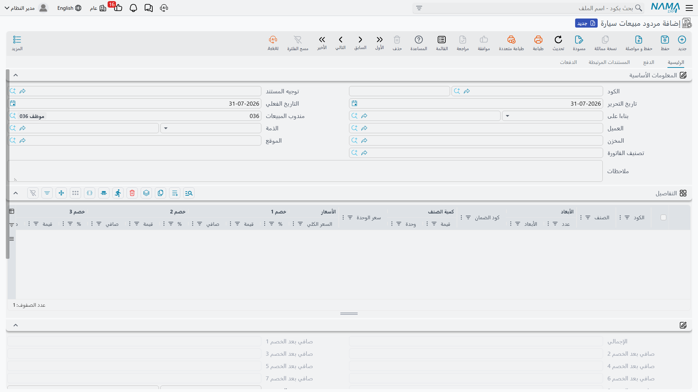

# مردود مبيعات السيارة

[فاتورة المبيعات](/ar/modules/servicecenter/car-sales/car-sales-invoice.md) هي نقطة اللاعودة، ومعنى
ذلك أن هناك طريقاً واحداً للعودة: **مردود مبيعات سيارة**. لا
مستند إلغاء، ولا حذف للفاتورة — بل مردود يُصدر مقابل الفاتورة، فيعكس المال ويعيد السيارة إلى المخزون.

تجده في **سيارات > مبيعات السيارات > مردود مبيعات سيارة**.

::: info الترخيص المطلوب
`srvcenter-subitems`.
:::

## ماذا يعكس

المردود مستند مالي كامل، له دفتره
و[**توجيهه**](/ar/modules/servicecenter/document-terms/servicecenter-terms-cars-and-other.md)،
ويفعل عند الاعتماد ثلاثة أشياء حقيقية:

1. **يعكس البيع في الأستاذ** — الإيراد العكسي وإشعار العميل وعكس الضريبة، عبر حسابات توجيه *المردود
   نفسه*. ولهذا يهم توجيه المردود: فهو ليس توجيه الفاتورة معكوساً، بل إعداد مستقل، وإن وجّهته إلى
   حسابات خاطئة نزل العكس في المكان الخاطئ.
2. **يعيد السيارة إلى المخزون** عبر إذن إضافة مخزني مُنشأ، وهو أيضاً ما يعيد التكلفة من حيث جاءت.
3. **يكتب سطر حالة على السيارة**، فيمكن دفع الهيكل إلى حالة قابلة للبيع — شريطة أن تتضمن
   [إعدادات حالة السيارة](/ar/modules/servicecenter/cars-setup/car-status-configurations.md) حركة
   لذلك الانتقال. وينسخ كذلك الخصائص الفنية من السطر إلى السيارة بالطريقة المعتادة.

ويحمل كل سطر مرجع **الفاتورة المصدر**، فتُربط كل سيارة مرتجعة بفاتورة المبيعات التي جاءت منها. املأه:
فهو ما يجعل المردود قابلاً للتتبع، وما يمنع أحدهم من إرجاع السيارة نفسها مرتين مقابل فاتورتين
مختلفتين.

## ما لا يفعله

هنا يقع القراء في الخطأ. المردود يعكس *البيع*؛ ولا ينظّف كل ما خلّفه البيع وراءه.

::: warning أربعة أشياء لا يمسّها المردود
- **حقول التخصيص في السيارة.** «مُخصصة لعميل» و«لفرع» و«لقسم» و«لمندوب مبيعات» و«لمخزن» ما زالت تسمّي
  العميل الذي أعاد السيارة. ولا يمسحها إلا
  [إلغاء تخصيص سيارة](/ar/modules/servicecenter/car-sales/car-allocation.md).
- **أختام المراجع في تبويب الإحصائيات.** السيارة المرتجعة ما زالت تعرض فاتورة المبيعات القديمة وأمر
  البيع القديم وتاريخ التسليم القديم. فهذه الأختام لا تُمسح إلا عند إلغاء اعتماد المستند *الأصلي*،
  ولا يمسحها مردود أبداً.
- **إذن الصرف الخاص بالتسليم النهائي**، إن كان التسليم قد أنشأ إذناً. فالمردود يقيّد إذن إضافة خاصاً
  به، فتتوازن الكمية ويبقى في تاريخ السيارة مستندان لا رابط بينهما.
- **أي شيء في كتلة التسليم في بطاقة السيارة** — حالة التسليم، والعميل المُستلم، ورقم اللوحه. فقد
  كُتبت يدوياً وتبقى كما هي حتى يعدّلها إنسان يدوياً.

فالتعليمة العملية بعد المردود: افتح
[بطاقة السيارة](/ar/modules/servicecenter/cars-setup/car-master-file.md)، وصحّح بيانات المبيعات أو
امسحها، وأصدر إلغاء تخصيص إن كانت السيارة مخصصة.
:::

وليس هناك كذلك **مستند إلغاء لمردود المبيعات**. فإن كان المردود نفسه خاطئاً، فاحذفه أو ألغِ اعتماده —
وإلغاء الاعتماد هو ما يزيل إذن الإضافة المُنشأ عنه وقيده في الأستاذ.

## أمران عن الشاشة

للمردود تخطيطه الخاص، لا التخطيط المشترك مع بقية عائلة مبيعات السيارات. يحمل العميل والمخزن والموقع
وتصنيف الفاتورة، وجدول أسطر يحمل الفاتورة المصدر لكل سطر، وأذون الإضافة التي أنشأها، وأسطر السداد،
وكتلة التقسيط، وجدول المستندات المُنشأة.

::: warning لا تفعّل «إنشاء صنف فرعي من معلومات السطر» في توجيه مردود أبداً
الخيار الذي يُنشئ بطاقات سيارات من أسطر المستندات يعمل على المردودات أيضاً. فعّله في توجيه مردود
مبيعات، فيصنع المردود بطاقات سيارات **جديدة تماماً** من أسطره بدل أن يطابق السيارات العائدة — ولا شيء
في النظام يتحقق من أن رقم الهيكل فريد. اتركه مطفأً في كل توجيهات المردودات.

ولاحظ كذلك أن زر **إنشاء صنف فرعي من معلومات السطر** غير متاح في هذه الشاشة، وإن كان خيار التوجيه
يعمل عند الحفظ. وهذا في صالحك هنا؛ فلا تبحث عن الزر.
:::

## المثال العملي

لنفترض أن شراء ليلى الحربي للسيارة `CAR-000318` انهار بعد الفاتورة. يصدر المعرض مردود مبيعات مقابل
`SISI-2026-0498`، بسطر واحد، مع ذكر الفاتورة المصدر، والسيارة `CAR-000318`.

| | المبلغ |
|---|---|
| الصافي المعكوس | **87,000** |
| ضريبة القيمة المضافة 15 % المعكوسة | 13,050 |
| **المقيّد لصالح العميل** | **100,050** |
| التكلفة العائدة إلى المخزون | **76,500** |

تعود السيارة إلى `WH-SHOW` بإذن الإضافة المُنشأ، وتنتقل حالتها إلى حالة قابلة للبيع. ثم على أحدهم أن
يصدر إلغاء التخصيص، وعلى أحدهم أن يفتح `CAR-000318` ويمسح كتلة التسليم يدوياً — لأن المردود، كما
سبق، لا يفعل أياً من الاثنين.

وكسائر الآثار في الوحدة، يُنشأ العكس بوصفه **طلب أعمال** يُعالَج في الخلفية. وإن فشل، أعِد تنفيذه من
قائمة **طلبات الأعمال** عبر **المزيد ← إعادة المعالجة / إعادة الاعتماد**.
