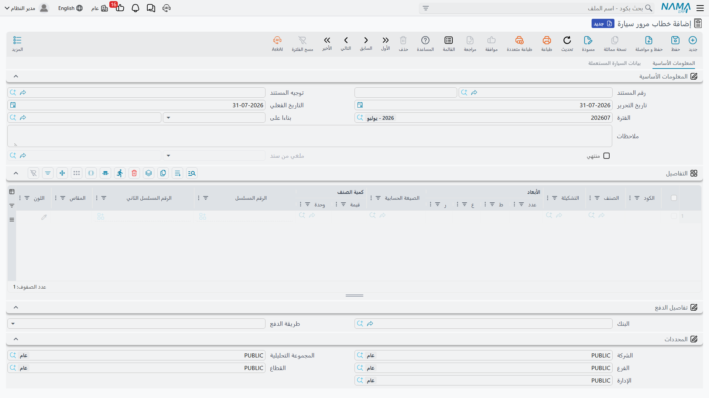

# خطابات المرور

السيارة المباعة لا يمكن قيادتها بعد. فقبل أن يضعها العميل على الطريق، على المعرض أن يصدر **خطاباً
إلى إدارة المرور** (*خطاب مرور*) حتى تُرخَّص المركبة وتُلوَّح باسم المشتري. وهي ورقة حقيقية مؤرخة
مرقّمة، وقد أفرد لها النظام مستندين: **طلباً** داخلياً للخطاب، ثم **الخطاب** نفسه.

- **طلب خطاب مرور سيارة** — `سيارات > مبيعات السيارات > طلب خطاب مرور سيارة`
- **خطاب مرور سيارة** — `سيارات > مبيعات السيارات > خطاب مرور سيارة`

ولكل منهما مستند إلغاء مقابل، ويقيم الإلغاءان في المجلد نفسه لا مع بقية الإلغاءات:

- **إلغاء طلب خطاب مرور سيارة** — `سيارات > مبيعات السيارات > إلغاء طلب خطاب مرور سيارة`
- **إلغاء خطاب مرور سيارة** — `سيارات > مبيعات السيارات > إلغاء خطاب مرور سيارة`

::: info الترخيص المطلوب
`srvcenter-subitems`.
:::

## ما فائدة المستندين

**الطلب** هو الخطوة الداخلية: يطلب مكتبُ المبيعات من الإدارة المسؤولة عن الترخيص أن تُصدر خطاباً لهذا
الهيكل ولهذا العميل. أما **الخطاب** فيسجّل أن الخطاب صدر بالفعل. ويستعملان الشاشة نفسها التي تستعملها
بقية عائلة مبيعات السيارات — رأس فيه الدفتر والتوجيه وتاريخ الاستحقاق و**بناءا على (From Document)**
والعميل والمخزن، وجدول أسطر يذكر كل سطر فيه سيارة واحدة في عمود **السياره (Customer Car)**.

ابنِ الطلب على أمر البيع أو على
[فاتورة المبيعات](/ar/modules/servicecenter/car-sales/car-sales-invoice.md)، وابنِ الخطاب على الطلب،
فتُبقيك قائمة اختيار السيارة على
السيارات التي كانت على المستند المصدر.

## ماذا يدفعان إلى بطاقة السيارة

هذا هو الجزء النافع، وهو سبب حمل الخطابين كتلةً فنية في أسطرهما أصلاً. عند الاعتماد تُنسخ خصائص كل
سطر إلى بطاقة السيارة — ولا تُستبدل إلا القيم غير الفارغة، والنسخ في اتجاه واحد، من المستند إلى
السيارة:

| ما يُدفع إلى السيارة | |
|---|---|
| رقم الهيكل (Chassis Number) | رقم المحرك (Engine Number) |
| ناقل الحركة (Gear Box) | نوع الهيكل (Body Type) |
| عدد الركاب (Number Of Passengers) | مدة الضمان (Warranty Period) |
| رقم المفتاح (Key Number) | رقم الموقع الفرعي (Slot Number) |
| علامات الملحقات — الكتالوج والدعاسات وعدة العدد والمفتاح الاحتياطي والضمان | |

فخطاب المرور إذن نقطة التقاط بيانات نافعة حقاً: فهو غالباً اللحظة التي يقارن فيها أحدهم رقم المحرك
بالمعدن أخيراً، وما يُكتب هنا يستقر في بطاقة السيارة إلى الأبد.

ويكتب كل مستند منهما **سطر حالة** على السيارة — عادةً *مطلوب له خطاب مرور (Traffic Letter Requested)*
للطلب و*مُصدر له خطاب مرور (Traffic Letter Issued)* للخطاب — إن كانت
[إعدادات حالة السيارة](/ar/modules/servicecenter/cars-setup/car-status-configurations.md) تتضمن سطر
تحديث حالة يستهدف ذلك المستند. وإن فعّل التوجيه الخيار، خُتم مرجع الخطاب في تبويب **الإحصائيات** في
السيارة، فتعرف من السيارة أي خطاب صدر لها.

::: warning الخطاب لا يستطيع تسجيل اللوحة التي وُجد من أجلها
**لا يوجد حقل لرقم اللوحة** في خطاب المرور ولا في طلبه. فالمستند الذي وُجد للحصول على اللوحات ليس له
موضع يكتب فيه اللوحة العائدة.

اللوحة تسكن في [**بطاقة السيارة**](/ar/modules/servicecenter/cars-setup/car-master-file.md)، في
تبويب بيانات المخزن، وتُكتب هناك يدوياً. ولا يكتبها شيء — لا
خطاب المرور، ولا التسليم النهائي، ولا أي مستند آخر. اجعلها خطوة صريحة في إجراءاتك: حين تصل اللوحات،
افتح السيارة واكتب الرقم.
:::

## ما لا يفعلانه

::: danger إعدادات المحاسبة في هذه المستندات معطّلة تماماً
تعرض [شاشات توجيه](/ar/modules/servicecenter/document-terms/servicecenter-terms-cars-and-other.md)
مستندات خطاب المرور الأربعة كتلة محاسبية كاملة — مدين ودائن ونقدية وضرائب وخصومات
من الأول إلى السابع وأتعاب خدمات وقيمة حجز، بكل تفاصيلها.

**ولا يرحّل أي من الأربعة شيئاً أبداً.** كل حساب تضبطه هناك يُهمَل، ولا يصدر أي قيد، ولا يخبرك أحد.
وهذه ليست «محاسبة اختيارية»، بل كتلة شاشة لا تفعل شيئاً في هذه المستندات. لا تنفق عليها وقتاً، ولا
تفسّر بها قيداً مفقوداً.
:::

ولا يحركان مخزوناً كذلك. خطاب المرور ورقة وحركة حالة — لا غير.

::: warning لا شيء يشترط خطاب مرور قبل التسليم
لا قاعدة في المنتج ترفض فوترة سيارة أو تسليمها لعدم وجود خطاب مرور لها. تستطيع أن تفوتر وتسلّم
المفاتيح وتغلق الملف دون أن يوجد أي من المستندين أصلاً.

فإن احتاج معرضك هذه البوابة — ومعظم المعارض تحتاجها — فأنت من يبنيها، في إعدادات حالة السيارة: صمّم
الحركات المشروعة بحيث لا يمكن بلوغ الحالة التي يشترطها
[التسليم النهائي](/ar/modules/servicecenter/car-sales/car-final-delivery.md) إلا مروراً بحالة خطاب
المرور.
هذه **إعدادات**، وهي السبيل الوحيد لوجود هذه البوابة. وهناك أيضاً وسم **منع البيع (Prevent Sales)**
في بطاقة السيارة بوصفه حاجزاً يدوياً فظاً.
:::

## المثال العملي

تُفوتَر `CAR-000318` لليلى الحربي في 1 مارس 2026. وتسير أوراق الترخيص بالتوازي مع التسليم:

| التاريخ | المستند | ماذا يضيف |
|---|---|---|
| 1 مارس | `SITLR-2026-0288` — طلب خطاب مرور | يطلب الخطاب؛ ويدفع بيانات الهيكل والمحرك والمفتاح إلى `CAR-000318`؛ الحالة ← *مطلوب له خطاب مرور* |
| 2 مارس | `SITL-2026-0296` — خطاب مرور | يسجّل الخطاب الصادر؛ ويحدّث البيانات الفنية نفسها؛ الحالة ← *مُصدر له خطاب مرور* |

ولا يرحّل أي منهما شيئاً. أما اللوحة `ر ط ص 8318` فتُكتب في بطاقة السيارة يوم 5 مارس حين تعود
اللوحات — بيد إنسان، في شاشة السيارة نفسها.

## بناء بطاقة السيارة من السطر

ثلاث من الشاشات الأربع تحمل في قائمة **المزيد** إجراء **إنشاء صنف فرعي من معلومات السطر**: الطلب،
والخطاب، وإلغاء خطاب المرور. وهو يبني بطاقات سيارات من بيانات السطر، ولا يعمل إلا إذا كان خيار *إنشاء
صنف فرعي من السطر* في توجيه المستند مفعّلاً.

::: warning تحذيران بشأن هذا الزر
- **إن كان خيار التوجيه مطفأً، فالزر بلا أثر وبصمت.** يُحدَّث الجدول، ولا يُنشأ شيء، ولا تظهر أي
  رسالة. تحقق من التوجيه أولاً.
- **وفي شاشة «إلغاء طلب خطاب مرور سيارة» الزر موصول بنوع السطر الخطأ** فيعيد بناء الجدول من بيانات
  خاطئة. لا تستعمله هناك.

وعلى وجه العموم: فعّل خيار *إنشاء صنف فرعي من السطر* في نوع مستند **واحد** فقط في كل سلسلة. فوجود
مستندين بالخيار مفعّلاً إما أن يعيد كتابة بطاقة سيارة قائمة بصمت، أو — إن كُتبت أسطر المستند اللاحق
من جديد بدل نسخها — أن يُنشئ بطاقة سيارة **مكررة**، إذ لا شيء يتحقق من أن رقم الهيكل فريد.
:::

## إلغاء خطاب

اربط مستند الإلغاء بالخطاب أو بالطلب عبر **بناءا على** واعتمده. يختم المصدر بأنه ملغي ويكتب سطر حالته
الخاص — وكسائر مستندات الإلغاء في هذه الوحدة، لا يعكس مالاً ولا مخزوناً، لأن هذه المستندات لم تنتج
شيئاً من ذلك أصلاً. واعتماد إلغاء ثانٍ للخطاب نفسه مرفوض.

واملأ *بناءا على*. فالإلغاء المحفوظ بدونه يُعتمد بنظافة، ولا يختم شيئاً، وينقل حالة السيارة مع ذلك.
والنمط كاملاً في
[مستندات الإلغاء](/ar/modules/servicecenter/car-sales/car-cancellation-documents.md).
