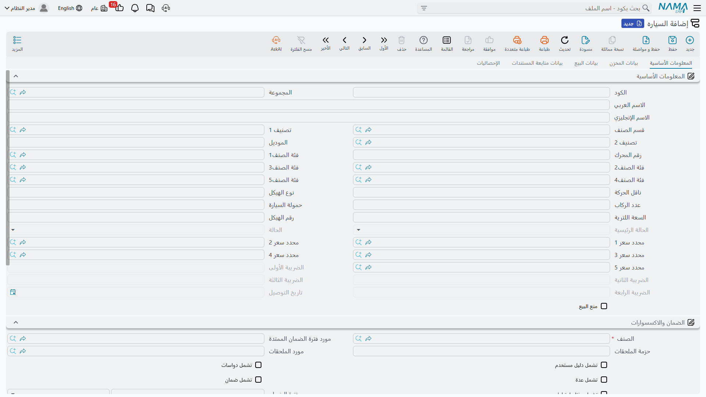
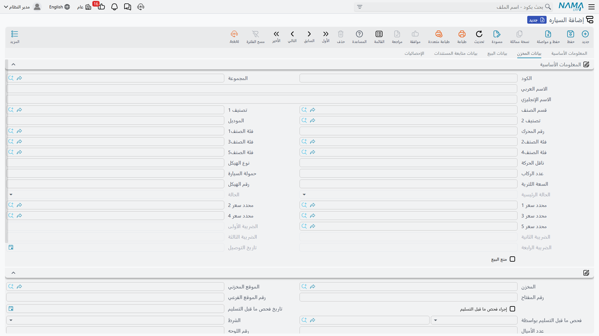
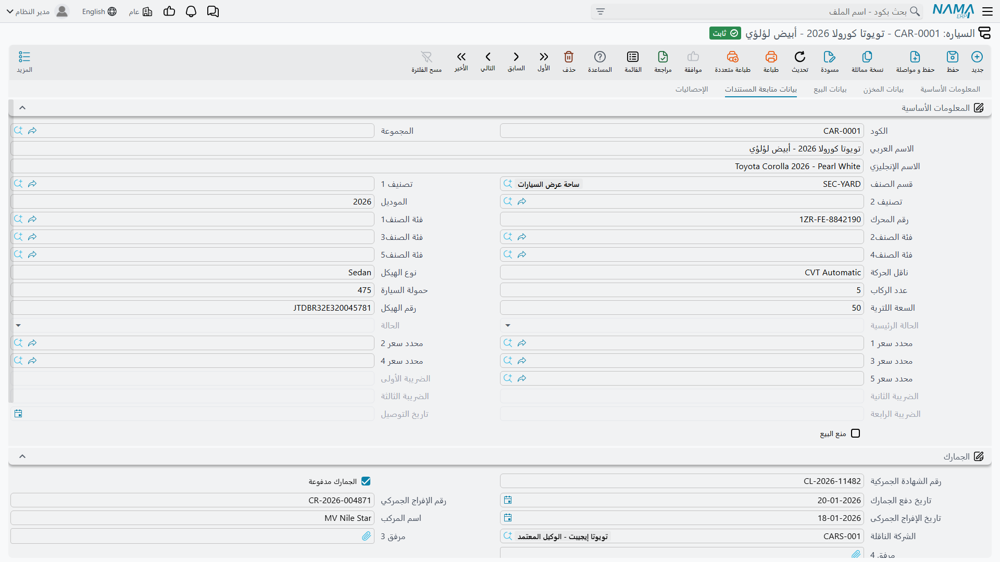
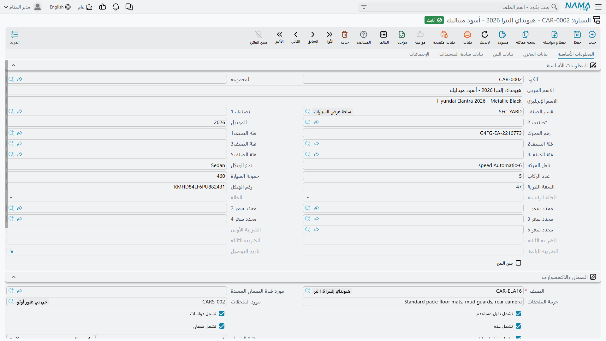

# ملف السيارة

**السياره / Customer Car** — `سيارات > ملفات السيارات > السياره` — سجل لمركبة واحدة بعينها. هو ملف
رئيسي كملف العميل أو الصنف، له كود ومجموعة واسم، لكن كل ما فيه تقريباً يصف سيارة بذاتها: هذا الهيكل،
وهذا المحرك، وهذا المفتاح، وهذا الموقع في الساحة، وهذه الكومة من أوراق الجمارك.

وفي أغلب الأحوال لن تنشئه بيدك. فملف السيارة يُولد عادةً لحظة حفظ أحد مستندات مشتريات السيارات، من
البيانات المكتوبة في السطر — انظر
[فاتورة شراء السيارة](/ar/modules/servicecenter/car-purchasing/car-purchase-invoice.md). لكن السجل هو
حيث ينتهي كل شيء، وهو أول شاشة ينبغي لمهندس الدعم أن يفتحها حين يسأل أحد: «لماذا لم يفعل ذلك
المستند ما توقعته؟».

::: info الترخيص المطلوب
`srvcenter-subitems`.
:::

## الحقل الوحيد الإجباري حقاً

**الصنف / Item** — صنف المخزون الذي تُعد السيارة وحدة منه. وكل ما عداه يمكن تركه فارغاً. ولأن ملف
السيارة *محدد* من محددات ذلك الصنف فإن المخزون والتكلفة يُتتبعان لكل سيارة على حدة: الرصيد المتاح
وتكلفة المخزون كلاهما محفوظ على اقتران الصنف بملف السيارة، وهذا ما يجعل سؤال «كم كلّفنا الهيكل
`NWA7R24C26K000318` فعلاً؟» سؤالاً له جواب.

## خمس صفحات

مجموعة المعلومات الأساسية ومجموعة المحددات مكررتان في أعلى **كل** صفحة. وهذا من غرائب تصميم الشاشة
لا نسخ خمس من البيانات — هي الحقول نفسها معروضة مرة أخرى.

### الصفحة الأولى — المعلومات الأساسية

هوية المركبة:

| الحقل | بالإنجليزية | يُكتب باليد أم بمستند |
|---|---|---|
| الكود / المجموعة | Code / Group | تكتبه قاعدة الترقيم للمجموعة المسماة في إعدادات الحالة |
| الموديل | Model — **نص حر** لا ملف موديلات الورشة | باليد أو منسوخاً من سطر المستند |
| رقم الهيكل | Chassis Number | من سطر المستند أو هنا |
| رقم المحرك | Engine Number | من سطر المستند أو هنا |
| ناقل الحركة / نوع الهيكل / عدد الركاب | Gearbox / Body Type / Number of Passengers | باليد |
| حمولة السيارة / السعة اللترية | Pay Load / Liter Capacity | باليد |
| قسم الصنف والتصنيفات والفئات | Section, classes, categories | منسوخة من الصنف أو السطر |
| الحالة الرئيسية / الحالة | Main Status / Status | **للقراءة فقط**، يكتبها محرك الحالات وحده |
| نسب الضرائب ١–٤ | Tax percentages 1–4 | **للقراءة فقط**، تُزامَن مع السطر بخيارات التوجيه |
| تاريخ التسليم | Delivery Date | **للقراءة فقط**، يختمه مستند إذا نصّ توجيهه على ذلك |
| منع البيع | Prevent Sales | باليد |

الصفحة الأولى على شاشة سيارة جديدة — هوية المركبة كلها في مجموعة واحدة:

وتحتها مجموعة **الضمان والاكسسوارات**: مرجع الصنف، ومقدّم الضمان الممتد، وحزمة اكسسوارات بنص حر
ومورّدها، والخانات الخمس — كتالوج، ودواسات، وعدة، وضمان، ومفتاح احتياطي — ومدة الضمان ومدة الضمان
الممتد بوحدتيهما. ثم جدول مرفقات لمسح أي ورقة تصل مع السيارة.

::: warning «منع البيع» يمنع أكثر من البيع
خانة **منع البيع (Prevent Sales)** هي الحقل الوحيد على هذه الشاشة الذي له أنياب حقيقية: يرفض مستند
البيع أي سطر تحمل سيارته العلامة برسالة *«الصنف الفرعي … في السطر … ممنوع من البيع»*.

والذي يفوت كثيرين أن منتقي السيارة على **كل** مستند يستبعد السيارات المعلَّمة استبعاداً كاملاً —
بما في ذلك مستندات الشراء و[سند توريد السيارة](/ar/modules/servicecenter/car-purchasing/car-receipt.md)
ومردود مشتريات السيارة. فالسيارة التي علّمتها لتمنع بيعها
تختفي أيضاً من البحث في المستندات التي تحتاجها لتصحيح مخزونها. ارفع العلامة قبل أن تحاول إصلاح شيء.
:::

### الصفحة الثانية — بيانات المخزن

أين السيارة فعلياً وما حالتها: المخزن، والموقع، ورقم المفتاح، ورقم الموقع في الساحة، والفحص قبل
التسليم وتاريخه ومن أجراه، وحالة الاستخدام (جديدة أو مستعملة)، والممشى، ورقم اللوحة، والعميل المسجّل،
ووجود خدوش وملاحظاتها، وملاحظات عامة، وحالة التسليم، ومن سُلّمت إليه، والتسليم لجهة ذات علاقة،
ومرفقان.

::: warning هذه الصفحة كلها تقريباً تُكتب باليد — ولا يملؤها أي مستند
هذا أكثر توقّع خاطئ شيوعاً في نصف السيارات. فـ**حالة التسليم، ومن سُلّمت إليه، والتسليم لجهة ذات
علاقة، وحالة الاستخدام، والممشى، والفحص قبل التسليم وتاريخه ومن أجراه، ورقم اللوحة، وسداد الجمارك
وتاريخه، ورقم الفسح الجمركي وتاريخه، وختم خطاب المرور** — ليس لأي منها كاتب تلقائي في المنتج كله.

وعلى وجه الخصوص: اعتماد
**[مستند التسليم النهائي للسيارة](/ar/modules/servicecenter/car-sales/car-final-delivery.md)** لا يضع
حالة التسليم ولا يسجّل من سُلّمت إليه، وإن كان ينقل حالة السيارة إلى *توصيل نهائي* بلا مشكلة.
و**[خطاب المرور](/ar/modules/servicecenter/car-sales/car-traffic-letters.md)** لا يحمل حقل رقم لوحة
أصلاً، فالمستند الموجود لاستخراج اللوحات لا يستطيع تسجيل اللوحة التي استخرجها. كل ذلك يُكتب في هذه
الصفحة، بيد إنسان، بعد وقوعه.

والاستثناءان الحقيقيان هما **المخزن** و**الموقع**، إذ تستطيع توجيهات المستندات نسخهما على السيارة
بخيارَي *نسخ المخزن إلى الصنف الفرعي* و*نسخ الموقع إلى الصنف الفرعي*.
:::

### الصفحة الثالثة — بيانات البيع

خمسة حقول، كلها للقراءة فقط: مخصصة للعميل، وللفرع، وللقسم، وللمندوب، وللمخزن. يكتبها مستند
**[تخصيص السيارة](/ar/modules/servicecenter/car-sales/car-allocation.md)** ويمسحها **إلغاء
التخصيص**، ولا شيء غيرهما.

واقرأها ختماً معلوماتياً لا أكثر. فلا قاعدة عمل واحدة تستشيرها — وفاتورة بيع لسيارة مخصصة لشخص آخر
تُعتمد بلا اعتراض.

### الصفحة الرابعة — بيانات متابعة المستندات

ثلاث مجموعات من الأوراق، كل حقل فيها يُكتب باليد:

- **الجمارك** — رقم البيان الجمركي، وسداد الجمارك، وتاريخ السداد، ورقم الفسح وتاريخه، واسم الباخرة،
  والناقل، ومرفقان.
- **مستندات الشركة المصنعة للمعدات الأصلية** — المورّد الأصلي، وتاريخ فاتورة الشراء، ورقم خطاب مرور
  المصنع وموقعه وبيانات استلامه.
- **مستندات التسجيل** — ختم خطاب المرور، ورقم شهادة البيانات، وتاريخ إصدارها، ومنطقتها.

::: warning حقول الجمارك نصوص لا تكاليف
لا شيء في هذه الصفحة متصل بأي مبلغ. فرقم البيان الجمركي وخانة سداد الجمارك تسميات تسجّلها لمرجعك
ولتقاريرك؛ لا تغذّي تكلفة السيارة، ولا تنشئ قيداً محاسبياً، ولا تقرؤها آلية التكلفة النهائية.

فمصاريف الاستيراد تصل إلى تكلفة السيارة بطريق مختلف تماماً — سطور خدمية على فاتورة الشراء. انظر
[الشحن والجمارك والتكلفة النهائية](/ar/modules/servicecenter/car-purchasing/car-landed-cost.md).
:::

### الصفحة الخامسة — الإحصائيات

افتح هذه أولاً حين يقع خلل. وكل ما فيها للقراءة فقط.

في أعلاها المستندات التي مسّت السيارة: فاتورة الشراء، وفاتورة البيع، وأمر الشراء، وأمر البيع، وخطاب
المرور، والمندوب، والمستند المُلغي، وسند الاستلام المخزني، وطلب خطاب المرور، وعرض السعر، وطلب عرض
السعر. ولا يُختم أي منها إلا إذا كان توجيه المستند المعني يحمل خيار *تحديث … في الصنف الفرعي*
المقابل مفعّلاً — فالحقل الفارغ يعني غالباً أن الخيار لم يُفعَّل، لا أن المستند لم يقع.

وتحتها الجدول الذي يجيب عن أكثر الأسئلة:
**حركات تغير حالة الصنف الفرعي / Sub Item Status Entries**. سطر لكل تغيّر حالة، يعرض تاريخ الإنشاء،
والتاريخ المؤثر، والمستند المسبِّب، ورقم السطر، والصنف، وقيمتَي «من» و«إلى» للحالة وللحالة الرئيسية.
هذا هو الأثر الكامل لدورة حياة السيارة، معاداً ترتيبه بالتاريخ المؤثر — اقرأه من أعلى إلى أسفل تعرف
بالضبط لماذا هي حيث هي. وسلوكه، بما فيه ما يحدث عند تأريخ مستند بأثر رجعي، مشروح في
[إعدادات حالة السيارة](/ar/modules/servicecenter/cars-setup/car-status-configurations.md).

## ما الذي تكتبه المستندات على السيارة

عدا الحالة، ثلاث آليات تكتب في ملف السيارة، ويحسن تمييزها حين لا يمتلئ حقل:

1. **حقول التخصيص** — يكتبها مستند تخصيص السيارة ويمسحها إلغاؤه. لا غير.
2. **ما يحمله السطر** — الهيكل، والمحرك، وناقل الحركة، ونوع الهيكل، وعدد الركاب، ومدة الضمان، ورقم
   المفتاح والموقع، وتصنيفات الصنف وفئاته، تُنسخ من خصائص السيارة في سطر المستند عند الإنشاء،
   وتُعاد نسختها كلما أُعيدت معالجة المستند. ولا تُستبدل إلا القيم غير الفارغة: تفريغ حقل في السطر
   **لا** يفرّغه على السيارة.
3. **أختام المراجع ونسخ المحددات** — خيارات
   [توجيه المستند](/ar/modules/servicecenter/document-terms/servicecenter-terms-cars-and-other.md)
   المسماة *تحديث فاتورة الشراء / فاتورة البيع /
   سند الاستلام / أمر الشراء / أمر البيع / خطاب المرور / طلب خطاب المرور / عرض السعر / طلب عرض السعر
   / المندوب في الصنف الفرعي*، و*تحديث تاريخ التسليم في الصنف الفرعي*، و*تحديث المستند المُلغي*.
   يكتب كل منها مرجعه عند اعتماد المستند ويمسحه عند إلغائه.

وثمة آلية رابعة أهدأ: عند حفظ **الصنف** يُحدَّث كل ملف سيارة معلّق عليه وفق خريطة الحقول المسماة في
إعدادات حالة الصنف. وبها يصل تغيير سمة على مستوى الموديل إلى السيارات المفردة.

## الإنشاء باليد

تستطيع ذلك. أعطه صنفاً، واكتب رقمَي الهيكل والمحرك، واحفظ. وهو التصرف الصحيح للأرصدة الافتتاحية —
السيارات الواقفة في الساحة يوم بدء التشغيل — ولتصحيح سجل أنشأه مستند إنشاءً سيئاً.

وتحذيران. الأول أن السيارة المُنشأة باليد لا حركات حالة لها، فحالتها هي ما تسميه إعدادات الصنف حالةً
مبدئية. والثاني أن تتذكر أنه لا تحقق من تفرّد رقم الهيكل في أي موضع: ابحث في الملف قبل أن تنشئ، فإن
المكرر سيُقبل بصمت ثم يحمل مخزونه وتكلفته على حدة.

## المثال العملي

`CAR-000318` أولى ست سيارات ناوا رمال ٢٫٤ اشترتها الصحراء من `SUP-77` شركة ناوا لاستيراد السيارات في
فبراير ٢٠٢٦:

| الحقل | القيمة |
|---|---|
| الكود | `CAR-000318` |
| الصنف | `MDL-RIMAL24` ناوا رمال ٢٫٤ |
| رقم الهيكل | `NWA7R24C26K000318` |
| رقم المحرك | `R24-360318` |
| رقم المفتاح / الموقع | `K-318` / `A-14` |
| المخزن | `WH-SHOW` |
| التكلفة النهائية | **٧٦٬٥٠٠** — ٧٤٬٠٠٠ للمستورد و٢٬٥٠٠ شحناً وجمارك |
| رقم اللوحة | `ر ط ص 8318`، كُتب على هذه الشاشة في ٥ مارس بعد عودة اللوحات |

وصفحة إحصائياتها تعرض فاتورة الشراء `SIPI-2026-021`، وسند الاستلام `STR-2026-0552`، وحركة حالة لكل
مستند من فاتورة الشراء إلى التسليم النهائي.
