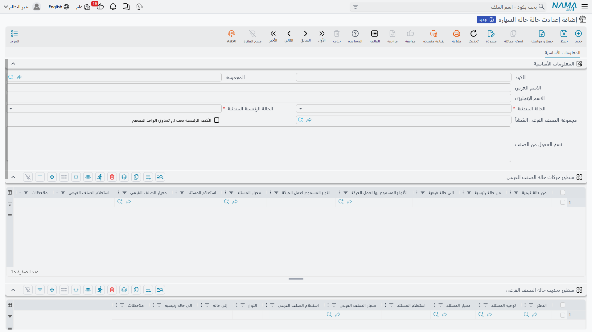

# إعدادات حالة السيارة

**إعدادت حالة حاله السياره / Car Status Configurations** —
`سيارات > ملفات السيارات > إعدادت حالة حاله السياره`. (تسمية القائمة العربية تحمل كلمة مكررة؛
والسجل هو إعدادات حالة السيارة.)

هنا ترسم حياة السيارة. لا حيث تقرؤها — حيث *ترسمها*. وهو السجل الوحيد في
[نصف السيارات من الوحدة](/ar/modules/servicecenter/cars-setup/servicecenter-cars-overview.md) الذي
يحوّل كومة مستندات إلى دورة حياة، وحتى يوجد ويُربط بصنف يظل كل مستند سيارة في الوحدة يُحفظ بنجاح ولا يغيّر
في السيارة شيئاً.

::: info الترخيص المطلوب
`srvcenter-subitems`.
:::

## لا دورة حياة مبنية مسبقاً

قلها صريحة، فأسماء الحالات في القائمة تشبه مسار عمل جاهزاً حتى ليفترض الجميع أنه موصول سلفاً.

**الحالة الوحيدة التي يسندها المنتج نفسه هي الأولى.** فحين يُنشأ
[ملف سيارة](/ar/modules/servicecenter/cars-setup/car-master-file.md) من سطر مستند يُختم
*ما قبل المبدئي*، وهذا هو مدى السلوك المبني مسبقاً في الوحدة كلها.
و[فاتورة الشراء](/ar/modules/servicecenter/car-purchasing/car-purchase-invoice.md) لا «تجعل السيارة
بالطريق»، و[سند التوريد](/ar/modules/servicecenter/car-purchasing/car-receipt.md) لا «يجعلها مخزوناً
متاحاً»، و[فاتورة البيع](/ar/modules/servicecenter/car-sales/car-sales-invoice.md) لا «تجعلها
مفوترة». وكل انتقال من تلك لا يوجد إلا لأن أحداً كتب سطراً في هذا الإعداد.

والنتيجة ذات وجهين. فأنت تستطيع تمثيل دورة حياة تطابق طريقة عمل معرضك فعلاً — ووكالة استيراد ومعرض
مستعمل يحتاجان سلسلتين مختلفتين. وهي تعني كذلك أن قاعدة بيانات لم يملأ أحد فيها هذا الإعداد تتصرف
وكأن خاصية الحالات كلها معطّلة، وهذا بالضبط ما تبدو عليه من الخارج.

## كيف يُربط

يُربط الإعداد **بالصنف**، في *الصنف ▸ الإعدادات ▸ إعدادات حالة السيارة*. ويستطيع إعداد واحد أن يخدم
أصنافاً كثيرة، وهذا هو المعتاد — سجل لسيارات الركاب وآخر للمركبات التجارية — لكن كل صنف له سيارات
يحتاج واحداً مشيراً إليه.

::: warning لا تعتمد على «إعدادات حالة الصنف الفرعي الإفتراضية»
في شاشة إعدادات مركز الخدمة خيار اسمه
**إعدادات حالة الصنف الفرعي الإفتراضية / Default SubItem Configuration**، وليس هو البديل الاحتياطي
الذي يعد به اسمه.

فهو يُستشار لغرض واحد: توفير **سطور فلترة الحالات لمنتقي السيارة** على سطور المستندات، وذلك فقط حين
لا يكون *للصنف* إعداد خاص به.

وهو **لا** يغذّي محرك الحالات، و**لا** يغذّي الإنشاء التلقائي لملفات السيارات. فكلاهما يقرأ إعداد
الصنف نفسه ويرفض المضي بدونه — بل يفشل الإنشاء التلقائي صراحةً برسالة *«الصنف … ليس له إعدادات حالة
السيارة»*. اربط إعداداً حقيقياً بكل صنف له سيارات؛ فالافتراضي على مستوى الوحدة لن ينقذك.
:::

## الشاشة — رأس وأربعة جداول

الشاشة كلها صفحة واحدة: الرأس في أعلاها، ثم **سطور حركات حالة الصنف الفرعي** و**سطور تحديث حالة
الصنف الفرعي** الواحد تحت الآخر، ثم جدولا المجموعات والفلاتر:

### الرأس

| الحقل | بالإنجليزية | ملاحظات |
|---|---|---|
| الحالة المبدئية | Initial SubItem Status | **إجباري.** الحالة التي تُعد السيارة فيها قبل أول حركة، والتي ترتد إليها إن حُذفت حركاتها كلها |
| الحالة الرئيسية المبدئية | Sub Item Initial Main Status | **إجباري.** المثل، لمحور الحالة الرئيسية |
| مجموعة الصنف الفرعي المُنشأ | Created SubItem Master Group | المجموعة التي تنزل فيها السيارات الجديدة، ومنها قاعدة ترقيمها ومحدداتها العامة. **ويفشل الإنشاء التلقائي إن تُركت فارغة** |
| الكمية الرئيسية يجب ان تساوي الواحد الصحيح | Prime Quantity Must Be One | يرفض أي سطر مستند يحمل سيارة وكمية غير الواحد |
| نسخ الحقول من الصنف | Copy Fields From InvItem | خريطة حقول تُطبَّق على كل سيارات الصنف كلما حُفظ الصنف |

ويستحق خيار *الكمية الرئيسية يجب ان تساوي الواحد الصحيح* وقفة. فعّله. فهو الإعداد الوحيد الذي يحوّل
أشيع خطأ إدخال في الوحدة — كتابة كمية ٦ في سطر واحد بدل ستة سطور بكمية ١ — من ملف سيارة خاطئ صامت
إلى رفض عند الحفظ.

### الجدول الأول — سطور تحديث حالة الصنف الفرعي

**أي مستند يضع أي حالة.** وهذا الجدول هو الذي تقضي فيه وقتك.

كل سطر قاعدة: *حين يُعتمد مستند من هذا النوع، في هذا الدفتر، على هذا التوجيه، مطابقاً لهذه المعايير،
على سيارة مطابقة لهذه المعايير — انقل السيارة إلى هذه الحالة، واختياراً إلى هذه الحالة الرئيسية.*

وأعمدته: الدفتر،
و[توجيه المستند](/ar/modules/servicecenter/document-terms/servicecenter-terms-cars-and-other.md)،
ومعايير المستند، واستعلام «طبّق حين» للمستند، ومعايير السيارة،
واستعلام «طبّق حين» للسيارة، والنوع، والحالة الهدف، والحالة الرئيسية الهدف، والملاحظات. و**العمود
الفارغ يطابق كل شيء**، وهو ما يجعل قاعدة مثل «أي فاتورة شراء سيارة ← الجمارك» سطراً واحداً بحقلين.

و**أول مطابقة تفوز**. فرتّب الجدول من الأخص إلى الأعم.

ولعمود *إلى حالة رئيسية* قيمة إضافية، **بدون / None**، ومعناها «انقل الحالة الفرعية واترك الرئيسية».

### الجدول الثاني — سطور حركات حالة الصنف الفرعي

**أي الانتقالات مسموح بها.** هذه هي القائمة البيضاء، وهي مطبَّقة بصرامة.

كل سطر يقول إن السيارة تنتقل *من* هذه الحالة (واختياراً من هذه الحالة الرئيسية) *إلى* تلك، ويسمّي
أنواع المستندات المسموح لها بعمل الانتقال. وما ليس في القائمة يُرفض عند الاعتماد برسالة:

> *لا يمكن تغيير حالة السياره من … - حالة رئيسية … إلى … - حالة رئيسية … في المستند … للصنف … في
> السطر …*

وهذه أكثر رسائل الوحدة ظهوراً، وهي تعني في الغالب أن جدول الحركات ينقصه سطر، لا أن المستخدم أخطأ.

### الجدول الثالث — مجموعات الصنف الفرعي

تجاوز لـ *مجموعة الصنف الفرعي المُنشأ*: اختر مجموعة مختلفة لكل تركيبة من المحددات العامة الخمسة.
مفيد حين ينبغي أن تُرقَّم سيارات فرع الرياض غير سيارات جدة. وحين لا يطابق سطر تُستعمل مجموعة الرأس.

### الجدول الرابع — فلاتر الأصناف الفرعية في المستندات

أي الحالات يجوز اختيارها في منتقي السيارة، لكل نوع ودفتر وتوجيه — حتى خمس حالات في السطر. وبه تمنع
مندوباً من اختيار سيارة ما زالت في الجمارك على فاتورة بيع.

ويطبّق المنتقي فلترين آخرين دائماً: سيارات صنف السطر فقط، والسيارات غير المعلَّمة بـ*منع البيع* فقط.
وما لم يفعّل التوجيه خيار *عدم فلترة الأصناف الفرعية بأصناف المستند المبني عليه* فإنه يقصر القائمة
كذلك على السيارات الموجودة في المستند المبني عليه.

## ماذا يفحص الحفظ — وماذا لا يفحص

يفحص حفظ الإعداد ثلاثة أشياء:

- **تنبيه** إذا تساوت حالتا «من» و«إلى» في سطر حركة؛
- **فشل** إذا لم تظهر الحالة المبدئية كـ*حالة من* في سطر حركة واحد على الأقل — *«يجب إضافة سطر
  بالحالة … في حقل من حالة في السطور …»*؛
- **فشل** إذا ملأ سطر فلترة النوع المفرد وقائمة الأنواع معاً.

::: warning الجدولان لا يُقابَل بينهما أبداً
لا شيء يتحقق من أن حالة تنتجها سطور التحديث عندك يمكن بلوغها عبر سطور الحركات. فتستطيع حفظ إعداد
يبدو مكتملاً، ولا تكتشف الثغرة إلا حين يُرفض مستند حقيقي أمام عميل برسالة *«لا يمكن تغيير حالة
السياره من … إلى …»*.

ابنِ جدول الحركات أولاً ثم جدول التحديثات، وامشِ بسيارة اختبار على السلسلة كلها في بيئة تجريبية قبل
التشغيل.
:::

## قاعدة إعادة التشغيل، ولماذا يؤلم التأريخ الرجعي

لا يكتفي المحرك بـ«وضع الحالة». فكل مستند يمس سيارة يكتب **حركة حالة** — سطراً مؤرَّخاً يقول أي
مستند حرّك السيارة وإلى أين. وحين يُعتمد أي منها يجمع النظام **كل** حركات تلك السيارة، من كل مستند
ومن كل نوع، ويرتبها بالتاريخ المؤثر ثم بتاريخ الإنشاء، ثم يسلسلها: حالة «من» في كل حركة هي حالة
«إلى» في سابقتها، وأول حركة تبدأ من الحالة المبدئية في الإعداد. ثم تُفحص كل حلقة في السلسلة على جدول
الحركات. وحالة السيارة الجارية ليست إلا هدف آخر حركة.

والتاريخ المؤثر افتراضاً هو تاريخ المستند المؤثر؛ ويستطيع التوجيه تسمية حقل تاريخ آخر بخيار *حقل
التاريخ المُؤثر في حالة الصنف الفرعي*.

::: warning المستند المؤرَّخ رجعياً يعيد اشتقاق كل ما بعده
لأن التاريخ كله يُعاد ترتيبه عند كل اعتماد، فإن إقحام مستند في وسط ماضي السيارة يعيد سلسلة كل انتقال
لاحق. وانتقال كان مشروعاً حين وقع قد يصير ممنوعاً، فيُرفض المستند الرجعي برسالة تسمّي حالات مستند
*آخر* — فيبدو وكأن اللوم على المستند الخطأ.

خطط لذلك: صحّح تاريخ السيارة من الأحدث إلى الأقدم، أو احذف المستندات اللاحقة وأقحم التصحيح ثم أعد
تحريرها. وحذف مستند يحذف حركاته ويعيد حساب السيارة إلى حالها السابق، فالآلية قابلة للعكس — لكنها
مزعجة.
:::

## قائمة الحالات

في القائمة عشرون قيمة. والجدول أدناه هو **الكتالوج**، ومعه عائلة المستندات التي سُميت كل قيمة من
أجلها.

::: warning العمود الأيمن إعداد مقترح لا سلوك مبني مسبقاً
لا شيء في المنتج يربط أياً من هذه الحالات بأي مستند. وعمود «القاعدة المعتادة» يصف سطر التحديث الذي
ينتهي أكثر المعارض إلى كتابته — وهو نقطة بداية لإعدادك أنت، ولا يصف شيئاً يقع قبل أن تكتبه.
:::

| الحالة | بالإنجليزية | القاعدة المعتادة (تكتبها أنت) | معناها في الساحة |
|---|---|---|---|
| ما قبل المبدئي | Pre Initial | **النظام**، عند الإنشاء من سطر مستند | السجل موجود ولم يقع شيء بعد |
| مبدئي | Initial | يُسمّى حالةً مبدئية في الإعداد | حالة بداية السلسلة |
| بالطريق | In Transit | [أمر شراء السيارة](/ar/modules/servicecenter/car-purchasing/car-purchase-order.md) أو الفاتورة المبدئية | مطلوبة من المصنع وفي الطريق |
| الجمارك | Customs | فاتورة شراء السيارة | وصلت وواقفة في الجمارك |
| تم دفع الجمارك | Customs Paid | المستند الذي تستعمله لمرحلة الجمارك | سُدّدت الرسوم |
| تم تسليمه | Received | سند توريد السيارة — يعكسه إلغاء التوريد | استُلمت فعلياً في المخزن |
| مخزون متاح | Free Stock | سند التوريد أو مستند مخزني | في المعرض وغير محجوزة |
| مخزون أمانات | Stock Consignment | مستند أمانات | محتفظ بها أمانة |
| محجوز | Booked | طلب عرض السعر أو عرض السعر أو أمر البيع | محجوزة لعميل |
| مخصص | Allocated | تخصيص السيارة — يعكسه إلغاء التخصيص | مسندة إلى عميل أو فرع أو مندوب |
| مطلوب له خطاب مرور | Traffic Letter Requested | طلب خطاب المرور — يعكسه إلغاؤه | طُلب خطاب التسجيل |
| مُصدر له خطاب مرور | Traffic Letter Issued | خطاب المرور — يعكسه إلغاؤه | صدر خطاب التسجيل |
| مفوتر كلياً | Invoiced | فاتورة البيع أو الفاتورة المبدئية — يعكسها المردود | بيعت وفُوترت |
| توصيل كلي | Totally Delivered | مستند تسليم أو صرف | سُلّمت للعميل |
| توصيل نهائي | Final Delivered | [التسليم النهائي](/ar/modules/servicecenter/car-sales/car-final-delivery.md) — يعكسه إلغاؤه | تم التسليم النهائي |
| أخرى ١ … أخرى ٥ | Other 1 … Other 5 | حرة لمراحلك الخاصة | ما يحتاجه معرضك |

وتسمية واحدة تستحق التنبيه كي لا تربك أحداً: **Received** مترجمة *تم تسليمه*، ومعناها «تم استلامه».
وفي قائمة تحوي أيضاً *توصيل كلي* و*توصيل نهائي* تُقرأ معكوسة. خذ المعنى من الإنجليزية.

### الحالة الرئيسية

محور ثانٍ أخشن يُحفظ إلى جانب الحالة، بخمس قيم: **مبدئي**، و**بضاعة الامانات**، و**مخزونات
الشركة**، و**المشتريات**، و**مبيعات**. وُجد ليسأل تقرير «كم سيارة في جانب المشتريات» بلا تعداد اثنتي
عشرة حالة فرعية. وسطور الحركات تستطيع اشتراط حالة رئيسية معينة في «من»؛ وسطور التحديث تضع الجديدة أو
تتركها بـ*بدون*.

## إعداد عملي

هذا هو الإعداد الذي ربطته الصحراء بالصنف `MDL-RIMAL24`، ومنه تأتي كل حالة تلقاها في أمثلة المعرض في
هذا التوثيق.

الرأس: الحالة المبدئية **مبدئي**، والحالة الرئيسية المبدئية **المشتريات**، والمجموعة المُنشأة
`GRP-CARS-NEW`، وعلامة *الكمية الرئيسية يجب ان تساوي الواحد الصحيح* مفعّلة.

سطور التحديث، من الأخص إلى الأعم:

| النوع | الدفتر | إلى حالة | إلى حالة رئيسية |
|---|---|---|---|
| فاتورة شراء سيارة | `BK-SIPI` | الجمارك | المشتريات |
| توريد سيارة | `BK-SIR` | مخزون متاح | مخزونات الشركة |
| أمر بيع سيارة | `BK-SISO` | محجوز | مبيعات |
| تخصيص سيارة | `BK-SIA` | مخصص | مبيعات |
| طلب خطاب مرور | — | مطلوب له خطاب مرور | *بدون* |
| خطاب مرور | — | مُصدر له خطاب مرور | *بدون* |
| فاتورة بيع سيارة | `BK-SISI` | مفوتر كلياً | مبيعات |
| تسليم نهائي | `BK-SIFD` | توصيل نهائي | مبيعات |

وسطور الحركات، تسمح بتلك السلسلة وبعكوسها:

| من | إلى | الأنواع المسموح بها |
|---|---|---|
| مبدئي | الجمارك | فاتورة شراء سيارة |
| الجمارك | مخزون متاح | توريد سيارة |
| مخزون متاح | محجوز | أمر بيع سيارة |
| محجوز | مخصص | تخصيص سيارة |
| مخصص | مطلوب له خطاب مرور | طلب خطاب مرور |
| مطلوب له خطاب مرور | مُصدر له خطاب مرور | خطاب مرور |
| مُصدر له خطاب مرور | مفوتر كلياً | فاتورة بيع سيارة |
| مفوتر كلياً | توصيل نهائي | تسليم نهائي |
| مخصص | مخزون متاح | إلغاء التخصيص |
| محجوز | مخزون متاح | إلغاء أمر البيع |
| توصيل نهائي | مفوتر كلياً | إلغاء التسليم النهائي |

واقرأ عبارة «يعكسه» في هذين الجدولين على أنها **حالة فقط**. فمستند الإلغاء في هذه الوحدة ينقل حالة
السيارة ولا شيء غير ذلك — لا يعكس مخزوناً ولا يعكس محاسبة.

ولاحظ أن العكوس سطور كغيرها. فمستند الإلغاء ليس حالة خاصة عند المحرك — يكتب حركة كسائر المستندات،
وإن لم تمنحه انتقالاً مشروعاً رُفض الإلغاء نفسه.

وسطور الفلترة تضبط المنتقيات: على أمر بيع السيارة *مخزون متاح* فقط؛ وعلى فاتورة البيع *مخصص* و*مُصدر
له خطاب مرور* فقط.

وتمشي `CAR-000318` على تلك السلسلة من **الجمارك** في ١٠ فبراير إلى **توصيل نهائي** في ٣ مارس، وتحمل
صفحة إحصائياتها حركة لكل خطوة.
