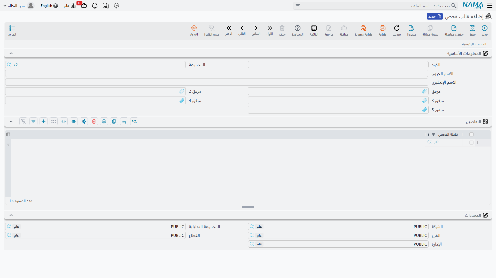
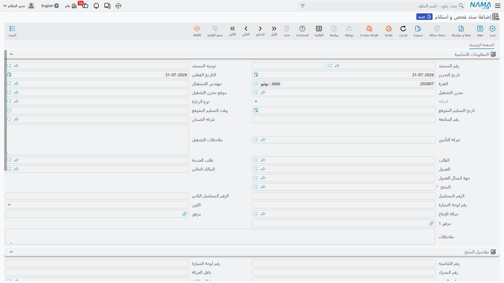

# سندات الفحص والاستلام

حين يسلّم فهد العتيبي مفاتيحه في الثامنة وعشرين دقيقة صباح ٣ مارس، لا بد أن يدور معه أحد حول سيارته
سيف ١٫٦: الخدش في الصادم الخلفي، والإطار الأيمن المستهلك، وربع خزان وقود، وإطار احتياطي موجود، وبطاقة
الملاحة مفقودة. وبعد خمس عشرة دقيقة تصير هذه الجولة سجلًا موقّعًا لحالة السيارة عند وصولها — وإن نشأ
خلاف يوم التسليم، فهو السجل الوحيد الموجود.

هذا بالضبط ما وُجد له **سند الفحص والاستلام**، ويجدر القول من البداية إنه ليس إلا ذلك. هو سجل حالة.
ولا يتحول إلى عمل.

::: info الترخيص المطلوب
`srvcenter`
:::

تتكون الخاصية من ثلاث شاشات، وثلاثتها رقيقة عن قصد:

| الشاشة | مكانها |
|---|---|
| نقطة فحص | مركز خدمة > الإعدادات > نقطة فحص |
| قالب فحص | مركز خدمة > الإعدادات > قالب فحص |
| سند فحص و استلام | مركز خدمة > المستندات > سند فحص و استلام |

## نقطة الفحص — شيء واحد تنظر إليه

النقطة بند واحد في جولة الفحص: *الهيكل — الأمام*، *حالة الإطارات*، *مستوى الوقود*، *الإطار
الاحتياطي*. وهي ملف رئيسي عادي بكود واسم عربي واسم إنجليزي وخمس مرفقات، وحقل واحد يحمل ذكاءها كله:

**الاختيارات (Options)** مربع نص متعدد الأسطر. اكتب إجابة مسموحة في كل سطر — *سليم*، *خدش سطحي*،
*انبعاج*، *صدأ* — وهذا كل ما هي عليه: قائمة أسطر.

::: warning لا يوجد نظام أنواع نتائج
هذا أول توقع يجب تصحيحه. نقطة الفحص **ليس** لها علم نجاح/رسوب، ولا قياس رقمي، ولا وحدة، ولا حد أدنى
أو أعلى، ولا قائمة قيم محددة. النتيجة المسجلة أمامها **نص حر**، دائمًا.

وأسطر *الاختيارات* **مصدر اقتراحات ليس إلا**. فبينما يكتب موظف الاستقبال في خانة النتيجة، تظهر
الأسطر التي تحتوي ما كتبه حتى الآن كاقتراحات. ولا شيء يمنعه من كتابة ما ليس في القائمة، ولا شيء يفحص
بعد ذلك أنه لم يفعل. اكتب اختياراتك لمساعدة من يعبّئ السند لا لتقييده، لأنها لا تقيّد أحدًا.
:::

::: warning تعبئة «النتيجة الافتراضية» لا يمكن أن تحدث
تحمل النقطة قيمة *نتيجة افتراضية* يقرأها النظام عند إضافة النقطة إلى سند، بنية تعبئة النتيجة مسبقًا
— لكن الحقل **ليس موجودًا في شاشة نقطة الفحص**، فلا سبيل لإعطائه قيمة. ولذلك تبدأ كل نتيجة في كل سند
فارغة.

لا تخطط لمسار عمل يقوم على إجابات معبأة مسبقًا من نوع «كل شيء افتراضيًا سليم ويغيّر موظف الاستقبال
الاستثناءات». لن يحدث ذلك؛ كل سطر يُكتب من الفراغ.
:::

ولا شيء في هذه الشاشة يخضع لفحص. يمكن أن تحمل نقطتان الاسم نفسه، وقائمة اختيارات فارغة مقبولة تمامًا.

## القالب — قائمة نقاط مرتبة

**قالب الفحص** ورقة فحص: كود واسم وخمس مرفقات وجدول من عمود واحد يسرد نقاط الفحص بالترتيب الذي تريد
أن يسير عليه موظف الاستقبال.

ولا شيء غير ذلك فيه. لا درجة خطورة، ولا رقم تسلسل، ولا علم إلزامي، ولا إجابة افتراضية على مستوى
القالب، و— وهذا هو المهم — **لا حقل «ينطبق على الطراز كذا»**. القالب لا يعرف شيئًا عن السيارة.

تحتفظ شركة الصحراء للسيارات بقالبين: `SCIT-001` *استلام سيارة*، المستخدم في مسار الورشة، وورقة أقصر
لـ*تسليم سيارة* عند التسليم.

::: warning القالب يُختار يدويًا في كل مرة
لا توجد قاعدة تختار لك قالبًا. لا شيء يعتمد على طراز السيارة ولا علامتها ولا نوع الزيارة ولا توجيه
المستند، ولا شيء يصفّي قائمة الاختيار — يرى موظف الاستقبال القائمة كاملة وعليه أن يعرف أيها يختار.
أبقِ القائمة قصيرة وسمِّ القوالب بأسماء المواقف التي تخصها، فالاسم هو الإرشاد الوحيد الذي يحصل عليه
المستخدم.
:::

وإضافة النقطة نفسها مرتين في القالب مسموحة، وينتج عنها سطران متطابقان في كل سند مبني عليه. يستحق نظرة قبل الحفظ.

## السند نفسه

سند الفحص والاستلام هو ما تُسجَّل فيه جولة الفحص. ومعظم شاشته تُعبَّأ ذاتيًا؛ لا يكتب موظف الاستقبال
إلا القليل.

**المعلومات الأساسية** تحمل دفتر المستند وكوده، وتاريخي الإصدار والاستحقاق، والفترة المالية، ومهندس
الاستقبال، ومخزن التشغيل وموقعه، والحالة، ونوع الزيارة، وتاريخ ووقت التسليم المتوقع، ورقم المتابعة،
وشركتي الضمان والتأمين، وملاحظات التشغيل، والحقلين اللذين يقودان بقية الشاشة: **القالب** و**طلب
الخدمة**.

**تفاصيل المنتج** كتلة السيارة — رقم الشاسيه، واللوحة، ورقم المحرك، وناقل الحركة، والإكسسوارات، وكود
المورّد، وقراءتا العداد السابقة والحالية بتاريخيهما، وتواريخ التأمين وكيلومتراته، والعلامة والطراز
وسنة الصنع، ومتوسط الاستهلاك اليومي، وعقد الخدمة. وأغلبها يصل تلقائيًا عند اختيار السيارة.

**التفاصيل** هي ورقة الفحص: سطر لكل نقطة، وأمامه **النتيجة**.

**المحددات** تختم الشاشة كالمعتاد.

### كيف تعبّئ الشاشة نفسها

ثلاثة حقول مرجع تؤدي العمل، بهذا الترتيب:

1. **طلب الخدمة** — ينسخ العميل والمالك الحالي والسيارة ورقمي المسلسل ورقم اللوحة واللون وصالة العمل
   من [الحجز](/ar/modules/servicecenter/job-cycle/servicecenter-service-request.md).
2. **السيارة** — تملأ كتلة تفاصيل المنتج كاملة من
   [ملف السيارة](/ar/modules/servicecenter/workshop-setup/servicecenter-product-file.md): الشاسيه
   والمحرك وناقل الحركة
   والإكسسوارات والعلامة والطراز وسنة الصنع وتواريخ التأمين وتاريخ العداد.
3. **القالب** — يبني جدول التفاصيل بسطر لكل نقطة في القالب.

::: warning اختيار القالب يستبدل الجدول ولا يدمجه
اختر قالبًا ثانيًا بعد كتابة النتائج فيُعاد بناء الجدول من الصفر: تضيع كل نتيجة كُتبت، ودون رسالة
تأكيد. اختر القالب أولًا ثم دُر حول السيارة.
:::

ولا شيء في كتلة تفاصيل المنتج مقفل، فيستطيع موظف الاستقبال الكتابة فوق ما وصل من ملف السيارة —
والمكتوب هو ما يحفظه السند، وهو ما قد يُكتب لاحقًا في ملف السيارة.

## ماذا يفعل الفحص المكتمل فعلًا

::: warning الفحص المكتمل لا يُنشئ عملًا
هذه أهم جملة في الصفحة. عند اعتماد سند الفحص:

- **النتائج لا تذهب إلى أي مكان.** لا تتحول إلى مهام، ولا تُنسخ إلى الملاحظات، ولا تُلخَّص في أي
  موضع. تبقى في هذا المستند وفيه وحده.
- **بناء [أمر شغل](/ar/modules/servicecenter/job-cycle/servicecenter-job-order.md) من الفحص يعطيك
  جدول مهام فارغًا.** حقل *بناءً على مستند* في أمر الشغل يقبل سند فحص
  فعلًا، وينقل رأس السيارة ورقم المتابعة وملاحظات التشغيل — لكن جدولي المهام وقطع الغيار يصلان
  **فارغين**، لأن الفحص لا يملك سطور مهام يعطيها. المستند بتركيبه لا يستطيع حملها.
- **لا يوجد زر** في الشاشة لإنشاء أمر شغل أو طباعة ورقة فحص أو نسخ النتائج إلى أي مكان.

من يكتب أمر الشغل يقرأ النتائج على الشاشة أو على الورق ويكتب المهام يدويًا. وقد بُني
`SCJO-2026-0417` في شركة الصحراء بهذه الطريقة تمامًا: كُتبت المهام الخمس من جديد بعد قراءة السند
`SCID-2026-0623`.
:::

لكنه ليس خاملًا تمامًا. ثلاثة أشياء حقيقية تحدث عند الاعتماد، وتستحق ضبطًا واعيًا.

**يُفحص العداد.** إن عبّأت العداد الحالي وتاريخه، وكان ذلك التاريخ في يوم قراءة السيارة الأخيرة أو
بعده، فيجب ألا تقل القراءة عن العداد المسجل في ملف السيارة. اكتب ٤٤٬٠٠٠ لسيارة يقول ملفها ٤٥٬٣٠٠
فيُرفض الاعتماد برسالة *«العداد الحالي {0} يجب أن يكون أكبر من العداد الحالي في المنتج {1}»*.

::: tip يُفحص لكنه لا يُكتب في الملف
تُفحص القراءة أمام السيارة وتُحفظ في المستند — ثم تُترك هناك. الفحص **لا** يقدّم
[عداد السيارة](/ar/modules/servicecenter/job-cycle/servicecenter-odometer-and-service-intervals.md)؛
أمر الشغل وحده يفعل. فيبقى ملف فهد على ٤١٬٦٠٠ بعد اعتماد الفحص، وينتقل إلى ٤٥٬٣٠٠ عند اعتماد
`SCJO-2026-0417`.
:::

**تتحرك حالة السيارة** إن كان توجيه المستند يقول بذلك — انظر أدناه.

**تُملأ الحقول الفارغة في ملف السيارة** من المستند. رقم الشاسيه واللوحة ورقم المحرك وناقل الحركة
والإكسسوارات وكود المورّد والعلامة والطراز وسنة الصنع وتواريخ التأمين ومدته تُنسخ إلى سجل السيارة،
لكن **فقط حيث يكون حقل السيارة نفسه فارغًا أو صفرًا**. ولا يُكتب فوق شيء معبأ. كما يُوسم جهة الاتصال
التي أحضرت السيارة على السيارة بوصفها آخر طالب للخدمة.

ولورشة تستقبل سيارة لم ترها من قبل، تلك التعبئة نافعة حقًا: سند الاستقبال هو المكان الذي تصير فيه
السيارة المجهولة سجلًا كاملًا.

## توجيه المستند

يتشارك سند الفحص
[عائلة توجيه](/ar/modules/servicecenter/document-terms/servicecenter-terms-workshop.md) مع بقية
مستندات الورشة الصغيرة، والتوجيه **اختياري** — يُعتمد المستند بدونه.

وتحمل شاشته ثلاثة خيارات، وهذه الثلاثة فقط:

| الخيار | التسمية بالإنجليزية | ماذا يفعل |
|---|---|---|
| تغيير حالة الصنف إلى | Change Product Status To | يكتب قيد حالة للسيارة عند الاعتماد، فتصبح حالتها الحالية *داخل الورشة* مثلًا |
| تغيير الحالة فقط عند توافق المعيار | Change Status Only When Criteria Matches | يقيّد تغيير الحالة بالمعايير |
| تشغيل التنبيه عند تغير الحالة | Notify On Status Change | يطلق تنبيهًا لسيارة تغيرت حالتها فعلًا |

وتُبنى الحالة بإعادة تشغيل كل قيود حالات السيارة بترتيب التاريخ، فالسند المؤرخ بأثر رجعي يندرج في
التاريخ ولا يكتب فوق الحاضر. وإلغاء اعتماد الفحص يحذف قيده وتُعاد الحالة بدونه.

وسند الفحص لا ينشئ قيدًا محاسبيًا ولا حركة مخزنية ولا يولّد أي مستند.

## الإعداد ثم الاستخدام

**مرة واحدة عند الإعداد:**

1. أنشئ نقطة فحص لكل شيء ينبغي لموظف الاستقبال أن ينظر إليه، واكتب الإجابات المتوقعة سطرًا سطرًا في
   *الاختيارات*.
2. أنشئ قالبًا لكل موقف — استقبال، تسليم — واسرد فيه النقاط بترتيب الجولة.
3. قرّر ماذا ينبغي أن يفعل السند بحالة السيارة واضبطه في التوجيه.

**لكل زيارة:**

1. حرّر سند الفحص واختر **طلب الخدمة** — فيصل العميل والسيارة واللوحة واللون وصالة العمل.
2. اختر **القالب** — فيمتلئ جدول التفاصيل بسطر لكل نقطة.
3. دُر حول السيارة مع العميل واكتب نتيجة في كل سطر مستعينًا بالاقتراحات.
4. اقرأ العداد في *العداد الحالي* مع تاريخه — ٤٥٬٣٠٠ يوم ٣ مارس للسيارة `VEH-2031`.
5. اعتمد السند. تتحرك حالة السيارة، وتُملأ الفراغات في سجلها، ويُحفظ السند.
6. حرّر أمر الشغل و**اكتب العمل**. السند أخبرك بما ينبغي عمله، ولن يعمله عنك.
