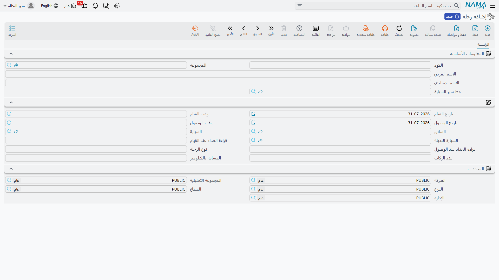

# الرحلات وخطوط السير والمحطات

تشغّل شركة الصحراء للسيارات سيارة نقل صغيرة بين موقع الرياض وفرع الدمام مرتين أسبوعيًا، تحمل قطع
غيار ومفاتيح سيارات عملاء بين حين وآخر. ويريد أحدهم أن يعرف كم كيلومترًا قطعتها الشهر الماضي. هذا
السؤال — وبصراحة، هذا السؤال وحده — هو ما تجيب عنه سجلات الرحلات.

::: info الترخيص المطلوب
`srvcenter`
:::

ثلاثة ملفات رئيسية، بالترتيب الذي تنشئها به:

| الملف | مكانه |
|---|---|
| محطة | مركز خدمة > الملفات > محطة |
| خط سير سيارة | مركز خدمة > الملفات > خط سير سيارة |
| رحلة | مركز خدمة > الملفات > رحلة |

## المحطات وخطوط السير

**المحطة** بالكاد تكون سجلًا: كود واسم عربي واسم إنجليزي ومرفقات. هي مكان تقوم منه السيارة أو تصل
إليه. `STN-RUH` مستودع الرياض، `STN-DMM` فرع الدمام.

و**خط السير** رِجل واحدة بين محطتين، بجدول زمني وأرقام تقديرية:

| الحقل | التسمية بالإنجليزية | خط سير شركة الصحراء `SCTR-RUH-DMM` |
|---|---|---|
| محطة القيام | Departure Station | `STN-RUH` مستودع الرياض |
| محطة الوصول | Arrival Station | `STN-DMM` فرع الدمام |
| وقت القيام | Departure Time | ٠٦:٠٠ |
| وقت الوصول | Arrival Time | ١١:٣٠ |
| المسافة بالكيلومتر | Distance In KM | ٤٠٠ |
| الوقود المستهلك باللتر | Consumed Fuel In Liters | ٣٨ |

كل ما في خط السير تقديري — ما تستغرقه الرِّجل *عادةً* وما تكلّفه *عادةً*. ولا شيء منه يخضع لفحص:
يمكن أن تكون المحطتان واحدة، ويمكن أن يسبق وقت الوصول وقت القيام، ويمكن أن تكون المسافة صفرًا. خط
السير قالب ستعيد استخدامه، فيستحق ضبطًا يدويًا متأنيًا.

## الرحلة

**الرحلة** تنفيذ واحد لخط سير. أنشئ سجلًا لكل جولة.

| الحقل | التسمية بالإنجليزية | ملاحظات |
|---|---|---|
| خط سير السيارة | Trip Route | اختياره يعبّئ الأوقات وقيمة الوقود |
| تاريخ / وقت القيام | Departure Date / Time | التاريخان يبدآن بتاريخ اليوم |
| تاريخ / وقت الوصول | Arrival Date / Time | |
| السائق | Driver | موظف |
| السيارة | Car | سيارة من [سجل سيارات مركز الخدمة](/ar/modules/servicecenter/workshop-setup/servicecenter-product-file.md) |
| السيارة البديلة | Replacement Car | للجولة التي غابت عنها السيارة المعتادة |
| قراءة العداد عند القيام | Counter At Departure | العداد لحظة المغادرة |
| قراءة العداد عند الوصول | Counter At Arrival | العداد لحظة الوصول |
| نوع الرحلة | Trip Type | نص حر — بحسب حاجة تقاريرك |
| عدد الركاب | Number Of Passengers | |
| المسافة بالكيلومتر | Distance In KM | **محسوبة ومقفلة** |

المسافة هي الحقل المحسوب الوحيد، والحساب هو تمامًا ما يبدو عليه: **قراءة الوصول ناقص قراءة القيام**،
ويُعاد احتسابه كلما تغيّرت إحدى القراءتين. في الرحلة `SCTRP-2026-0044` غادرت السيارة `STN-RUH` يوم ٥
مارس الساعة ٠٦:١٠ بقراءة **١٢٨٬٤٠٠** ووصلت `STN-DMM` الساعة ١١:٥٥ بقراءة **١٢٨٬٨١٠**، فيعرض السجل
**٤١٠ كم** — عشرة أكثر من الأربعمائة التقديرية في خط السير، وهو بالضبط ما وُجد السجل ليُظهره.

والقاعدة الوحيدة المفروضة عند الاعتماد هي ألا تكون المسافة سالبة، أي ألا تقل قراءة الوصول عن قراءة
القيام. ولا شيء آخر يُفحص: لا ترتيب التواريخ، ولا كون السيارة مرتبطة برحلة أخرى، ولا توافق قراءة
القيام مع عداد السيارة نفسها.

::: tip مسافة خط السير لا تُنسخ
اختيار خط السير ينقل وقت القيام ووقت الوصول وقيمة الوقود — لكن **ليس** المسافة. وإن تُركت القراءتان
فارغتين كانت مسافة الرحلة صفرًا مهما قال خط السير. أدخل القراءتين دائمًا؛ فهما جوهر السجل كله.
:::

::: warning قيمة الوقود تهبط حيث لا تراها
عند اختيار خط السير ينسخ النظام *الوقود المستهلك باللتر* من خط السير إلى الرحلة — إلى حقل **ليس
موجودًا في شاشة الرحلة**. فالرحلة تعرض المسافة ولا تعرض الوقود، ولا يمكن قراءة استهلاك الوقود لكل
كيلومتر من السجل، ولا يستطيع السائق تصحيح الرقم حين تستهلك الجولة أكثر من المعتاد. عامل الوقود على
أنه خاصية لخط السير لا للرحلة.
:::

## ما ليست عليه الرحلات

::: warning الرحلات سجل أسطول معزول
الرحلة **لا** ترتبط بأي شيء آخر في مركز الخدمة. لا ترتبط
بـ[أمر شغل](/ar/modules/servicecenter/job-cycle/servicecenter-job-order.md) ولا
بـ[طلب خدمة](/ar/modules/servicecenter/job-cycle/servicecenter-service-request.md) ولا بمستندات حركة
المندوبين. ولا تنشئ مستندًا ولا قيدًا محاسبيًا ولا تحرك مخزونًا. ورغم أنها تسجل قراءتي عداد، فهي
**لا** تحدّث عداد السيارة في ملف السيارة — فمنطق
[فترات الصيانة](/ar/modules/servicecenter/job-cycle/servicecenter-odometer-and-service-intervals.md)
القائم على الكيلومترات يتجاهل الرحلات تمامًا.

وعلى وجه الخصوص، لا تقرأ كلمة «رحلة» على أنها خدمة ميدانية أو زيارة متنقلة لعميل. إرسال فني إلى موقع
العميل غير مُمثّل هنا، وورقة جولة المندوب في
[وحدة التسليم عبر المندوبين](/ar/modules/servicecenter/mobile-delivery/servicecenter-mobile-delivery-overview.md)
مستند منفصل لا علاقة له بهذا.

أما ما هي الرحلة، وكل ما هي عليه: سطر في سجل أسطول تبني عليه تقاريرك.
:::

## طريقة الاستخدام

1. أنشئ **محطة** لكل مستودع أو فرع أو موقع يتنقل الأسطول بينها.
2. أنشئ **خط سير** لكل رِجل، بأوقاتها ومسافتها ووقودها المعتاد.
3. لكل جولة أنشئ **رحلة**: اختر خط السير، واختر السيارة والسائق، وأدخل قراءتي العداد. تُحسب المسافة
   وتُقفل.
4. ابنِ تقاريرك على السجلات — فهنا تكمن القيمة، وهنا تنتهي الخاصية.
