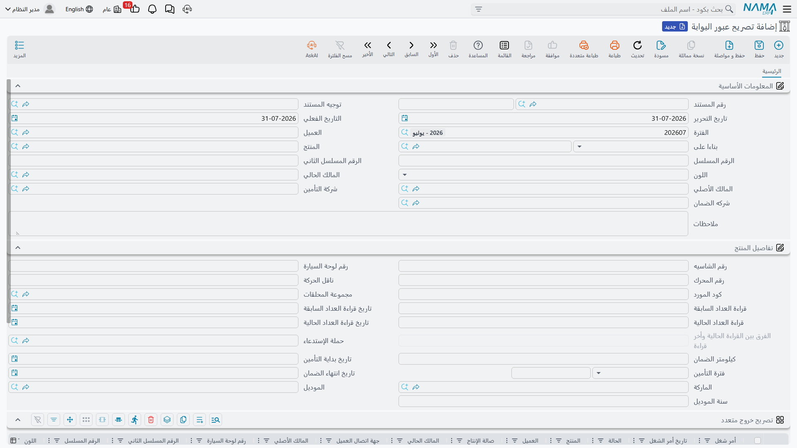

# تصريح عبور البوابة

يجيب تصريح عبور البوابة عن سؤال واحد لا غير:

> **هل فُوتر أمر الشغل هذا — وسُدِّد — عن كل جهة عليها شيء؟**

فإن كان الجواب نعم رُحِّل المستند وصار في يدك إذن خروج مطبوع يحمله العميل إلى المخرج. وإن كان الجواب
لا رفض المستند الترحيل وأخبرك أي فاتورة ناقصة أو كم بقي غير مسدَّد. وهذه هي الخاصية كلها.

القائمة: **مركز خدمة > المستندات > تصريح عبور البوابة**.

::: info الترخيص المطلوب
`srvcenter`. و**[التوجيه](/ar/modules/servicecenter/document-terms/servicecenter-terms-workshop.md)
إجباري** — وهو الذي يقوم بالعمل كله، لأن كل فحص في هذه الصفحة خيارٌ فيه.
:::

## ما ليس هو

اضبط التوقعات قبل أن يهيّئ أحد هذا المستند، فالاسم يَعِد بأكثر مما يقدّم.

فتصريح العبور **بلا اتجاه** — لا «دخول» ولا «خروج». و**بلا بوابة**: لا تكامل مع حاجز، ولا حارس، ولا
كاميرا، ولا معرِّف بوابة. و**بلا وقت عبور** — فلا شيء يسجّل لحظة اجتياز المركبة شيئاً. وليس له أثر على
المخزون ولا على المحاسبة ولا على أمر الشغل.

هو **فحص إفراج** لا ضبط بوابة. فإن كنت تحتاج سجل دخول وخروج للمركبات بأوقاته، فليس هذا هو المستند،
وليس في الوحدة ما يقوم به.

وبهذا الفهم يصير مفيداً حقاً: فهو الآلية التي تمنع خروج سيارة قبل اكتمال الجانب المالي، والخيارات
السبعة التي تقوده حقيقية ومطبَّقة.

## الشاشة

يحمل الرأس العميل، و*بناءا على*، والمركبة، وأرقامها المسلسلة، واللون، وآخر طالب خدمة وجهة اتصاله،
والمالك الحالي والمالك الأول، وشركتَي التأمين والضمان، ثم مجموعة تفاصيل المنتج المعتادة والمحددات.

وتحته جدول كبير واحد — سطر لكل أمر شغل يُفرج عنه. اختر
[أمر شغل](/ar/modules/servicecenter/job-cycle/servicecenter-job-order.md) في سطر فيملأ السطر نفسه منه: تاريخه
وحالته والمنتج والعميل والمالكين واللوحة والأرقام المسلسلة واللون ونوع الزيارة وتاريخ ووقت الحجز
وشركتَي التأمين والضمان والشاسيه والمحرك وناقل الحركة وكود المورد وقراءتَي العداد والملحقات وحملة
الاستدعاء ومخزن تحت التشغيل ومهندس الاستقبال وسنة الصنع والموديل وبيانات التأمين. فالسطر مرآة لرأس أمر
الشغل — وُجد ليُظهر التصريحُ المطبوع المركبةَ كاملة.

ولأن المركبات في أسطر الجدول فإن حقل **المنتج** في الرأس **ليس** إجبارياً في هذا المستند — وهو مستند
مركز الخدمة الوحيد الذي يصح فيه ذلك.

## الفحوص السبعة

كل فحص خيار في التوجيه صيغته إذنٌ بالصورة *السماح بدون…*. فاترك الخيار **مطفأً** يكن الفحص مطبَّقاً،
وفعّله يسقط الفحص.

| خيار التوجيه | حين يكون مطفأً يُرفض التصريح إلا إذا… |
|---|---|
| السماح بتصريح عبور بدون أمر شغل | كان *بناءا على* مملوءاً ويشير إلى أمر شغل |
| السماح بتصريح عبور بدون فاتورة عميل | وُجدت فاتورة عميل **مرحَّلة** — وذلك فقط إذا كان في أحد أسطر الأمر حصة عميل فعلاً |
| السماح بتصريح عبور بدون فاتورة تأمين | كذلك، لحصة التأمين وفاتورتها |
| السماح بتصريح عبور بدون فاتورة ضمان | كذلك، لحصة الضمان وفاتورتها |
| السماح بتصريح عبور مع وجود متبقٍ في فاتورة العميل | كانت فاتورة العميل **مسدَّدة بالكامل**؛ وإلا سمّت الرسالة الفاتورة والمبلغ المتبقي |
| السماح بتصريح عبور مع وجود متبقٍ في فاتورة التأمين | كذلك، لفاتورة التأمين |
| السماح بتصريح عبور مع وجود متبقٍ في فاتورة الضمان | كذلك، لفاتورة الضمان |

ولاحظ حصافة نطاق فحوص الفواتير: فأمر شغل لا حصة تأمين فيه أصلاً لا يُطالَب بفاتورة تأمين. فالفحص لا
يعمل إلا حيث يوجد مستحَق.

## الإفراج عن سيارة فهد

تضبط شركة الصحراء توجيه تصريح العبور ليشترط فاتورة **عميل** مرحَّلة ومسدَّدة بالكامل، مع فاتورتَي تأمين
وضمان مرحَّلتين — فشركة التأمين وجهة الضمان على الحساب، فلا يلزم سداد فاتورتيهما قبل خروج السيارة، أما
فاتورة عميل التجزئة فيلزم.

فيُحرَّر التصريح `SCGP-2026-0475` في ٤ مارس ٢٠٢٦ بسطر واحد لأمر الشغل `SCJO-2026-0417`. وعندها:

- فاتورة العميل `SINV-2026-3311` موجودة وقد سدّد فهد الـ 799.25 نقداً — ✔
- فاتورة الضمان `SINV-2026-3312` موجودة ومرحَّلة — ✔
- فاتورة التأمين `SINV-2026-3313` موجودة ومرحَّلة — ✔

فيُرحَّل التصريح ويُطبع. ولو أراد فهد الخروج بلا سداد لرفض المستند برسالة تسمّي فاتورته والمبلغ
المتبقي — وهو تماماً الحوار الذي يحتاج مكتب الاستقبال أن يجريه.

ولاحظ أن لا شيء في التصريح يسجّل الساعة ١٦:٢٠، ولا أي مخرج استعمل، ولا أنه عاد بعد ساعة. فالتصريح هو
الإذن لا الواقعة.

## ماذا يفعل عند الترحيل

لا شيء تقريباً، وهذا مقصود:

- **لا أثر محاسبي ولا أثر مخزني ولا مستند مولَّد.**
- يملأ الحقول الفارغة في
  [ملف المركبة](/ar/modules/servicecenter/workshop-setup/servicecenter-product-file.md)، كسائر
  مستندات العمل.
- وإن سمّى التوجيه **حالة يُنقل إليها المنتج** أضاف قيد حالة للمنتج — وبهذا يظهر ملف المركبة بحالة
  *خرجت من المركز* بعد إصدار تصريحها. وتصحبه الخيارات المعتادة: مرشِّح معايير حتى لا تتغير الحالة إلا
  عند تحققها، وإشعار اختياري.

وتغيّر حالة المنتج هذا هو عملياً الأثر الباقي الوحيد لتصريح العبور. فإن أردت
[تقارير](/ar/modules/servicecenter/servicecenter-reports-and-forms.md) عن المركبات المفرَج عنها
فقيد الحالة ذاك ومستندات التصاريح نفسها هما ما لديك.

## حسن التهيئة

- **احسم سياستك مرة واحدة لكل توجيه.** فالخيارات السبعة ليست لكل مركبة ولا لكل عميل، بل هي قاعدة
  الورشة. ومعظم الوكالات تنتهي إلى توجيه صارم لعملاء التجزئة، وأحياناً آخر أرخى لحسابات الأساطيل.
- **لا تفعّل كل شيء.** فتوجيه فُعِّلت فيه الخيارات السبعة ينتج مستنداً لا يفحص شيئاً على الإطلاق —
  ورقة بلا منطق وراءها.
- **وتذكّر أن الفواتير أولاً.** فلأن التصريح يتوقف على
  [فواتير مرحَّلة](/ar/modules/servicecenter/job-cycle/servicecenter-job-order-invoicing.md)،
  والفواتير تتوقف على
  [إغلاق أمر الشغل](/ar/modules/servicecenter/job-cycle/servicecenter-job-order-closing.md)، صار
  تصريح العبور حقاً آخر مستند في
  [الدورة](/ar/modules/servicecenter/job-cycle/servicecenter-job-cycle-overview.md).
