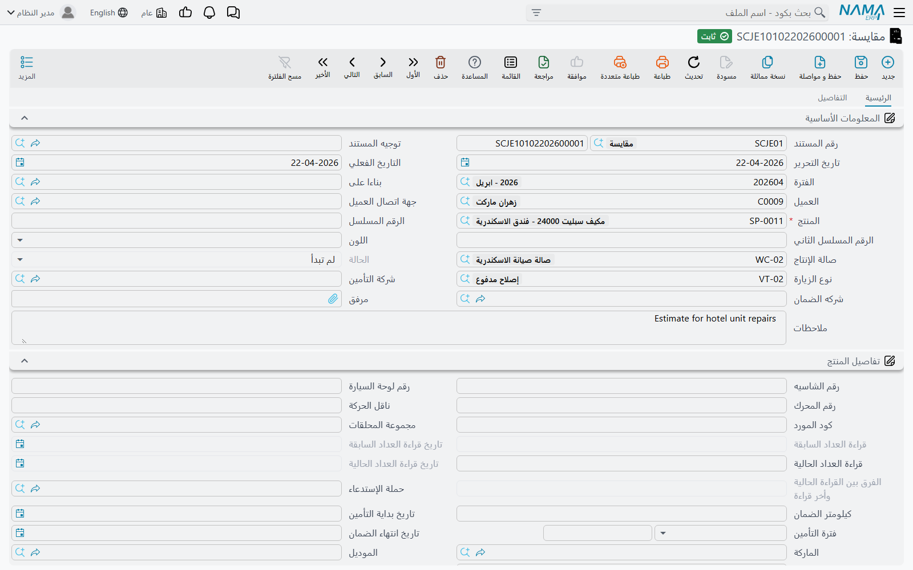

# المقايسات

المقايسة هي عرض السعر. فقبل أن يمس أحد السيارة لا بد أن يستطيع أحدهم أن يخبر العميل بكلفة العمل،
و — في ورشة كثيراً ما يدفع ثمن الإصلاح فيها ثلاثة أطراف — من الذي سيُطالَب بأي جزء منه. وهذا ما وُجد
له هذا المستند.

والمقايسة في بنيتها هي أمر الشغل بعد نزع أنيابه: الرأس نفسه، والجداول الثلاثة نفسها، وأعمدة الجهات
الدافعة نفسها، لكن بلا دفع لقراءة العداد، وبلا فحص حملات استدعاء، وبلا فواتير، وبلا محاسبة. وُجدت
لتُسعَّر وتُطبع ويُتفاوض عليها ثم تُنسخ إلى ما بعدها.

القائمة: **مركز خدمة > المستندات > مقايسة**.

::: info الترخيص المطلوب
`srvcenter`. ولا يحتاج أي من مستندَي هذه الصفحة
[توجيهاً](/ar/modules/servicecenter/document-terms/servicecenter-terms-workshop.md).
:::

## تسعير عمل فهد

سيارة فهد على الرافعة، وأكد الفني تلف الكمبروسر. فيحرر المستشار المقايسة `SCJE-2026-0455` مشيراً بحقل
*بناءا على* إلى طلب خدمة الصباح، فتصل بيانات المركبة والعمليات المطلوبة جاهزة.

ويستقر جدول **العمليات** على هذا — وإجمالي السطر دائماً **سعر الساعة × المدة × العدد**، والمدة قادمة
من [كتالوج المهام](/ar/modules/servicecenter/workshop-setup/servicecenter-tasks.md):

| المهمة | المدة | العدد | سعر الساعة | الإجمالي |
|---|---|---|---|---|
| تغيير زيت وفلتر | 1.0 | 1 | 120 | 120 |
| تغيير تيل الفرامل الأمامي | 1.5 | 1 | 120 | 180 |
| تغيير كمبروسر التكييف | 3.0 | 1 | 120 | 360 |
| ضبط زوايا الإطارات | 0.5 | 1 | 120 | 60 |
| غسيل وتنظيف السيارة | 0.5 | 1 | 120 | 60 |
| | | | **إجمالي العمليات** | **780** |

ويضيف جدول **قطع غيار** في صفحة التفاصيل
[القطع](/ar/modules/servicecenter/spare-parts/servicecenter-spare-parts-overview.md)، وكل قطعة مسعَّرة بمحرك أسعار البيع المعتاد في سلسلة
الإمداد لهذا العميل وهذا التاريخ — فليس في سعر قطعة الغيار شيء خاص بمركز الخدمة:

| المهمة | القطعة | الكمية | سعر الوحدة | السعر |
|---|---|---|---|---|
| تغيير الزيت | زيت محرك 5W-30 | 5 | 32 | 160 |
| تغيير الزيت | فلتر زيت | 1 | 45 | 45 |
| تيل الفرامل | طقم تيل فرامل أمامي | 1 | 380 | 380 |
| التكييف | كمبروسر تكييف | 1 | 1,850 | 1,850 |
| | | | **إجمالي القطع** | **2,435** |

**إجمالي المقايسة: 3,215.**

ثم يأتي ما يجعل هذه الوحدة ما هي عليه: كل سطر من تلك الأسطر التسعة يُوزَّع بين العميل وشركة التأمين
وجهة الضمان والشركة نفسها. والقواعد كاملة في
[توزيع القيمة على الجهات الدافعة](/ar/modules/servicecenter/job-cycle/servicecenter-payer-split.md)؛
وفي هذه المقايسة يستقر التوزيع على 695 / 60 / 2,400 / 60.

أما الجدول الثالث، **موارد التشغيل**، فيسرد الآلات التي تحتاجها المهمة. وهو وصفي: لا شيء يجدول عليه.

## المقايسة لا تفحص شيئاً

::: warning أخطاء المقايسة تظهر لاحقاً في أمر الشغل
المقايسة **لا تجري أي تحقق من صحتها**. فمقايسة بلا أي سطر عمليات، أو فيها مهمة مكررة مرتين، أو فيها
سطر خدمة بلا أسطر تابعة، أو توزيع دافعين لا تبلغ نسبه 100 ولا تبلغ قيمه سعر السطر — كل ذلك يُحفظ
ويُرحَّل دون كلمة اعتراض.

وهذه الأخطاء نفسها **مُطبَّقة** في [أمر الشغل](/ar/modules/servicecenter/job-cycle/servicecenter-job-order.md).
فمقايسة حُفظت بسلام قد تنتج أمر شغل يرفض الترحيل — والذي يضطر لإصلاحه غالباً ليس هو من كتب المقايسة.

والقاعدة العملية: إن كانت المقايسة ذات أثر (لأنها طُبعت ووُقِّعت، أو لأنها ستُنسخ مباشرة إلى أمر شغل)
فافحص توزيع الدافعين بعينك قبل إرسالها. فمجموع نسب الأعمدة الأربعة في كل سطر لا بد أن يكون 100،
ومجموع قيمها الأربع لا بد أن يساوي سعر السطر.
:::

فلا تصف المقايسة ولا تُعلِّمها بوصفها مستنداً مُتحقَّقاً منه. هي ورقة تسعير.

## ترحيلها

ترحيل المقايسة ينقل طلب الخدمة المصدر إلى **قيد التنفيذ**، ويضيف قيد حالة للمنتج إن سمّاها التوجيه،
ويملأ الحقول الفارغة في ملف المركبة. وليس لها **أثر محاسبي ولا أثر مخزني ولا تولّد مستنداً.**

وتتيح قائمة المزيد **إنشاء سند حجز** من جدول قطع الغيار — وهو مفيد حين يتوقف عرض السعر على قطعة تريد
حجزها.

## تعديل المقايسة

ينظر فهد إلى الـ 3,215 فيقبل الأعمال الميكانيكية ويطلب رفع بند الغسيل. فماذا تصنع بالمقايسة التي
أعطيته إياها؟

القائمة: **مركز خدمة > المستندات > تعديل مقايسة**.

تعديل المقايسة **مقايسة ثانية منقّحة تسمّي الأولى**. لها الرأس نفسه والجداول الثلاثة نفسها، ومعها حقل
إجباري واحد يشير إلى المقايسة التي تتعلق بها. فتحرر `SCJEU-2026-0119` وتشير به إلى `SCJE-2026-0455`
وتسعّر عليه العمل المنقَّح.

::: warning ليس تعديلاً ولا إحلالاً
اسم المستند «تعديل»، لكنه **لا يفعل بالمقايسة التي يشير إليها شيئاً على الإطلاق**. فتبقى الأصلية على
أسطرها وأسعارها وإجمالياتها. ولا تُقفَل، ولا تُرقَّم بإصدار، ولا تُوسَم بأنها نُقِّحت، ولا يظهر عليها
في أي موضع أن ثمة نسخة منقّحة — إلى أن يُبنى أمر شغل فيقلب حالتها.

فالتصور الأمين هو: مقايستان جنباً إلى جنب، والثانية تحمل مؤشراً إلى الأولى. فإن كان إجراؤك يقتضي أن
يظهر العرض المُلغى ميتاً، فعليك أن تصنع ذلك بنفسك — بإلغاء الأصلية، أو بعرف تسمية يلتزمه موظفوك.
:::

وغرضه العملي أن يكون *بناءا على* لأمر الشغل بعد موافقة العميل على العرض المنقَّح. وعند ترحيل ذلك
الأمر تُنقل المقايسة الأصلية **وطلب الخدمة الأصلي** معاً إلى *قيد التنفيذ*، فيضيء المسار كله دفعة
واحدة.

## ماذا بعد

يُنشأ [أمر الشغل](/ar/modules/servicecenter/job-cycle/servicecenter-job-order.md) وحقل *بناءا على*
فيه يشير إلى المقايسة التي وافق عليها العميل — الأصلية أو المنقّحة. ويُنسخ كل شيء لقطةً واحدة. ومن تلك
اللحظة تصير المقايسة تاريخاً: تعديل أمر الشغل لا يغيّرها، وتعديلها لا يمس أمر الشغل.
