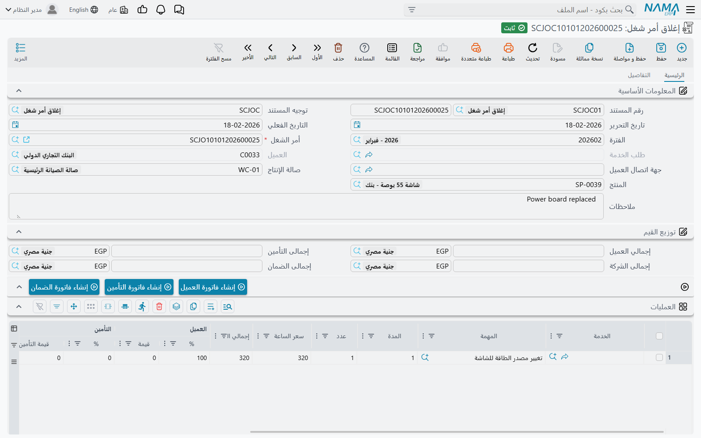

# إغلاق أمر الشغل

انتهت السيارة، ورُكِّبت القطع، وسجّل الفنيون أوقاتهم. ومستند إغلاق أمر الشغل هو الذي يضع خطاً تحت ذلك
كله: فيجمع ما نُفِّذ فعلاً، ويحسب ما على كل جهة دافعة، ويخرج القطع المستهلكة من المخزون، ويحسب موعد
عودة المركبة، ويحوّل [أمر الشغل](/ar/modules/servicecenter/job-cycle/servicecenter-job-order.md) إلى
**مغلق** — وهي الحالة التي تفتح أزرار الفواتير وتقفل أمر الشغل عن
أي تعديل.

ولكل أمر شغل **إغلاق واحد** إلى الأبد. ويجدر أن تعرف ذلك قبل أن تنشئه.

القائمة: **مركز خدمة > المستندات > إغلاق أمر شغل**.

::: info الترخيص المطلوب
`srvcenter`. و**[التوجيه](/ar/modules/servicecenter/document-terms/servicecenter-terms-workshop.md)
إجباري**، وهو الذي يحمل الطرفين المحاسبيين ودفتر الصرف المخزني — فبدونهما لا
ينشئ الإغلاق قيداً ولا يصرف شيئاً.
:::

## إغلاق عمل فهد

المستند `SCJOC-2026-0392`، تاريخه الفعلي ٤ مارس ٢٠٢٦. والشيء الوحيد الذي يكتبه أحد هو أمر الشغل.

فاختيار `SCJO-2026-0417` في حقل **أمر الشغل** يتكفل بالباقي: فيُملأ لك المنتج والعميل وصالة الإنتاج
وطلب الخدمة الذي وراءه وحقول الزيارة القادمة والجدولان وصناديق المال الأربعة. وحقلا العميل وطلب
الخدمة معطَّلان — فهما لأمر الشغل لا لك — ومنتقي أمر الشغل يخفي عمداً الأوامر المغلقة سلفاً.

### ما الذي يُجلب

- **العمليات**: الأسطر التي حالتها **منتهية** فقط. ويُجلب سطر الخدمة إن كانت أي مهمة تابعة له منتهية.
  فإن أردت جلب كل شيء بصرف النظر عن الحالة، ففي التوجيه خيار لتجاهل حالة أسطر العمليات.
- **المواد**: **كل** أسطر قطع الغيار في أمر الشغل، بلا ترشيح.

ويصل الجدولان بأزواج النسبة والقيمة الأربعة سليمة، منسوخة من أمر الشغل. وتُعاد صناديق المال الأربعة من
تلك الأسطر عند كل حفظ، فهي إجماليات للعرض لا أرقام تعدّلها:

| الصندوق | عمل فهد |
|---|---|
| إجمالي العميل | **695** |
| إجمالى التأمين | **60** |
| إجمالى الضمان | **2,400** |
| إجمالى الشركة | **60** |

ومجموعها 3,215 — إجمالي العمل. والاشتقاق كاملاً في
[توزيع القيمة على الجهات الدافعة](/ar/modules/servicecenter/job-cycle/servicecenter-payer-split.md).

## ما الذي يصل إلى الأستاذ

::: danger قيمة العميل وحدها هي التي تُسجَّل
تبدو صناديق المال الأربعة وكأنها قيد رباعي. وليست كذلك. فالقيد الذي ينتجه هذا الإغلاق **سطران** — مدين
ودائن، من الطرفين المحاسبيين في التوجيه — و**كلاهما يحمل قيمة العميل وحدها**.

وفي عمل فهد هي **695** لا 3,215.

- **التأمين (60)** و**الضمان (2,400)** لا يصلان إلى المحاسبة إلا حين تضغط
  [زرَّي فاتورتيهما](/ar/modules/servicecenter/job-cycle/servicecenter-job-order-invoicing.md). فلا
  فاتورة، فلا قيد.
- أما **حصة الشركة (60)** فلا تصل إلى المحاسبة **بأي طريق**. فلا مستند لها ولا دفتر ولا زر في الوحدة
  كلها.

فإن كانت وكالتك تعتمد على هذه الوحدة في محاسبة أعمال الضمان المستردة من الوكيل، فافهم بدقة من أين يأتي
ذلك الاسترداد: من **فاتورة** الضمان. فشهر من الإغلاقات بلا فواتير ضمان يترك ثقباً صامتاً بحجم كل
عمالة الضمان وقطعه.
:::

وتُستخرج الحسابات نفسها ومخزن صالة الإنتاج في أمر الشغل هو المصدر، وتأتي المحددات من مستند الإغلاق.
والعملة تتبع عملة مال العميل.

وكسائر الآثار في نما، يُنشأ القيد في صورة **طلب أعمال** يُعالَج في الخلفية. فإن لم يظهر فابحث في شاشة
طلبات الأعمال، ورشّح على الفاشلة، ثم **المزيد ← إعادة المعالجة**.

## ما الذي يفعله بالمخزون

يولّد الإغلاق **صرفاً مخزنياً** — وهنا تغادر القطع المخزون بالمعنى المحاسبي أخيراً.

ويحسن التدقيق فيما يدخل هذا الصرف، فهو ليس ما يعرضه جدول مواد الإغلاق نفسه. إذ يُبنى الصرف من سجل قطع
أمر الشغل: لكل صنف، ما
**[نُقل إلى مخزن تحت التشغيل](/ar/modules/servicecenter/spare-parts/servicecenter-spare-parts-issue.md)
ناقص [ما أُرجع](/ar/modules/servicecenter/spare-parts/servicecenter-spare-parts-return.md)**. وتُسقَط الأسطر التي لم يبق منها
شيء. ويُفرض المخزن والموقع على مخزن وموقع تحت التشغيل في أمر الشغل.

وفي عمل فهد سُحبت ستة لترات زيت وعاد لتر، فاستُهلكت خمسة؛ واستُهلك الفلتر وطقم التيل والكمبروسر
بالكامل. ويُخرج الصرف **تكلفة المخزون** لتلك القطع — (5 × 21) + 28 + 245 + 1,290 = **1,668** — ولا
علاقة لها بالـ 2,435 المفوترة على العميل وجهة الضمان. فلا آلية هامش بين الرقمين.

::: warning لا دفتر صرف، فلا صرف مخزني — وبلا تنبيه
لا يُولَّد الصرف المخزني إلا إذا مُلئ **كلٌّ من** دفتر الصرف وتوجيه الصرف في توجيه مستند الإغلاق. فإن
نقص أحدهما لم يُولَّد شيء ولم يُقل شيء. فافحصهما في كل توجيه إغلاق تنشئه.
:::

ويُرحَّل الصرف المخزني تلقائياً، ويُعاد توليده كلما أُعيد حفظ الإغلاق، ويُحذف إذا أُلغي ترحيله. وتحمل
صفحة التفاصيل قائمة للعرض فقط بالصروف التي أنتجها هذا الإغلاق، فتستطيع دائماً أن ترى هل وُجد صرف أم
لا.

## الزيارة القادمة

ويحسب الإغلاق كذلك موعد عودة المركبة. فيأخذ متوسط استهلاكها اليومي وأقصر فترة كيلومترية بين مهام أمر
الشغل، ويتوقع تاريخاً، ويكتبه على الإغلاق وعلى أمر الشغل معاً.

وسيارة فهد تقطع نحو 60.7 كم يومياً. وتتكرر صيانة الزيت كل 10,000 كم وكانت آخرها عند 36,000، فتستحق
التالية عند 46,000 — أي على بعد 700 كم، نحو ١١٫٥ يوماً، من الـ 45,300 المقروءة عند الوصول. فيتوقع
الإغلاق **١٥ مارس ٢٠٢٦**. وإن عجز عن الحساب رجع إلى ما يقوله أمر الشغل. والتفصيل في
[قراءات العداد وفترات الصيانة](/ar/modules/servicecenter/job-cycle/servicecenter-odometer-and-service-intervals.md).

## ماذا يرفض الإغلاق

1. **أمراً مغلقاً سلفاً.** إغلاق واحد لكل أمر؛ والثاني مرفوض قطعاً.
2. **الأوامر الموقوفة.** يُرفض أمر الشغل *الملغي* أو *المؤجل* أو *المتوقف* إلا إذا فُعِّل في التوجيه
   *السماح بإغلاق الأوامر الموقوفة*.
3. **عملاً لم ينتهِ.** مع تفعيل إعداد الوحدة *منع الإغلاق مع وجود مهمة غير منتهية* — وهو **مفعَّل
   افتراضياً** — يمنع الإغلاقَ أي سطر تنفيذ لهذا الأمر ينقصه تاريخ بداية أو نهاية، مسمّياً المهمة
   والفني. وهذا الفحص هو ما يجعل الفنيين يكملون كشوف أوقاتهم.
4. **مواد لم تُصرف**، إن فُعِّل خيار ذلك في التوجيه: فكل قطعة غيار في أمر الشغل لا بد أن تكون قد صُرفت
   بالكمية المخططة على الأقل. ولاحظ أن هذا الفحص يجمع بالصنف، فالقطعة الواردة في مهمتين تُحسب مرة
   واحدة — وصرف ما يكفي لمهمة قد يُرضيه عنهما جميعاً.

## التراجع عن الإغلاق

الإغلاق مستند عادي: ألغِ ترحيله أو احذفه فتنفكّ آثاره. فيختفي قيد الحالة، فتُعاد حالة أمر الشغل مما
بقي ويكف عن كونه مغلقاً؛ ويُحذف الصرف المخزني المولَّد؛ ويُرفع قيد حالة المنتج؛ ويُرسل طلب حذف للقيد
المحاسبي.

::: warning أنشئ الفواتير في النهاية
**لا يمكن حذف الإغلاق متى وُجدت أي واحدة من الفواتير الثلاث** — والفحص كل أو لا شيء. فأنشئ فاتورة
العميل وحدها فيتجمد الإغلاق فوراً، وإن كانت فاتورتا التأمين والضمان ما زالتا مفقودتين.

فترتيب العمل الآمن: أغلق، وراجع صناديق المال الأربعة والصرف المخزني، ثم أصدر الفواتير. فإن اضطررت إلى
تصحيح أمر الشغل بعد الفوترة فأنت تحذف الفواتير أولاً.
:::

وتذكّر كذلك أن أمر الشغل المغلق لا يُعدَّل البتة، فتصحيح سعر أو توزيع يعني دائماً حذف الإغلاق أولاً.

## الطريق الآخر لإنشاء الإغلاق

وثمة طريق ثانٍ ينبغي لموظف الدعم أن يعرفه. فمستند
**[تنفيذ أمر الشغل](/ar/modules/servicecenter/workshop-execution/servicecenter-production-execution.md)** —
وهو كشف أوقات الورشة، وتسميته
في القائمة الإنجليزية حالياً *Production Review* — فيه زر ينشئ الإغلاق **ويرحّله فوراً**، مستعملاً
دفتر الإغلاق وتوجيهه المضبوطين في توجيه مستند التنفيذ نفسه.

وذلك الإغلاق التلقائي ينسخ أسطر مهام أمر الشغل وموادها جملةً: فهو **لا** يطبق ترشيح «الأسطر المنتهية
فقط» الذي تستعمله الشاشة اليدوية. وهو تسهيل للورش التي تغلق العمل لحظة انصراف آخر فني. فإن استعملته
فاعتنِ بتوجيه مستند التنفيذ عنايتك بتوجيه الإغلاق، فمنه يأتي دفتره وتوجيهه ومن ثم حساباته.
