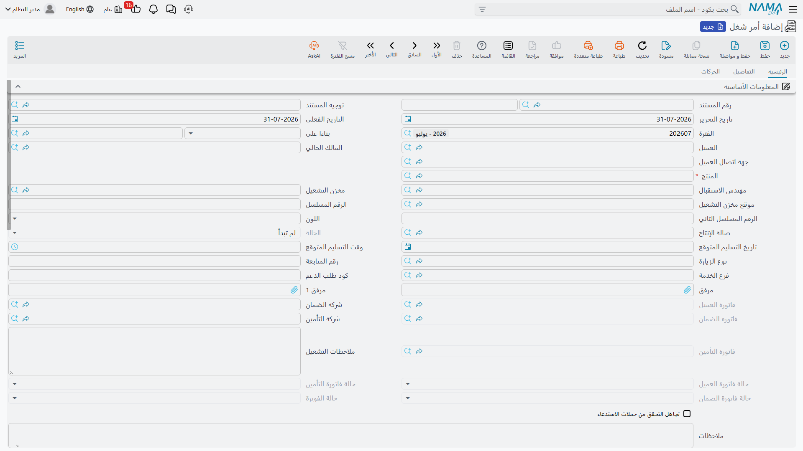
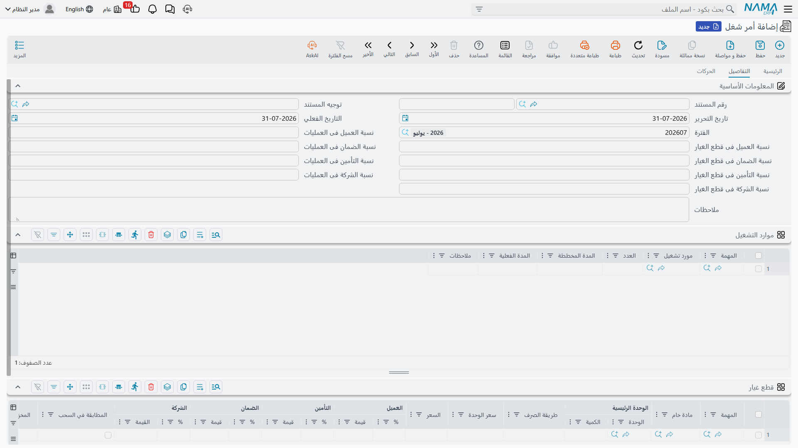
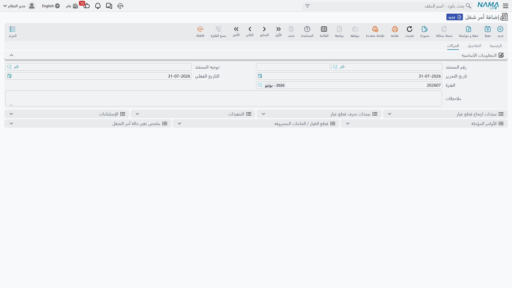
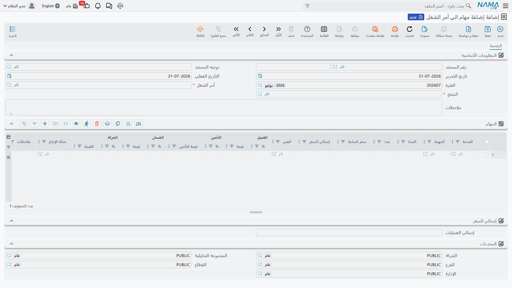

# أمر الشغل

أمر الشغل هو مركز الوحدة. فكل ما قبله تحضير وكل ما بعده نتيجة. وهو المستند الذي يقول: *هذه المركبة،
وهذه قائمة الأعمال، وهذه القطع، وهذه الصالة، وهذا الفني، وهذا توزيع الفاتورة بين العميل وشركة التأمين
وجهة الضمان وأنفسنا.*

ويحسن أن نوضح من البداية ما **ليس** أمر الشغل. فهو لا ينشئ قيداً — لا قيد محاسبي على هذا المستند
البتة. وهو لا يحرّك مخزوناً — بل هو مستند **طلب** يخطط أي القطع يحتاجها العمل؛ أما خروج القطع من
المخزن فيكون [بمستندات صرف قطع غيار مستقلة](/ar/modules/servicecenter/spare-parts/servicecenter-spare-parts-issue.md).
وما يفعله بدل ذلك أنه يحفظ حقيقة العمل أثناء جريانه، ويغذّي
كل ما بعده: الإغلاق والفواتير الثلاث وتصريح العبور.

القائمة: **مركز خدمة > المستندات > أمر شغل**.

::: info الترخيص المطلوب
`srvcenter`. و**[التوجيه](/ar/modules/servicecenter/document-terms/servicecenter-terms-workshop.md)
إجباري**، وهو عملياً ليس اختيارياً: فدفاتر فواتير العميل والتأمين والضمان
وتوجيهاتها كلها فيه، وبدونها لا يمكن فوترة العمل.
:::

## فتح الأمر

يُنشأ `SCJO-2026-0417` في ٣ مارس ٢٠٢٦ وحقل *بناءا على* فيه يشير إلى المقايسة المنقّحة
`SCJEU-2026-0119`. فيصل الرأس والجداول الثلاثة معبّأة. ثم يضيف الاستقبال ما لا يعرفه غيره:

- **صالة الإنتاج** `WC-MECH`، صالة الميكانيكا.
- **مهندس الاستقبال** `EMP-214`.
- **مخزن وموقع تحت التشغيل** `WH-WIP` / `WIP-01` — حيث تقيم القطع المسحوبة لهذا العمل حتى تُستهلك.
- **التسليم المتوقع** ٤ مارس ٢٠٢٦ الساعة ١٦:٠٠.
- **[تذكرة الطابور](/ar/modules/servicecenter/service-queues/servicecenter-queue-overview.md)** التي
  سحبها العميل في الاستقبال، `A014` في الفرع `QSB-RUH`.

واختيار المركبة في حقل **المنتج** هو ما يملأ الباقي: فيصير العميل هو المالك الحالي للمركبة، وتصل من
ملفها اللوحة والشاسيه والمحرك وناقل الحركة واللون ومجموعة الملحقات والماركة والموديل وسنة الصنع
وشركتا التأمين والضمان وتواريخ التأمين وقراءة العداد السابقة.

## الصفحة الرئيسية

| المجموعة | المحتوى |
|---|---|
| المعلومات الأساسية | رقم المستند، التوجيه، تاريخا التحرير والفعلي، الفترة، *بناءا على*، العميل، المالك الحالي، جهة اتصال العميل، **المنتج**، مهندس الاستقبال، مخزن وموقع تحت التشغيل، الأرقام المسلسلة، اللون، صالة الإنتاج، **الحالة**، تاريخ ووقت التسليم المتوقع، نوع الزيارة، رقم المتابعة، فرع الطابور وكود التذكرة، مرفقان، مراجع الفواتير الثلاث، شركتا الضمان والتأمين، ملاحظات العمليات، حقول حالة الفوترة، تجاهل التحقق من حملة الاستدعاء، ملاحظات |
| تفاصيل المنتج | بيانات المركبة: الشاسيه، اللوحة، المحرك، ناقل الحركة، كود المورد، الملحقات، قراءتا العداد السابقة والحالية بتاريخيهما وفرقهما، حملة الإستدعاء، كيلومتر وتواريخ التأمين، الماركة، الموديل، سنة الموديل، متوسط الاستهلاك اليومي، عقد الخدمة وحالته |
| العمليات | الأعمال — انظر أدناه |
| إجمالي السعر | إجمالي المواد المساعدة، إجمالي العمليات، اجمالى التكلفة |
| الزيارة القادة (هكذا تظهر على الشاشة، وصوابها «الزيارة القادمة») | التاريخ والنوع — يُكتبان هنا لكن يعيد الإغلاق كتابتهما |
| المحددات | الشركة، المجموعة التحليلية، الفرع، القطاع، الإدارة |

وبعض هذه الحقول محسوب لا يُكتب:

- **الحالة** مشتقة لا تُدخَل. تُحسب من قيود الحالة التي تكتبها المستندات الأخرى. فلا تستطيع أن تجعل
  أمر الشغل *مغلقاً* باختيار ذلك من قائمة.
- **مراجع الفواتير الثلاث** وحقول حالة الفوترة تكتبها أزرار الفواتير.
- **عقد الخدمة** و**حالة العقد** يُحدَّثان من ملف المركبة عند كل حفظ.
- **تاريخ قراءة العداد الحالية** معطَّل ويأخذ دائماً التاريخ الفعلي للمستند.

::: warning تسجيل قراءة أُخذت في يوم آخر
لأن *تاريخ قراءة العداد الحالية* يتبع تاريخ المستند، فلا يمكن هنا تسجيل قراءة أُخذت في يوم مختلف.
استعمل لذلك
[سجل قراءة العداد](/ar/modules/servicecenter/job-cycle/servicecenter-odometer-and-service-intervals.md).
:::

## جدول العمليات

جدول واحد يحمل كل أعمال العمالة، ويعمل بنمط السطر الرئيسي والأسطر التابعة.

| العمود | المعنى | مكتوب أم محسوب |
|---|---|---|
| الخدمة | حزمة تضم عدة مهام | مكتوب |
| المهمة | | مكتوب |
| المدة | | تصل من كتالوج المهام، وقابلة للتعديل |
| عدد | | مكتوب |
| سعر الساعة | | يصل من كتالوج المهام، وقابل للتعديل |
| إجمالي السعر | | **محسوب** = سعر الساعة × المدة × العدد |
| الفني | | مكتوب |
| العميل / التأمين / الضمان / الشركة، نسبة وقيمة | | انظر [توزيع القيمة على الجهات الدافعة](/ar/modules/servicecenter/job-cycle/servicecenter-payer-split.md) |
| صالة الإنتاج | | افتراضها صالة الرأس |
| الحالة | | **محسوبة** — تبدأ *لم تبدأ* وتقودها مستندات التنفيذ |
| ملاحظات | | مكتوب |

### الأسطر الرئيسية والتابعة

تُدخَل **[الخدمة](/ar/modules/servicecenter/workshop-setup/servicecenter-operations.md)** في سطر
مستقل، واختيارها يفجّرها إلى أسطر تابعة تحتها. والقواعد مطبَّقة عند الترحيل
وهي صارمة:

- السطر يحمل خدمة **أو** مهمة، لا الاثنتين.
- سطر الخدمة لا بد له من أسطر تابعة.
- السطر التابع لا يحمل خدمة خاصة به.
- لا تتكرر المهمة نفسها مرتين في أمر شغل واحد.

وأي المستويين يحمل المال يتوقف على ضبط الخدمة في الكتالوج: فمع التسعير بالسطر تُسعَّر الأسطر التابعة
ويكون سطر الخدمة صفراً؛ ومع التسعير الإجمالي يحمل سطر الخدمة سعر الحزمة وتُصفَّر الأسطر التابعة.

### من أين يأتي سعر العمالة

سعر العمالة هو **سعر الساعة × المدة × العدد**، وكلٌّ من المدة وسعر الساعة يصل من
[كتالوج المهام](/ar/modules/servicecenter/workshop-setup/servicecenter-tasks.md) حين
تختار المهمة — من سطر المهمة الخاص بموديل هذه المركبة إن وُجد، وإلا من متوسط مدة المهمة وسعرها،
وسعر ساعة صالة الإنتاج آخر الملاذات.

::: info الوقت المسجَّل لا يُفوتر أبداً
المدة في هذا الجدول هي **الزمن القياسي في الكتالوج**، وهي الرقم الذي يدفعه العميل. أما
[الساعات التي يسجّلها الفنيون فعلاً في الورشة](/ar/modules/servicecenter/workshop-execution/servicecenter-production-execution.md)
فتُسجَّل، وتقود حالة كل سطر مهمة، وتظهر للمراجعة — لكن لا شيء في
الوحدة يحوّل الوقت المقيس إلى مال.

ففي مثالنا أمضى الفنيون **٧ ساعات و٢٠ دقيقة**؛ ويُفوتَر العميل على **٦٫٥ ساعة** الكتالوجية. وليس هذا
خللاً بل هو التصميم: ورشة بسعر ثابت.
:::

## صفحة التفاصيل

### حقول النسب الثمانية في الرأس

في أعلى صفحة التفاصيل ثمانية حقول نسب — العميل والتأمين والضمان والشركة، مرة للمهام ومرة للمواد. وهي
**أدوات تطبيق جماعي**: تكتب رقماً فيُختم على كل سطر موجود حالياً في ذلك الجدول. وليست قيماً افتراضية،
ولا سياسة، ولا يُعاد تطبيقها عند الحفظ. والشرح كامل في
[توزيع القيمة على الجهات الدافعة](/ar/modules/servicecenter/job-cycle/servicecenter-payer-split.md).

### موارد التشغيل

المهمة، مورد التشغيل، العدد، المدة المخططة (وعنوانها الإنجليزي *Standard Flat Rate*)، المدة الفعلية،
ملاحظات. والمدة الفعلية تكتبها مستندات التنفيذ. وهذا الجدول وصفي — لا شيء يجدول آلة ولا يتحقق من
فراغها.

### قطع الغيار

المهمة، مادة خام، الوحدة والكمية، طريقة الصرف، سعر الوحدة، السعر، أزواج النسبة والقيمة الأربعة،
المطابقة في السحب، المخزن، الموقع، ملاحظات.

- **السعر** محسوب = سعر الوحدة × الكمية.
- **سعر الوحدة** يأتي من محرك أسعار البيع المعتاد في سلسلة الإمداد — أي قائمة أسعار العميل لذلك الصنف
  وذلك التاريخ وتلك الكمية. فليس ثمة تسعير لقطع الغيار خاص بمركز الخدمة، ولا آلية هامش تربط سعر البيع
  بتكلفة المخزون.
- **المطابقة في السحب** **تُفرَض من توجيه المستند عند كل حفظ**، فالكتابة في العمود لا تجدي. اضبطها في
  التوجيه.
- ومع استهلاك مستندات الصرف للأمر تُتابَع الكميات المصروفة وغير المصروفة لكل سطر بالطريقة المعتادة.

وإذا كان إعداد الوحدة *إظهار جدول الضرائب في أمر الشغل والمستندات الأخرى* مفعَّلاً أُضيفت إلى الجدولين
أربعة أزواج نسبة وقيمة للضريبة وعمود إجمالي بعد الضرائب.

::: warning ضريبة واحدة فقط في أسطر العمليات
في أسطر العمليات تُملأ أعمدة الضريبة الثانية والثالثة والرابعة بقيمة الضريبة **الأولى**. فالتركيب
متعدد الضرائب لا يعمل في أسطر العمالة — فابنِ أمثلتك وخطط ضرائبك على ضريبة واحدة.
:::

## صفحة الحركات

قوائم للعرض فقط، مفيدة لتتبع العمل بعد انتهائه: مستندات صرف وإرتجاع قطع الغيار المحرَّرة على هذا
الأمر، ومستندات التنفيذ، والاستثناءات، والأوامر المؤجلة، وسجل القطع المصروفة فعلاً، وتاريخ تغيّر حالة
الأمر نفسه.

## الحالات وما تمنعه

يمر أمر الشغل بالحالات **لم تبدأ، وقيد التنفيذ، ومتوقف، ومؤجل، وملغي، ومنتهي، ومغلق**. والحالة لا
تُكتب أبداً — بل تُشتق من القيود التي تكتبها المستندات الأخرى، مع تجاوز واحد: إن قال أي قيد *مغلق*
فالأمر مغلق.

| الحالة | ماذا تعني لك |
|---|---|
| لم تبدأ | رُحِّل للتو ولم يُسجَّل عليه وقت بعد |
| قيد التنفيذ | سُجِّل وقت على مهمة واحدة على الأقل |
| مؤجل / متوقف | [موقوف](/ar/modules/servicecenter/workshop-execution/servicecenter-pending-and-resume.md). والإغلاق يرفض هاتين الحالتين إلا إذا سمح توجيهه بإغلاق الأوامر الموقوفة |
| منتهي | تم العمل ولم يُغلق بعد |
| مغلق | يكتبها مستند الإغلاق. **ولا يمكن تعديل الأمر بعدها البتة** |
| ملغي | متروك؛ لا يُعدَّل ولا يُغلق عادة |

ومن هذا أمران يفاجئان الناس. الأول: بعد الإغلاق لا تستطيع تصحيح سعر ولا كمية ولا توزيع على الأمر —
بل عليك حذف مستند الإغلاق أولاً، ولا تستطيع ذلك إلا ما دامت الفواتير الثلاث كلها غير موجودة. والثاني:
منتقي أمر الشغل في مستند الإغلاق يخفي عمداً الأوامر المغلقة.

## ماذا يرفض أمر الشغل

عند الترحيل يتحقق المستند من:

1. **اكتمال الأسطر.** كل سطر عمليات لا بد أن يحمل مهمة (إلا أن يكون سطر خدمة)، وكل سطر قطع غيار لا بد
   أن يحمل مهمة — إلا إذا أطفأ التوجيه ذلك بخيار إضافة المهام والمواد من الخارج.
2. **قواعد الرئيسي والتابع** السابقة، ومنها منع تكرار المهمة.
3. **ألا يرجع العداد إلى الوراء.** إذا كان تاريخ عداد المستند في تاريخ عداد المركبة أو بعده، فلا يجوز
   أن تقل القراءة المدخلة هنا عن القراءة الحالية للمركبة.
4. **صحة توزيع الدافعين** — مجموع النسب الأربع 100 ومجموع القيم الأربع سعرُ السطر، في كل سطر مسعَّر.
5. **أمر شغل مفتوح واحد لكل مركبة**، إن كان إعداد الوحدة *عدم السماح بأوامر شغل متعددة مفتوحة على
   المنتج* مفعَّلاً. فيُرفض أمر ثانٍ للمركبة نفسها ما دام أمر سابق ليس منتهياً ولا ملغياً ولا مغلقاً.
6. **حملات الاستدعاء.** إذا ظهرت المركبة في حملة استدعاء نشطة داخل فترة سريانها ولم تُنفَّذ بعد، رُفض
   الترحيل. وللتجاوز طريقان: تفعيل *تجاهل التحقق من حملة الاستدعاء* في الرأس، أو تسمية الحملة في حقل
   **حملة الإستدعاء** بالرأس — وهذا ما تفعله حين يكون أمر الشغل هذا هو عمل الاستدعاء نفسه.

::: warning أي قيمة حملة في الرأس تُطفئ الفحص لكل الحملات
يُتخطى فحص الاستدعاء كلما حمل الرأس أي قيمة حملة أياً كانت — لا الحملة التي سميتها وحدها. وبعد أن يحمل
أمر شغل حملةً تُنسخ تلك القيمة إلى أوامر الشغل التالية للمركبة نفسها، فلا يظهر أبداً تحذير من حملة
سلامة ثانية مختلفة على تلك المركبة. فإن كانت الاستدعاءات تهمك، فراجع قوائم الحملات مباشرة ولا تعتمد
على أمر الشغل في إيقافك.
:::

## أزرار أمر الشغل

**تجميع الموارد والمواد الخام** يمر على المهام الموجودة في جدول العمليات فيضيف لكل مهمة آلاتها
القياسية وقطع غيارها القياسية، مسعِّراً كل قطعة عبر محرك أسعار البيع. وهو يضيف إلى الجدولين ولا
يستبدلهما. وهذا هو الزر الذي تستعمله.

**إنشاء سند حجز** (في قائمة المزيد) يبني سند حجز من جدول قطع الغيار لتُحجز القطع الشحيحة لهذا العمل.
ويعتذر بلطف إن كان الجدول فارغاً.

وأزرار **إنشاء فاتورة العميل / التأمين / الضمان** مشروحة في
[فوترة أمر الشغل](/ar/modules/servicecenter/job-cycle/servicecenter-job-order-invoicing.md). وهي ترفض
العمل قبل إغلاق الأمر.

::: danger لا تستعمل «تجميع المهام» لمعرفة الخدمات المستحقة
زر **تجميع المهام** يقترح المجموعة الخاطئة من الخدمات. ففلتره معكوس: فهو يعيد مهام الصيانة التي
**لم** تستحق بعد عند قراءة عداد المركبة الحالية ويسقط المستحقة فعلاً، ثم يجلب قطع غيار تلك القائمة
الخاطئة — بعد أن يمسح جدول العمليات.

فلا تعتمد عليه، ولا تعلّمه على أنه «يجمع الخدمات المستحقة عند هذه القراءة». أدخل الأعمال المستحقة
يدوياً، مستعيناً بتاريخ صيانة المركبة وبأعمدة المهام المستحقة في
[سجل قراءة العداد](/ar/modules/servicecenter/job-cycle/servicecenter-odometer-and-service-intervals.md)،
فهي تستعمل الاختبار الصحيح.
:::

## إضافة أعمال في منتصف العمل

يتصل العميل ظهراً فيوافق على إصلاح إضافي. ولذلك مستند — **إضافة مهام الي أمر الشغل** (هكذا يظهر في
القائمة)، من **مركز خدمة > المستندات > إضافة مهام الي أمر الشغل** — ولا يعمل إلا إذا كان توجيه أمر
الشغل مفعَّلاً فيه خيار إضافة المهام والمواد من الخارج. وهو يضيف الخدمات والمهام فقط؛ فلا سبيل به
لإضافة قطع غيار أو موارد تشغيل، وهو يرفض أمر الشغل المغلق.

::: danger مستند إضافة المهام يعيد بناء جدول العمليات كله
هذا المستند لا يُلحِق. فهو عند الترحيل **يمسح جدول العمليات كله في أمر الشغل** ثم يعيد بناءه من
مستندات إضافة المهام المحرَّرة على ذلك الأمر — ولا شيء غيرها. فيُدمَّر كل سطر عمليات كُتب مباشرة على
أمر الشغل، بصمت، أول مرة يُرحَّل فيها مستند إضافة مهام.

فالقاعدة إذن الكل أو لا شيء:

> متى استعملت *إضافة مهام الي أمر الشغل* على أمر، وجب أن تأتي **كل** عملية في ذلك الأمر من مستند
> إضافة مهام. وكل ما يُكتب على الأمر نفسه يضيع.

وعملياً: احسم أمرك قبل فتح أمر الشغل. فإما أن تكتب كل الأعمال على الأمر ولا تقترب من هذا المستند
أبداً، وإما أن تفتح الأمر بلا عمليات وتضيف كل شيء عبر مستندات إضافة المهام. وحالات الأسطر تُحفظ
للمهام التي كانت موجودة، وإلغاء ترحيل مستند إضافة مهام يعيد بناء الجدول مرة أخرى مما بقي منها.

والمثال المرجعي في هذه الوثائق لا يستعمل هذا المستند أبداً.
:::

## ماذا يفعل ترحيل أمر الشغل فعلاً

لا قيد ولا حركة مخزنية. وما يفعله:

- يدفع قراءة العداد الحالية إلى ملف المركبة.
- يسجّل لكل مهمة في الأمر أن هذه الخدمة نُفِّذت على هذه المركبة عند هذه القراءة — وهو ما يجعل فترات
  الصيانة بالكيلومترات تعمل في المرة القادمة.
- يختم سطر حملة الاستدعاء المطابق بأنه منفَّذ مع تاريخ التنفيذ والمستند.
- يغلق تذكرة طابور الاستقبال المسمّاة في الرأس.
- يضيف قيد حالة للمنتج إن سمّاها التوجيه.
- ينقل المقايسة المصدر وطلب الخدمة الذي وراءها إلى *قيد التنفيذ* ويختم رقمه عليهما.

ومن هنا يُسجَّل العمل في الورشة، ثم
[يُغلق الأمر](/ar/modules/servicecenter/job-cycle/servicecenter-job-order-closing.md).
