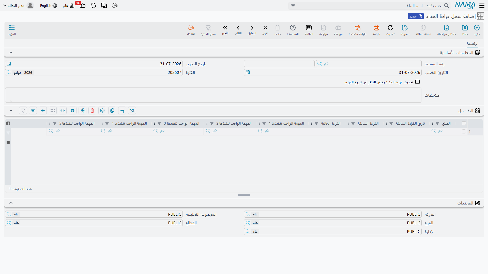

# قراءات العداد وفترات الصيانة

كل ما يتكرر في الورشة — تغيير الزيت، والسير، والصيانة الكبرى — يتكرر بالمسافة لا بالتاريخ. ولذلك تحفظ
الوحدة صورة جارية لمسافة كل مركبة، وتحسب تقريباً سرعة قيادتها، وتستعمل الرقمين لتقول متى تستحق خدمة
بعينها وفي أي يوم تقريباً ينبغي أن تعود السيارة.

والسلسلة قصيرة: القراءات تُكتب في
[ملف المركبة](/ar/modules/servicecenter/workshop-setup/servicecenter-product-file.md)، وملف المركبة
يشتق متوسط مسافة يومية، وأمر الشغل يسجّل
أي خدمة نُفِّذت عند أي قراءة، والإغلاق يتوقع تاريخاً من ذلك كله. وهذه الصفحة تمشي في تلك السلسلة وتسمّي
مستنداتها.

::: info الترخيص المطلوب
`srvcenter`. ولا يحتاج أي من مستندَي هذه الصفحة توجيهاً ليعمل — وسجل قراءة العداد لا يحتاجه البتة.
:::

## الأرقام الثلاثة في ملف المركبة

| الحقل | ما هو |
|---|---|
| قراءة العداد السابقة وتاريخها | القراءة المقبولة السابقة |
| قراءة العداد الحالية وتاريخها | آخر قراءة مقبولة |
| متوسط استهلاك الكيلومتر يوميا | محسوب — المسافة بين القراءتين مقسومة على الأيام بينهما |

ولسيف ١٫٦ التي يملكها فهد، المركبة `VEH-2031`:

| | القراءة | التاريخ |
|---|---|---|
| قراءة العداد السابقة | 41,600 | ١ يناير ٢٠٢٦ |
| قراءة العداد الحالية | 45,300 | ٣ مارس ٢٠٢٦ |
| الفرق | **3,700 كم في ٦١ يوماً** | |

3,700 ÷ 61 = **60.7 كم يومياً**.

ولا يُعاد حساب المتوسط إلا بعد مضي مدة كافية —
فـ[إعداد الوحدة](/ar/modules/servicecenter/servicecenter-configuration.md) *أقل عدد من الأيام لحساب
متوسط إستهلاك الكيلومتر* يحدد أدنى فجوة. وهذا مقصود: فقراءتان بينهما يوم واحد تنتجان رقماً جامحاً يفسد كل توقع يُبنى
عليه. فاضبطه على أسبوعين مثلاً ودعه.

## من يكتب القراءات

ثلاثة أشياء تحرّك عداد المركبة:

1. **سجل قراءة العداد** — الشاشة المخصصة لذلك، وهي موصوفة أدناه.
2. **أمر الشغل.** فقراءة العداد الحالية المكتوبة في أمر الشغل تُدفع إلى ملف المركبة في كل حفظ. وعملياً
   من هنا تأتي معظم القراءات: يقرأ الاستقبال العداد لحظة وصول السيارة.
3. أي مستند آخر يسجّل قراءة، ومنه مستند افتتاحي مهمات المنتج — مع أن
   [سند الفحص والاستلام](/ar/modules/servicecenter/inspections-and-campaigns/servicecenter-inspections.md)
   لا يفعل بالقراءة أكثر من التحقق منها، ولا يدفع عداد المركبة أبداً.

وأياً كان المصدر فالقاعدة واحدة: **القراءة الجديدة تدحرج القراءة الحالية إلى السابقة** وتحل محلها،
ولا يُسمح للقراءة أن ترجع إلى الوراء. فإذا كان تاريخ المستند الجديد في تاريخ عداد المركبة أو بعده، فلا
يجوز أن تقل قراءته عن القراءة الحالية للمركبة. فالعدادات لا ترجع، والخطأ المطبعي الذي يقول إنها رجعت
مرفوض.

::: warning تسجيل قراءة أُخذت في يوم آخر
في [أمر الشغل](/ar/modules/servicecenter/job-cycle/servicecenter-job-order.md) يكون *تاريخ قراءة
العداد الحالية* معطَّلاً ويتبع دائماً التاريخ الفعلي للمستند. فقراءة أُخذت الثلاثاء لا يمكن إدخالها في
أمر شغل الخميس بتاريخ الثلاثاء. استعمل لذلك سجل قراءة العداد.
:::

## سجل قراءة العداد

القائمة: **مركز خدمة > المستندات > سجل قراءة العداد**.

مستند بسيط: رأس فيه الكود والتواريخ المعتادة وعلامة واحدة — *تحديث العداد بصرف النظر عن التاريخ* —
وجدول بسطر لكل مركبة:

| العمود | مكتوب أم مملوء |
|---|---|
| المنتج | مكتوب |
| تاريخ القراءة السابقة | يُملأ من ملف المركبة |
| القراءة السابقة | يُملأ من ملف المركبة |
| القراءة الحالية | **مكتوب** — القراءة الجديدة |
| المهمة المستحقة ١ … ٥ | تُملأ — انظر أدناه |

وعلامة **تحديث العداد بصرف النظر عن التاريخ** هي باب الخروج: فمع تفعيلها يُسمح لقراءة أقدم تاريخاً أن
تكتب فوق القراءة الحالية للمركبة. استعملها لتصحيح خطأ لا روتيناً.

### أعمدة المهام المستحقة

عند إدخال قراءة تملأ أعمدة *المهمة المستحقة* الخمسة نفسها بمهام الصيانة التي **صارت مستحقة الآن عند
تلك القراءة** — أي التي بلغت أو تجاوزت قراءةَ آخر تنفيذ لها مضافاً إليها فترة تكرارها. ولا تظهر إلا
الخمس الأُوَل، وهي للعلم فقط: لا يُنشأ منها شيء ولا يُولَّد مستند.

لكنها الطريقة الموثوقة لمعرفة ما تحتاجه المركبة. اقرأها ثم اكتب الأعمال في أمر الشغل يدوياً.

## سجل آخر صيانة

كيف يعرف النظام أن آخر تغيير زيت لسيارة فهد كان عند 36,000 كم؟

لأن أمر الشغل أخبره. فعند ترحيل أمر الشغل يسجّل لكل مهمة فيه أن هذه الخدمة نُفِّذت على هذه المركبة عند
هذه القراءة في هذا التاريخ. وتتراكم تلك السجلات في سجل لكل مركبة ومهمة — ويظهر قائمةً للعرض فقط في ملف
المركبة — وهذا السجل هو ما يقرؤه حساب المهام المستحقة.

أما فترة التكرار نفسها فتأتي من
[كتالوج المهام](/ar/modules/servicecenter/workshop-setup/servicecenter-tasks.md): فكل مهمة قد تحمل
تكراراً بالكيلومترات، وقد يختلف بحسب
الموديل. وتغيير زيت سيارة فهد يتكرر كل **10,000 كم**.

فإذن: آخر تنفيذ عند 36,000، والتكرار كل 10,000، فالاستحقاق التالي عند **46,000**. والسيارة تقرأ 45,300
عند الوصول — أي على بعد 700 كم. وبمعدل 60.7 كم يومياً يكون ذلك نحو **١١٫٥ يوماً**، وبه يصل
[مستند الإغلاق](/ar/modules/servicecenter/job-cycle/servicecenter-job-order-closing.md) إلى زيارة
قادمة متوقعة في **١٥ مارس ٢٠٢٦**.

## تأسيس التاريخ للمركبات الموروثة

وثمة مشكلة ظاهرة في هذا كله يوم التشغيل: فالورشة تخدم هذه السيارات منذ سنين والسجل فارغ. فتبدو كل
مركبة وكأنها لم تغيّر زيتاً قط، فلا يستحق شيء أبداً.

ولهذا وُجد **مستند افتتاحي مهمات منتج**. القائمة: **مركز خدمة > المستندات > افتتاحي مهمات منتج**.

هو رصيد افتتاحي، لكن ما يفتتحه **تاريخ خدمة**. جدول واحد، بسطر لكل مركبة ومهمة:

| العمود | ملاحظات |
|---|---|
| المنتج | مكتوب |
| المهمة | مكتوب |
| القراءة عند تنفيذ المهمة | **إجباري** — القراءة يوم نُفِّذت الخدمة آخر مرة |
| تاريخ المهمة | **إجباري** |
| تكرر كل / كم | للعرض فقط — يُملأ من قواعد تكرار المهمة لهذه المركبة |

وترحيله يكتب تلك الأسطر في سجل آخر صيانة تماماً كما لو كتبتها أوامر شغل، ويدفع عداد كل مركبة إلى
القراءة المكتوبة في سطرها. وإلغاء الترحيل يرفعها.

ولسيارة فهد يكفي سطر واحد — تغيير زيت وفلتر، عند 36,000 كم، بتاريخه — لتعمل الصيانة بالكيلومترات من
اليوم الأول.

::: warning المستند الافتتاحي لا يفحص شيئاً
هذا المستند **لا يجري أي تحقق من صحته**. فسطر بقراءة غير معقولة، أو تكرار لزوج المركبة والمهمة، أو
تاريخ يناقض تاريخ المركبة نفسها — كل ذلك يُرحَّل بلا اعتراض، ويذهب مباشرة إلى السجل الذي يثق به كل ما
عداه.

فعامله معاملة أداة ترحيل بيانات: جهّز القائمة بعناية خارج النظام، وحمّلها مرة واحدة، ثم افحص عينة من
قوائم آخر صيانة في ملفات بعض المركبات قبل أن تعتمد على أرقام المهام المستحقة.
:::

## ما الذي لا تقوده المسافة

أمران يحسن ذكرهما حتى لا يبحث عنهما أحد:

- **حملات الاستدعاء تُطابَق بالمركبة لا بالمسافة.** فالحملة تسرد مركبات بعينها؛ ولا دخل للعداد في منع
  أمر الشغل من الترحيل. انظر [أمر الشغل](/ar/modules/servicecenter/job-cycle/servicecenter-job-order.md).
- **لا شيء يجدول لك الزيارة.** فتاريخ الزيارة القادمة توقع يُكتب على أمر الشغل وإغلاقه. ولا يرفع
  تذكيراً ولا مهمة ولا طلب خدمة — ومتابعته عمل من يدير التواصل مع العملاء عندك، انطلاقاً من تاريخ
  الزيارة القادمة المتوقعة في أوامر الشغل المغلقة.

وأخيراً: لا تبنِ إجراء «ما المستحق» على زر *تجميع المهام* في أمر الشغل؛ ففلتره معكوس وهو يقترح الخدمات
**غير** المستحقة. وصفحة أمر الشغل تحمل التحذير كاملاً. أما أعمدة المهام المستحقة في سجل قراءة العداد
فتستعمل الاختبار الصحيح — فاستعملها.
