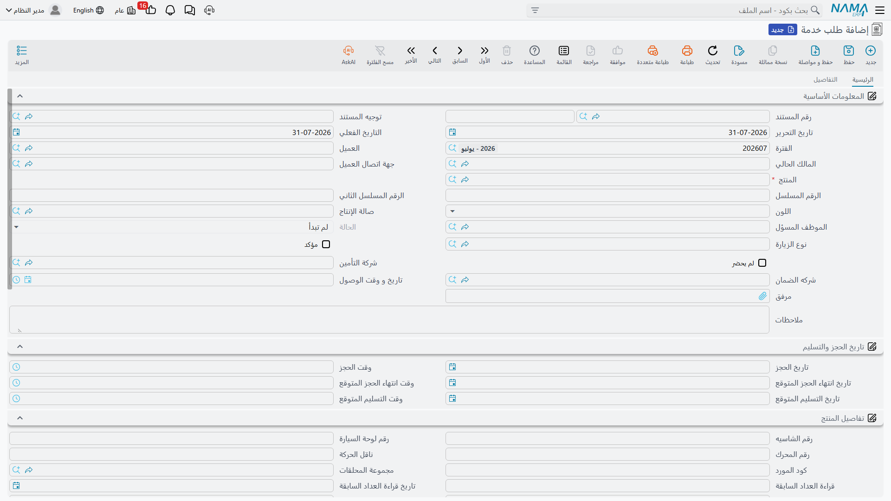

# طلبات الخدمة

طلب الخدمة هو دفتر المواعيد. يتصل العميل، فتتفقان على يوم ووقت، وتدوّن الخدمات التي يطلبها، فيخبرك
النظام هل تستطيع الورشة استيعاب هذا العمل في ذلك اليوم أصلاً. وهو المستند الوحيد في الوحدة كلها الذي
يعمل ضابطاً للطاقة، وتلك مهمته كلها تقريباً — فهو لا يسعّر شيئاً ذا أثر، ولا ينشئ قيداً، ولا يحرّك
مخزوناً.

القائمة: **مركز خدمة > المستندات > طلب خدمة**.

::: info الترخيص المطلوب
`srvcenter`. ولا يحتاج [توجيه مستند](/ar/modules/servicecenter/document-terms/servicecenter-terms-workshop.md) —
فحقل **توجيه المستند** اختياري ولا يحمل إلا خيارات حالة المنتج.
:::

## حجز زيارة فهد

يتصل فهد العتيبي بشركة الصحراء للسيارات في ٢ مارس ٢٠٢٦ ليحجز لناوا سيف ١٫٦ صيانتها الدورية، مع شكوى
من التكييف. فيحرر مستشار الخدمة الطلب `SCSR-2026-0881`:

1. **يختار المركبة.** اختيار `VEH-2031` في حقل **المنتج** يملأ معظم الشاشة: فيصير المالك الحالي هو
   العميل، وتصل من [ملف المركبة](/ar/modules/servicecenter/workshop-setup/servicecenter-product-file.md)
   اللوحة والشاسيه ورقم المحرك واللون ومجموعة الملحقات والماركة والموديل
   وسنة الصنع وشركتا التأمين والضمان وتواريخ التأمين وقراءة العداد السابقة.
2. **يحدد الموعد.** **تاريخ الحجز** ٣ مارس و**وقت الحجز** ٠٩:٠٠، مع تاريخ ووقت متوقعين لانتهاء الحجز
   وللتسليم.
3. **يسرد العمل.** في جدول **العمليات** يدخل المهام — أو خدمة تنفجر إلى مهامها — فتصل المدة وسعر
   الساعة من [كتالوج المهام](/ar/modules/servicecenter/workshop-setup/servicecenter-tasks.md).
   خمس مهام مجموعها **٦٫٥ ساعة**.
4. **يختار نوع الزيارة.** `VT-SRV` صيانة دورية. ونوع الزيارة أهم مما يبدو — انظر قسم الطاقة أدناه.
5. **يرحّل.** فتصبح الـ ٦٫٥ ساعة محجوزة على يوم ٣ مارس في صالة الميكانيكا.

وحين يصل فعلاً صباح الثالث، يملأ المستشار **تاريخ و وقت الوصول** في المستند نفسه.

## الشاشة

### الصفحة الرئيسية

| المجموعة | ما تحمله |
|---|---|
| المعلومات الأساسية | رقم المستند (الدفتر والكود)، توجيه المستند، تاريخ التحرير، التاريخ الفعلي، الفترة، العميل، المالك الحالي، جهة اتصال العميل، **المنتج**، الرقم المسلسل، الرقم المسلسل الثاني، اللون، صالة الإنتاج، الموظف المسؤول، الحالة، نوع الزيارة، علامتا **مؤكد** و**لم يحضر**، شركة التأمين، شركة الضمان، تاريخ ووقت الوصول، مرفق وملاحظات |
| تاريخ الحجز والتسليم | تاريخ ووقت الحجز، تاريخ ووقت انتهاء الحجز المتوقع، تاريخ ووقت التسليم المتوقع |
| تفاصيل المنتج | بيانات المركبة منقولة من ملفها: الشاسيه، أرقام وحروف اللوحة، رقم المحرك، ناقل الحركة، كود المورد، الملحقات، قراءتا العداد السابقة والحالية بتاريخيهما والفرق بينهما، حملة الإستدعاء، كيلومتر الضمان، تاريخ بداية التأمين، فترة التأمين، تاريخ انتهاء الضمان، الماركة، الموديل، سنة الموديل، متوسط الاستهلاك اليومي، عقد الخدمة وحالته |
| العمليات | الخدمة، المهمة، المدة، العدد، سعر الساعة، إجمالي السعر، ملاحظات |
| إجمالي السعر | إجمالي المواد المساعدة وإجمالي العمليات واجمالى التكلفة — كلها محسوبة |
| المحددات | الشركة، المجموعة التحليلية، الفرع، القطاع، الإدارة |

ولاحظ ما **لا** يحمله جدول العمليات في هذا المستند: أزواج النسبة والقيمة الأربعة للجهات الدافعة.
فتوزيع القيمة بين العميل والتأمين والضمان والشركة يبدأ في المقايسة وأمر الشغل لا هنا. فالحجز لا يحتاج
أن يعرف من يدفع.

### صفحة التفاصيل

جدولان يماثلان جدولَي أمر الشغل:

- **موارد التشغيل** — المهمة، مورد التشغيل، العدد، المدة المخططة (وعنوانها في الواجهة الإنجليزية
  *Standard Flat Rate*)، المدة الفعلية، ملاحظات.
- **قطع غيار** — المهمة، مادة خام، الوحدة والكمية، طريقة الصرف، سعر الوحدة، السعر، المطابقة في السحب،
  ملاحظات.

وزر **تجميع الموارد والمواد الخام** في الصفحة الرئيسية يملأ الجدولين: فلكل مهمة موجودة في جدول
العمليات يضيف آلاتها القياسية وقطع غيارها القياسية، مسعِّراً كل قطعة عبر محرك أسعار البيع المعتاد في
سلسلة الإمداد. وهو تسهيل تخطيطي لا أكثر — فطلب الخدمة لا يحجز شيئاً ولا يصرف شيئاً.

وتتيح قائمة المزيد كذلك **إنشاء سند حجز**، وهو يبني سند حجز من جدول قطع الغيار. استعمله حين تكون
القطعة شحيحة وتريد حجزها لهذا الموعد.

## كيف يعمل فحص الطاقة

هذا هو الجزء الجدير بالفهم الدقيق، لأنه القيد الحقيقي الوحيد على الطاقة في الوحدة كلها.

**[جدول التحميل](/ar/modules/servicecenter/workshop-execution/servicecenter-loading-table.md)**
المنشور [لصالة إنتاج](/ar/modules/servicecenter/workshop-setup/servicecenter-work-centers.md)
يقسّم إجمالي ساعات اليوم المتاحة إلى أربعة أوعية — الحجز
والمرحَّل من أمس والزيارات بلا موعد والطوارئ. وصالة الميكانيكا في الصحراء فيها ٥ أماكن عمل × ٨ ساعات =
**٤٠ ساعة** يومياً، منها ٨٠٪ — أي **٣٢ ساعة** — للحجز.

وعند ترحيل طلب الخدمة يجري فحصان:

1. **نافذة الاستقبال.** لا بد أن يقع وقت الحجز داخل وقتي بدء وانتهاء الاستقبال في صالة الإنتاج،
   وافتراضهما ٠٨:٠٠–١٤:٠٠. فالحجز الساعة ١٦:٠٠ مرفوض.
2. **ساعات الحجز.** يُقارن مجموع الساعات المحجوزة في *كل* طلبات الخدمة لتلك الصالة في ذلك التاريخ
   بساعات الحجز المتاحة لليوم. فإن كان الحجز الجديد يدفع المجموع فوق الـ ٣٢ رُفض برسالة تقول إن الحجز
   غير مسموح به.

فتُقاس ساعات فهد الـ ٦٫٥ على الـ ٣٢، وتنقص الساعات المتبقية في سجل اليوم بمقدارها. وإلغاء الطلب أو
حذفه يعيد الساعات.

::: warning أول حجز في اليوم لا يُفحص أبداً
لا يعمل فحص الطاقة إلا إذا وُجد حجز آخر بالفعل لتلك الصالة في ذلك التاريخ. أما **أول** حجز في اليوم
فيُقبل مهما كان حجمه — فطلب واحد بـ ٥٠٠ ساعة على يوم سعته ٤٠ ساعة يُرحَّل بلا اعتراض، ولا تظهر الرسالة
إلا مع الطلب الثاني في ذلك اليوم.

وعملياً يعني هذا أن الفحص يحميك من الحجز الزائد التدريجي لا من رقم واحد أُدخل خطأ. فعامل أول موعد في
كل يوم على أنه غير مفحوص وألقِ نظرة على ساعاته.
:::

والطريق الآخر لتجاوز الفحص متعمَّد: **نوع زيارة** مفعَّل فيه خيار *السماح دائماً بالحجز* يتخطى اختبار
ساعات الحجز كلياً. وهذا ما تستعمله للعميل الذي تعطلت سيارته في الطريق ولا بد من استقباله اليوم. فأبقِه
على نوع زيارة واحد واضح الاسم — نوع للطوارئ — لا على أنواعك اليومية.

## ماذا يفعل الترحيل فعلاً

- يحجز ساعات الطلب على سجل يوم صالة الإنتاج.
- يملأ الحقول **الفارغة** في ملف المركبة — الشاسيه واللوحة والمحرك وناقل الحركة والملحقات وكود المورد
  والماركة والموديل وسنة الصنع وتواريخ التأمين. أما الحقول التي لها قيمة فتُترك كما هي.
- يسجّل جهة اتصال العميل بوصفها آخر طالب خدمة للمركبة.
- يضيف قيد حالة للمنتج إن كان التوجيه يسمّي حالة يُنتقل إليها — وبهذا تظهر المركبة المحجوزة في ملفها
  بحالة *إنتظار استقبال*.

وهذا كل شيء. **لا أثر محاسبي ولا أثر مخزني ولا مستند مولَّد.**

## من الحجز إلى المقايسة

بعد وصول العميل وفحص المركبة يحرر المستشار
[مقايسة](/ar/modules/servicecenter/job-cycle/servicecenter-job-estimation.md) يشير حقل *بناءا على*
فيها إلى هذا الطلب. فيُنسخ الرأس والجداول الثلاثة، وترحيل المقايسة ينقل الطلب إلى **قيد التنفيذ**.
ويمكن كذلك بناء [أمر الشغل](/ar/modules/servicecenter/job-cycle/servicecenter-job-order.md) من الطلب
مباشرة، تخطياً للمقايسة.

ولا شيء يفرض أياً من الخطوتين. فطلب الخدمة الذي لا يتبعه شيء يبقى ببساطة عند *لم تبدأ* وتظل ساعاته
محجوزة حتى يلغيه أحد — وهذا سبب وجيه لمراجعة الطلبات المفتوحة القديمة، فكل واحد منها ما زال يستهلك
طاقة حجز ليوم مضى من زمن.
