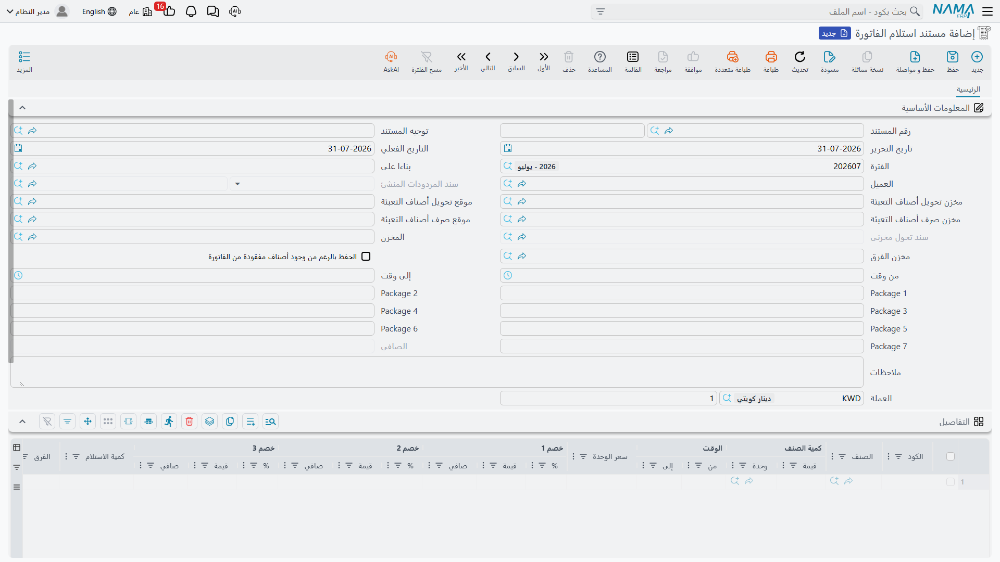

# مستند استلام الفاتورة

::: info الترخيص المطلوب
`srvcenter-mobile-delivery`. ورغم وجوده داخل مركز الخدمة فهو ليس مستنداً للورشة — بل يقع في القائمة تحت **مركز خدمة ← تطبيقات الجوال - مراكز الخدمة**.
:::

تعود سيارة التوصيل إلى الصحراء في الخامسة عصراً، ويبلّغ السائق أن مؤسسة ناصر التجارية أخذت أربعة فلاتر زيت من ستة في الفاتورة `SINV-2026-3320`، وأعادت اثنين لأنهما من درجة خاطئة. والفاتورة تقول ستة. فلا بد لشيء أن يوفّق بين الرقمين، ويردّ للعميل قيمة النقص، ويحاسب على الصندوق الذي جاءت فيه الفلاتر.

هذا هو **مستند استلام الفاتورة**. وهو يجيب سؤالاً واحداً: *سلّم [المندوب](/ar/modules/servicecenter/mobile-delivery/servicecenter-mobile-delivery-overview.md) فاتورة المبيعات هذه — فماذا استلم العميل فعلاً، وماذا عاد من مواد التعبئة؟*

::: warning المصدر يجب أن يكون فاتورة مبيعات، والفحص ليس لطيفاً
**حقل «بناءا على» إجباري، ويجب أن يشير إلى فاتورة مبيعات.** فإن تركته فارغاً، أو وجّهته إلى أي نوع مستند آخر، أنتج حفظ المستند — أو الضغط على زر الكميات غير المتطابقة — **خطأ خادم غير معالَج** بدل رسالة تحقق تشرح لك ما الخطأ.

فإن أبلغ مستخدم أن هذه الشاشة «تنهار عند الحفظ»، فافحص حقل *بناءا على* أولاً. فهو السبب في الغالب الأعم، ولا توجد رسالة تخبره بذلك.
:::

## الشاشة

صفحة واحدة **الرئيسية**.

**المعلومات الأساسية** — كود المستند، والتوجيه، وتاريخا الإصدار والقيمة، والفترة المالية، ثم:

| الحقل | English | الغرض |
|---|---|---|
| بناءا على | From Document | فاتورة المبيعات الجاري تسويتها. إجباري — انظر التحذير أعلاه. |
| العميل | Customer | من استلمها. |
| سند المردودات المنشئ | Generated Returns Document | مرجع للقراءة فقط إلى مردود المبيعات الذي أنشأه هذا المستند. |
| مخزن ومكان تحويل أصناف التعبئة | Package Item Transfer Warehouse / Locator | وجهة التحويل المخزني لمواد التعبئة. |
| مخزن ومكان صرف أصناف التعبئة | Package Items Issue Warehouse / Locator | مصدر ذلك التحويل. |
| سند تحول مخزنى | Generated Stock Transfer | مرجع للقراءة فقط إلى ذلك السند. |
| المخزن | Warehouse | مخزن المستند. |
| مخزن الفرق | Difference Warehouse | حيث تُقيَّد البضاعة الناقصة الاستلام. |
| الحفظ بالرغم من وجود أصناف مفقودة من الفاتورة | Save Even There Are Missing Items | يسمح بالحفظ حين يغيب صنف من الفاتورة عن السطور تماماً. |
| من وقت / إلى وقت | From Time / To Time | نافذة التسليم. |
| التعبئة ١ … التعبئة ٧ | Package 1 … 7 | مجاميع محسوبة لكل نوع تعبئة؛ وللقراءة فقط عملياً. |
| صافي القيمة، الوصف، العملة، السعر | — | حقول مستند قياسية. |

**التفاصيل** — سطر لكل صنف: كود الصنف والصنف، الكمية ووحدة القياس، من وقت وإلى وقت، سعر الوحدة، ثلاثة أعمدة خصم، ثم العمودان اللذان وُجد هذا المستند من أجلهما:

- **كمية الاستلام** — ما أخذه العميل فعلاً.
- **الفرق** — كمية الفاتورة ناقص كمية الاستلام، ويُحسب لك أثناء الكتابة ومرة أخرى عند الحفظ.

**الكميات الغير متطابقة** — جدول ثانٍ يسرد الفروق: علامة *صنف مفقود من الفاتورة*، والصنف، ورقم السطر، والفرق. ولا تملأ هذا الجدول يدوياً أبداً؛ فالزر يفعل ذلك.

وتُختم الصفحة بمجموعة المحددات.

::: warning عمود المخزن على مستوى السطر غير قابل للاستخدام
تستبدل كل إعادة حساب مخزن **كل** سطور التفاصيل بـ**مخزن الفرق** في الرأس. فتعامل مع *مخزن الفرق* بوصفه مخزن المستند لجميع السطور، ولا تحاول توجيه سطور مختلفة إلى مخازن مختلفة — فالعمود لن يحتفظ بما تكتبه. وإن تُرك *مخزن الفرق* فارغاً انتهت السطور بلا مخزن إطلاقاً.
:::

## توليد الكميات غير المتطابقة

الإجراء **تحديث جدول الكميات الغير متطابقة** هو محور المستند كله. اضغطه بعد إدخال كميات الاستلام، فيقوم بما يلي:

- يدمج السطور المكررة للصنف الواحد — جامعاً الكميات وكميات الاستلام، وواصلاً الأرقام المسلسلة، وموسّعاً نافذة الوقت من/إلى؛
- يعيد حساب كل فرق؛
- يتحقق من أن صنف كل سطر إما موجود على الفاتورة المصدر وإما صنف **تعبئة** مصنَّف، ويفشل برسالة *"The item in line {0} does not have specific classification"* إن لم يكن أياً منهما؛
- يجمع أصناف التعبئة في عدادات التعبئة السبعة في الرأس، بحسب التصنيفات المضبوطة في التوجيه؛
- يعيد بناء جدول الكميات غير المتطابقة — بما في ذلك سطر لكل صنف على الفاتورة **غائب تماماً** عن تفاصيلك، مُعلَّماً بـ*صنف مفقود من الفاتورة*.

## ماذا يرفض المستند

الفحوص صارمة، وكلها تدور حول إبقاء الجدولين متسقين معاً:

- **لا يجوز أن يكون الفرق سالباً.** فلا يستلم العميل أكثر مما فُوتر.
- إن كان لسطرٍ فرقٌ غير صفري، وجب وجود سطر غير متطابق يحمل **الفرق نفسه** — وإلا ظهرت الرسالة *"The line number {0} was not reviewed, please click on Generate Mismatched Quantities Lines"*. والعكس صحيح: السطر غير المتطابق القديم الذي لا يقابله سطر يُرفض بالطريقة ذاتها.
- السطر غير المتطابق المشير إلى سطر حذفته يُرفض برسالة *"The line number {0} does not exist now, please click on Generate Mismatched Quantities Lines"*.
- الصنف الموجود على الفاتورة والغائب عن الجدولين معاً يُرفض بالتعليمة نفسها.
- والسطر غير المتطابق المعلَّم بـ*صنف مفقود من الفاتورة* يمنع الحفظ تماماً، ما لم تُفعَّل **الحفظ بالرغم من وجود أصناف مفقودة من الفاتورة**.

والنمط ثابت: كلما اشتكى المستند، اضغط الزر مرة أخرى فيُعاد بناء الجدولين متسقين.

## ماذا يُنشئ

اعتماد المستند يفعل شيئين بالضبط، وكلاهما متوقف على [التوجيه](/ar/modules/servicecenter/document-terms/servicecenter-terms-cars-and-other.md).

**مردود مبيعات بقيمة النقص.** إن وفّر التوجيه **دفتر مردود مبيعات** و**توجيه مردود مبيعات**، بنى النظام مردود مبيعات يحمل سطراً لكل سطر غير متطابق بفرق غير صفري، بمخزن يساوي مخزن الفرق، والفاتورة الأصلية مستنده المصدر. وبهذه الطريقة تُردّ قيمة فلترَي مؤسسة ناصر التجارية. وإن خلا جدول الكميات غير المتطابقة، حُذف أي مردود أُنشئ سابقاً. ويُحفظ المرجع في *سند المردودات المنشئ*.

::: warning غياب الدفتر والتوجيه يعني غياب الرد
حين يُترك دفتر مردود المبيعات أو توجيهه فارغاً في التوجيه، **لا يُنشأ مردود أبداً**. فتُسجَّل الكميات الناقصة على المستند ولا يُردّ للعميل شيء. فإن كنت تنوي أن يصحح هذا المستند أرصدة العملاء، فاضبط الاثنين.
:::

**تحويل مخزني لمواد التعبئة.** إن وفّر التوجيه **دفتر وتوجيه تحويل مخزني**، وكان صنف سطر تفاصيل واحد على الأقل يحمل أحد تصنيفات أصناف التعبئة المذكورة في التوجيه، بُني سند تحويل مخزني من مخزن ومكان *صرف التعبئة* إلى مخزن ومكان *تحويل التعبئة*، لا يحوي إلا سطور التعبئة. وإلا حُذف أي تحويل سابق. ويُحفظ المرجع في *سند تحول مخزنى*.

وإلغاء مستند استلام الفاتورة يحذف المستندين المُنشأين معاً.

ونتيجتان مفيدتان يجدر تذكرهما: لمستند استلام الفاتورة **لا أثر مخزني بذاته** — فكل حركة مخزنية تخص مردود المبيعات المُنشأ والتحويل المخزني المُنشأ، كلٌّ تحت دفتره وتوجيهه — وكذلك **لا أثر محاسبي بذاته**.

::: warning ثلاث مجموعات في التوجيه لا تفعل شيئاً هنا
لأن هذا المستند لا يشغّل خط تأثيرات المستندات القياسي، فإن ثلاثة أشياء ستجدها في شاشة توجيهه معطّلة الأثر:

- إعدادات **حجز المخزون**،
- **تتبع الصناديق والتشغيلات**،
- وأي **مجموعة قواعد** مضبوطة لإنشاء مستندات أخرى.

وهي مرسومة على الشاشة لأن [توجيه المستند](/ar/modules/servicecenter/document-terms/servicecenter-terms-basics.md) يرثها من عائلة مستندات المبيعات العادية، لكن لا شيء في هذا المستند يقرؤها. اضبط دفتري وتوجيهي مردود المبيعات والتحويل المخزني — فهي الإعدادات التي تعمل فعلاً.
:::

## إعداد تصنيف مواد التعبئة

عمودان في التوجيه يحددان ما يُعدّ تعبئة:

| الإعداد | English | ماذا يفعل |
|---|---|---|
| تصنيف الصنف | Item Class | أي تصنيف صنف يجعل الصنف صنف تعبئة. ويمكن استخدام أي من خانات تصنيف الصنف العشر. |
| نوع التعبئة | Package Type | أي عدّاد من عدادات التعبئة السبعة في الرأس يجمع فيه ذلك التصنيف. |

فالصندوق المصنَّف في الخانة الثالثة بوصفه *صندوقاً مرتجعاً*، والمربوط بنوع التعبئة الأول، يعني أن كل سطر صندوق في المستند يضاف إلى *التعبئة ١* في الرأس وينضم إلى تحويل التعبئة المُنشأ. وإن أخطأت في هذا الربط رفض زر الكميات غير المتطابقة سطر الصندوق بوصفه غير مصنَّف.
