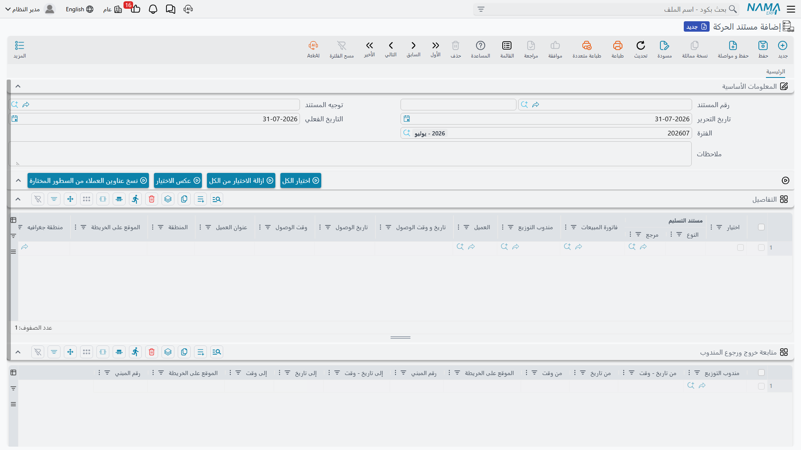
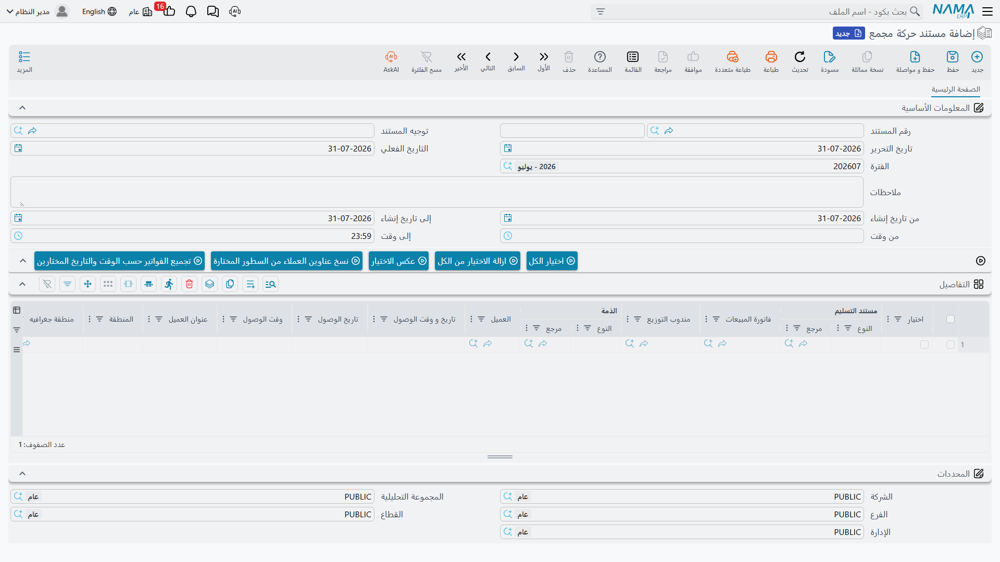

# مستندات الحركة

::: info الترخيص المطلوب
`srvcenter-mobile-delivery`.
:::

::: warning ليس مستند تسليم سيارة
لا علاقة لأي من المستندين في هذه الصفحة بالمركبات ولا [بتسليم السيارة النهائي](/ar/modules/servicecenter/car-sales/car-final-delivery.md). فسطر الحركة يمكن أن يشير إلى **فاتورة مبيعات** أو **مردود مبيعات** أو **مهمة عمل** أو **مستند استلام فاتورة** — ولا شيء غير ذلك. انظر [النظرة العامة](/ar/modules/servicecenter/mobile-delivery/servicecenter-mobile-delivery-overview.md).
:::

تشغّل شركة الصحراء للسيارات سيارة توصيل واحدة من بنك قطع الغيار. ويخدمها مستندان: **مستند الحركة** هو ورقة خط سير اليوم لتلك السيارة، و**مستند الحركة المجمع** هو الأداة التي تبني تلك الأوراق بالجملة من فواتير اليوم بدل بنائها يدوياً. وكلاهما تحت **مركز خدمة ← تطبيقات الجوال - مراكز الخدمة**.

## مستند الحركة — ورقة خط سير مندوب واحد

مستند واحد، مندوب واحد، وقفات يوم واحد.

يسمّي الرأس **المندوب** و**المسوّق** و**جهة التسليم** و**المنطقة**. وتحته جدولان ومجموعة أزرار تحديد.

### جدول الوقفات

كل سطر وقفة واحدة. والأعمدة المهمة:

| العمود | ما يحمله |
|---|---|
| مختار | السطور المفعّلة هي ما تعمل عليه أزرار الإجراءات الأربعة. |
| المستند المُسلَّم | فاتورة المبيعات أو مردود المبيعات أو مهمة العمل أو مستند استلام الفاتورة الجاري تسليمه. |
| فاتورة المبيعات | الفاتورة وراء الوقفة، حين لا يكون المستند المسلَّم هو الفاتورة نفسها. |
| المندوب | من سيأخذه. |
| جهة التسليم | الجهة المستلمة. |
| تاريخ ووقت الوصول | يختمهما التطبيق عند وصول المندوب. |
| العنوان ١، المنطقة الفرعية، الموقع على الخريطة، المنطقة | إلى أين يذهب — يُنسخ من العميل ثم يصححه المندوب على الطريق. |
| التعبئة ١ … التعبئة ٧ | كم عبوة من كل نوع تركب مع هذه الوقفة. وهذه الأرقام هي التي تقود التحويل المخزني أدناه. |
| المسوّق، الفرع | منقولان من المستند المصدر. |
| حالة التسليم | *مبدئي* أو *تم التسليم* أو *العميل غير متاح* أو *تم النقل*. والسطور الجديدة تبدأ بـ*مبدئي*. |
| المرفق الصوتي، ملاحظات المندوب، الملاحظات | ما سجّله المندوب عند الوقفة. |

وفوق الجدول أربعة أزرار — **اختيار الكل** و**ازالة الاختيار من الكل** و**عكس الاختيار** و**نسخ عناوين العملاء من السطور المختارة**. والأخير يكتب عناوين السطور المختارة إلى ملفات العملاء الرئيسية؛ وتشرح [النظرة العامة](/ar/modules/servicecenter/mobile-delivery/servicecenter-mobile-delivery-overview.md) معنى ذلك وحدوده.

### جدول فحص الأوقات

جدول ثانٍ يسجّل وردية المندوب: المندوب، وتاريخ ووقت الحضور مع الموقع الجغرافي عند الحضور، وتاريخ ووقت الانصراف مع الموقع عند المغادرة. ويكتبها التطبيق؛ ولا تكتبها أنت عادةً.

وتُختم الشاشة بمجموعة المحددات.

### ماذا يفعل المستند عند الحفظ وعند الاعتماد

عند الحفظ يرتّب السطور: تُنسخ منطقة العميل وسطر عنوانه الأول وموقعه على الخريطة إلى كل وقفة، ويُختم تاريخ القيمة، وتُضبط حالة التسليم مبدئياً على *مبدئي*. ووقفة مهمة العمل تلتقط ملاحظات المهمة؛ ووقفة مردود المبيعات تلتقط كود المستند الذي بُني عليه المردود.

وعند الاعتماد يُعلِّم كل سطر بأنه معتمد، ويختم كل سطر بمستنده الأب، ثم — إن كان [التوجيه](/ar/modules/servicecenter/document-terms/servicecenter-terms-cars-and-other.md) مضبوطاً لذلك — ينشئ سندات التحويل المخزني.

### التحويل المخزني لمواد التعبئة

هذا هو الأثر الحقيقي الوحيد لهذه الوحدة على ما عداها، وهو موجود ليجيب سؤالاً مخزنياً: *ماذا يوجد في السيارة الآن؟*

ولا يعمل إلا حين تتحقق **كل** الشروط التالية:

- أن يحمل التوجيه **دفتر تحويل مخزني** و**توجيه تحويل مخزني**؛ و
- أن يكون واحد على الأقل من **أصناف التحويل** السبعة مملوءاً في التوجيه؛ و
- أن يكون المستند المسلَّم في السطر **فاتورة مبيعات** (فسطور مهام العمل والمردودات ومستندات استلام الفواتير تُتجاهل).

وعندها تصبح أعداد *التعبئة ١ … التعبئة ٧* في كل سطر كمياتٍ من أصناف التحويل المقابلة لها بالرقم، وتنتقل البضاعة من مخزن ومكان التخزين المصدر في التوجيه إلى **مخزن المندوب نفسه** — أي مكان تخزين تكون جهته المرتبطة هي سجل موظف ذلك المندوب. ويُنتَج سند تحويل واحد لكل زوج مخازن.

فإن لم يكن للمندوب مكان تخزين خاص به، رُفض اعتماد المستند برسالة *"Courier {0} does not have warehouse"*. ويُرفض الاعتماد كذلك حين تكون أصناف التحويل مضبوطة بينما ينقص المخزن المصدر أو مكان التخزين المصدر أو توجيه التحويل أو دفتره — فالتوجيه نصف المضبوط يُلتقط بدل أن يُتجاهل بصمت.

::: danger قاعدتا إعداد لا مفرّ منهما
**مندوب واحد لكل مستند حركة.** فحين يحمل المستند سطوراً لمندوبَين مختلفين، تنتهي عبوات **كليهما** محوّلةً إلى مكان تخزين المندوب **الثاني**. فتظهر سيارة الأول فارغة وسيارة الثاني مضاعفة. ولا يوجد أي تنبيه. اجعل لكل مستند مندوباً واحداً — وهو أيضاً ما ينتجه المستند المجمع حين تضبطه بشكل صحيح.

**إلغاء المستند لا يزيل سندات التحويل التي أنشأها.** فهي تبقى قائمة، ويظل المخزون مقيّداً على مندوب لم يعد يحمله. فبعد إلغاء مستند حركة أو فك اعتماده، ابحث عن سندات التحويل المُنشأة وعالجها يدوياً. (أما إعادة حفظ مستند قائم فتحذف فعلاً السندات التي لم تعد لازمة — الثغرة خاصة بالإلغاء وحده.)
:::

### ماذا يفعل تطبيق الجوال به

بعد الاعتماد يُنبَّه المندوبون على هواتفهم وتظهر سطور المستند في التطبيق. ومن هناك يكتب التطبيق حالة التسليم وتاريخ ووقت الوصول والعنوان كما وُجد وملاحظات المندوب وأي رسالة صوتية — مباشرةً على السطر، دون أن تعمل فحوص المستند. وتشرح [النظرة العامة](/ar/modules/servicecenter/mobile-delivery/servicecenter-mobile-delivery-overview.md) لماذا يهم ذلك فريق الدعم.

## مستند الحركة المجمع — بناء أوراق خط السير بالجملة

الاسم يوحي بتسليم بالجملة؛ وليس الأمر كذلك إطلاقاً. **إنه مولّد مجمّع لمستندات الحركة.**

الرأس أربعة حقول — **من تاريخ الإنشاء** و**إلى تاريخ الإنشاء** و**من وقت الإنشاء** و**إلى وقت الإنشاء** — وتأتي افتراضياً على اليوم الحالي من ٠٠:٠٠ إلى ٢٣:٥٩. وتحتها جدول يعكس جدول وقفات مستند الحركة، مضافاً إليه عمودا الذمة والمحددات الأربعة.

### التجميع

الإجراء **تجميع الفواتير حسب الوقت والتاريخ المختارين** يسحب كل فاتورة مبيعات ومهمة عمل أُنشئت داخل تلك النافذة. ويتخطى أي فاتورة تظهر أصلاً على سطر حركة، فالضغط عليه مرتين لا يكرر العمل؛ وحين يوجد مستند استلام فاتورة لفاتورة ما، يُربط ذلك المستند بوصفه المستند المسلَّم بدلاً منها. ويصل كل سطر مجمَّع وقد مُلئت فيه جهة التسليم وعنوان الشحن وسطر العنوان الأول والمسوّق والمحددات الأربعة من المستند المصدر.

ثم تعدّل السطور المجمَّعة — تسنِد المندوبين، وتضبط أعداد العبوات، وتحذف ما لن يخرج اليوم.

### التوليد

وعند الاعتماد تُجمَّع السطور، ويُنشأ **مستند حركة واحد لكل مجموعة**، في الدفتر والتوجيه المسمَّيَين في توجيه المستند المجمع نفسه، ويُختم كلٌّ منها بأنه أتى من هذا المستند. وإعادة الاعتماد بعد تعديلٍ تُبقي المجموعات متسقة: فالمجموعة التي لم تعد قائمة يُحذف مستند الحركة المُنشأ لها، وإلغاء المستند المجمع يحذفها جميعاً.

ويُبنى مفتاح التجميع من أي من علامات **«شروط تجميع السطور»** الثماني تكون مفعّلة في التوجيه: الفرع، القطاع، الإدارة، المجموعة التحليلية، المندوب، جهة التسليم، المنطقة، المسوّق. والعلامات نفسها تحدد أي حقول الرأس تُنسخ إلى كل مستند حركة مُنشأ.

::: danger فعّل علامة المندوب على الأقل
إذا لم تكن **أي** من العلامات الثماني مفعّلة، كان مفتاح التجميع فارغاً — فتقع كل فاتورة ومهمة مجمَّعة في مستند حركة **واحد** لا غير، بلا مندوب، وبلا منطقة، وبلا نسخ للمحددات. ولا شيء ينبهك؛ إنما تحصل على ورقة خط سير ضخمة لا يستطيع أي مندوب استعمالها ولا يمكنها أن تنشئ تحويلاً مخزنياً، لأنه لا يوجد مندوب لتحوَّل إليه البضاعة.

عملياً: فعّل **المندوب**. وأضف المنطقة أو الفرع أو المسوّق بحسب ما يتطلبه توزيعك فعلاً. ولا تترك العلامات الثماني مطفأة أبداً.
:::

::: warning نسخ العناوين يختلف سلوكه بين الشاشتين
تحمل الشاشتان إجراء *نسخ عناوين العملاء من السطور المختارة*، لكنهما لا تتصرفان تصرفاً واحداً حين يكون مستلم أحد السطور المختارة جهةً لا تحمل بيانات اتصال: ففي المستند المجمع تُعالَج بقية السطور رغم ذلك، أما في مستند الحركة المفرد فيتوقف التنفيذ عندها. تحقق بالعينة من التحديدات الكبيرة في مستند الحركة.
:::
