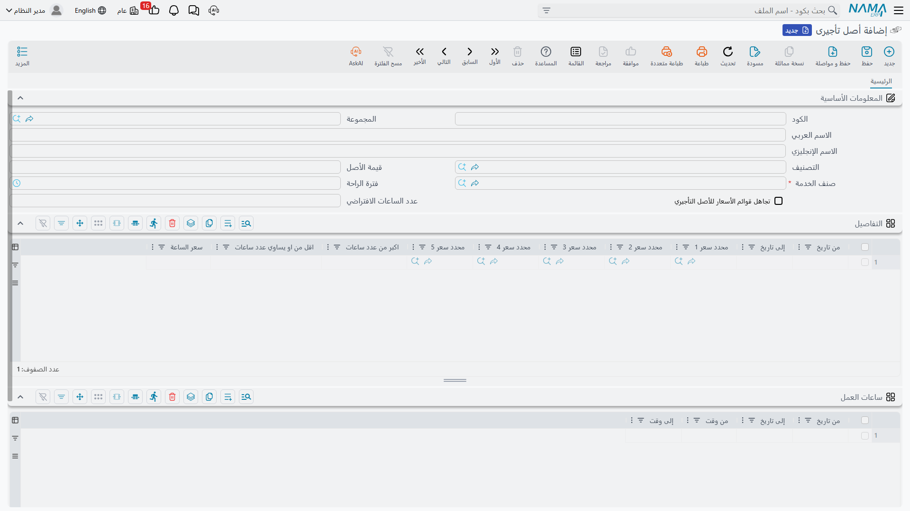
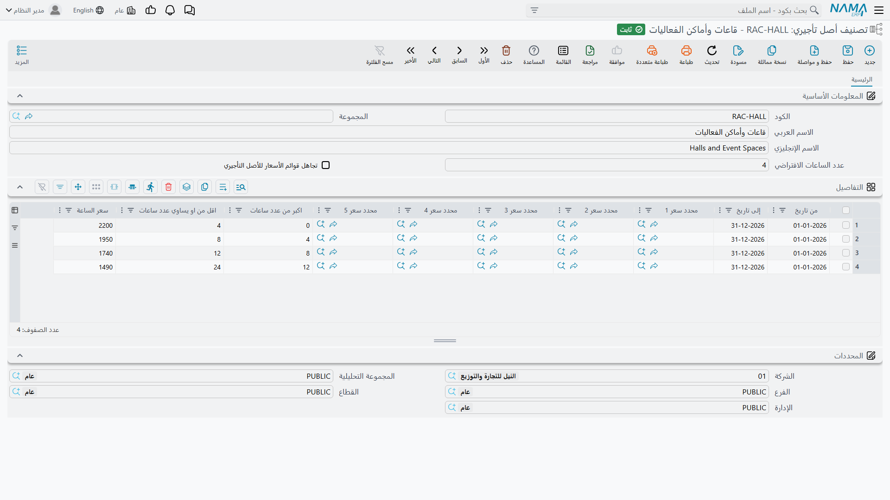

# ملف الأصل التأجيري

::: info الترخيص المطلوب
`srvcenter-rental-assets`. كلا الملفين الرئيسيين في هذه الصفحة مقيّدان بالترخيص.
:::

تُعير شركة الصحراء للسيارات أربع سيارات صغيرة للعملاء الذين تطول إصلاحاتهم. ولكل واحدة منها سجل **أصل تأجيرى** — والسجل `RA-004` *سيارة بديلة سيف ١٫٦* هو الذي تستخدمه كل الأمثلة في هذه الصفحات. تُنشئه من **مركز خدمة ← أصول تأجيرىة ← أصل تأجيرى**.

وقبل أي شيء، النقطة التي تذكرها [صفحة النظرة العامة](/ar/modules/servicecenter/rental-assets/servicecenter-rental-overview.md) وتكررها هذه الصفحة لأنها تحدد كيف تملأ الشاشة: **الأصل التأجيري سجل مورد قابل للحجز، قائم بذاته.** ليس [ملف سيارة المعرض](/ar/modules/servicecenter/cars-setup/car-master-file.md) ولا [ملف المركبة في الورشة](/ar/modules/servicecenter/workshop-setup/servicecenter-product-file.md) ولا صنفاً مخزنياً. لا يوجد حقل رقم لوحة، ولا رقم شاسيه، ولا رقم محرك، ولا عداد، ولا لون، ولا حالة. وإن بحثت عنها فلن تجدها، ولا يوجد تعديل شاشة يجعلها ذات معنى — فلا شيء في منطق الحجز أو التسعير يقرأ هوية المركبة.

ما يحمله السجل فعلاً هو: كم يمكن حجزه، وكم يحتاج من فاصل بين الحجوزات، وكم يكلّف الساعة، وعلى أي صنف يُفوتَر.

## بيانات الرأس

| الحقل | English | ماذا يفعل |
|---|---|---|
| الكود / الاسم العربي / الاسم الإنجليزي / المجموعة | Code / Name / Group | هوية الملف الرئيسي القياسية. |
| التصنيف | Classification | يشير إلى تصنيف أصل تأجيري، ويوفّر شرائح أسعار احتياطية ومدداً افتراضية — انظر أدناه. |
| قيمة الأصل | Asset Value | **للعلم فقط.** لا يقرؤه شيء: لا التسعير ولا الفاتورة ولا [أي تقرير](/ar/modules/servicecenter/servicecenter-reports-and-forms.md). تسجّل الصحراء ٦٢٬٠٠٠ هنا لمرجعيتها الخاصة. |
| صنف الخدمة | Service Item | **إجباري.** الصنف الذي يصبح سطر الإيراد في كل فاتورة تُنشأ لهذا الأصل. تستخدم الصحراء `SRV-RENT-CAR` *تأجير مركبة*. |
| فترة الراحة | Rest Time | فاصل بالدقائق يُضاف على **جانبَي** كل حجز قائم عند فحص التعارض. تضبطه الصحراء على ٦٠ — ساعة للتنظيف والتزود بالوقود بين عميل وآخر. |
| تجاهل قوائم الأسعار للأصل التأجيري | Ignore Pricing List | رغم المسمّى، لا علاقة له بقوائم الأسعار. انظر التحذير أدناه. |
| عدد الساعات الافتراضي | Default Number of Hours | يظهر فقط حين يكون التسعير بالساعة. مدة الحجز التي تُملأ تلقائياً عند اختيار الأصل. |
| عدد الأيام الافتراضي | Default Number of Days | يظهر فقط حين يكون التسعير باليوم. |

::: warning «عدد الأيام الافتراضي» وحده لا يعمل
عند ملء مستند الحجز من الأصل، تفحص الشاشة أولاً ما إذا كان *عدد الساعات الافتراضي* يحمل قيمة قبل أن تنسخ *عدد الأيام الافتراضي*. لذلك فإن أصلاً مملوءاً فيه حقل الأيام وحده يعطي دائماً **يوماً واحداً**. في تركيب يعمل «باليوم»، املأ الحقلين معاً — أو توقّع كتابة المدة في كل حجز.
:::

## ساعات العمل — الشيء الوحيد الذي يجعل الأصل غير متاح

لا يوجد على الأصل التأجيري أي علامة «خارج الخدمة» أو «تحت الصيانة» أو «مستبعد». والإتاحة ليست مخزّنة، بل تُستنبَط لحظة التحقق من الحجز، من ثلاثة أشياء فقط:

1. **جدول ساعات العمل** على الأصل — سطور من *تاريخ بداية* و*تاريخ نهاية* و*وقت بداية* و*وقت نهاية*، تحدد النافذة اليومية التي يجوز الحجز داخلها، مع إمكانية تقييدها بمدى تواريخ. تنشر الصحراء سطراً واحداً: من ٠٨:٠٠ إلى ٢٢:٠٠.
2. **الحجوزات المؤكدة القائمة** — أي الحجوزات المحتجزة فعلاً على هذا الأصل.
3. **فترة الراحة** — التي توسّع كل حجز قائم على جانبيه قبل اختبار التعارض.

::: warning جدول ساعات عمل فارغ يعني إلغاء فحص الوقت كلياً
إذا لم يكن في الجدول أي سطر، فإن التحقق من النافذة الزمنية يُتخطى تماماً ويصبح الأصل قابلاً للحجز على مدار الساعة. ومن السهل إغفال ذلك لأن الشاشة لا تنبّه إليه. املأ الجدول لكل أصل تريد التحكم فيه.
:::

وثمة تفصيل يستحق المعرفة حين تنشر أكثر من سطر ساعات عمل: في الحجز الممتد لعدة أيام، يختار الفحص السطر الساري في **تاريخ بداية** الحجز ويتحقق من وقت النهاية بحسب ذلك السطر نفسه. فالحجز الذي يبدأ داخل مدى سطر وينتهي بعده يظل محكوماً بالسطر الذي بدأ فيه.

ولأنه لا يوجد حقل حالة، فإن سحب الأصل من السوق يتم بإحدى طريقتين: إفراغ جدول ساعات عمله فتُرفض كل الحجوزات، أو استخدام إجراء **منع الاستعمال** العام المتاح على أي ملف رئيسي في Nama.

## التسعير — جدول شرائح يُقرأ بالترتيب

جدول **التفاصيل** على الأصل هو جدول الأسعار. كل سطر يحمل مدى صلاحية (*من تاريخ*، *إلى تاريخ*)، ومحددات السعر الخمسة، ثم — بحسب [طريقة تسعير التركيب](/ar/modules/servicecenter/servicecenter-configuration.md) — إما حداً بالساعات وسعر ساعة، وإما حداً بالأيام وسعر يوم. ولا تظهر إلا مجموعة أعمدة واحدة.

يحمل `RA-004` لدى الصحراء سطرين:

| من تاريخ | إلى تاريخ | أكبر من (ساعة) | حتى (ساعة) | سعر الساعة |
|---|---|---|---|---|
| ١ يناير ٢٠٢٦ | ٣١ ديسمبر ٢٠٢٦ | ٠ | ٤ | **٥٠** |
| ١ يناير ٢٠٢٦ | ٣١ ديسمبر ٢٠٢٦ | ٤ | ١٢ | **٤٠** |

يقرأ النظام الجدول **بترتيب السطور**، مستهلكاً مدة الحجز شريحةً بعد شريحة. ويُؤخذ السطر حين يقع الحجز داخل مدى تواريخه، وتطابق كل محددات السعر غير الفارغة فيه محددات المستند، ويساوي حدّه «أكبر من» المدة المستهلكة فعلاً، وتبقى مدة تتجاوز ذلك الحد.

**وكل شريحة مطابقة تصبح سطر فاتورة مستقلاً.** لذلك ينتج حجز فهد العتيبي لاثنتي عشرة ساعة سطرين:

| السطر | الصنف | الساعات | سعر الساعة | القيمة |
|---|---|---|---|---|
| ١ | `SRV-RENT-CAR` | ٤ | ٥٠ | **٢٠٠** |
| ٢ | `SRV-RENT-CAR` | ٨ | ٤٠ | **٣٢٠** |
| | | | **صافي الفاتورة** | **٥٢٠** |

بينما يعرض حقل *إجمالي قيمة التأجير* في رأس المستند نفسه **٦٠٠** — أي اثنتي عشرة ساعة بسعر الـ٥٠ الذي مُلئ من الشريحة الأولى. ذلك الرقم حقل عرض؛ والمبلغ الحقيقي هو ٥٢٠. وتشرح [صفحة الحجز](/ar/modules/servicecenter/rental-assets/servicecenter-rental-booking.md) هذا الاختلاف بالتفصيل.

ويكتمل المشهد بسلوكين:

- **إذا لم تطابق أي شريحة**، يبني النظام سطراً واحداً للمدة كلها بالسعر الموجود في رأس المستند.
- **إذا طابقت الشرائح دون أن تغطي المدة كلها**، يُرفض الحفظ برسالة *"Could not handle pricing for … hours"* — إلا إذا كان خيار *تجاهل قوائم الأسعار للأصل التأجيري* مفعّلاً.

ولا توجد قائمة أسعار ولا بطاقة أسعار ولا سعر لنهاية الأسبوع أو للمواسم خارج ما يمكنك التعبير عنه بمديات تواريخ السطور ومحددات السعر الخمسة.

::: warning «تجاهل قوائم الأسعار للأصل التأجيري» لا يتجاهل قوائم الأسعار
المسمّى يعد بما لا يفعله الخيار. أثره **الوحيد** هو كتم رسالة الرفض *"Could not handle pricing for … hours"* حين لا تغطي شرائح الأسعار مدة الحجز كاملة؛ أما التحقق العادي من قوائم أسعار المبيعات فيظل يعمل على السطور المُنشأة كما هو.

والأهم من المسمّى هو أثر تركه مطفأً: **الأصل الذي جدول تفاصيله فارغ ولا تصنيف يسنده يرفض كل حجز.** فإن رفض أصل جديد كل ما تحاول حجزه عليه، فأول ما تفحصه هو جدول الشرائح الفارغ.
:::

## التصنيف — سند احتياطي لا سياسة

**تصنيف أصل تأجيري** (**مركز خدمة ← أصول تأجيرىة ← تصنيف أصل تأجيري**) يجمع الأصول المتشابهة في التسعير. وتحتفظ الصحراء بالتصنيف `RACL-COMPACT` *اقتصادي* لسياراتها البديلة.

يحمل التصنيف مدداً افتراضية، وعلَم *تجاهل قوائم الأسعار* الخاص به، وسعر يوم، وجدول الشرائح نفسه. ودوره احتياطي بحت:

- **شرائح الأسعار** — تُستخدم فقط حين يكون جدول تفاصيل الأصل نفسه فارغاً. فإن ملأت جدول الأصل، لم تُقرأ شرائح التصنيف له أبداً.
- **تجاهل قوائم الأسعار** — يُورَّث حين يكون علَم الأصل نفسه مطفأً.
- **عدد الأيام / الساعات الافتراضي** — يُنسخ إلى الأصل لحظة اختيارك التصنيف، ثم يصبح ملكاً للأصل.
- **سعر اليوم** — مسجَّل ولا يقرؤه شيء. فسعر اليوم المستخدم فعلاً يأتي من سطر شريحة أو من رأس المستند، لا من هذا الحقل.

لذا فالإعداد الحكيم هو: ضع الشرائح القياسية على التصنيف، ولا تتجاوزها على أصل بعينه إلا حين تكون تلك المركبة مختلفة السعر فعلاً.

## جدول الحجوزات على الشاشة

تحمل شاشة الأصل جدولاً للقراءة فقط بعنوان **فواتير تأجير الأصل**، يعرض الفاتورة وتاريخ القيمة وتاريخ ووقت البداية وتاريخ ووقت النهاية وعدد الساعات لكل حجز مؤكد ومعتمد على هذا الأصل.

ويجدر معرفة ما هو هذا الجدول، لأنه ليس تقريراً بكل ما حُجز يوماً — بل هو سجل الحجوزات نفسه، ومجموعة السطور ذاتها التي يقرؤها فحص ازدواج الحجز. فالحجز المحفوظ كمسودة، أو المعتمد دون تفعيل *تأكيد الحجز*، لا يظهر فيه ولا يمنع أحداً. وهذا التمييز هو موضوع الصفحة التالية.
