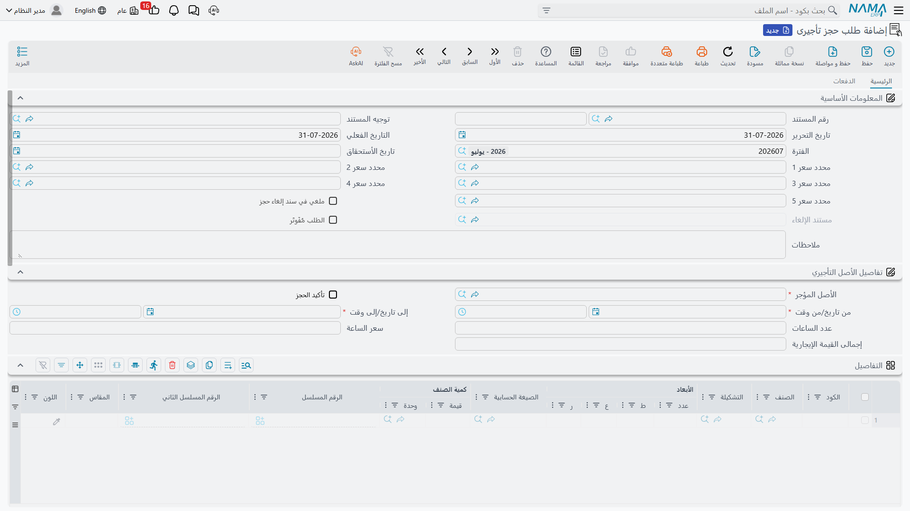
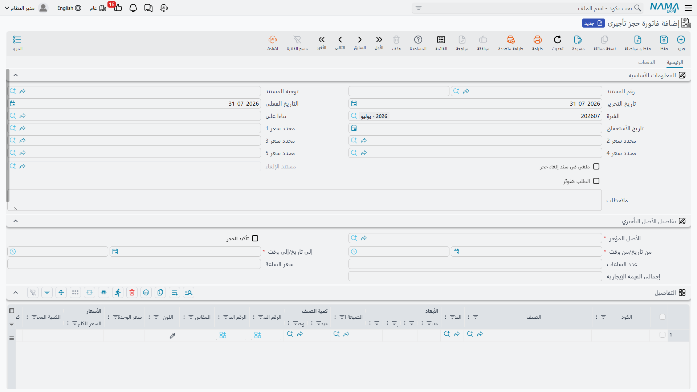

# الحجز والفوترة والإلغاء

::: info الترخيص المطلوب
`srvcenter-rental-assets`. المستندات الثلاثة في هذه الصفحة مقيّدة بالترخيص.
:::

سيارة فهد العتيبي في الورشة على [أمر شغل](/ar/modules/servicecenter/job-cycle/servicecenter-job-order.md) لتغيير الكمبروسر، وهو بحاجة إلى سيارة ليومه. تتابع هذه الصفحة ذلك الحجز من لحظة احتجاز مهندس الاستقبال للفترة حتى اعتماد الفاتورة — ثم، في المسار الذي لا تتمناه الصحراء، حتى مستند الإلغاء الذي يحرر الفترة من جديد.

ثلاثة مستندات، جميعها تحت **مركز خدمة ← أصول تأجيرىة**:

| المستند | English | الدور |
|---|---|---|
| طلب حجز تأجيرى | Rental Asset Request | يحتجز الفترة. |
| فاتورة حجز تأجيرى | Rental Asset Invoice | يفوتر الفترة المخططة. |
| إلغاء حجز أصل تأجيري | Rental Asset Reservation Cancel | يحرر الفترة ويقيّد مبلغاً مكتوباً يدوياً. |

## الطلب — احتجاز الفترة

يُصدَر الحجز `RARR-2026-0057` في ٣ مارس ٢٠٢٦ لفهد العتيبي على الأصل `RA-004`، من **٣ مارس ٠٩:٠٠** إلى **٣ مارس ٢١:٠٠** — اثنتا عشرة ساعة.

الشاشة صفحة واحدة **الرئيسية** فيها أربع مجموعات:

**المعلومات الأساسية** — دفتر المستند وكوده، وتوجيه المستند، وتاريخ الإصدار، وتاريخ القيمة، والفترة المالية، وتاريخ السداد، ومحددات السعر الخمسة. وتعرض أيضاً ثلاثة حقول لا يمكنك الكتابة فيها: *ملغي في سند إلغاء حجز*، و*مستند الإلغاء*، و*الطلب مُفَوتَر*. الثلاثة تُختَم بمستندات أخرى؛ وهي موجودة لتعرف من الطلب نفسه ما آل إليه.

**تفاصيل الأصل التأجيري** — قلب المستند: **الأصل التأجيري** (إجباري)، ومربع **تأكيد الحجز**، وتاريخ ووقت البداية المركّبان، وتاريخ ووقت النهاية المركّبان، ثم إما *عدد الساعات* + *سعر الساعة* وإما *عدد الأيام* + *سعر اليوم* بحسب طريقة تسعير التركيب، وأخيراً *إجمالي قيمة التأجير*.

**التفاصيل** — جدول سطور المبيعات المعتاد. لا تكتب فيه عادةً: فسطر التأجير يُبنى لك. أما السطر الذي تكتبه بنفسك فيبقى، وهذه هي الطريقة الوحيدة لإضافة ما لا تحاسِب عليه الوحدة — وقود، أو استرداد قيمة تلف، أو رسم توصيل.

وتكتمل الصفحة الرئيسية بـ**سطور السداد** ومجاميع المستند و**المحددات**. وثمة صفحة ثانية، **الدفعات**، فيها عنوان الفوترة، وقالب السداد وإجراء *إنشاء الدفعات*، وجدول الأقساط، ومستندات السداد الخارجية، وجدول **بنود البيع**.

### ما يُملأ تلقائياً

اختيار الأصل يملأ سعر الساعة من أول سطر شريحة يطابق مدى تاريخه ومحددات سعره، ويملأ المدة الافتراضية من الأصل. ثم تحافظ الشاشة على اتساق الأرقام الثلاثة أثناء الكتابة: غيّر المدة أو تاريخ ووقت البداية فيُعاد حساب تاريخ ووقت النهاية؛ غيّر تاريخ ووقت النهاية فتُعاد المدة؛ غيّر أي سعر أو عدد فيُعاد حساب *إجمالي قيمة التأجير* بحاصل ضرب العدد في السعر.

وعند الحفظ يعيد الخادم بناء سطور التأجير من الصفر — إذ يُحذف كل سطر مُعلَّم كسطر تأجير ويُنشأ من جديد. لذلك تكون السطور مملوكة للنظام، ولذلك لا جدوى من تعديلها يدوياً.

### مجموعان مختلفان، ولماذا

حجز فهد يعرض هذا على الشاشة وهذا على الفاتورة:

| | القيمة |
|---|---|
| *إجمالي قيمة التأجير* في الرأس | **٦٠٠** — اثنتا عشرة ساعة × الـ٥٠ التي مُلئت من الشريحة الأولى |
| السطور المُنشأة | ٤ ساعات × ٥٠ = ٢٠٠، ثم ٨ ساعات × ٤٠ = ٣٢٠ |
| **صافي الفاتورة** | **٥٢٠** |

والرقمان صحيحان كلٌّ بحسب طبيعته. فـ*إجمالي قيمة التأجير* حقل عرض يُحسب بضرب العدد في سعر الرأس الواحد؛ أما المبلغ فيأتي من السطور المُنشأة التي قرأت جدول الشرائح وسعّرت الساعات الثماني التالية بأربعين. **صافي الفاتورة هو المال.** قل ذلك لكل من يستفسر عن الفارق، وافحص السطور لا الرأس كلما بدا مجموع ما غير صحيح.

### تأكيد الحجز

**تأكيد الحجز** مربع اختيار عادي بلا قيمة افتراضية. وهو أيضاً أخطر حقل في المستند، لأن سطر سجل الحجوزات — السطر الذي يجعل هذا الأصل غير متاح لأحد غيرك — لا يُكتب إلا حين يكون المستند **معتمداً** *و* المربع **مفعّلاً**.

فعّله واعتمد المستند تُحتجَز الفترة. اتركه مطفأً، أو اترك المستند مسودة، فلا يشغل الحجز شيئاً على الإطلاق.

::: danger منع ازدواج الحجز جزئي فقط
فحص التعارض نفسه مكتوب بشكل صحيح: يقارن الفترة المطلوبة، موسّعةً بفترة راحة الأصل على الجانبين، بسجل الحجوزات، ويرفض المستند المتعارض. لكنه **لا يرى إلا الحجوزات التي أُكدت واعتُمدت**، ولا يعمل أصلاً إلا في شروط يسهل إغفالها:

- **طلب الحجز التأجيري** يُفحص دائماً، سواء فُعِّل *تأكيد الحجز* أم لا.
- **فاتورة الحجز التأجيري** تُفحص **فقط حين يكون *تأكيد الحجز* مفعّلاً.** فإن تُرك المربع مطفأً لم تُفحص الفاتورة للتعارض إطلاقاً.

والنتيجة بصراحة: **فاتورتا حجز تأجيري لنفس السيارة ونفس الفترة، والمربع مطفأ فيهما، تُعتمدان كلتاهما بنجاح.** لا شيء يمنع الثانية، ولا شيء ينبّه، ويبدو الأصل مؤجَّراً مرتين دون أي أثر للتعارض. وكذلك طلبان لنفس الفترة يُعتمدان معاً — إذ يُفحص كلٌّ منهما، لكن لا أحدهما قد كتب سطر حجز بعد، فلا يجد أيٌّ منهما ما يتعارض معه.

لا تصف إتاحة التأجير بأنها مضمونة أبداً. والقاعدة العملية لدى الصحراء، وهي التي ينبغي نشرها لمستخدميك: **فعّل تأكيد الحجز في كل مستند تأجير، واعتمده.** فالحجز غير المؤكد أو غير المعتمد مجرد ملاحظة لنفسك، لا حجز.
:::

### ما يُفحص أيضاً عند الاعتماد

يجب أن يسبق تاريخ ووقت البداية تاريخ ووقت النهاية سبقاً صريحاً. ويجب أن يقع الحجز داخل نافذة ساعات عمل الأصل — إلا إذا كان جدولها فارغاً فيُتخطى الفحص. ويجب ملء العدد الذي تجعله طريقة التسعير إجبارياً (الساعات أو الأيام). وبعد ذلك تنطبق فحوص مستند المبيعات المعتادة: اتساق جدول السداد، والتحقق من قوائم أسعار المبيعات، ووجود عميل حين يشترطه [التوجيه](/ar/modules/servicecenter/document-terms/servicecenter-terms-basics.md)، وكود التقسيط ورقم تفويض سطر السداد، وعدم تكرار بنود البيع.

::: warning عدد الأيام لا يُعاد حسابه في طريقة «باليوم»
في التركيب الذي طريقة تسعيره «باليوم»، لا يُصحَّح *عدد الأيام* الذي تكتبه من تاريخي البداية والنهاية أبداً. يحسب النظام عدد الأيام من الفترة لكنه يكتبه في حقل *الساعات* المخفي — وهو ما تستهلكه مطابقة الشرائح — ويترك عددك المكتوب كما هو. فإن غيّرت التواريخ بعد كتابة العدد اختلف الرأس عن السطور. أعد كتابة العدد كلما غيّرت تاريخاً، وافتح المستند بعد الحفظ للتأكد مما حُفِظ.
:::

## الفاتورة — فوترة الفترة المخططة

تُنشأ الفاتورة `RARI-2026-0061` من الطلب عبر آلية **إنشاء مستند بناءا على** المعتادة، وهي تنسخ الأصل والفترة والأسعار والأعداد وعلَم التأكيد وقالب السداد والإجمالي إلى المستند الجديد. وشاشة الفاتورة مطابقة لشاشة الطلب، يُضاف إليها حقل *بناءا على* في المجموعة الأساسية.

ويحدث أمران عند اعتماد فاتورة مبنية على طلب: تتسلّم الفاتورة الحجز — مستبعِدةً من فحص التعارض سطرها وسطر الطلب معاً، حتى لا يبدو التسليم تعارضاً — وتختم الطلب بأنه *مُفَوتَر* فتُحذف سطور حجزه. وهذا التسليم يعمل بشكل صحيح.

والفاتورة تفوتر **الفترة الموجودة في رأسها هي**، مسعَّرةً بنفس قراءة الشرائح الموصوفة في [صفحة ملف الأصل التأجيري](/ar/modules/servicecenter/rental-assets/servicecenter-rental-asset.md). لذا تحمل فاتورة فهد السطرين ٢٠٠ و٣٢٠ بصافٍ قدره **٥٢٠**، إضافةً إلى ما يطبّقه التوجيه من ضريبة وخصم.

::: warning عدّل الفترة قبل الاعتماد لا بعده
لا يوجد تاريخ عودة فعلي في هذا المستند. الفاتورة تسعّر الفترة **المخططة** من/إلى ولا شيء غير ذلك. فإن أعاد فهد السيارة في الحادية عشرة ليلاً بدل التاسعة، فالسبيل الوحيد لتحصيل الساعتين هو تعديل *وقت النهاية* في الفاتورة قبل اعتمادها — وهو ما يعيد قراءة الشرائح ويعيد بناء السطور — أو إصدار فاتورة مبيعات منفصلة بالفرق. ولا توجد غرامة تأخير ولا سعر ساعات إضافية ولا رسم كيلومترات ولا رسم وقود ترجع إليه.
:::

والزوج *طلب ← فاتورة* غير مسجّل كخطوة مستند تالية قياسية، لذا يُضبط الربط عملياً إما يدوياً وإما بقاعدة إنشاء مستندات على التوجيه.

ويقيّد الطلب والفاتورة كلاهما عبر التأثيرات المالية القياسية لفاتورة المبيعات، ويتشاركان [توجيهاً واحداً](/ar/modules/servicecenter/document-terms/servicecenter-terms-cars-and-other.md). ولا يقيّدان **إلا حين يكون في ذلك التوجيه طرف مدين أو دائن مملوء**؛ فإن تُرك الطرفان فارغين لم ينتج عن الاعتماد أي قيد. ولا يحرّك أي منهما المخزون — فالسطر المُنشأ صنف خدمة.

## الإلغاء — تحرير الفترة

المستند `RARC-2026-0009` هو **إلغاء حجز أصل تأجيري**. وهو مستند عادي لا مستند مبيعات، في صفحة واحدة: الدفتر والكود، والتوجيه، وتاريخا الإصدار والقيمة، والفترة المالية، و**بناءا على**، والأصل المؤجَّر، والملاحظات، وزوجا تاريخ ووقت البداية والنهاية، والعميل، و**قيمة الخصم مقابل الإلغاء**، وسبب الإلغاء، والذمة، والعملة وسعرها، ثم مجموعة المحددات.

وجّه حقل *بناءا على* إلى الطلب أو الفاتورة المراد إلغاؤها، فيُملأ الأصل والعميل وزوجا التاريخ والوقت تلقائياً — على الشاشة، ثم مرة أخرى عند كل حفظ. والكتابة فوقها بلا جدوى؛ فهي تُستبدل.

وعند الاعتماد يفعل المستند ثلاثة أشياء: يختم الطلب أو الفاتورة المصدر بأنه ملغى، ويسجّل نفسه كمستند إلغائه، و**يحذف سطر حجز المصدر** — فتُحرَّر الفترة فوراً. وحذف مستند الإلغاء أو فك اعتماده يعكس الثلاثة، وقبل أن يسمح لك بذلك يعيد تشغيل فحص التعارض على المستند المصدر، حتى لا تُحجَز فترة أخذها غيرك في الأثناء دون تنبيه.

ويرفض المستند أمرين: *بناءا على* لا يشير إلى طلب أو فاتورة حجز تأجيري، ومصدراً سبق أن ألغاه مستند إلغاء **آخر**.

### مبلغ الإلغاء رقم تكتبه بنفسك

**قيمة الخصم مقابل الإلغاء** حقل عشري حر. **ولا شيء يحسبه.** فهو غير مشتق من قيمة الحجز، ولا من مدة الإشعار، ولا من نسبة على الأصل أو التصنيف، وغير مُتحقَّق منه إطلاقاً — يقبل الصفر والسالب ومبلغاً أكبر من الحجز نفسه. وسياسة الصحراء ١٠٠ ثابتة للإلغاء في اليوم نفسه، فيكتب الموظف ١٠٠.

وأثره الوحيد قيد محاسبي: سطر مدين وسطر دائن بذلك المبلغ، على الطرفين المحاسبيين المضبوطين في توجيه مستند الإلغاء، مع أخذ الذمة من حقل الذمة في المستند أو من العميل.

::: warning لا يُنشأ مدين، ولا يُقيَّد شيء ما لم يُضبط الطرفان
مبلغ الإلغاء قيد محاسبي بحت. فهو **لا** ينشئ مديناً على العميل و**لا** ينتج فاتورة — فإن كنت تنوي تحصيل الـ١٠٠ فافتُرها بمستند منفصل.

وإن تُرك **أي** من الطرفين المحاسبيين فارغاً في التوجيه، لم يقيّد المستند شيئاً على الإطلاق، وبصمت. وسيظل يحرر الفترة؛ لكنه لن يسجّل مالاً. اضبط الطرفين، أو اقبل أن المبلغ مجرد ملاحظة على مستند.
:::

## الدورة في تسع خطوات

1. اضبط [**طريقة التسعير**](/ar/modules/servicecenter/servicecenter-configuration.md) للتركيب مرة واحدة. كل ما بعدها يتبعها.
2. أنشئ تصنيفاً لكل فئة مركبات، بمدته الافتراضية وجدول شرائحه.
3. أنشئ أصلاً تأجيرياً لكل مركبة: سمِّه، ووجّه صنف الخدمة إلى صنف الإيراد، واختر التصنيف، واضبط فترة الراحة، و**املأ جدول ساعات العمل** — فبدونه لا يوجد فحص نافذة زمنية أصلاً.
4. يحجز العميل: أصدر **طلب حجز تأجيرى**، واختر العميل والأصل والفترة؛ تُملأ المدة والسعر تلقائياً؛ **فعّل تأكيد الحجز**؛ وحصّل مقدماً عبر سطور السداد إن لزم.
5. اعتمد. يُكتب سطر الحجز وتُحتجَز الفترة أمام المستندات المؤكدة الأخرى.
6. يستلم العميل المركبة. **لا يُسجَّل شيء** — فلا وجود لمستند تسليم.
7. الفوترة: أنشئ **فاتورة حجز تأجيرى** من الطلب. صحّح تاريخ ووقت النهاية **قبل الاعتماد** إن اختلفت الفترة الفعلية؛ فتُعاد السطور والمبالغ. ويُختم الطلب بأنه مُفَوتَر وتتسلّم الفاتورة الفترة.
8. إن ألغى العميل: أصدر **إلغاء حجز أصل تأجيري** على الطلب أو الفاتورة، واكتب المبلغ والسبب، واعتمد. تتحرر الفترة.
9. تستطيع القنوات الخارجية — موقع إلكتروني أو كشك في الصالة — قراءة ساعات الأصل المنشورة وحجوزاته المستقبلية عبر خدمة الإتاحة. وتذكّر أنها تُرجع أسعار الساعة فقط.
