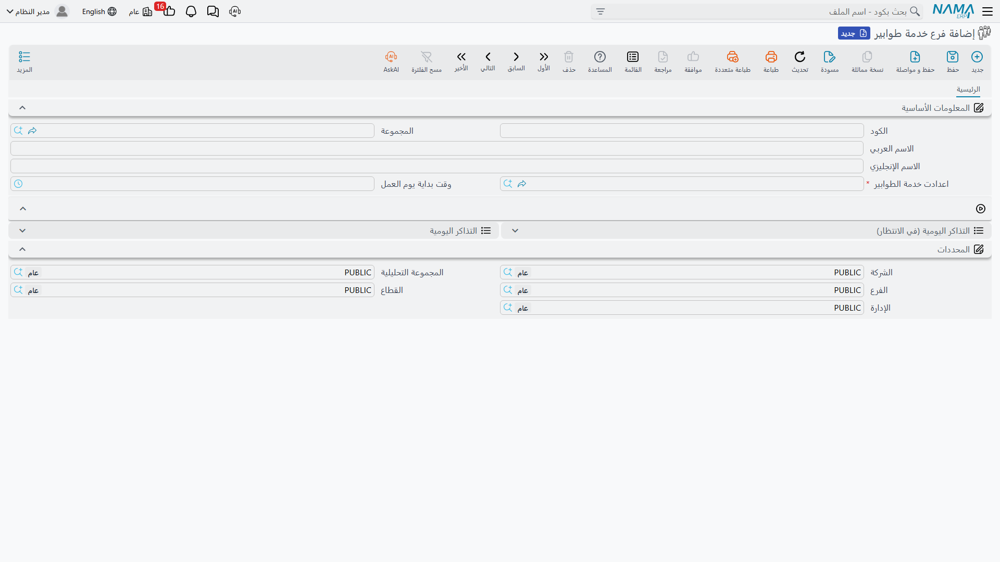

# فروع الطوابير وشاشة التشغيل

::: info الترخيص المطلوب
`srvcenter-service-queues`.
:::

إن كانت الإعدادات كتاب القواعد، فالفرع هو صالة الاستقبال التي تُلعب فيها. والسجل نفسه يكاد يكون خالياً —
حقلان — لكنه المكان الذي تعيش فيه تذاكر كاونتر حقيقي، وهو في الوقت نفسه شاشة تشغيل المشرف طوال اليوم.

القائمة: **مركز خدمة > خدمة الطوابير > فرع خدمة طوابير**.

ولدى شركة الصحراء للسيارات واحد: `QSB-RUH`، يشير إلى الإعدادات `QSC-01` ويبدأ يومه الساعة **٠٧:٠٠**.

## السجل

| الحقل | English | ماذا يفعل |
|---|---|---|
| الكود، الاسم العربي، الاسم الإنجليزي، المجموعة | Code, Name1, Name2, Group | تعريف الملف الرئيسي المعتاد. والكود هو ما يُوجَّه إليه الكشك وشاشة العرض. |
| **اعدادت خدمة الطوابير** | Queue Service Configurations | **إلزامي.** كتاب القواعد الذي يتبعه هذا الكاونتر. وقد تشترك فيه عدة فروع. |
| **وقت بداية يوم العمل** | Day Start Time | اللحظة التي يبدأ عندها يوم الخدمة. وكل ما يلي معلَّق به. |

ومعهما مجموعة **المحددات** المعتادة.

## يوم الخدمة، ولماذا يهم وقت البداية

**وقت بداية يوم العمل** ليس زينة، وله وظيفتان.

**يحدد معنى «اليوم».** فيوم الخدمة يمتد من وقت البداية إلى الوقت نفسه من صباح الغد — من ٠٧:٠٠ إلى
٠٧:٠٠ عند الصحراء. وهو عمداً ليس منتصف الليل، وإلا لانقسم اليوم نصفين على كاونترات الاستقبال التي تعمل
بوردية مسائية. فالتذكرة المسحوبة الساعة ٢٣:٤٠ تنتمي إلى الوردية التي بدأت ذلك الصباح لا إلى التي تليها.

**ويقود إعادة الترقيم الليلية.** ففي وقت البداية من كل يوم يعود عدّاد كل طابور إلى الصفر، فيأخذ أول
عميل بعد ٠٧:٠٠ الرقم ١ ويطبع `A001`. ولهذا كانت `A014` لفهد في ٣ مارس تعني «العميل الرابع عشر في طابور
الخدمة الجديدة منذ ٠٧:٠٠ هذا الصباح»، ولهذا يظهر الكود نفسه في اليوم التالي لعميل آخر.

::: warning إعادة الترقيم الليلية غير موثوقة في التركيبات متعددة الفروع
موعد إعادة الترقيم محفوظ في **خانة واحدة مشتركة** لا في خانة لكل فرع، فإذا كان في التركيب أكثر من فرع
طوابير فلن تُدار إعادة الترقيم إدارة موثوقة إلا لآخر فرع حُمِّل — أما ما قبله فقد يُترك بلا إدارة أو
يُلغى موعده.

فإن كنت تشغّل أكثر من فرع: تحقق في صباح اليوم التالي — بعد **أي** تعديل على فرع أو على إعداداته — أن كل
فرع بدأ فعلاً من ١. والعرض الظاهر حين لا يحدث ذلك هو استمرار أرقام التذاكر صاعدة من آخر رقم بالأمس بدل
أن تبدأ من جديد، ثم بلوغ العدّاد سقف **اخر رقم** ورفضه إصدار التذاكر. أما التركيب ذو الفرع الواحد فلا
يتأثر.
:::

## شاشة التشغيل — جدولا التذاكر

تحمل شاشة الفرع جدولين لتذاكره. ويعرضان الأعمدة نفسها، ويختلفان فيما يشملانه وفيما يجوز لك فعله منهما.

| الجدول | English | ماذا يعرض |
|---|---|---|
| **التذاكر اليومية (في الانتظار)** | Not Assigned Tickets | التذاكر التي لم يسحبها أحد بعد — صالة الانتظار في صورة جدول. وهو الجدول الذي عليه الإجراءات. |
| **التذاكر اليومية** | Day Tickets | كل تذاكر هذا الفرع: منتظرة أو جارية أو منتهية. للعرض فقط. |

والأعمدة بترتيبها:

| العمود | English |
|---|---|
| فرع الخدمة | Service Branch |
| تاريخ الإنشاء | Created On |
| تاريخ السحب | Assigned On |
| تاريخ التنفيذ | Finished On |
| تمت سحب التذكرة يدويا بواسطة | Manually Assigned By |
| مقدم الخدمة | Service Provider |
| كود طلب الدعم *(هكذا يظهر العنوان — فهو يشارك حقل طلب الدعم في مكان آخر من النظام تسميته، والمقصود هنا كود تذكرة الطابور)* | Ticket Code |
| المسلسل | Sequence |
| كودالطابور | Queue Code |
| العميل | Customer |
| رقم اللوحه | Plate Number |

وقراءة السطر مباشِرة: **تاريخ الإنشاء** حين أخذ العميل التذكرة، و**تاريخ السحب** حين ناداه مستشار،
و**تاريخ التنفيذ** حين أُغلقت الزيارة، و**تمت سحب التذكرة يدويا بواسطة** لا يُملأ إلا حين دفع مشرف
التذكرة إلى أحد بدل أن يسحبها المستشار بنفسه.

::: warning ليس أي من الجدولين مقصوراً على اليوم
رغم التسمية، يعرض الجدولان تذاكر الفرع **بلا فلتر تاريخ**. وعلى وجه الخصوص: التذكرة التي أُنشئت قبل
أيام ولم يسحبها أحد ما تزال جالسة في **التذاكر اليومية (في الانتظار)**، وما تزال في قائمة الانتظار التي
تسحب منها محطات المستشارين — فإعادة الترقيم الليلية تعيد **الترقيم** ولا تحذف التذاكر ولا تُسقطها.
ففلتِر الجدولين بـ **تاريخ الإنشاء** حين تريد اليوم الجاري، ونظّف التذاكر القديمة عمداً (انظر إجراء
التنظيف أدناه).
:::

## ماذا تستطيع أن تفعل من شاشة الفرع

يحمل جدول **التذاكر اليومية (في الانتظار)** خمسة إجراءات في قائمة المزيد، وهناك زر إجراء منفصل في وسط
الصفحة:

| الإجراء | English | ماذا يفعل |
|---|---|---|
| **إضافة تذكرة** | Add Day Ticket | يصدر تذكرة يدوياً — البديل حين يتعطل الكشك أو يلزم إقحام عميل. |
| **تعديل تذكرة** | Modify Day Ticket | يعدّل تذكرة منتظرة، كتصحيح رقم اللوحة أو ربط العميل الصحيح. |
| **سحب التذكرة يدويا** | Manually Assign Day Ticket | يدفع التذكرة المختارة إلى مقدم خدمة. |
| **سحب التذكرة (للمستخدم الحالي)** | Self Assign Day Ticket | يسحب التذكرة المختارة إليك أنت — وبه يأخذ المستشار عميلاً خارج الدور. |
| **حذف تذكرة** | Delete Day Ticket | يزيل تذكرة منتظرة. |
| **حذف التذاكر التي تمت تنفيذها حتي تاريخ** | Delete Assigned Ticket Till Date | إجراء التنظيف، على زر مستقل: يمسح التذاكر المخدومة حتى تاريخ تحدده. |

**وكل واحد من هذه الإجراءات يُفحص أمام جدول مقدمي الخدمة في الإعدادات.** فلا بد أن يكون للمستخدم الحالي
سطر مقدم خدمة على إعدادات هذا الفرع يحمل الصلاحية المناسبة — **يمكنه التعديل** للتعديل، و**يمكنه سحب
التذكرة يدويا** لأي من نوعَي السحب، و**الحذف** للحذف — وإلا رُدَّ الإجراء برسالة *«المستخدم … ليس لديه
القدرة … على فرع التذاكر …»*. وحين يبلّغك مشرف أن الزر «لا يفعل شيئاً» فذلك الجدول أول ما تنظر فيه.

::: tip السحب اليدوي يغلق ما كان مفتوحاً لدى المستشار
دفع التذكرة إلى مقدم خدمة أو سحبها له يتصرف تماماً كضغط المستشار *التالي* في محطته: فما كان مفتوحاً
لديه يُختم منفَّذاً في تلك اللحظة. والمستشار لا يخدم عميلين في وقت واحد أبداً.
:::

## التذاكر ليست مستندات

التذكرة سجل خفيف لا مستند. فلا دفتر لها ولا سلسلة أكواد مستندية، ولا دورة مسودة ثم ترحيل، ولا
[توجيه](/ar/modules/servicecenter/document-terms/servicecenter-terms-basics.md)،
ولا أثر محاسبي ولا مخزني. وما تراه في الجدولين هو كل ما هناك، والإجراءات أعلاه هي السبيل الوحيد لتغييرها.

والأثر الذي يستحق التخطيط له يخص الجانب **الحي** من الميزة. فمن يُخدَم عند أي مكتب، وأي التذاكر منتظرة،
وما الرقم التالي — كل ذلك حالة يحفظها الخادم ويوزعها على الأجهزة المتصلة، ويعيد بناءها من التذاكر
المخزّنة. ومن ثم:

- **إذا أعيد تشغيل الخادم أثناء يوم العمل انقطع اتصال كل جهاز.** فلا بد لشاشة الحائط ومحطات المستشارين
  أن تعاود الاتصال، وأن يدخل المستشارون من جديد بأرقام مهندسيهم قبل أن يعمل الكاونتر طبيعياً. أما
  التذاكر نفسها فتبقى — فهي سطور الجدولين أعلاه — لكن ما كانت تعرضه الشاشة في تلك اللحظة يذهب حتى تعاود
  الاتصال.
- **ولا بد أن تصل الأجهزة إلى خادم النظام باستمرار** لا عند الإقلاع فحسب: فتحديث الشاشة وزر «التالي»
  كلاهما معلَّق باتصال حي. وكشكٌ يطبع القصاصات وشاشةٌ لا تتحدث أبداً مشكلةُ اتصال في الغالب لا مشكلة
  إعداد.
- **والترخيص يحرس الاتصال نفسه.** فبدون `srvcenter-service-queues` يرفض الخادم أجهزة الطوابير رفضاً
  تاماً مهما أُحسن إعداد الفرع.

## أمر الشغل هو الذي يغلق التذكرة

آخر خطوة في حياة التذكرة تقع على شاشة أخرى تماماً، وليست الشاشة التي يتوقعها أكثر الناس.

**لا شيء في الطوابير يمسّ [طلب الخدمة](/ar/modules/servicecenter/job-cycle/servicecenter-service-request.md).** فقد حُجزت زيارة فهد على طلب الخدمة `SCSR-2026-0881`، وذلك
المستند لا يحمل حقول تذاكر البتة. والصلة في
[**أمر الشغل**](/ar/modules/servicecenter/job-cycle/servicecenter-job-order.md)، وفي مجموعته الأساسية حقلان:

| الحقل | English | ملاحظات |
|---|---|---|
| فرع الخدمة | Service Branch | صالة الاستقبال التي سُحبت منها التذكرة — `QSB-RUH`. |
| كود التذكرة *(وعنوانه في الواجهة العربية* كود طلب الدعم*)* | Ticket Code | يُختار من قائمة اقتراحات لا يُكتب بحرية — `A014`. |

وبمجرد اختيارك الفرع يقترح حقل كود التذكرة **تذاكر الفرع التي ما تزال مفتوحة والتي سُحبت في التاريخ
الفعلي لأمر الشغل أو بعده**. ويلزم من ذلك أمران، وهما مكالمتا الدعم اللتان تتولدان عن هذا:

- التذكرة التي لم يسحبها مستشار قط لا تظهر — فهي لم تُسحب أصلاً؛
- والتذكرة المسحوبة بالأمس لا تظهر على أمر شغل مؤرخ باليوم.

وحين يُرحَّل أمر الشغل `SCJO-2026-0417` تُختم التذكرة `A014` منفَّذة، وتُبلَّغ شاشات الطوابير، وتتحرر
محطة المستشار. **فترحيل أمر الشغل هو ما يغلق تذكرة العميل** — فرحِّله عند المكتب. أما أوامر الشغل التي
تُحفظ مسودات وتُرحَّل دفعة واحدة آخر اليوم فتترك تذاكرها ظاهرة «جارية» على شاشة الحائط طوال بعد الظهر.

::: warning إلغاء أمر الشغل لا يعيد فتح التذكرة فتحاً صحيحاً
إلغاء أمر شغل مرحَّل يفكّ ارتباط التذكرة به، لكن التذكرة **تحتفظ بتاريخ تنفيذها ولا تعود إلى قائمة
الانتظار** — فتظل الشاشة ومحطات المستشارين تعاملها معاملة المخدومة.

فإن لزم إلغاء أمر شغل والعميل ما يزال منتظراً حقاً، فلا تنتظر عودة التذكرة القديمة إلى الحياة. أصدر
تذكرة جديدة من شاشة الفرع بإجراء **إضافة تذكرة** واربط الجديدة بأمر الشغل البديل.
:::

## اقرأ بعد ذلك

- [إعدادات طوابير الخدمة](/ar/modules/servicecenter/service-queues/servicecenter-queue-configuration.md) — الطوابير والترقيم، وصلاحيات مقدمي الخدمة التي تكرر هذه الصفحة الإشارة إليها، وخطوات الخدمة الذاتية.
- [كيف تعمل خدمة الطوابير](/ar/modules/servicecenter/service-queues/servicecenter-queue-overview.md) — الميزة من أولها إلى آخرها، وأدوار الأجهزة الثلاثة التي يُبنى منها الكاونتر.
