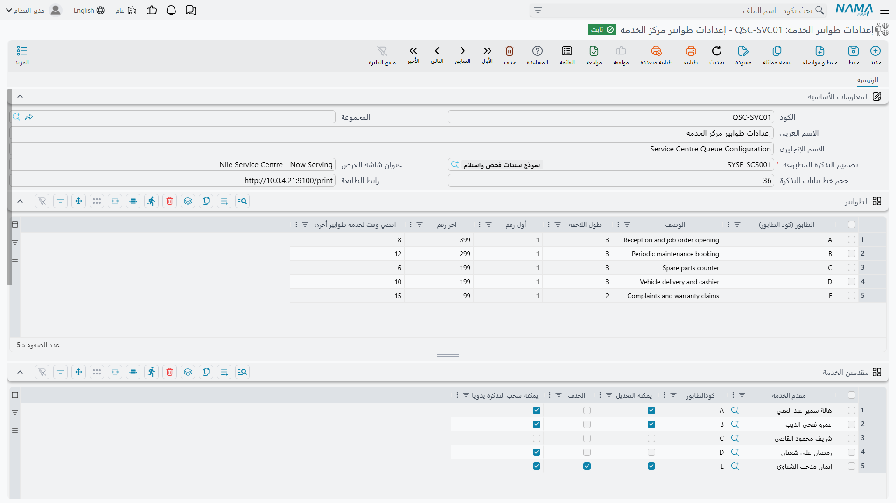

# إعدادات طوابير الخدمة

::: info الترخيص المطلوب
`srvcenter-service-queues`.
:::

الإعدادات كتاب قواعد كاونتر الاستقبال. تقول كم طابوراً هناك وما أسماؤها، ومن يجوز له خدمة أي منها، وكيف
تبدو القصاصة المطبوعة، وما الذي يتبدل على شاشة صالة الانتظار، وإن أردت كشكاً ذاتي الخدمة فما الأسئلة
التي يُسأل عنها العميل قبل أن يأخذ تذكرته.

وهي لا تحمل تذاكر ولا تخص صالة استقبال بعينها. وذلك فصل مقصود: **الإعدادات الواحدة تخدم عدة فروع**.
فمجموعة وكالات لها أربع صالات استقبال متماثلة تكتب القواعد مرة واحدة وتشير إليها بأربعة سجلات فروع.

القائمة: **مركز خدمة > خدمة الطوابير > إعدادات طوابير الخدمة**.

ولدى شركة الصحراء للسيارات واحدة، هي `QSC-01` *استقبال الرياض*، وبقية هذه الصفحة تبنيها.

## الترويسة

كتاب القواعد كله في صفحة واحدة: مجموعة الترويسة أولاً، ثم جداول الطوابير ومقدمي الخدمة والإعلانات والتذاكر الآلية مرصوصة تحتها.

| الحقل | English | ماذا يفعل |
|---|---|---|
| الكود، الاسم العربي، الاسم الإنجليزي، المجموعة | Code, Name1, Name2, Group | تعريف الملف الرئيسي المعتاد. |
| **تصميم التذكرة المطبوعه** | Ticket Design | **إلزامي.** [التقرير](/ar/modules/servicecenter/servicecenter-reports-and-forms.md) الذي يطبع قصاصة العميل. |
| عنوان شاشة العرض | Screen Title | العنوان الظاهر أعلى شاشة صالة الانتظار. وتستعمل الصحراء *استقبال الصحراء — الرياض*. |
| حجم خط بيانات التذكرة | Ticket Information Font Size | حجم طباعة بيانات التذكرة على القصاصة. |
| رابط الطابعة | Printer URL | عنوان خدمة الطباعة المحلية التي يدفع إليها جهاز إصدار التذاكر القصاصة — وهو عادة شيء مثل `http://localhost:9100` على جهاز الكاونتر نفسه لا على الخادم. |

وتحمل الإعدادات كذلك مجموعة **المحددات** المعتادة (الشركة، المجموعة التحليلية، الفرع، القطاع، الإدارة).

::: tip تصميم التذكرة ليس اختيارياً
لا تستطيع حفظ الإعدادات بلا تصميم تذكرة، فابنِ التقرير أولاً. وحين تُطبع القصاصة يُمرَّر إلى التقرير
التذكرة نفسها **وعدد المنتظرين في الطابور نفسه**، وبذلك تستطيع القصاصة أن تقول *«أمامك ٦ عملاء»*.
:::

## الطوابير — الحروف التي يراها العميل

جدول **الطوابير** سطر لكل طابور. والطابور صفّ خدمة له ترقيمه الخاص، وحرفه هو أول محرف في كل كود تذكرة
يصدرها — وهو الكود الذي يختاره المستشار لاحقاً في
[أمر الشغل](/ar/modules/servicecenter/job-cycle/servicecenter-job-order.md) الخاص بالعميل.

| العمود | English | ملاحظات |
|---|---|---|
| **الطابور (كود الطابور)** | Queue Letter (Queue Code) | **إلزامي.** بادئة التذكرة، والكود الذي تشير به إلى الطابور في كل مكان آخر — في سطور مقدمي الخدمة وفي سطور التذاكر آلياً. وهو حرف واحد عادة. |
| الوصف | Description | ما هذا الطابور، بالكلمات. |
| طول اللاحقة | Suffix Length | إلى كم رقماً يُكمَّل الرقم بالأصفار. و٣ تعطي `A001`. |
| أول رقم | First Number | **لا يُستعمل — انظر التنبيه أدناه.** |
| **اخر رقم** | Last Number | **إلزامي.** أعلى رقم يجوز لهذا الطابور إصداره في اليوم. |
| اقصي وقت لخدمة طوابير أخرى | Max Time To Switch Queues | بالدقائق. التذكرة التي انتظرت هذه المدة تتقدم على قائمة انتظار الفرع كلها. اتركه فارغاً أو صفراً لتعطيل التقدم. |

وطابورا الصحراء:

| الطابور | الوصف | طول اللاحقة | اخر رقم | اقصي وقت للتبديل |
|---|---|---|---|---|
| `A` | خدمة جديدة | ٣ | ٩٩٩ | ٢٠ |
| `B` | ضمان | ٣ | ٩٩٩ | — |

### كيف يُبنى كود التذكرة

يبدأ الترقيم من جديد عند وقت بداية يوم العمل في الفرع، و**أول عميل في اليوم يأخذ الرقم ١**. والكود هو
حرف الطابور يتلوه ذلك الرقم مكمَّلاً بالأصفار إلى طول اللاحقة:

> `A` + الرقم ١ مكمَّلاً إلى ٣ ← **`A001`** — أول عميل يدخل من الباب.
> وبعد ثلاث عشرة تذكرة يسحب فهد العتيبي **`A014`**.

وحين تكتب طول اللاحقة تعرض عليك الشاشة أن تملأ **اخر رقم** بأكبر رقم يتسع فيه — ٩٩٩ لطول لاحقة ٣.
فاقبل. فتجاوز **اخر رقم** يُرفض صراحة برسالة *«لقد وصلت إلى آخر رقم … للطابور …»*، والعميل الواقف عند
الكشك لا يخرج له شيء، فالسقف المنخفض توقفٌ فعلي عند الكاونتر. وإن كان الفرع المزدحم يصدر أكثر من ٩٩٩
تذكرة بين بداية يوم وبداية اليوم التالي، فارفع طول اللاحقة إلى ٤ والسقف إلى ٩٩٩٩.

::: warning «أول رقم» لا يفعل شيئاً البتة
**أول رقم (First Number)** لا يقرؤه أي جزء من النظام. اجعله ١٠٠ ومع ذلك تكون أول تذكرة في اليوم
**`A001`** — فالترقيم يبدأ من ١ دائماً. وهو ليس وسيلة لحجز مدى أرقام، ولا لجعل فرعين يصدران أرقاماً
متمايزة. اتركه على قيمته الافتراضية ولا تبنِ عليه إجراءً أبداً.

أما جاراه فسليمان: **اخر رقم** مطبَّق فعلاً، و**طول اللاحقة** يتحكم في التكملة بالأصفار فعلاً.
:::

### ماذا يفعل «اقصي وقت لخدمة طوابير أخرى» حقاً

هو صمام إنصاف، وهو يعمل. تضع الصحراء ٢٠ دقيقة على الطابور `A`. فإذا انتظرت تذكرة `A` عشرين دقيقة كفّت
عن انتظار دورها خلف ترتيب الحروف وقفزت إلى مقدمة قائمة انتظار **الفرع كله** — فأول مستشار يضغط *التالي*،
أياً كانت طوابيره، يأخذ ذلك العميل. وإذا تجاوزت عدة تذاكر مدتها فالأقدم أولاً. والساعة تجري من لحظة
إنشاء التذكرة لا من لحظة جلوس العميل.

واترك العمود فارغاً في الطوابير التي تفضّل فيها أولوية الحروف الصارمة — وتتركه الصحراء فارغاً في `B`
لأن أعمال الضمان تُخدَم بعد الخدمة الجديدة عمداً.

## مقدمو الخدمة — من يخدم ماذا

جدول **مقدمين الخدمة** هو ضبط الصلاحيات في هذه الوحدة. فمن لا سطر له فيه لا يخدم، ولا يسحب تذكرة، ولا
يمسّ جداول تذاكر الفرع.

| العمود | English | ملاحظات |
|---|---|---|
| **مقدم الخدمة** | Service Provider | **إلزامي.** مستخدم النظام — المستشار أو المهندس. |
| كودالطابور | Queue Code | أي طابور يمنحه هذا السطر. **واتركه فارغاً لتمنح كل الطوابير**: فمن كوده فارغ تُعرض عليه أول تذكرة منتظرة في أي حرف. |
| يمكنه التعديل | Can Modify | يعدّل تذكرة منتظرة من شاشة الفرع. |
| الحذف *(العنوان ناقص، والمقصود «يمكنه الحذف» — وهو ناقص في اللغتين)* | Can Delete | يحذف تذكرة من شاشة الفرع. |
| يمكنه سحب التذكرة يدويا | Can Manually Assign | يسحب تذكرة — لنفسه أو لمقدم خدمة آخر — من شاشة الفرع. |

وسطر الصحراء الوحيد: `EMP-214` ماجد القحطاني، الطابور `A`، بعلامتَي **يمكنه التعديل** و**يمكنه سحب
التذكرة يدويا**، وبترك **الحذف** خالياً.

وقاعدتان تفرضهما الشاشة عند الحفظ: يُرفض سطر مقدم خدمة كوده ليس أحد حروف جدول الطوابير، ولا يتكرر
المستخدم نفسه للطابور نفسه. ولتمكين مستشار من خدمة طابورين أعطه **سطرين**، سطراً لكل حرف — وهذا هو
المقصود، وهو غير ترك الكود فارغاً الذي يمنح كل شيء بما فيه الطوابير التي تضيفها لاحقاً.

::: tip هذه الصلاحيات تحرس شاشة الفرع لا التطبيق وحده
كل إجراء على جداول تذاكر سجل الفرع يُفحص أمام هذا الجدول، ومن ينقصه العمود المناسب يُرَدّ برسالة
*«المستخدم … ليس لديه القدرة … على فرع التذاكر …»*. فالجدول هو ما تعدّله حين يشكو مشرف أنه لا يستطيع
حذف تذكرة عالقة.
:::

## الإعلانات — ما تراه صالة الانتظار

جدول **إعلانات** دورة إعلانية صغيرة لشاشة العرض: صورة، ووصف لها لمرجعك أنت، وعلامة **غير نشط** لتنحية
إعلان دون حذفه. وتقلّب الصحراء صورة عرض خدمة وصورة ضمان ناوا، وتضع علامة غير نشط على إعلان رمضان أحد
عشر شهراً في السنة.

## إصدار التذاكر آلياً — مسار قرار الخدمة الذاتية

إذا كان العميل سيخدم نفسه بكتابة رقم جواله بدل أن يناوله موظف الاستقبال تذكرة، فلا بد لشيء أن يقرر
*هل* يأخذ تذكرة و*في أي* طابور يقع. وذلك هو جدول **سطور التذاكر اّلياَ**: متتالية قصيرة من الخطوات
المرقَّمة يمشي فيها الخادم كلما وصله طلب كهذا.

ويقدّم العميل ثلاثة أشياء: الفرع، و**رقم الجوال**، و**رقم اللوحة**. ثم يبحث الخادم عن عميل — وعن خيط
بيع في إدارة العلاقات — يكون **كود الأعمال (Business Code)** الخاص به هو رقم الجوال نفسه بالضبط. وهذه
هي قاعدة التعرّف كلها، ولها أثر عملي يستحق التخطيط: **إن أردت للخدمة الذاتية أن تتعرف على عملائك فلا
بد أن يكون رقم جوال كل منهم مخزّناً في كود الأعمال**، لا في بيانات الاتصال فحسب.

ويبدأ التنفيذ عند **أول سطر في الجدول** — فالسطر الأعلى هو المدخل، وليست هناك علامة «بداية» — ويمشي من
خطوة إلى خطوة حتى يبلغ خطوة تنهي الحوار.

| العمود | English | ملاحظات |
|---|---|---|
| **كود الخٌطوة** | Step Code | اسم الخطوة. ولا يتكرر. |
| **نوع الخُطوة** | Step Type | ما تفعله الخطوة — انظر الجدول التالي. |
| الاستعلام | Query | لخطوة *استعلام* فقط: استعلام على قاعدة البيانات يرجع رقماً. |
| كود طابور التذكرة *(عنوان هذا العمود بالعربية غير مترجم ويظهر مفتاحه الخام)* | Ticket Queue Code | لخطوة *إنشاء و طباعة تذكرة* فقط: في أي طابور تصدر التذكرة. و**إلزامي** في هذا النوع. |
| قالب الرسالة (عربي) | Arabic Message Template | الرسالة التي تُعرض على العميل بالعربية. |
| قالب الرسالة (إنجليزي) | English Message Template | الرسالة نفسها بالإنجليزية. |
| الخطوة التالية (عندما) | Next Step (Then) | إلى أين نذهب حين يكون الفحص **صحيحاً**. |
| الخطوة التالية (اٌخري) | Next Step (Else) | إلى أين نذهب حين يكون الفحص **خاطئاً**. |

### أنواع الخطوات الستة

| نوع الخطوة | English | ماذا تقرر أو تفعل | تنهي المسار؟ |
|---|---|---|---|
| التحقق من العميل | Check Customer | صحيحة حين يوجد عميل كود أعماله هو رقم الجوال. | لا — تمضي إلى *عندما* أو *اٌخري*. |
| التحقق من خيط البيع | Check Lead | صحيحة حين يوجد خيط بيع كود أعماله هو رقم الجوال. | لا. |
| استعلام | Query | تشغّل استعلام السطر وتكون صحيحة حين يرجع رقماً غير الصفر. | لا. |
| إنشاء و طباعة تذكرة | Create And Print Ticket | تصدر التذكرة في **كود طابور التذكرة** لذلك العميل (أو خيط البيع) ورقم اللوحة، وترجع التذكرة والرسالتين. | **نعم.** |
| رسالة نجاح العملية | Success Message | ترجع الرسالتين على أنهما نتيجة عادية. | **نعم.** |
| رسالة خطأ | Error Message | ترجع الرسالتين موسومتين بأنهما خطأ، فيعرضهما الكشك على أنه اعتذار. | **نعم.** |

وقوالب الرسائل تُصاغ قبل عرضها، فتستطيع أن تستدعي قيماً بدل أن تكون نصاً ثابتاً — وبذلك تحيّي الرسالة
العميل باسمه.

### مسار مشروح

تريد الصحراء أن يُخدم العملاء المعروفون فوراً وأن يُحال الغرباء إلى المكتب:

| كود الخطوة | نوع الخطوة | كود طابور التذكرة | عندما | اٌخري |
|---|---|---|---|---|
| `10` | التحقق من العميل | — | `20` | `30` |
| `20` | إنشاء و طباعة تذكرة | `A` | — | — |
| `30` | رسالة خطأ | — | — | — |

وقالب الخطوة `30` بالعربية *«رقمك غير مسجل لدينا، يرجى التوجه إلى موظف الاستقبال»* وبالإنجليزية
*«We could not find your number — please see the receptionist»*.

وإضافة طابور ضمان سطر واحد إضافي: ضع أمامه خطوة *استعلام* تسأل هل المركبة ما تزال في الضمان، فترسل
الصحيح إلى خطوة *إنشاء و طباعة تذكرة* على الطابور `B` والخطأ إلى نظيرتها على الطابور `A`.

### ما ترفض الشاشة حفظه

الفحوص هنا صارمة، وهي من النوع الحسن — إذ تمنع الكشك من أن يقف مسدوداً أمام عميل:

- سطران بكود خطوة واحد؛
- خطوة *تحقق* أو *استعلام* تُرك فيها **الخطوة التالية (عندما)** أو **الخطوة التالية (اٌخري)** فارغة؛
- خطوة رسالة تُرك فيها أحد قالبَي الرسالة فارغاً؛
- خطوة *إنشاء و طباعة تذكرة* بلا **كود طابور التذكرة**؛
- خطوة تشير إلى كود خطوة غير موجود؛
- دورة مغلقة — إذ يُمشى المسار كله ويُرفض الدوران برسالة *«وجدنا مساراً لا نهائياً …»*.

::: warning رسالة خطأ «عندما / اٌخري» تشير إلى العمود الخطأ
حين تترك **الخطوة التالية (اٌخري)** فارغة تشير الرسالة إلى **الخطوة التالية (عندما)** — والعكس بالعكس.
والحفظ مرفوض في الحالتين على الصواب، لكن اقرأ العمودين معاً بدل الوثوق بأيّهما أُشير إليه.
:::

## اقرأ بعد ذلك

- [فروع الطوابير وشاشة التشغيل](/ar/modules/servicecenter/service-queues/servicecenter-queue-branches.md) — ربط هذه الإعدادات بصالة استقبال، ويوم الخدمة، وجداول التذاكر اليومية.
- [كيف تعمل خدمة الطوابير](/ar/modules/servicecenter/service-queues/servicecenter-queue-overview.md) — الميزة كلها في سرد واحد، بما فيها أدوار الأجهزة الثلاثة.
