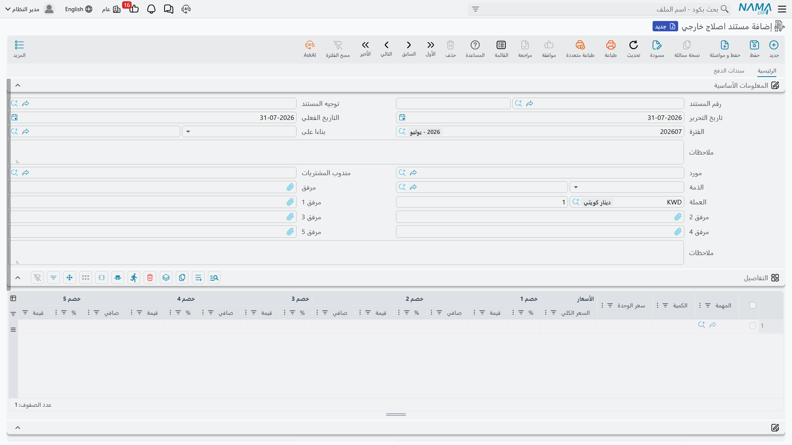

# الإصلاح الخارجي

بعض الأعمال تغادر المبنى. فكمبروسر التكييف في سيارة فهد العتيبي لا بد أن يُختبر على بنش، ولا بنش عند
شركة الصحراء، فيذهب إلى الطرف الآخر من المدينة عند `SUP-91` الفيصل لكهرباء السيارات، الذين يطلبون
**400** أجراً للعمل.

ومستند **الإصلاح الخارجي** هو الذي تُسجَّل به هذه الأربعمائة. ويحسن الدقة في بيان ماهيته، لأن اسمه
يوحي بأنه مستند ورشة وهو ليس كذلك: **هو فاتورة مشتريات لعمل مُسنَد إلى الغير**، ويتصرف تصرفها.

تجده في **مركز خدمة > المستندات > External Repair**.

::: info الترخيص المطلوب
`srvcenter`
:::

::: tip خطآن في التسمية على هذه الشاشة
ليس لعنوان الشاشة ترجمة إنجليزية، فيظهر بالعربية في الجلسة الإنجليزية — والعربية نفسها فيها خطأ
مطبعي: **«مستند اصلاج خارجي»**، والصواب **«مستند إصلاح خارجي»**. أما مدخل القائمة فيقرأ
*External Repair* صحيحاً.
:::

## ما الذي يحمله المستند

تحمل صفحة **الرئيسية** دفتر المستند وكوده والتوجيه والتواريخ والفترة المالية والوصف، ثم الكتلة
التجارية: **مورد**، و**مندوب المشتريات**، و**الذمة** — وقد تكون موظفاً أو حساباً — والعملة والسعر
وستة مرفقات وحقل **بناءا على**.

وجدول **التفاصيل** هو موضع سرد العمل، وليس فيه صنف ولا مخزن:

| العمود | ما هو |
|---|---|
| **المهمة** | مطلوبة. أي مهام أمر الشغل نفّذتها الورشة الخارجية. |
| الكمية وسعر الوحدة والإجمالي | أجر العمل المُسنَد لتلك المهمة. |
| الخصومات 1–8 والضرائب 1–4 والصافي | كتلة قيم سطر الفاتورة القياسية. |
| **حساب** | حساب المصروف الذي تُحمَّل عليه القيمة. يُكتب لكل سطر. |
| الذمة ونوع حساب الذمة | الطرف المقابل لذلك السطر إن اختلف عن الترويسة. |

وتحت الجدول تقع كتلة القيم — الإجماليات والخصومات والضرائب وصافي القيمة والمدفوع والمتبقي — ثم صفحة
**سندات الدفع** بسطور الدفع الخارجية وسطور السداد وقالب الدفع وجدول الدفعات، مع إجراء **إنشاء
الدفعات** القياسي. أي أن آلية فواتير الموردين ومدفوعاتها كلها متاحة هنا.

وصلته الوحيدة بالورشة هي **بناءا على**. فليس في المستند حقل لأمر الشغل. وجّه *بناءا على* إلى
[أمر الشغل](/ar/modules/servicecenter/job-cycle/servicecenter-job-order.md) `SCJO-2026-0417` فيمتلئ
الجدول بسطر لكل مهمة في ذلك الأمر بكمية 1 — **وبلا سعر**. فتحذف المهام
التي بقيت في الداخل، وتبقي `TSK-AC`، وتكتب أمامها 400 وحساب المصروف.

## ماذا يفعل الاعتماد

شيئان، لا ثالث لهما.

**يسجّل المال.** يُنشئ المستند قيده بوصفه شراءً: يُجعل المورد — أو الذمة المسمّاة في السطر — دائناً،
ويُجعل حساب المصروف في السطر مديناً، وتتبع الخصومات والضرائب والنقدية الحسابات المحددة في
[توجيه المستند](/ar/modules/servicecenter/document-terms/servicecenter-terms-workshop.md).
(وخيار التوجيه **تعمل مبيعات ليست مشتريات** يعكس الاتجاه للحالة النادرة التي تطالب فيها طرفاً
خارجياً بأجر عمل قمت أنت به.) وتُدار المدفوعات والأقساط من الصفحة الثانية، تماماً كأي فاتورة مورد.

**ويؤشر على المهام بأنها منتهية.** فلكل سطر في المستند، تُجعل المهمة المطابقة في أمر الشغل
**منتهية**.

ولا ينشئ أمر شراء ولا فاتورة مشتريات ولا سنداً مخزنياً ولا أثراً مخزنياً.

## تكلفة الإصلاح الخارجي لا تصل أمر الشغل

هذا هو التوقع الذي يأتي به الجميع، وهو خاطئ.

::: warning تكلفة العمل المُسنَد لا تدخل تكلفة أمر الشغل أبداً
لا شيء في سلسلة تكلفة أمر الشغل يقرأ مستند الإصلاح الخارجي. فتكلفة أمر الشغل نفسها،
و[جدول قطع الغيار](/ar/modules/servicecenter/spare-parts/servicecenter-spare-parts-overview.md)،
و[إغلاق أمر الشغل](/ar/modules/servicecenter/job-cycle/servicecenter-job-order-closing.md)، وفواتير
العميل والتأمين والضمان الثلاث كلها **لا تعلم بوجود المستند**.

فأربعمائة شركة الصحراء تستقر في دفتر الأستاذ على حساب المصروف وعلى حساب الفيصل — وهذا صحيح، وهناك
تبقى. وهي **لا** تنضم إلى الـ 3,215 في `SCJO-2026-0417`، ولا تظهر سطر تكلفة على العمل، و**لا يُعاد
تحميلها على أحد** تلقائياً.

فإن كان العميل أو شركة التأمين أو جهة الضمان هي التي ينبغي أن تدفع أجر العمل الخارجي، فعلى أحدهم أن
يضعه في أمر الشغل **بيده**: يضيف مهمة أو سطر مادة يحمل تلك القيمة، قبل إغلاق الأمر. ولن يذكّرك شيء.
:::

والنتيجة العملية لمن يقرأ ربحية الأعمال من نظام نما: العمل الذي فيه إسناد خارجي يبدو أربح مما هو
عليه. فإذا كان الإصلاح الخارجي جزءاً معتاداً من نشاطك، فاجعل حساب المورد — أو حساب مصروف مخصصاً لكل
ورشة خارجية — هو موضع تحليل تلك التكلفة، ولا تتوقع أن يطابقها أمر الشغل.

## المهام تصير «منتهية» فوراً

لحظةَ اعتماد الإصلاح الخارجي تنتقل كل مهمة يسمّيها إلى **منتهية** في أمر الشغل — لا حين تعيد الورشة
الخارجية العمل، بل حين تُدخَل الفاتورة.

::: warning الإلغاء لا يعيد المهام إلى ما كانت عليه
إن ألغيت إصلاحاً خارجياً أو صححته، **بقيت** المهام التي جعلها *منتهية* منتهية. فإلغاء المستند لا يعيد
شيئاً، ولا تظهر رسالة. أعِد حالة المهمة بنفسك من مستند
[تنفيذ أمر الشغل](/ar/modules/servicecenter/workshop-execution/servicecenter-production-execution.md)
— فأزرار تغيير الحالة فيه وجدول المتابعة هما السبيل الوحيد — قبل أن يلتقط الإغلاق عملاً لم يُنفَّذ.
:::

::: danger الإلغاء يدمّر مرفقات السطور
إلغاء اعتماد الإصلاح الخارجي يجعل مرفق كل سطر تفصيلي **فارغاً بلا رجعة**. عرض السعر من الورشة
الخارجية، وتقريرها، وصور القطعة المفكوكة — كلها تذهب، ولا تعود عند إعادة الاعتماد.

فاحتفظ بأوراق المورد في مكان آخر أيضاً: في مرفقات الترويسة، أو على أمر الشغل، أو في أرشيف مستنداتك.
وعامِل مرفقات سطور هذا المستند على أنها قابلة للفقد.
:::

## السيارة خارج الورشة، ولا شيء يتتبعها

ليس في هذا المستند مركبة. لا صنف فرعي، ولا مخزن، ولا موقع، ولا تاريخ «إرسال» ولا تاريخ «استلام».
والحالة الوحيدة التي يحرّكها هي حالة **مهمة** أمر الشغل الموصوفة أعلاه.

فليس عند الوحدة جواب عن سؤال *أين السيارة، ومنذ متى؟* وهي عند ورشة خارجية. وإن احتجت إلى ذلك فالخيارات
هي ملاحظات أمر الشغل نفسه، أو إيقاف يُحرَّر من
[مستند إيقاف الخدمة](/ar/modules/servicecenter/workshop-execution/servicecenter-pending-and-resume.md)
بسبب *مُرسَل لإصلاح خارجي* — وهو على الأقل يضع الأمر في حالة *موقوف* ظاهرة ويمنع إغلاقه — أو إجراء
خارج النظام. ولا تبحث عن ذلك في الإصلاح الخارجي.

ولاحظ كذلك أن [تصريح عبور البوابة](/ar/modules/servicecenter/job-cycle/servicecenter-gate-pass.md)
مستند آخر بوظيفة أخرى: هو فحص إفراج مقابل الفواتير والسداد، لا تسجيل
لخروج مركبة إلى إصلاح خارجي. ولا يجوز الخلط بينهما.

## الآثار في سطور

| | |
|---|---|
| الأثر المخزني | **لا شيء.** لا صنف ولا مخزن، ولا شيء يتحرك. |
| الأثر المحاسبي | **التزام** تجاه المورد (أو مديونية عليه مع *تعمل مبيعات ليست مشتريات*)، مقابل حساب المصروف المسمّى في كل سطر. |
| المستندات المولَّدة | سندات الدفع، عبر إجراء *إنشاء الدفعات* القياسي. |
| الأثر في أمر الشغل | تُجعل المهام المسمّاة **منتهية**. لا غير — لا تكلفة ولا مادة ولا سعر. |
