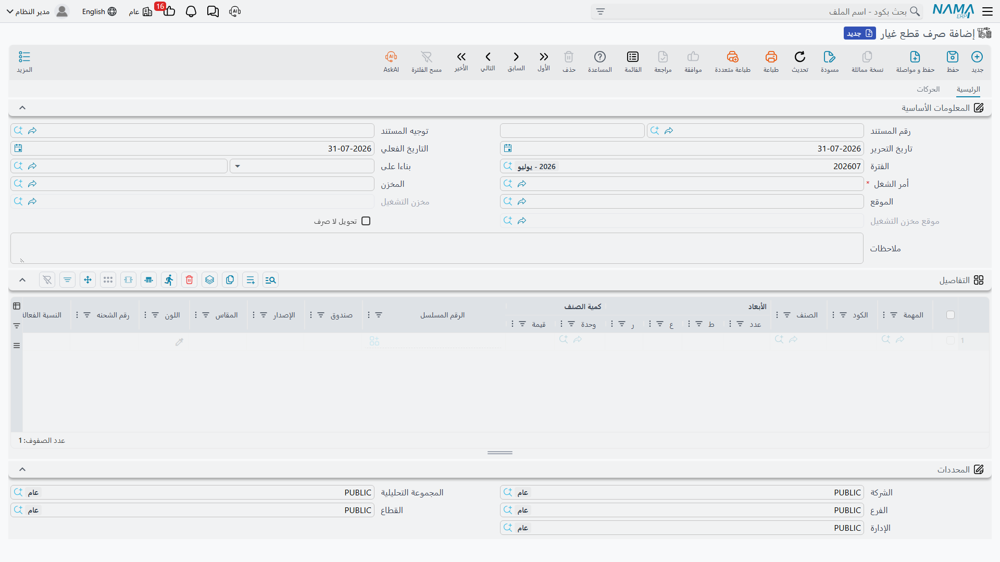

# صرف قطع الغيار

**صرف قطع غيار** هو المستند الذي يحرره أمين المخزن حين تخرج القطع من المخزن إلى سيارة. وهو أكثر
مستندات الورشة حركة، وأكثرها أثراً — من أي مستند آخر — في صحة تكلفة العمل وصحة فاتورة العميل.

تجده في **مركز خدمة > المستندات > Spare Parts Issue**.

::: info الترخيص المطلوب
`srvcenter`
:::

::: tip عنوان الشاشة عربي حتى في الجلسة الإنجليزية
هذا المستند — مثل الإرتجاع والطلب والإصلاح الخارجي — ليس له اسم إنجليزي مسجَّل، فتعرض ترويسة الشاشة
**صرف قطع غيار** بأي لغة عملت. أما مدخل القائمة فبالإنجليزية. ولا خلل في منشأتك.
:::

## الشاشة

تحمل **المعلومات الأساسية** دفتر المستند وكوده و**توجيه المستند** وتاريخي الإصدار والقيمة والفترة
المالية و**بناءا على**، ثم الحقول التي يدور عليها العمل:

| الحقل | ما هو |
|---|---|
| **أمر الشغل** | مطلوب. وكل ما في المستند معلَّق عليه. |
| **المخزن** و**الموقع** | **تكتبهما بنفسك** — المخزن الذي تخرج منه القطع. يُنزَّلان على السطور، ولكل سطر أن يتجاوزهما. |
| **مخزن التشغيل** و**موقع مخزن التشغيل** | غير قابلين للتعديل، منسوخان من أمر الشغل. ولا يُستعملان إلا في وضع التحويل. |
| **تحويل لا صرف** | غير قابل للتعديل، منسوخ من توجيه المستند. وهو الذي يقرر أي الوضعين أدناه أنت فيه. |

أما جدول **التفاصيل** فسطر سلسلة توريد كامل: **المهمة**، وكود الصنف والصنف، والكمية ووحدة القياس،
ومحددات الصنف نفسه (الرقم المسلسل، اللوط، المقاس، اللون، الإصدار، تاريخا الإنتاج والصلاحية)، وعمود
**السياره**، ومخزن وموقع على مستوى السطر، ومرفق، والعمودان اللذان تعود إليهما هذه الصفحة مراراً:
**سعر الوحدة** والسعر الإجمالي الناتج.

وتحمل صفحة **الحركات** قائمتين للعرض فقط: **تحويلات مخزنية** و**سندات صرف مخزني** المولَّدة من هذا
المستند. وهناك تتأكد من أن القطع تحركت فعلاً.

## تعبئة المستند

**اختيار [أمر الشغل](/ar/modules/servicecenter/job-cycle/servicecenter-job-order.md) ينسخ مواده
المخططة** سطراً سطراً، بالصنف والكمية وسعر الوحدة المخطط. وهذا هو
المسار المعتاد، وهو الذي يبقي الأسعار صحيحة. وإن فضّلت ورشتك أن تبدأ بجدول فارغ، فخيار التوجيه **عدم
نسخ التفاصيل من أمر الشغل** يوقف النسخ.

**واختيار مهمة في سطر يفرد قائمة مواد تلك المهمة.** فيختفي السطر الذي كنت تحرره ويحل محله سطر لكل
مادة تستهلكها المهمة، مفلترة على ماركة المركبة وموديلها. وهو أمر مريح — وهو الموضع الوحيد في هذه
الشاشة الذي يجب أن تراجع فيه عملك:

::: danger القطع المضافة بفرد المهمة تأتي بلا سعر
السطور التي ينشئها اختيار المهمة تحمل الصنف والمهمة والكمية — و**لا تحمل سعر وحدة**. ولأن كتابة
السعر إلى أمر الشغل لا تملأ إلا سعراً ما يزال صفراً، فإن القطعة صفرية السعر تبقى صفراً إلى النهاية:
صفر في أمر الشغل، وصفر في الإغلاق، و**صفر في فاتورة العميل**. تُعطى القطعة مجاناً ولا يُنبَّه أحد.

فبعد فرد المهمة اكتب سعر الوحدة في كل سطر أنتجته، قبل الاعتماد.
:::

ولا تعرض قائمة **المهمة** في السطر إلا المهام الموجودة في أمر الشغل، ولا يعرض حقل **بناءا على** إلا
أوامر الشغل التي حالتها *تحت التنفيذ* أو *لم يبدأ*.

## وضعان: صرف، أو تحويل إلى مخزن التشغيل

يقرر **تحويل لا صرف** في
[توجيه المستند](/ar/modules/servicecenter/document-terms/servicecenter-terms-workshop.md) أي الوضعين
أنت فيه، ويُنسخ إلى الترويسة حيث تراه.

**وضع الصرف (الافتراضي).** يولّد الاعتماد **سند صرف مخزني** من مخزن السطر بدفتر وتوجيه الإنشاء
المحددين في التوجيه. وذلك السند هو الذي ينشئ طلب الأعمال المخزني ويخفّض الكمية ويسجّل قيد تكلفة
المبيعات بحسابات توجيهه هو. وفي المثال المرجعي يولّد مستند الصرف `SCRMI-2026-1902` سندَ الصرف
المخزني `STI-2026-1188` من `WH-PARTS`.

**وضع التحويل.** يولّد الاعتماد **سند تحويل مخزني** بدل ذلك، بـ **دفتر التحويل** و**توجيه التحويل**،
ناقلاً القطع من مخزنك وموقعك إلى مخزن التشغيل الخاص بأمر الشغل — `WH-WIP` / `WIP-01` في شركة
الصحراء. فتبقى القطع في المخزون وقد انتقلت إلى أرض الورشة. استعمل هذا حين تريد رؤية العمل تحت
التشغيل مخزوناً، وتذكّر أن الواجب ملؤه في هذا الوضع هو دفتر وتوجيه **التحويل** لا زوج الإنشاء.

::: warning إن كان الدفتر أو التوجيه فارغاً فلا شيء يتحرك
في أي من الوضعين، الدفتر الفارغ أو التوجيه الفارغ يعني أنه **لم يُولَّد سند مخزني إطلاقاً** — ويُحذف
أي سند سبق توليده. ومع ذلك يُعتمد مستند الصرف ويُسعّر ويكتب جدول قطع الغيار ويغذّي الفاتورة. غاية
الأمر أن القطع لا تغادر المخزن مخزنياً.

وإلغاء التأشير على *أنشاء مستندات تلقائيا* **لا** يوقف التوليد في هذا المستند؛ فهو مُهمَل هنا.
وإفراغ الدفتر أو التوجيه هو وسيلة التحكم الوحيدة.
:::

::: tip مخازن مختلفة، سندات صرف عدة
تُجمَّع السندات المولَّدة بحسب مخزن **السطر**. فإن سحبت بعض السطور من `WH-PARTS` وأخرى من مخزن ثانٍ،
أنتج مستند صرف واحد **أكثر من** سند صرف مخزني. وكلاهما يظهر في صفحة الحركات، وكلٌّ منهما ينشئ قيده
منفصلاً.
:::

## ماذا يفعل السعر في السطر

سعر الوحدة في سطر الصرف **ليس تكلفة**. هو السعر الذي سيُحاسَب عليه العميل، ويُكتب بعد الاعتماد إلى
أمر الشغل:

- لكل سطر مصروف يُبحث عن سطر المواد المطابق في أمر الشغل بالمهمة والصنف، و**إن كان سعر وحدته ما يزال
  صفراً وُضع فيه سعر سطر الصرف**. أما السعر المخطط في أمر الشغل فلا يُستبدل أبداً — الخطة تغلب.
- وحين يكون توجيه أمر الشغل مشغَّلاً عليه خيار **إضافة مهام قطع غيار لأمر الشغل من سندات خارجيه**،
  يُعاد **بناء** جدول مواد أمر الشغل كله من جدول قطع الغيار النظامي بدلاً من ذلك: كمية صافية لكل
  صنف، وسعر وحدة من الجدول، وقيمة معاد حسابها. وخيار التوجيه **فرد كميات الأصناف في السطور في حالة
  تم صرفها في أكثر من سند صرف قطع غيار** يحوّل ذلك البناء من سطر مجمَّع لكل صنف إلى سطر لكل سطر صرف.

::: warning إعادة البناء تصفّر توزيع الجهات الدافعة
حين يُعاد بناء جدول المواد من مستندات الصرف، يعود كل سطر مبنيّ وقيم **العميل والتأمين والضمان
والشركة فيه أصفار**. وفي عمل مثل `SCJO-2026-0417`، حيث الكمبروسر ضمان 100 % وطقم التيل مقسوم
50/50، يجب إعادة إدخال ذلك
[التوزيع](/ar/modules/servicecenter/job-cycle/servicecenter-payer-split.md) في أمر الشغل بعد صرف
القطع وقبل [الإغلاق](/ar/modules/servicecenter/job-cycle/servicecenter-job-order-closing.md). افتح
أمر الشغل وراجع الأعمدة الأربعة قبل أن تُغلق.
:::

::: warning الصنف نفسه مصروف مرتين بسعرين
يحتفظ جدول قطع الغيار بسعر وحدة **واحد** لكل صنف، ويُستبدل بكل سطر صرف يُعالَج — فالأخير يغلب، بلا
ترتيب معلوم. اصرف خمسة لترات زيت بـ 32 ولتراً سادساً بـ 35، فالسعر الذي يصل أمر الشغل هو أيّهما
عولج أخيراً، لا المتوسط. فإما أن تلتزم سعراً واحداً للصنف في العمل الواحد، وإما أن تشغّل خيار فرد
الكميات ليحتفظ كل صرف بسطره وسعره.
:::

## ما الذي يُرفض

يُرفض صرف قطع الغيار إذا كان أمر الشغل **مغلقاً** أو **ملغياً**، أو إذا صدرت له فاتورة عميل أو تأمين
أو ضمان — *«صدرت فاتورة أو أكثر لأمر الشغل»*. وفي ظل نظام الخطة يُرفض كذلك السطر بلا مهمة، أو الصنف
غير المخطط لتلك المهمة، أو الكمية التي تتجاوز بالتراكم الخطةَ. وهذه الفحوص موصوفة في
[صفحة قطع الغيار في أمر الشغل](/ar/modules/servicecenter/spare-parts/servicecenter-spare-parts-overview.md).

::: warning الحذف غير محمي في هذا المستند
يمكن حذف مستند صرف قطع غيار **معتمد** حتى بعد إغلاق أمر شغله وفوترته — فالفحص الذي يمنع ذلك في مستند
الإرتجاع مُلغى هنا. وحذف مستند صرف يغيّر بصمت تكلفة عمل سبق أن فُوتر.

فاحصر صلاحية حذف صرف قطع الغيار في عدد قليل من المشرفين، وصحّح الأخطاء
بـ[إرتجاع](/ar/modules/servicecenter/spare-parts/servicecenter-spare-parts-return.md) لا بحذف.
:::

## المحاسبة

مستند صرف قطع الغيار نفسه **لا ينشئ قيداً** ما لم تُعدّ عمداً جانبيه المدين والدائن في توجيهه.
واتركهما فارغين — وهو الإعداد المعتاد — فيكون القيد الوحيد في السلسلة كلها هو الذي ينشئه **سند الصرف
المخزني المولَّد** بتوجيهه هو: مخزون يخرج بتكلفة الصنف، وتكلفة مبيعات تُحمَّل. أما إيراد العميل
فيأتي لاحقاً من الفواتير الصادرة بعد إغلاق أمر الشغل.
