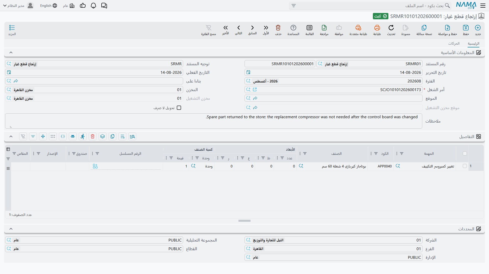

# إرتجاع قطع الغيار

ليس كل ما يصرفه المخزن يُستعمل. يخرج أمين المخزن ستة لترات زيت مع طقم الصيانة فيأخذ المحرك خمسة؛
ويتبين أن الجوان غير مطابق؛ وتُصرف قطعة لعمل يرفضه العميل بعد ذلك. و**إرتجاع قطع غيار** هو الطريق
الذي تعود منه تلك القطع — خارج العمل، وخارج فاتورة العميل، وداخل المخزون.

تجده في **مركز خدمة > المستندات > Spare Parts Return**.

::: info الترخيص المطلوب
`srvcenter`
:::

## الشاشة، وما الذي يفعله الاعتماد

الإرتجاع صورة مقابلة
لـ[مستند الصرف](/ar/modules/servicecenter/spare-parts/servicecenter-spare-parts-issue.md)، والشاشة
تقول ذلك: **أمر الشغل** نفسه، والمخزن والموقع نفسهما،
ومخزن التشغيل غير القابل للتعديل ومؤشر *تحويل لا صرف* منسوخين من التوجيه، وجدول التفاصيل نفسه بعموده
**المهمة** والصنف. وتعرض صفحة **الحركات** فيه تحويلاته المخزنية المولَّدة.

والاعتماد يفعل ثلاثة أشياء:

1. **يولّد السند الذي يحرّك القطع فعلاً** — **سند توريد مخزني** إلى مخزن السطر في الوضع العادي، أو
   **سند تحويل مخزني** من مخزن التشغيل الخاص بأمر الشغل إلى مخزنك حين يقول
   [التوجيه](/ar/modules/servicecenter/document-terms/servicecenter-terms-workshop.md)
   *تحويل لا صرف*.
   وكما في الصرف، الدفتر الفارغ أو التوجيه الفارغ يعني أن **شيئاً لا يتحرك إطلاقاً**، وإلغاء التأشير
   على *أنشاء مستندات تلقائيا* لا يوقفه — إفراغ الدفتر أو التوجيه هو التحكم الوحيد.
2. **يخصم في جدول قطع الغيار النظامي**: الكمية المصروفة لذلك الصنف في أمر الشغل ناقص ما عاد.
3. **يحدّث جدول مواد أمر الشغل**، فيفوتر الإغلاق والفواتير الكميةَ الصافية.

وفي عمل شركة الصحراء `SCJO-2026-0417` يعيد الإرتجاع `SRMR-2026-0344` لتراً واحداً من
`SP-OIL-5W30` في **سطر واحد**. ستة لترات مصروفة، ولتر مرتجع، وخمسة مستهلكة، ويُحاسَب العميل على
5 × 32 = 160.

## سطر إرتجاع واحد لكل صنف — ومستند إرتجاع واحد في كل مرة

::: danger سطر الإرتجاع الثاني للصنف نفسه يضيع
يجمع جدول قطع الغيار الكميات المصروفة تجميعاً صحيحاً، لكنه **لا يجمع الكميات المرتجعة**. فحين يُرتجع
الصنف نفسه في أكثر من سطر، أو في أكثر من مستند إرتجاع لأمر الشغل نفسه، لا يُحسب إلا **آخر** ما
عولج. وكل إرتجاع سابق لذلك الصنف يُهمَل بصمت.

والنتيجة مال. فيظل [أمر الشغل](/ar/modules/servicecenter/job-cycle/servicecenter-job-order.md) يُظهر
القطع مستهلكة، ويوزّعها
[الإغلاق](/ar/modules/servicecenter/job-cycle/servicecenter-job-order-closing.md) على الجهات الدافعة،
و**يُفوتَر العميل بقطع هي فعلياً على الرف**. ولا شيء ينبّه أحداً، والمخزون سليم — الخطأ في الفاتورة
وحدها — فلن يكتشفه الجرد أيضاً.

**القاعدة التي يُعمل بها:**

- سطر واحد لكل صنف في الإرتجاع — إن عاد لتران فأرجِعهما في سطر واحد بكمية 2، لا في سطرين بكمية 1؛
- مستند إرتجاع مفتوح واحد لأمر الشغل في كل مرة — وإن لزم إرتجاع ثانٍ للصنف نفسه فعدّل المستند القائم
  بدل تحرير مستند جديد؛
- وقبل فوترة عمل جرت فيه إرتجاعات، افتح أمر الشغل وطابق كميات المواد على ما عاد فعلياً.

وهذا يسري على الإرتجاع في الوضع العادي (سند التوريد المخزني). أما مسار *تحويل لا صرف* فيجمع تجميعاً
صحيحاً.
:::

::: warning إلغاء الإرتجاع يترك أمر الشغل قديماً
إلغاء الإرتجاع أو إلغاء اعتماده يعيد حساب جدول قطع الغيار حساباً صحيحاً، لكنه — على خلاف الصرف —
**لا** يحدّث جدول مواد أمر الشغل. ومع توجيه أمر الشغل المهيأ لقبول المواد من مستندات أخرى، يظل الجدول
يعرض الكمية **المخفَّضة** بعد الإرتجاع رغم إلغائه، فيُفوتَر العميل بأقل من حقه.

فبعد إلغاء إرتجاع، افتح أمر الشغل واحفظه من جديد قبل الإغلاق أو الفوترة. تلك الحفظة وحدها تعيد بناء
الجدول من الجدول النظامي وتعيد الكمية.
:::

## أين يقابل الإرتجاع الصرف وأين لا يقابله

| | الصرف | الإرتجاع |
|---|---|---|
| السند المولَّد المحرِّك للمخزون | صرف مخزني، أو تحويل إلى مخزن التشغيل | توريد مخزني، أو تحويل عكسي |
| تحديث جدول قطع الغيار عند الاعتماد | نعم | نعم |
| تجميع عدة سطور للصنف نفسه | نعم | **لا — انظر التحذير أعلاه** |
| تحديث جدول مواد أمر الشغل عند الاعتماد | نعم | نعم |
| تحديث جدول مواد أمر الشغل عند **الإلغاء** | نعم | **لا — انظر التحذير أعلاه** |
| كتابة سعر إلى أمر الشغل | نعم، حين لا تحمل الخطة سعراً | لا — وهو الصواب؛ الإرتجاع لا ينبغي أن يحدد سعراً |
| احتسابه في حدّ «المصروف يتجاوز المخطط» | يُضاف | يُخصم |
| منع الحذف بعد إغلاق أمر الشغل أو فوترته | لا | **نعم** |

ويستحق السطر الأخير قراءتين، لأنه عكس ما يتوقعه الناس: الإرتجاع هو المستند **المحمي**. فبعد إغلاق
أمر الشغل أو فوترته لا يمكن حذف إرتجاع معتمد — بينما يمكن حذف صرف معتمد.

## الأسعار، وما لا يمسّه الإرتجاع

يحمل الإرتجاع أعمدة السعر نفسها، والصواب تركها وشأنها. فلا شيء في الإرتجاع يكتب سعراً إلى أمر الشغل
— والقيمة التي تُخصم من العميل هي ببساطة سعر الوحدة المخطط مضروباً في الكمية الأصغر.

كذلك لا ينشئ الإرتجاع قيداً خاصاً به افتراضياً. والقيد المحاسبي الوحيد في السلسلة هو الذي ينشئه
**سند التوريد المخزني المولَّد** بتوجيهه هو: الصنف يعود إلى المخزون بتكلفته، وتُخفَّض تكلفة المبيعات
بالقدر نفسه.

## قبل فوترة عمل جرت فيه إرتجاعات

ثلاث مراجعات، بهذا الترتيب، على أي أمر شغل عادت فيه قطع:

1. افتح صفحة **الحركات** في الإرتجاع وتأكد من وجود سند التوريد (أو التحويل) فعلاً.
2. افتح جدول مواد أمر الشغل وتأكد من مطابقة الكميات لما استُهلك فعلياً — خمسة لترات لا ستة.
3. تأكد من أن
   [توزيع العميل والتأمين والضمان والشركة](/ar/modules/servicecenter/job-cycle/servicecenter-payer-split.md)
   ما يزال متسقاً في كل سطر مادة، فالجدول المعاد بناؤه يعود وأعمدته الأربعة أصفار.

ثم أغلِق وفوتر.
