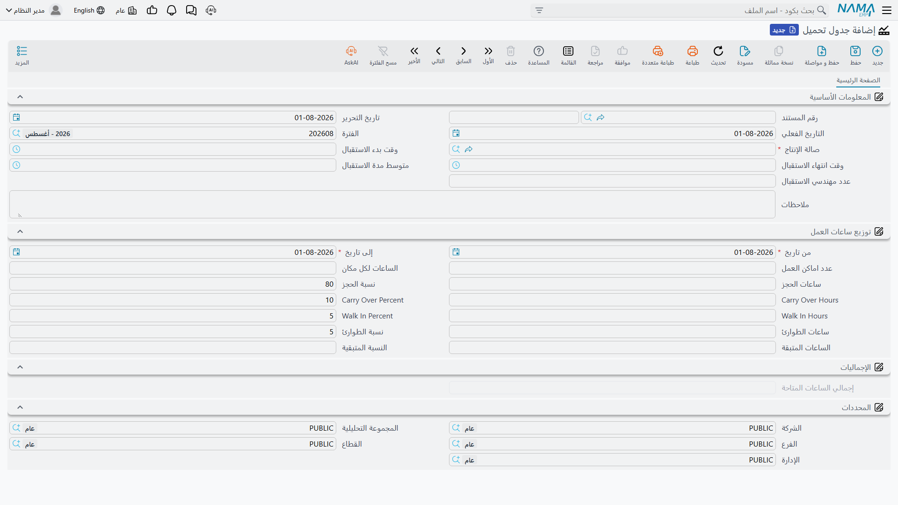

# جدول التحميل

في اليوم عدد محدود من الساعات، وليست كلها متاحة لمن يردّ على الهاتف. فبعض عمل الأمس ما يزال على
الرافعات، وأحدهم سيأتي بلا موعد، وشيء ما سيصل على ونش في الرابعة عصراً. وإذا بيع اليوم كله حجوزاً
صارت هذه السيارات الثلاث مشكلة.

و**جدول التحميل** هو الموضع الذي تكتب فيه هذا التقدير: يأخذ إجمالي الساعات المتاحة
لـ[صالة إنتاج](/ar/modules/servicecenter/workshop-setup/servicecenter-work-centers.md) في
مدى تواريخ، ويقسمها بين الحجوزات والعمل المُرحَّل والزيارات بلا موعد والطوارئ. تجده في
**مركز خدمة > الإعدادات > Loading Table**.

::: info الترخيص المطلوب
`srvcenter`
:::

وهو مستند، فيحتاج إلى **دفتر مستندات** — لكنه على غير العادة لا يحتاج إلى
[توجيه](/ar/modules/servicecenter/document-terms/servicecenter-terms-basics.md) إطلاقاً.

## ما يحمله الجدول

تحمل مجموعة المعلومات الأساسية كود المستند وتاريخي الإصدار والقيمة والفترة المالية و**صالة الإنتاج**
(مطلوبة) ونافذة الاستقبال وعدد مهندسي الاستقبال المنسوخة من تلك الصالة، والملاحظات. وتحتها الورقة
نفسها: **من تاريخ** و**إلى تاريخ**، وعدد أماكن العمل والساعات لكل مكان، ثم الأوعية الأربعة — كل وعاء
زوجٌ من الساعات والنسبة — ويليها زوج «المتبقي». أما **إجمالي الساعات المتاحة** فمحسوب وغير قابل
للتعديل.

واختيار صالة الإنتاج يكتب معظم ذلك عنك: تُنسخ أوقات استقبالها وعدد مهندسيها وعدد أماكن العمل
والساعات لكل مكان، ويُحسب إجمالي الساعات المتاحة = عدد الأماكن × ساعات المكان، وتُحوَّل النسب الأربع
— المبذورة من [إعدادات مركز الخدمة](/ar/modules/servicecenter/servicecenter-configuration.md) عند
80 / 10 / 5 / 5 — إلى ساعات. وبعدها تعيد كتابةُ قيمة ساعات
حسابَ نسبتها، وتعيد كتابةُ نسبة حسابَ ساعاتها.

وصالة الميكانيكا `WC-MECH` في شركة الصحراء فيها 5 أماكن عمل بثماني ساعات، فتقرأ ورقتها للفترة
1–31 مارس 2026 هكذا:

| الوعاء | النسبة | الساعات |
|---|---|---|
| ساعات الحجز | 80 % | **32** |
| Carry Over Hours | 10 % | 4 |
| Walk In Hours | 5 % | 2 |
| ساعات الطوارئ | 5 % | 2 |
| الساعات المتبقة | 0 % | 0 |
| **إجمالي الساعات المتاحة** | | **40** |

::: tip أربع تسميات إنجليزية في شاشة عربية
زوجا *Carry Over* و*Walk In* ليست لهما ترجمة عربية مسجّلة، فيظهران بتسميتهما الإنجليزية حتى في
الجلسة العربية. وقد نُقلا أعلاه كما يظهران على الشاشة تماماً.
:::

## ما الذي يُفرَض فعلاً — وعاء واحد، وأحياناً

اعتماد الورقة يكتب سطر طاقة لكل يوم تقويمي في المدى، يحمل **ساعات الحجز** لذلك اليوم وعدد المهندسين
ونافذة الاستقبال.

ومنذ تلك اللحظة يفعل
**[طلب الخدمة](/ar/modules/servicecenter/job-cycle/servicecenter-service-request.md)** — وهو مستند
الحجز — شيئين تجاه تلك السطور: يضيف ساعاته إلى
الساعات المحجوزة في اليوم، ويرفض الحجز الذي يتجاوز باليوم **مخصص الحجوزات**، إلا أن يكون نوع الزيارة
مؤشَّراً عليه بالسماح دائماً. ويرفض كذلك وقت حجز خارج نافذة الاستقبال.

هذا هو كامل سطح الإلزام. أما **ساعات العمل المُرحَّل والزيارات بلا موعد والطوارئ والمتبقي فتُسجَّل
وتُعرض ولا يقرؤها شيء.** هي معلومات تخطيطية: بيان نيّة لمن يديرون الورشة، لا قاعدة يطبّقها النظام.
فلا أحد يُمنع من الحجز داخل ساعات العمل المُرحَّل، ولا تُحسب زيارة بلا موعد على شيء.

وهذا استعمال معقول تماماً للورقة — ما دمت تعرف أنه ما تفعله. انشرها واطبعها، واستعمل رقم الحجوزات
عدداً يجوز للاستقبال بيعه، وعامِل الثلاثة الأخرى بوصفها موازنة الورشة الداخلية.

::: danger انشر جداول التحميل لصالة إنتاج واحدة فقط
سطور طاقة اليوم التي يكتبها هذا المستند مفتاحها **التاريخ وحده** — فصالة الإنتاج ليست جزءاً من
المفتاح، ولا هي جزء من الاستعلام الذي يبحث عنها.

وفي منشأة فيها صالتان أو أكثر يصير هذا مدمّراً: اعتماد ورقة لصالة الميكانيكا **يطمس طاقة أيام صالة
السمكرة والدهان**، وقد يُفحص حجزٌ لأي منهما مقابل الورقة التي تصادف أنها تغطي ذلك اليوم. فالأرقام
التي يراها الاستقبال قد تخص ورشة أخرى بالكامل.

وإلى أن يُعالج ذلك، انشر جداول التحميل لصالة إنتاج **واحدة**. وإن كان عندك أكثر من صالة فأدر طاقة
البقية خارج النظام بدل نشر ورقة ثانية.
:::

::: danger الورقة لا تتحقق من شيء
الفحصان اللذان يبدو أن الشاشة تجريهما لا يرفضان شيئاً في الحقيقة:

- **الأوراق المكررة تُحفظ بصمت.** جدولا تحميل لصالة الإنتاج نفسها ومدى التواريخ نفسه يُقبلان معاً،
  ويكتب كلاهما على الأيام ذاتها. فاحتفظ بسجلك الخاص لأي ورقة تغطي أي فترة، واحذف بدل أن تعيد الإصدار.
- **نافذة استقبال مقلوبة تُحفظ بصمت.** وقت انتهاء استقبال أسبق من وقت البداية مقبول، ثم يُختم على كل
  يوم في المدى — وبعدها يصير كل حجز خارج النافذة فيُرفض، دون شيء على الشاشة يفسّر السبب.

اقرأ الورقة بعد حفظها قبل أن تعتمد عليها.
:::

::: warning أول حجز في اليوم لا يُفحَص أبداً
لا يعمل فحص الطاقة إلا حين يكون لليوم حجز **قائم بالفعل**. أما أول موعد في أي يوم فيُقبل مهما كان
حجمه — حجز واحد بخمسمائة ساعة على يوم سعته أربعون يمرّ دون اعتراض، ولا يُرفض إلا الحجز **الثاني** من
ذلك اليوم. فتعامَل مع الفحص على أنه شبكة أمان ليوم مزدحم، لا ضمان.
:::

## أبقِ الأوعية الأربعة عند 100 %

زوج **الساعات المتبقة** و**النسبة المتبقية** لا معنى له إلا ما دامت الأوعية الأربعة تبلغ 100 % أو أقل
— كما في الجدول أعلاه حيث لا يفيض شيء.

ولا شيء يمنعك من تخصيص أكثر من 100 %، وإن فعلت توقفت الشاشة والسجل المحفوظ عن الاتفاق: فقد يعود
المتبقي أكبر من إجمالي الساعات المتاحة، والنسبة المتبقية أكبر من مئة. وهذه علامة على أن الورقة
مُفرَطة التخصيص، لا رقم طاقة فائضة تبني عليه. عدّل الأوعية حتى تبلغ مئة واحفظ من جديد.

## الأثر

جدول التحميل لا يحرّك مخزوناً ولا ينشئ قيداً محاسبياً. وأثره الوحيد هو سطور طاقة الأيام الموصوفة
أعلاه — ولهذا أيضاً يكون حذف ورقة أو إعادة إصدارها عملاً يُقدَم عليه عن قصد، وعين على الأيام التي
تغطيها.
