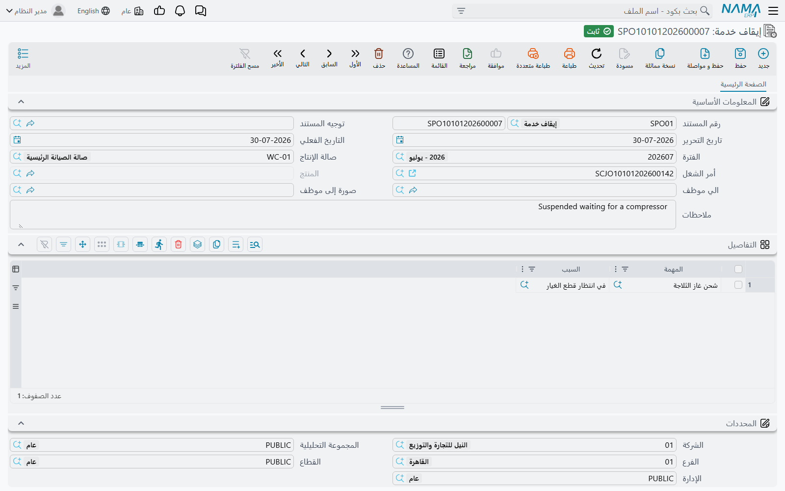
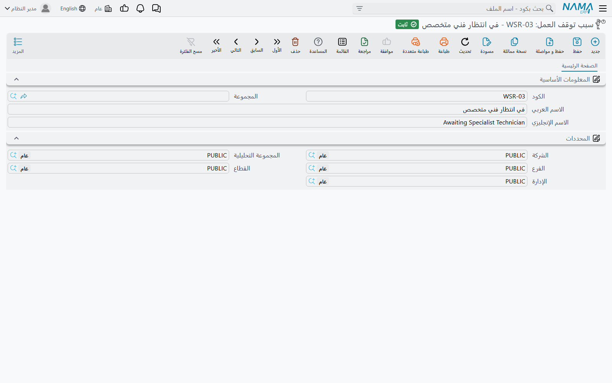

# إيقاف واستكمال الخدمة

يتوقف العمل لأسباب لا علاقة للفني بها. الكمبروسر غير متوفر وطُلب من المورد. العميل لم يوافق بعد على
الـ 1,850 الإضافية. السيارة تنتظر قرار شركة التأمين. المكان مطلوب لعمل ضمان وصل على ونش.

ولهذا تحديداً يعطيك نظام نما مستندين متقابلين: **إيقاف خدمة** يضع مهاماً بعينها على الانتظار مع بيان
السبب، و**إستكمال خدمة** يعيدها إلى العمل. وكلاهما تحت **مركز خدمة > المستندات**.

::: info الترخيص المطلوب
`srvcenter`
:::

## ما هو الإيقاف — وما ليس هو

الإيقاف **علامة حالة مصحوبة بسبب**. هذا كل ما فيه.

فهو لا يسجّل **أي ختم وقت**. ليس في المستندين حقل «أُوقف في» ولا «استُؤنف في»، ولا يوجد في سطر التنفيذ
ما يمكن أن يحمل مثل ذلك. ومن ثَمّ فالإيقاف **لا يقصّر الوقت المسجَّل** في سطر
[تنفيذ أمر الشغل](/ar/modules/servicecenter/workshop-execution/servicecenter-production-execution.md)
— فذلك الوقت يظل هو الفرق المجرد بين ختم بداية الفني وختم نهايته — و**لا يغيّر المبلغ المحاسَب عليه**،
لأن الفوترة لا تستعمل الوقت المقيس أصلاً، بل الساعات المعيارية من
[كتالوج المهام](/ar/modules/servicecenter/workshop-setup/servicecenter-tasks.md).

فإذا بدأ تركي عمل كمبروسر التكييف الساعة 08:30 من يوم 4 مارس، وأُوقف العمل ساعتين بحثاً عن قطعة، ثم
أنهاه الساعة 12:10، فإن السطر يقرأ 3:40 صافياً كأن شيئاً لم يكن، ويُحاسَب العميل على 3.0 ساعات
الكتالوج كأن شيئاً لم يكن.

الذي يعطيك إياه الإيقاف هو **السجل**: هذا الأمر توقف، وهذا سببه، وهذا موعد إعادته إلى العمل. وهو سجل
يستحق الاقتناء: به يتحول كلام «الورشة بطيئة» إلى «أحد عشر أمراً توقفت الشهر الماضي في انتظار قطع
غيار»، وبه يمتنع إغلاق أمر متعثر وفوترته سهواً.

## أسباب توقف العمل

قبل أن توقف شيئاً تحتاج إلى سبب تشير إليه. ملف **سبب توقف العمل** يقع تحت **مركز خدمة > الإعدادات**،
وهو من أصغر الملفات الرئيسية: كود واسم عربي واسم إنجليزي ومحددات. ولا يحمل أي سلوك على الإطلاق؛
واستعماله الوحيد في الوحدة كلها هو عمود *السبب* في سطر مستند الإيقاف.

اجعل القائمة قصيرة وتحليلية، فهي الشيء الوحيد الذي ستستطيع تجميع حالات التوقف عليه. وتعمل شركة
الصحراء بستة أسباب: *في انتظار قطع غيار*، و*في انتظار موافقة العميل*، و*في انتظار موافقة التأمين*،
و*مُرسل لإصلاح خارجي*، و*في انتظار مكان عمل*، و*نُقل الفني*.

## إيقاف العمل

ترويسة مستند الإيقاف تحمل دفتر المستند وكوده والتواريخ والفترة المالية، و**صالة الإنتاج**، و**أمر
الشغل**، و**المنتج** أي المركبة، وحقلَي **الي موظف** و**صورة إلى موظف** لمن ينبغي إبلاغه، والملاحظات.
أما الجدول فله عمودان اثنان لا غير: **المهمة** و**السبب**.

والشاشة ضيقة عمداً فيما تسمح لك به:

1. اختر **أمر الشغل**. القائمة لا تعرض إلا الأوامر التي حالتها *تحت التنفيذ*، ويمكن حصرها أكثر
   بصالة الإنتاج التي سمّيتها.
2. يمتلئ **المنتج** تلقائياً، ويمتلئ الجدول بـ **كل مهام ذلك الأمر التي حالتها تحت التنفيذ**.
3. **احذف السطور التي لا توقفها**، واختر سبباً لكل سطر يبقى. لا تستطيع كتابة مهمة بنفسك ولا تغيير
   المركبة — فكلاهما غير قابل للتعديل، وهذا مقصود. أنت هنا تختار من عمل الأمر القائم، لا تصف عملاً
   جديداً.
4. استعمل **ملاحظات** الترويسة للتفصيل: أي قطعة مطلوبة، من أي مورد، بأي رقم مطالبة. فلا يوجد حقل في
   السطر لذلك، وملف الأسباب أخشن من أن يحمله.
5. اعتمد المستند.

والاعتماد يفعل أربعة أشياء: تنتقل كل مهمة مسمّاة في أمر الشغل إلى **موقوفة**؛ وينتقل معها كل سطر
تنفيذ سبق تسجيله لتلك المهمة في ذلك الأمر؛ ويُكتب قيد حالة لأمر الشغل، وهو الذي يعيد اشتقاق **حالة
ترويسة الأمر** نفسه؛ ويُضاف قيد حالة للمركبة.

ويُرفض الإيقاف إذا كان
[أمر الشغل](/ar/modules/servicecenter/job-cycle/servicecenter-job-order.md) **مغلقاً** أو
**ملغياً**، وكذلك — وهذه هي التي تفاجئ الناس — إذا كانت
قد صدرت له **أي فاتورة عميل أو تأمين أو ضمان**. فالأمر الذي فُوتر انتهى أمره، مهما قالت مهامه.

::: tip الأمر الموقوف لا يُغلق
ما لم يكن توجيه مستند الإغلاق مهيأً للسماح بالأوامر الموقوفة، فإن أمر الشغل القابع في حالة *موقوف*
يُرفض من [إغلاق أمر الشغل](/ar/modules/servicecenter/job-cycle/servicecenter-job-order-closing.md).
وهذا هو النصف المفيد من الميزة: السيارة التي توقف عملها فعلاً لا يمكن أن
تُغلق وتُفوتر بهدوء.
:::

## استكمال العمل

**إستكمال خدمة** هو الصورة المقابلة، بحقل ترويسة إضافي واحد: **مستند إيقاف الخدمة**، وهو مطلوب. فأنت
لا تستكمل أمر شغل، بل تستكمل إيقافاً بعينه.

اختر مستند الإيقاف، فتمتلئ المركبة وأمر الشغل وصالة الإنتاج منه — بل تُكتب منه في كل حفظ، فلا شيء
لتصححه — ويمتلئ الجدول مسبقاً بسطر لكل مهمة في ذلك الإيقاف **لم تُستكمل بعد**. وعموده الوحيد،
*المهمة*، غير قابل للتعديل للسبب نفسه: لك أن تحذف سطوراً لا أن تخترعها. احذف المهام التي ما تزال
منتظرة، وأبقِ العائدة إلى العمل، واعتمد.

ويعيد الاعتماد سطور مهام أمر الشغل المطابقة وسطور تنفيذها إلى **تحت التنفيذ**، ويؤشر على تلك السطور
في مستند الإيقاف بأنها استُكملت فلا تُعرض ثانية، ويكتب قيود الحالة التي تعيد الأمر والمركبة.

وإلغاء أي من المستندين يعكس بالضبط ما فعله: الإيقاف الملغى يعيد المهام إلى ما كانت عليه، والاستكمال
الملغى يعيد إيقافها.

::: tip استكمل قبل أن تسجّل الوقت
الأمر الذي حالته *موقوف* لا يجمعه زر *تجميع أوامر الشغل* في مستند التنفيذ، مهما أجبت عن سؤاله عن
الأوامر المؤجلة. فإذا لم يجد الفني أمر شغل السيارة في شاشة أرض الورشة، فأول ما يُتحقق منه هو هل ما
يزال موقوفاً.
:::

## المستندان في جملة لكلٍّ منهما

لا يحرّك أي منهما مخزوناً، ولا ينشئ قيداً محاسبياً، ولا يولّد أي مستند آخر. وكلاهما ينتمي إلى عائلة
[توجيهات مستندات الورشة](/ar/modules/servicecenter/document-terms/servicecenter-terms-workshop.md)
ويعرض حقل **توجيه المستند** وهو في الحقيقة لا يطلبه — فلك أن تتركه فارغاً ويُحفظ المستند ويعمل.

::: warning نقولها ثانية، لأنها السؤال الذي يُسأل
إيقاف العمل **لا يسجّل وقتاً**. لا يوقف الساعة في سطر التنفيذ، ولا يطرح شيئاً من ساعات الفني المسجلة،
ولا يخفّض ما يدفعه العميل. إنما يؤشر على المهام — وعلى الأمر — بأنها متوقفة، ويقول لماذا، ويمنع
الإغلاق. لا أكثر.
:::
