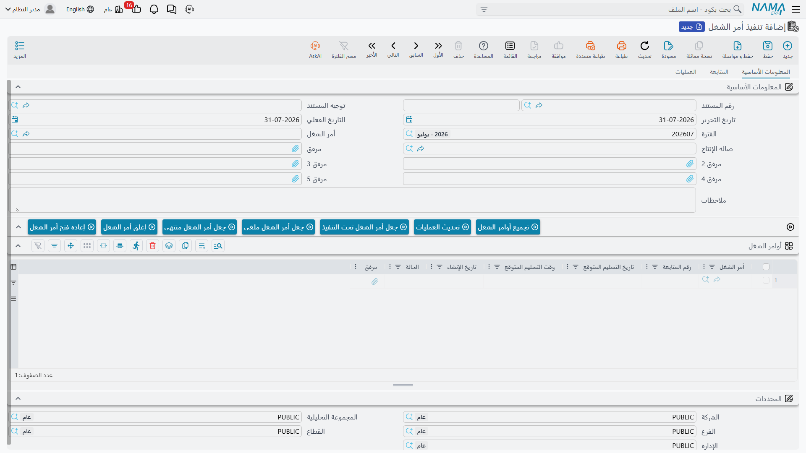

# تنفيذ أمر الشغل

[أمر الشغل](/ar/modules/servicecenter/job-cycle/servicecenter-job-order.md) يقول ما الذي وعدت الورشة
بعمله. وهو لا يقول شيئاً عمّا جرى فعلاً على أرض الورشة: من الذي
استلم السيارة، ومتى بدأ العمل في الكمبروسر، وهل كان الفني ما يزال عليه وقت الإغلاق. وهذا بالضبط ما
يسجله مستند **تنفيذ أمر الشغل**: كشف أوقات للورشة، سطر لكل مهمة، ببداية حقيقية ونهاية حقيقية يختمها
من يؤدي العمل.

تجده في **مركز خدمة > المستندات > Production Review**.

::: info الترخيص المطلوب
`srvcenter`
:::

::: tip اسم المستند في القائمة مختلف
عنوان المستند نفسه هو **تنفيذ أمر الشغل**، وهو الاسم المستعمل في هذه الصفحات. أما القائمة الإنجليزية
فما تزال تعرضه باسم **Production Review**، فهذا هو السطر الذي تبحث عنه وأنت تصل إلى الشاشة.
:::

## أهم ما ينبغي استيعابه قبل تسجيل أي وقت

كل قارئ يصل إلى هذه الشاشة وهو يظن أن الساعات التي تُلتقط فيها تنتهي إلى فاتورة العميل. وهذا غير صحيح.

الساعة في هذا المستند تقيس الوقت الفعلي على الحائط — الفرق المجرد بين ختم البداية وختم النهاية. أما
العميل فيُحاسَب على **الساعات المعيارية** المحفوظة في
[كتالوج المهام](/ar/modules/servicecenter/workshop-setup/servicecenter-tasks.md) والمنسوخة إلى أمر
الشغل ساعةَ اختيار المهمة. ولا شيء في الوحدة كلها يحوّل دقيقة مقيسة إلى مال.

وأمر الشغل `SCJO-2026-0417` في شركة الصحراء للسيارات يوضح الفكرة برقمين. المهام الخمس تحمل بينها
**6.5 ساعة معيارية**، وهي التي تُبنى منها الفواتير. أما تركي الشمري، الذي نفّذ الخمس جميعاً، فقد
سُجِّل له في مستند التنفيذ `SCPE-2026-0774` ما يلي:

| المهمة | من | إلى | صافي الوقت |
|---|---|---|---|
| `TSK-OIL` تغيير زيت وفلتر | 3 مارس 09:00 | 3 مارس 10:05 | 1:05 |
| `TSK-BRK` تغيير تيل الفرامل الأمامي | 3 مارس 10:15 | 3 مارس 11:50 | 1:35 |
| `TSK-AC` تغيير كمبروسر التكييف | 4 مارس 08:30 | 4 مارس 12:10 | 3:40 |
| `TSK-ALN` ضبط زوايا الإطارات | 4 مارس 13:00 | 4 مارس 13:35 | 0:35 |
| `TSK-WSH` غسيل وتنظيف السيارة | 4 مارس 13:40 | 4 مارس 14:05 | 0:25 |
| | | **إجمالي الوقت** | **7:20** |

سبع ساعات وعشرون دقيقة مقيسة، وست ساعات ونصف محاسَب عليها. ولا أحد الرقمين يحرّك الآخر. الذي يقوده
مستند التنفيذ فعلاً هو **الحالة** — أي المهام انتهت، ومن ثَمّ أي أوامر الشغل انتهت، ومن ثَمّ ما الذي
يُسمح لـ[مستند الإغلاق](/ar/modules/servicecenter/job-cycle/servicecenter-job-order-closing.md)
بسحبه — وهذا وحده سبب كافٍ للحرص على دقته.

## ثلاث صفحات، ثلاث وظائف

**المعلومات الأساسية** تحمل الترويسة — دفتر المستند وكوده، تاريخ الإصدار وتاريخ القيمة، الفترة
المالية، **أمر الشغل** و**صالة الإنتاج** والمرفقات والملاحظات — وجدولاً واحداً هو **أوامر الشغل**.

وهذا الجدول ليس قائمة اختيار، بل هو **سجل الحالات**: كل سطر فيه انتقال حالة واحد لأمر شغل واحد، له
تاريخ إنشائه، والحالة الحالية لأمر الشغل تُستخرج بإعادة تشغيل السطور مرتبةً بالتاريخ. أضف سطراً
بحالة *منتهي* فينتهي الأمر، وأضف بعده سطراً بحالة *تحت التنفيذ* فيعود إلى الورشة.

**المتابعة** هي الصفحة التفصيلية، حيث السطر الواحد في الجدول = **مهمة** واحدة نفّذها فني واحد:
المهمة، ومورد التشغيل المستعمل، وحتى خمسة فنيين، وتاريخ ووقت البداية، وتاريخ ووقت النهاية، وصافي
الوقت المحسوب، والحالة والملاحظات. وفوق الجدول تقع الحقول **المهمه الحالية** و**الفني الحالي**
و**المهمه التالية** و**الفني التالي** وحقل **فني موحد**.

::: warning تسميتان تضللان القارئ
الحقلان اللذان تسميهما الشاشة الإنجليزية *Current Operation* و*Next Operation* يختاران من قائمة
**المهام** لا من الخدمات — والتسمية العربية (**المهمه**) هي الصحيحة.

و**الفني الموحد** ليس قيمة افتراضية؛ إذا ملأته فإن الحفظ **يستبدل الفني في كل سطور المستند** به.
استعمله حين يكون شخص واحد قد نفّذ كل شيء، كما فعل تركي في `SCJO-2026-0417`، واتركه فارغاً بمجرد أن
يتقاسم العمل اثنان.
:::

**العمليات** هي الصفحة الإجمالية. هنا تسجّل وقت **خدمة** كاملة بدل مهامها المفردة، فيوزّع النظام
الوقت المنقضي على مهام تلك الخدمة بنسبة ساعاتها المعيارية.

## يوم على أرض الورشة

اليوم المعتاد في `WC-MECH` يمضي هكذا:

1. افتح مستند تنفيذ جديداً، واختر **صالة الإنتاج**، واضغط **تجميع أوامر الشغل**. عندئذ تُحمَّل في
   جدول أوامر الشغل كل أوامر تلك
   [الصالة](/ar/modules/servicecenter/workshop-setup/servicecenter-work-centers.md) التي حالتها
   *تحت التنفيذ* أو *لم يبدأ*، بسطر تفصيلي لكل أمر.
2. اختر سطر المهمة التي ستبدأ واضغط **بدء المهمة للسطر الحالي**. يُختم تاريخ ووقت البداية بلحظة
   الضغط، وينتقل السطر إلى *تحت التنفيذ*، وإن لم يكن للأمر سطر حالة بعد أُضيف له سطر *تحت التنفيذ*.
3. حين يترك الفني العمل، اختر السطر نفسه واضغط **إنهاء المهمة السطر الحالي**. تُختم النهاية بلحظتها،
   وينتقل السطر إلى *منتهي*، ويظهر صافي الوقت في عمودَي **ساعات العمل** — رقماً عشرياً وصيغةَ
   `hh:mm`.
4. وهكذا مهمةً بعد مهمة. و**إنهاء أمر شغل** هو الاختصار في آخر السيارة: يجعل كل سطور الأوامر وكل
   السطور التفصيلية منتهية، ويختم اللحظة الحالية على كل ما بقي مفتوحاً.
5. حين تنتهي السيارة، يولّد زر **إغلق أمر الشغل** مستند إغلاق أمر الشغل من هنا مباشرة، بدفتر الإغلاق
   وتوجيهه المحددين في توجيه هذا المستند. ويحذف زر **إعاده فتح أمر الشغل** ذلك الإغلاق مرة أخرى.
   احفظ مستند التنفيذ قبل الضغط على أيٍّ منهما.

أما أزرار تغيير الحالة الثلاثة — *تحت التنفيذ* و*ملغي* و*منتهي* — فلا تفعل أكثر من إضافة سطر واحد
إلى جدول أوامر الشغل بتلك الحالة وبلحظتها الحالية تاريخَ إنشاء. وهي وسيلتك لتصحيح سجل حالات انحرف.

::: warning التجميع لا يأتي بالعمل الموقوف أبداً
يسألك زر *تجميع أوامر الشغل* عمّا إذا كنت تريد تضمين الأوامر المؤجلة. ومهما كانت إجابتك فالأوامر التي
يحمّلها هي دائماً وحصراً ما كان *تحت التنفيذ* أو *لم يبدأ* — والأمر الذي أوقفته بـ
[مستند إيقاف الخدمة](/ar/modules/servicecenter/workshop-execution/servicecenter-pending-and-resume.md)
لن يظهر. استكمله أولاً ثم جمّع.
:::

::: warning زر «تحديث العمليات» لا يفعل شيئاً
زر التحديث في شريط إجراءات صفحة المعلومات الأساسية خامل: الضغط عليه لا ينتج رسالة ولا تغييراً في
الجداول ولا خطأ. لم يحدث عطل ولا حاجة إلى إعادة المحاولة — لجلب مزيد من العمل استعمل *تجميع أوامر
الشغل*، ولجلب مهام أمر بعينه اختره في الترويسة.
:::

## ما يفرضه المستند

**لا يكون الفني في مكانين في وقت واحد.** إذا اشترك سطران في فني وتداخلت فترتاهما — سواء أكانا في هذا
المستند أم كان أحدهما في مستند تنفيذ آخر في التواريخ نفسها — رُفض الحفظ مع بيان الفترة. وهذه هي رقابة
الوحدة الحقيقية الوحيدة على الوقت المسجَّل، وهي تستحق الانضباط الذي تفرضه.

**لا يُسجَّل إلا العمل المخطط.** لا بد أن يظهر أمر الشغل الخاص بكل سطر تفصيلي في جدول أوامر الشغل،
ولا بد أن تكون مهمة كل سطر موجودة في جدول خدمات ذلك الأمر. والرسالتان ليستا خللاً: معناهما أن أحدهم
يسجّل عملاً لا يحتويه الأمر، وهذا حديث يُجرى قبل أن يصير فاتورة.

**الأوامر المنتهية محمية.** أمر الشغل الذي أصبح **مغلقاً**، أو الذي صدرت له فاتورة عميل أو تأمين أو
ضمان، لا يمكن أن يظهر في مستند تنفيذ جديد أصلاً.

**السطر المبدوء يتجمّد.** متى صار للسطر تاريخ بداية وتاريخ نهاية امتنع تغيير الخدمة ومورد التشغيل
وأعمدة الفنيين الخمسة فيه. وإذا شُغّل خيار الإعدادات *عدم تعديل السطر إذا كانت حالته منتهية* صار
السطر المنتهي غير قابل للتعديل في كل أعمدته.

وثمة فحص إضافي اختياري: فعِّل في توجيه هذا المستند خيار منع أكثر من مهمة غير منتهية للفني الواحد،
فيُرفض الحفظ الذي يترك فنياً بمهمتين مفتوحتين في اليوم نفسه. وتعامل معه بوصفه تنبيهاً مفيداً لا
ضماناً: فهو يتوقف عن العمل في بقية المستند بمجرد أن يصادف سطراً مفتوحاً لم يُسمَّ فيه فني.

::: warning حقل التوجيه يبدو اختيارياً — وهو ليس كذلك هنا
يُحفظ المستند دون مشكلة وحقل **توجيه المستند** فارغ. لكن التوجيه الفارغ يعطّل بصمت فحص «مهمة مفتوحة
واحدة لكل فني»، ويترك زر *إغلق أمر الشغل* بلا دفتر ولا توجيه ينشئ بهما الإغلاق. املأه دائماً.
:::

## طريقتان للتسجيل، ولماذا يجب ألا تخلط بينهما

صفحة المتابعة وصفحة العمليات بديلتان، لا رفيقتان.

::: danger سطور صفحة العمليات تدمّر سطور المتابعة المكتوبة يدوياً
متى كان في صفحة **العمليات** أي سطر، فإن حفظ المستند **يمسح جدول المتابعة ويعيد بناءه** من سطور
العمليات. وكل ما كتبه الفني بيده في صفحة المتابعة يضيع، بلا سؤال وبلا رسالة.

**استعمل صفحة واحدة في كل مستند.** إما تسجيل مهمةً مهمةً في صفحة المتابعة، وإما تسجيل الخدمات في
صفحة العمليات — ولا تجمع بينهما في مستند واحد أبداً.
:::

::: danger سجّل خدمة واحدة في المستند الواحد على صفحة العمليات
حين يُفكَّك سطر عمليات واحد إلى سطور مهام، تُبنى السلسلة بشكل صحيح: أول مهمة تبدأ ببداية الخدمة،
وآخر مهمة تنتهي بنهايتها، وما بينهما يقتسم الوقت المنقضي بنسبة الساعات المعيارية.

أما مع سطر عمليات **ثانٍ** في المستند نفسه، فإن سطور مهام الخدمة الثانية تأخذ أوقات بدايتها من مهام
الخدمة **الأولى**. فتخرج أوقات صافية خاطئة، وربما اصطدمت بفحص التداخل. أنشئ مستند تنفيذ واحداً لكل
خدمة تسجّلها بهذه الطريقة.
:::

## اختيار الفني

تُخفي الوحدة افتراضياً من قوائم اختيار الفنيين كل من له سطر تنفيذ بلا ختم نهاية — وهي طريقة معقولة
لتوجيه الملاحظ إلى من هو متفرغ. لكن الاستعلام خلف ذلك محدود بسقف في المنشآت الكبيرة، فقد يظهر فني
مشغول فعلاً في القائمة؛ فالخيار معونة لا قفل. وإن فضّلت رؤية الجميع فأوقف خيار *إخفاء الفنيين الذين
لديهم مهام مفتوحة* في إعدادات مركز الخدمة.

## ما ينتجه المستند وما لا ينتجه

لا يحرّك **مخزوناً** ولا يُنشئ **قيداً محاسبياً**. وليس فيه سطر مواد أصلاً: قطع الغيار تُدار بالكامل
عبر [مستندات قطع الغيار](/ar/modules/servicecenter/spare-parts/servicecenter-spare-parts-overview.md).

الذي يكتبه هو الحالة: تُختم حالات سطور مهام أمر الشغل من سطور التنفيذ، ويُسجَّل قيد حالة لأمر الشغل
(وهو الذي يعيد اشتقاق حالة الترويسة)، ويُضاف قيد حالة للمركبة. والمستند الوحيد الذي يمكن أن يولّده هو
إغلاق أمر الشغل، وعند الضغط على الزر فقط.

## كشف الحضور والانصراف

يقع مستند **حضور / انصراف مركز الخدمة** تحت **مركز خدمة > المستندات** على ترخيص `srvcenter` نفسه. وهو
كشف التقاط بسيط: جدول واحد فيه الموظف والوقت من والوقت إلى وإجمالي الوقت الناتج، ويُستعمل تاريخ قيمة
المستند لأي سطر تركته بلا تاريخ.

ومن الأمانة أن نقول ما هو له، وهو سجلّك الخاص. **لا شيء يقرأه.** فهو ليس حضور الموارد البشرية، ولا
يغذّي الرواتب، ولا يُقارَن أبداً بالأوقات المسجلة في مستند التنفيذ، ولا يوجد تقرير جاهز عليه. وإن
احتجت إلى حضور الفنيين ليقود شيئاً، فالتقاطه يكون في وحدة الموارد البشرية.

::: warning لا تُدخل وردية تعبر منتصف الليل
السطر من 22:00 إلى 06:00 يُعامَل على أن وقتيه في **اليوم نفسه**، فيخزّن إجمالياً سالباً قدره
−16 ساعة — ويُحفظ المستند دون اعتراض، لأن هذه الشاشة لا تتحقق من شيء إطلاقاً. قسّم الوردية الليلية
سطرين في يومين: 22:00–23:59 و00:00–06:00.
:::
