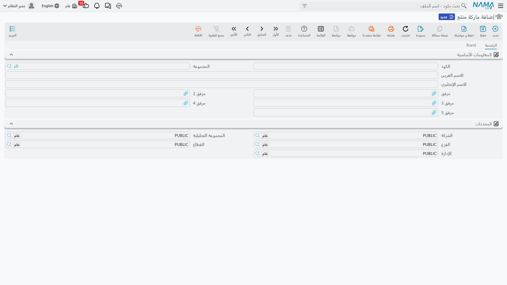
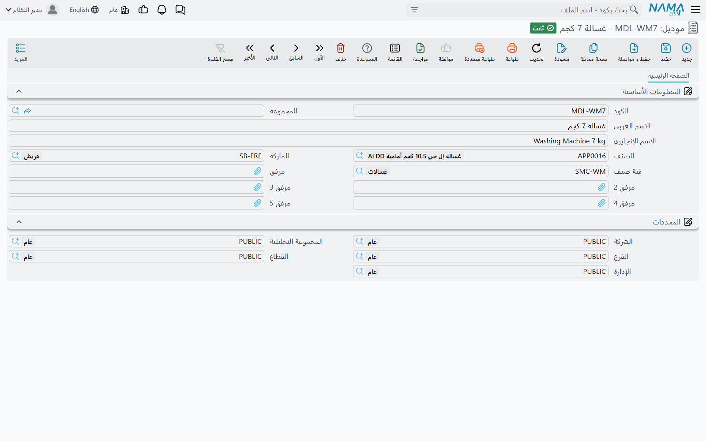

# الماركات والموديلات وتصنيفاتها

تخدم شركة الصحراء للسيارات سيارات ناوا، وناوا سيف ١٫٦ ليست ناوا رمال ٢٫٤. فتغيير الزيت يستغرق أطول على السيارة الرياضية، وفترات الصيانة تختلف، وحزمة العشرة آلاف كيلومتر تُباع برقم آخر. ولا بد للورشة من موضع تقول فيه *هذه المركبة من ذلك النوع* — وهذا ما يفعله التصنيف ثلاثي المستويات.

| | |
|---|---|
| القائمة | **مركز خدمة ← الملفات ← ماركة منتج / موديل / تصنيف موديل** (`Brand / Model / Product Model Category`) |
| النوع | ثلاثة ملفات رئيسية — لا أثر مخزني ولا أثر محاسبي |

::: info الترخيص المطلوب
`srvcenter`
:::

## المستويات الثلاثة

```
الماركة           BRD-NAWA    ناوا / NAWA
  └─ الموديل      MDL-SAIF16  ناوا سيف ١٫٦ (صالون)
     MDL-RIMAL24 ناوا رمال ٢٫٤ (رياضية)
     MDL-NAKHLA  ناوا نخلة (فان)
        └─ ويشير كل موديل لأعلى إلى تصنيف
تصنيف الموديل     MCT-PASS    سيارات ركاب / Passenger Cars
```

اقرأها هكذا: **الماركة** هي العلامة التجارية؛ و**الموديل** خط مركبات واحد من تلك العلامة؛ و**تصنيف الموديل** طريقة لتجميع الموديلات عبر الماركات («سيارات ركاب»، «مركبات تجارية خفيفة»).

### ملف الماركة

**ماركة منتج** (Brand) نحيف عن قصد — كود، واسم عربي وإنجليزي، ومرفقات. وصفحته الثانية، وعنوانها **ماركه** (Brand)، قائمة للقراءة فقط بكل موديل ينتمي إليه، وهي أسرع طريقة لمعرفة ما إذا كانت العلامة قد أُعدّت بالكامل.



### ملف الموديل

**موديل** (Model) هو موضع التصنيف المفيد.

| الحقل | المسمى الإنجليزي | ماذا يحمل |
|---|---|---|
| الكود، المجموعة، الاسم العربي، الاسم الإنجليزي | Code, Group, Name1, Name2 | بيانات التعريف. `name1` عربي و`name2` إنجليزي. |
| الصنف | Item | صنف مخزني مرتبط بالموديل. |
| الماركة | Item Brand | العلامة التي ينتمي إليها الموديل — `BRD-NAWA`. |
| فئة صنف | Category | تصنيف الموديل. |
| المرفقات، المحددات | Attachment, Dimensions | الكتل المعتادة. |

والأشياء الثلاثة التي يقودها الموديل، أدناه، تعتمد كلها على **سجل الموديل نفسه** لا على الصنف المذكور في حقل «الصنف».



### ملف تصنيف الموديل

**تصنيف موديل** (Product Model Category) كود واسمان ولا شيء غير ذلك. يجمع الموديلات لقارئ بشري ولفلترة شاشات القوائم. ولا سعر ولا فترة ولا قاعدة في أي موضع من الوحدة تقرؤه.

## ما الذي يقوده الموديل فعلًا

هذا هو الجزء الجدير بالحفظ، لأنه قصير ولأنه كل عائد إعداد التصنيف إعدادًا سليمًا. فالموديل يختار **ثلاثة** أشياء بالضبط.

**١. سعر حزمة الخدمة.** فـ[الخدمة](/ar/modules/servicecenter/workshop-setup/servicecenter-operations.md) المسعَّرة بسياسة **الإجمالي** تحمل جدول أسعار موديلات. وحين تدخل تلك الخدمة على [أمر شغل](/ar/modules/servicecenter/job-cycle/servicecenter-job-order.md) للسيارة `VEH-2031`، يكون السعر المأخوذ هو السطر الذي موديله سيف ١٫٦. وأما قراءة عمود السعر العادي أو عمود المصنّع فتتوقف على إعداد سياسة تسعير الخدمات على مستوى التركيب كله.

**٢. مدة التشغيل وسعر ساعة المهمة.** فـ[المهمة](/ar/modules/servicecenter/workshop-setup/servicecenter-tasks.md) تحمل جدول «منتج» — سطر لكل موديل، بالساعات التي يستغرقها ذلك الموديل والسعر المحتسَب. وتغيير الزيت ١٫٠ ساعة بسعر ١٢٠ على سيف ١٫٦ لأن سطرًا يقول ذلك.

**٣. [فترة الصيانة](/ar/modules/servicecenter/job-cycle/servicecenter-odometer-and-service-intervals.md).** فسطور تكرار المهمة تستطيع ضبط **تكرر كل / كم** مختلف لكل موديل، وسطر أسعار الموديل في الخدمة يحمل رقم تكراره الخاص. وهكذا يستحق تغيير الزيت نفسه كل ١٠٬٠٠٠ كم على الصالون وكل ٧٬٥٠٠ على الفان.

وشيء واحد لا يقوده صراحةً: **[قوالب الفحص](/ar/modules/servicecenter/inspections-and-campaigns/servicecenter-inspections.md)**. فقوالب الفحص ونقاط الفحص المبنية منها لا تحمل موديلًا ولا ماركة على الإطلاق، ولا توجد قاعدة ولا فلتر ولا خيار في `التوجيه` يختار قالبًا. فالقالب يُختار يدويًا، ممّن يملأ النموذج — لا من السيارة.

::: warning الماركة إلزامية ومُتجاهَلة
في جدول «منتج» على المهمة يكون عمود **الماركه** إلزاميًا — ولا تستطيع حفظ سطر بدونه. وفي جدول أسعار الموديلات على الخدمة يُعرض عمود الماركة ويُتحقق منه أمام الرأس.

ولا يُستخدم أيٌّ منهما في اختيار السطر. فكل مطابق يختار سعرًا أو مدة تشغيل أو فترة إنما يعتمد على **الموديل**. وسطران لنفس الموديل لا يختلفان إلا في الماركة لا يفرّق بينهما النظام، و**الأول** يفوز دائمًا.

إذن: املأ الماركة بالعلامة التي تملك الموديل فعلًا، لأنك مضطر — ثم صمّم بياناتك كأن العمود غير موجود. سطر واحد لكل موديل، لا سطران.
:::

::: warning اختيار الموديل لا يُرشِّح قائمة المهام
على أمر الشغل، اختيار المركبة لا يُضيِّق منتقي المهام أو الخدمات على ما عُرِّف لذلك الموديل. فالكتالوج كله يُعرض في كل مرة، والأمر متروك لمستشار الخدمة كي يختار الصحيح.

والآلية التي كانت سترشِّح القائمة موجودة في النموذج لكنها معطَّلة في الكود، فلا تبنِ عليها قصة تدريبية. وإن كان الكتالوج كبيرًا فاستثمر في أكواد ومجموعات رئيسية تُرتَّب ترتيبًا معقولًا.
:::

::: tip اكتب `brad` لا `brand`
حقل الماركة على المهمة وعلى سطور منتجها مكتوب **`brad`** في معرّفه. وهذه الكتابة تصلك عبر ملفات الاستيراد وتعريفات المعايير ومسارات الكيانات وتعبيرات الاستعلام — أي حيثما تسمّي الحقل بدل أن تنقر عليه. المسمى على الشاشة «الماركة»؛ أما المعرّف فلا.
:::

## إعداد التصنيف

1. أنشئ **الماركة** أولًا — واحدة لكل علامة تجارية تخدمها. وللصحراء واحدة، `BRD-NAWA`.
2. أنشئ **تصنيفات الموديلات** التي تريد التجميع بها فعلًا. وأبقِ القائمة قصيرة؛ فلا شيء يعتمد عليها، والقائمة الطويلة تكلّفك جهدًا ولا تشتري شيئًا.
3. أنشئ **موديلًا** واحدًا لكل خط مركبات، ووجّهه إلى ماركته وتصنيفه، واستخدم أكوادًا يتعرّف عليها الناس (`MDL-SAIF16` لا `M001`).
4. وعندئذٍ فقط ابنِ [كتالوج المهام](/ar/modules/servicecenter/workshop-setup/servicecenter-tasks.md) و[حزم الخدمات](/ar/modules/servicecenter/workshop-setup/servicecenter-operations.md) — لأن سطور أسعارها تُكتب *لكل موديل*، والموديل غير الموجود لا يمكن تسعيره.
5. وحين ينضم موديل جديد إلى المدى، تذكّر أنه يحتاج سطر سعر يُضاف إلى كل مهمة وكل خدمة تنطبق عليه. فلا شيء يُورَّث من الماركة، والموديل الجديد غير المسعَّر يرتدّ في صمت إلى متوسط مدة العملية العام وإلى [سعر ساعة مركز الخدمة](/ar/modules/servicecenter/workshop-setup/servicecenter-work-centers.md).
