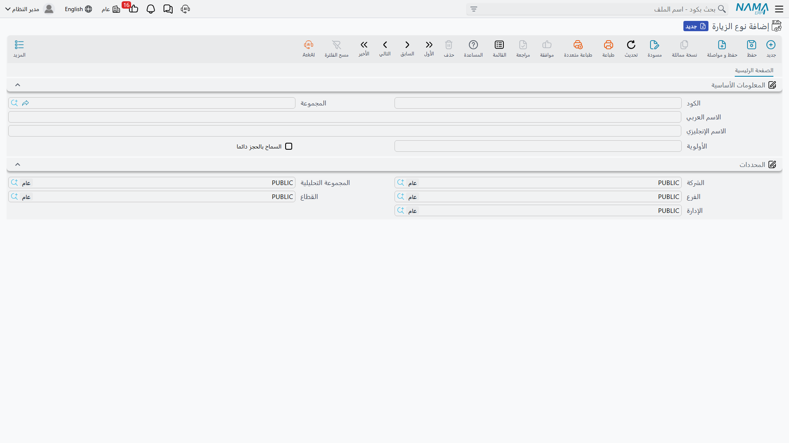

# ملفات التصنيف والوسوم

ثلاثة ملفات رئيسية صغيرة تجلس في قائمة مركز الخدمة، يتوقع القارئ منها بحق أن *تفعل* شيئًا — ولا يفعل أيٌّ منها. إنها تصنّف فحسب. تنتقل من المركبة إلى أمر الشغل، وتظهر أعمدةً في شاشات القوائم، وتجمّع الأشياء لعين قارئ بشري، وعند ذلك تنتهي مساهمتها.

وتغطي هذه الصفحة الثلاثة معًا، بأمانة وباختصار، كي لا يقضي أحد صباحه في إعداد أحدها منتظرًا سلوكًا لن يأتي.

::: info الترخيص المطلوب
`srvcenter`
:::

## مجموعة الملحقات

**مجموعة ملحقات** (Accessories Kit)، تحت **مركز خدمة ← الملفات**، تسمّي الحزمة التي جاءت بها المركبة — `AK-STD` *مجموعة قياسية / Standard Kit* على السيارة `VEH-2031` في الصحراء.

وتظهر في ثلاثة مواضع، وفي كلٍّ منها حقل مرجع واحد:

- على [ملف المركبة](/ar/modules/servicecenter/workshop-setup/servicecenter-product-file.md)، في كتلة تفاصيل المنتج؛
- على [أمر الشغل](/ar/modules/servicecenter/job-cycle/servicecenter-job-order.md) و[المقايسة](/ar/modules/servicecenter/job-cycle/servicecenter-job-estimation.md)، ويُملأ لك من المركبة حين تختار السيارة؛
- وعلى سطر [تصريح عبور البوابة](/ar/modules/servicecenter/job-cycle/servicecenter-gate-pass.md)، ويُملأ كذلك من المركبة.

وتُكتب على المركبة عند اعتماد مستند شغل، إن كان حقلها على المركبة ما يزال فارغًا.

::: warning وسم لا قائمة قطع
مجموعة الملحقات **مسمّى**. لا تحتوي أصنافًا، ولا تضيف سطورًا إلى مستند، ولا تحمل سعرًا، ولا تحرّك مخزونًا، ولا تسجّل شيئًا، ولا يفحصها أي تحقق. فتسمية المجموعة تقول لقارئ لاحق «وصلت هذه السيارة بالحزمة القياسية»؛ ولا تقول للنظام أن يفوتر شيئًا أو يصرفه.

فإن احتجت الملحقات نفسها على الشغل، فضعها في [جدول قطع الغيار](/ar/modules/servicecenter/spare-parts/servicecenter-spare-parts-overview.md) كأصناف عادية.
:::

::: warning لا توجد شاشة مسجَّلة لها
خلافًا لكل ملف رئيسي آخر في الوحدة، لم تُسجَّل لهذا الملف شاشة تحرير خاصة به. وما تحصل عليه عند فتحه من القائمة لم يُتحقق منه على نظام يعمل، ولذلك لا تصف هذه المستندات شاشته. فإن كان الملف مهمًا لديك فافحصه على تركيبك قبل أن تبني عليه إجراءً.
:::

## نوع الزيارة

**نوع الزيارة** (Visit Type) يصنّف سبب دخول السيارة — صيانة دورية، مطالبة ضمان، إصلاح حادث، شكوى. وتستخدم الصحراء `VT-SRV` *صيانة دورية* لزيارة `VEH-2031` في مارس.

ويسكن تحت **مركز خدمة ← الإعدادات**، ويُحمَل على [طلب الخدمة](/ar/modules/servicecenter/job-cycle/servicecenter-service-request.md) وأمر الشغل والمقايسة و[سند الفحص](/ar/modules/servicecenter/inspections-and-campaigns/servicecenter-inspections.md) وسطر تصريح عبور البوابة، إضافةً إلى حقول *نوع الزيارة القادمة المتوقعة* التي تتوقع موعد المركبة التالي.

وتحمل الشاشة الكود والمجموعة والاسمين وإعدادين:

| الحقل | المسمى الإنجليزي |
|---|---|
| الأولوية | Priority |
| السماح بالحجز دائما | Always Allow Reservation |

::: danger لا يفعل أيٌّ من الإعدادين شيئًا
**الأولوية** و**السماح بالحجز دائما** لا يقرؤهما أي كود في النظام. فضبط أولوية لا يرتّب شيئًا؛ وتأشير «السماح بالحجز دائما» لا يُعفي زيارة طارئة من فحص طاقة الحجوزات، ولا يوجد إعداد ثالث خلفهما يفعل ذلك.

نوع الزيارة **مسمّى تصنيفي فقط**. استخدمه للوصف وللتقارير؛ ولا تبنِ عليه قاعدة حجز أبدًا، ولا تقل لمستشار خدمة إن تأشير خانة هنا سيُدخِل سيارة.
:::

::: tip خللان في مسميات القائمة ينبغي توقعهما
مدخل القائمة الإنجليزي يقرأ **«Visit Type (Debit then Credit)»** — والعبارة بين قوسين مسمّى محاسبي شارد لا علاقة له بالزيارات، ولا يظهر في العربية. كما يحمل مجلد **الإعدادات** نفسه مسافة زائدة في أوله في اللغتين (` الإعدادات` / ` Settings`)، فقد يُرتَّب ترتيبًا غريبًا في شجرة القائمة. وكلاهما شكلي؛ والملف هو الموصوف هنا.
:::

## تصنيف الخدمة

**تصنيف خدمة** (Standard Operation Classification)، تحت **مركز خدمة ← الملفات**، يحمل الكود والاسمين والمرفقات والمحددات — لا أكثر.

واستخدامه الوحيد في الوحدة كلها هو حقل **التصنيف** (classification) على شاشة [مهمة الخدمة](/ar/modules/servicecenter/workshop-setup/servicecenter-tasks.md). ولا شيء آخر يشير إليه.

::: warning وسم حرّ على المهمة
لا سعر ولا فلتر ولا قاعدة تجميع ولا تقرير يقرأ هذا التصنيف. إنه عمود تستطيع البحث في قائمة المهام به، وكلمة يستطيع زميل قراءتها. وهذا كل ما فيه.

ومع ذلك يستحق الاستخدام — فـ«ميكانيكا» و«كهرباء» و«سمكرة» و«نظافة» تجعل كتالوجًا من مئتي مهمة قابلًا للتصفح — ما دام أحد لا يتوقع منه توجيه العمل أو تسعير شيء.
:::

## لماذا تملؤها أصلًا

لأن شاشات القوائم ومعايير البحث والتقارير المخصّصة وعمليات الاستيراد تقرأ كلها ما تضعه في هذه الحقول، وإن كان منطق الوحدة نفسه لا يقرؤه. فالورشة التي توسم مهامها بالتخصص وزياراتها بالسبب تستطيع الإجابة عن «كم زيارة ضمان استقبلنا في مارس» من شاشة قائمة؛ والورشة التي تتركها فارغة لا تستطيع. فقط اجعل الجهد بحجم عائده — وصفٌ وتقارير، لا سلوك.

أما ملف التصنيف الصغير الرابع، **تصنيف الموديل**، فمشمول في صفحة [الماركات والموديلات](/ar/modules/servicecenter/workshop-setup/servicecenter-brands-and-models.md)، حيث ينتمي إلى التدرّج نفسه مع الماركة والموديل.
