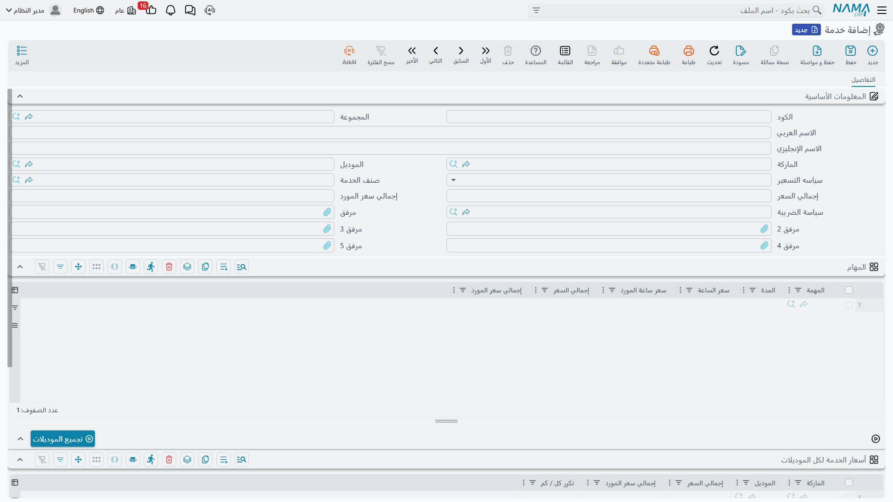

# الخدمات ومجموعات العمليات

العميل لا يطلب «تغيير زيت وتغيير فلتر وفحص فرامل وإكمال سوائل». هو يطلب صيانة العشرة آلاف كيلومتر، ويريد لها سعرًا واحدًا. و**الخدمة** — `خدمة` في القائمة العربية و*Operation* في الإنجليزية — هي الطريقة التي تبيع بها الورشة حزمة كهذه.

الخدمة حزمة مسمّاة من [المهام](/ar/modules/servicecenter/workshop-setup/servicecenter-tasks.md)، ومعها قرار: هل يرى العميل المهام مسعَّرة واحدةً واحدة، أم تحمل الحزمة سعرًا واحدًا وتأتي المهام في صمت؟

| | |
|---|---|
| القائمة | **مركز خدمة ← الملفات ← خدمة** (`Service Center > Master Files > Service Center Operation`) |
| النوع | ملف رئيسي — لا أثر مخزني ولا أثر محاسبي |

::: info الترخيص المطلوب
`srvcenter`
:::

::: tip كلمتان لشيء واحد
القائمة الإنجليزية تقول **Operation**، والقائمة العربية وكل المسميات العربية تقول **خدمة**. وهما الملف نفسه. وفي هذه المستندات كلها تعني «الخدمة» و«مجموعة العمليات» هذا السجل — ولا تعني أبدًا شغلًا جاريًا.
:::



## كلا الملفين ملف كتالوج

يستحق الأمر وضوحًا صريحًا، لأن الكلمتين تبدوان كمرحلتين من شيء واحد وليستا كذلك.

- **المهمة** هي الذرّة: خطوة إصلاح واحدة، بمدة معيارية وسعر ساعة وقائمة مكوّنات.
- **الخدمة** حزمة من المهام فوقها سياسة تسعير.

**وليس أيٌّ منهما هو العمل الجاري.** فكلاهما شيء تُعِدّه مرة وتعيد استخدامه. أما العمل المنفَّذ فسطر على أمر شغل وسطر مسجَّل الزمن على [ورقة تنفيذ الصالة](/ar/modules/servicecenter/workshop-execution/servicecenter-production-execution.md) — لا سجل مهمة ولا سجل خدمة.

## الشاشة

### المعلومات الأساسية

| الحقل | المسمى الإنجليزي | ماذا يفعل |
|---|---|---|
| الكود، المجموعة، الاسم العربي، الاسم الإنجليزي | Code, Group, Name1, Name2 | بيانات التعريف. `name1` عربي و`name2` إنجليزي. |
| الماركة | Item Brand | الماركة التي تنتمي إليها الخدمة. وهي أيضًا تحكم جدول أسعار الموديلات — انظر أدناه. |
| الموديل | Item Model | الموديل الذي تنتمي إليه الخدمة. |
| سياسه التسعير | Pricing strategy | **لكل سطر** (Per Line) أو ** الإجمالي** (Total). وهي المفترق الذي تدور حوله هذه الصفحة. |
| صنف الخدمة | Service Item | الصنف الذي [يُفوتَر](/ar/modules/servicecenter/job-cycle/servicecenter-job-order-invoicing.md) عن الحزمة. |
| إجمالي السعر | Total | سعر الحزمة، ويُستخدم حين تكون السياسة «الإجمالي». |
| إجمالي سعر المورد | Manufacturer Suggested Retail Total Price | سعر المصنّع للحزمة، ويُستخدم بدلًا منه حين يعمل التركيب بسياسة تسعير المورد. |
| سياسة الضريبة | Tax Plan | المعالجة الضريبية المحمولة مع الخدمة. |

### جدول المهام

| العمود | المسمى الإنجليزي | ماذا يحمل |
|---|---|---|
| المهمة | Task | المهمة العضو. **إلزامية في كل سطر** — ولا يمكن حفظ خدمة فيها سطر بعمود مهمة فارغ. |
| المدة | Total Hours | الساعات التي تسهم بها هذه المهمة في الحزمة. |
| سعر الساعة | Hour Price | سعر تلك الساعات. |
| سعر ساعة المورد | Manufacturer Suggested Retail Hour Price | سعر المصنّع للساعة. |
| إجمالي السعر | Total | الساعات × السعر. |
| إجمالي سعر المورد | Manufacturer Suggested Retail Total Price | الحاصل نفسه بسعر المصنّع. |

### جدول أسعار الموديلات

تحت جدول المهام زر اسمه **collectModels**، وجدول عنوانه **أسعار الخدمة لكل الموديلات** (price for all models).

| العمود | المسمى الإنجليزي | ماذا يحمل |
|---|---|---|
| الماركة | Item Brand | الماركة. |
| الموديل | Item Model | الموديل الذي ينطبق عليه السعر. |
| إجمالي السعر | Total | سعر الحزمة لذلك الموديل. |
| إجمالي سعر المورد | Manufacturer Suggested Retail Total Price | سعر المصنّع للحزمة لذلك الموديل. |
| تكرر كل / كم | Recur Every KM | كل كم كيلومترًا تعود هذه الخدمة على ذلك الموديل. |

والضغط على **collectModels** يوفّر عليك الكتابة: يقرأ الماركة في الرأس ويُنزل سطرًا لكل موديل تملكه تلك الماركة. ففي الصحراء، ومع `BRD-NAWA` في الرأس، تُنتج ضغطة واحدة سطورًا لسيف ١٫٦ ورمال ٢٫٤ ونخلة — ثم تكتب سعرًا أمام كل منها.

وقاعدتان تحكمان الجدول عند الحفظ. فالسطر الذي ماركته **غير** ماركة الرأس يُرفض عند الاعتماد. وبعد الاعتماد الناجح تُملأ ماركة كل سطر من موديله، فتبقى السطور التي أنتجها الزر مرتّبة.

::: warning عمود الماركة لا يختار شيئًا
حين يبحث النظام عن سعر هذه الخدمة لسيارة بعينها، فإنه يطابق على **الموديل وحده**. أما عمود الماركة في جدول أسعار الموديلات فيُعرض، ويُتحقق منه أمام الرأس، ثم يتجاهله البحث.

والنتيجة: سطران لنفس الموديل بماركتين مختلفتين لا يفرّق بينهما المطابق، و**الأول** يفوز دائمًا. فأبقِ سطرًا واحدًا لكل موديل.
:::

## لكل سطر أم الإجمالي — المفترق الذي يهمّ

حقل **سياسه التسعير** يقرّر أي مستوى من السجل يحمل المال، ويفعل ذلك بتصفير المستوى الآخر. وهذه ليست تفضيلات عرض؛ فالأرقام تُمسح فعلًا عند الحفظ.

**لكل سطر** — يُسعَّر كل سطر مهمة بذاته: *الساعات × سعر الساعة*. ويُصفَّر «إجمالي السعر» في الرأس. استخدمها حين ينبغي أن يرى العميل المكوّنات: «تغيير زيت ١٢٠، تيل فرامل ١٨٠، ضبط زوايا ٦٠».

**الإجمالي** — «إجمالي السعر» في الرأس هو سعر الحزمة، و**يُصفَّر سعر كل سطر مهمة**. استخدمها حين تبيع «صيانة العشرة آلاف» برقم واحد ولا تريد مناقشة أجزائه. ومع هذه السياسة يكون السعر الذي يأخذه أمر الشغل هو سطر جدول أسعار الموديلات المطابق لموديل السيارة، وأما قراءة عمود الإجمالي العادي أو عمود المصنّع فتتوقف على إعداد سياسة تسعير الخدمات على مستوى التركيب كله.

::: warning تبديل السياسة يُتلف أسعار الطرف الآخر
لأن الطرف الخاسر يُصفَّر عند الحفظ، فإن تحويل خدمة قائمة من «لكل سطر» إلى «الإجمالي» يمحو أسعار المهام، وإعادتها لا تستردّها. فاحسم السياسة عند إنشاء الخدمة، وإن اضطررت إلى تغييرها فتوقّع إعادة كتابة الأسعار.
:::

## كيف تصل الخدمة إلى أمر الشغل

يوجد **جدول واحد** للعمل على [أمر الشغل](/ar/modules/servicecenter/job-cycle/servicecenter-job-order.md)، وكلا الملفين يغذّيه. تدخل الخدمة **سطرًا رئيسيًا**، وتدخل مهامها **تحته سطورًا تابعة**. أما المهمة التي لا تنتمي إلى حزمة فتدخل وحدها بلا سطر أب.

فكان يمكن لأمر شغل الصحراء أن يبدو هكذا — سطر خدمة بأربعة أبناء ومهمة مستقلة:

```
▸ SRV-10K   صيانة العشرة آلاف كيلومتر      ← الخدمة، سطر رئيسي
    TSK-OIL   تغيير زيت وفلتر              ← مهامها، سطور تابعة
    TSK-BRK   تغيير تيل الفرامل الأمامي
    TSK-ALN   ضبط زوايا الإطارات
  TSK-AC     تغيير كمبروسر التكييف          ← مهمة مستقلة
```

وأربع قواعد تُفرض عند الحفظ:

| إن فعلت هذا | يرفض المستند برسالة |
|---|---|
| وضعت خدمة **ومهمة** في السطر نفسه | *Task and operation not allowed at the same line* |
| أدخلت خدمة بلا سطور تابعة تحتها | *Operation must have sub-rows* |
| وضعت خدمة على سطر هو نفسه سطر تابع | *It is slave line and must not have operations* |
| كرّرت المهمة نفسها مرتين في أمر شغل واحد | *The task {0} cannot be repeated for the same job order* |

والقاعدة الأخيرة تستحق التذكّر عند بناء الحزم: فإن اشتركت خدمتان في مهمة واحدة لم يمكن وضعهما معًا على أمر الشغل نفسه.

ومفترق التسعير يتبع السطور إلى المستند. فالسطر الرئيسي للخدمة تُصفَّر ساعاته وسعر ساعته وعدده — إذ لا يُحتسب رأس الحزمة بالساعة. وتُسعَّر سطوره التابعة فقط إذا كانت الخدمة الأم **لكل سطر**؛ فإن كانت **الإجمالي** صُفِّرت الأبناء أيضًا ووقف سعر الحزمة وحده — ثم يُحسم أي طرف يتحمّل هذا السعر عبر [تقسيم الجهات الدافعة](/ar/modules/servicecenter/job-cycle/servicecenter-payer-split.md) على المستند.

## بناء خدمة

1. ابنِ [المهام](/ar/modules/servicecenter/workshop-setup/servicecenter-tasks.md) أولًا. فالخدمة لا شيء بدونها، وكل سطر يجب أن يسمّي مهمة.
2. أنشئ الخدمة، وسمّها كما يطلبها العميل، واضبط الماركة في الرأس.
3. اختر **سياسه التسعير** الآن، قبل أن يستخدم أحد السجل.
4. أضف المهام الأعضاء. فمع «لكل سطر» امنح كلًّا منها ساعاتها وسعرها؛ ومع «الإجمالي» ضع سعر الحزمة في الرأس واترك السطور.
5. إن كنت تسعّر الحزمة بحسب الموديل فاضغط **collectModels** واملأ عمود الإجمالي سطرًا سطرًا — سطر واحد لكل موديل بلا تكرار.
6. أضف **تكرر كل / كم** على سطور الموديلات إن كانت الحزمة صيانة دورية تعود مع الكيلومترات.
