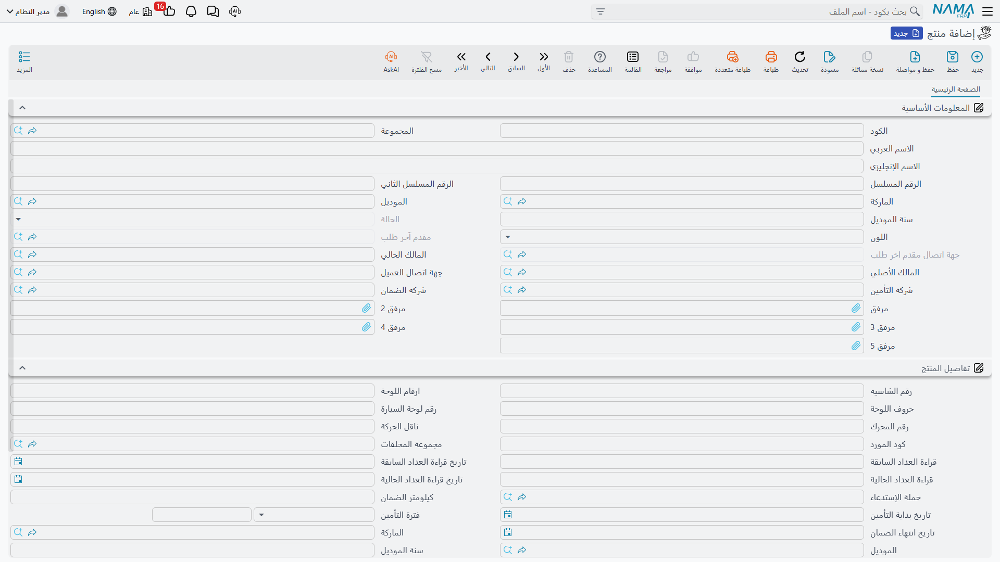

# ملف المنتج (المركبة)

حين يُحضر فهد العتيبي سيارته ناوا سيف ١٫٦ لصيانتها، تحتاج الورشة إلى موضع تحفظ فيه ما هو ثابت عن *تلك السيارة* لا عن هذه الزيارة: رقم شاسيهها ولوحتها ومالكها وشركة تأمينها وقراءة عدّادها في المرة الماضية وما أُجري عليها من قبل. وهذا الملف هو **المنتج** — سجل الورشة لمركبة واحدة بعينها.

والقائمة تسميه ببساطة **منتج** (Product)، وهو اسم يبخسه حقه. أما في بقية هذه المستندات فهو «ملف المركبة»، لأن هذا ما تستخدمه الورشة به.

| | |
|---|---|
| القائمة | **مركز خدمة ← الملفات ← منتج** (`Service Center > Master Files > Product`) |
| النوع | ملف رئيسي — لا أثر مخزني ولا أثر محاسبي |

::: info الترخيص المطلوب
`srvcenter`
:::

## مركبة المثال في الصحراء

| الحقل | القيمة |
|---|---|
| الكود | `VEH-2031` |
| الماركة / الموديل / السنة | ناوا / سيف ١٫٦ / ٢٠٢٣ |
| الرقم المسلسل (الشاسيه) | `NWA5S1B23K004471` |
| رقم المحرك | `S16-224471` |
| اللوحة | `ر ط ص 4471` |
| اللون | فضي |
| المالك الحالي | `CUS-1042` فهد العتيبي |
| شركة التأمين | `INS-02` وفاء للتأمين |
| جهة الضمان | `WRN-01` برنامج ضمان ناوا |
| مجموعة الملحقات | `AK-STD` مجموعة قياسية |

وكل صفحة ورشة في هذه المستندات تدور حول هذه السيارة.

::: danger ملف مركبة الورشة وسجل سيارة المعرض غير مرتبطين
تبيع الصحراء السيارات أيضًا، والسيارة التي تبيعها يُنشأ لها سجل مختلف تمامًا في سجلّ مختلف تمامًا — **[ملف السيارة](/ar/modules/servicecenter/cars-setup/car-master-file.md)**، تحت جذر قائمة `سيارات`، بمحرّك حالات خاص به ومستندات خاصة به.

و**لا يوجد رابط عامل بين الاثنين**. فالسيارة التي باعها المعرض لا تظهر في قائمة منتجات الورشة، وصيانة السيارة لا تمسّ سجل المعرض. أما حقلا المرجع في النموذج اللذان كان يُفترض أن يربطاهما فليسا على أي شاشة ولا يقرؤهما أي كود.

فإن احتجت أن تكون المركبة الفيزيائية نفسها مرئية على الجانبين، فعليك إنشاؤها مرتين — مرة كسجل سيارة عند شرائها، ومرة كمنتج عند أول دخولها للصيانة — مع إبقاء رقم الشاسيه متطابقًا كي يستطيع إنسان المطابقة بينهما. ولا شيء يؤتمت ذلك، ولا شيء يتحقق منه.
:::

## الشاشة

كل شيء في صفحة واحدة: كتلتان وثلاث قوائم.

### المعلومات الأساسية — من وما

| الحقل | المسمى الإنجليزي | ملاحظات |
|---|---|---|
| الكود، المجموعة، الاسم العربي، الاسم الإنجليزي | Code, Group, Name1, Name2 | بيانات التعريف. `VEH-2031`. و`name1` هو الاسم العربي و`name2` الإنجليزي. |
| الرقم المسلسل | Serial Number | رقم الشاسيه بوصفه مسلسل المركبة. |
| الرقم المسلسل الثاني | Second Serial | معرّف ثانٍ عند الحاجة. |
| الماركة / الموديل | Item Brand / Item Model | ناوا / سيف ١٫٦. وهذان الحقلان يقودان أسعار أجرة العمل وفترات الصيانة — انظر [الماركات والموديلات](/ar/modules/servicecenter/workshop-setup/servicecenter-brands-and-models.md). |
| سنة الموديل | Production Year | ٢٠٢٣. |
| الحالة | Status | **للقراءة فقط.** أين وصلت السيارة في زيارتها — انظر أدناه. |
| اللون | Color | فضي. |
| مقدم آخر طلب / جهة اتصال مقدم اخر طلب | Last Requester / Last Requester Contact | يملؤهما النظام من أحدث طلب خدمة. |
| المالك الحالي | Current Car Owner | فهد العتيبي. الطرف الذي تتعامل معه الورشة. |
| المالك الأصلي / جهة اتصال العميل | Initial Car Owner / Customer Contact | من امتلكها أولًا، وجهة الاتصال. |
| شركة التأمين | Insurance Company | وفاء للتأمين — الطرف وراء حصة التأمين في أي شغل. |
| شركه الضمان | Warranty company | برنامج ضمان ناوا — الطرف وراء حصة الضمان. |

### تفاصيل المنتج — المعدن والعدّاد

| الحقل | المسمى الإنجليزي | ملاحظات |
|---|---|---|
| رقم الشاسيه | Chassis No | رقم الشاسيه مرة أخرى، في كتلة التفاصيل. |
| ارقام اللوحة / حروف اللوحة | Car Plate Numbers / Characters | اللوحة تُكتب على جزأين. |
| رقم لوحة السيارة | Car Plate Number | **محسوب** — الأرقام والحروف موصولة بمسافة. لا تكتب فيه. |
| رقم المحرك | Engine No | `S16-224471`. |
| ناقل الحركة | Gear Box | عادي، أوتوماتيك، وهكذا. |
| كود المورد | Supplier Code | مرجع المورد الخاص بالمركبة. |
| مجموعة المحلقات | Accessories | مجموعة الملحقات التي جاءت بها السيارة — وسم وصفي. |
| قراءة العداد السابقة / تاريخها | Last Odometer / Date | ٤١٬٦٠٠ في ١ يناير ٢٠٢٦. |
| قراءة العداد الحالية / تاريخها | Current Odometer / Date | ٤٥٬٣٠٠ في ٣ مارس ٢٠٢٦. |
| الفرق بين القراءة الحالية وأخر قراءة | Difference Between Current and Last OdoMeter | ٣٬٧٠٠ كم. |
| متوسط استهلاك الكيلومتر يوميا | Average KM Daily Consumption | **محسوب** — ٣٬٧٠٠ ÷ ٦١ يومًا = **٦٠٫٧ كم/يوم**. |
| حملة الإستدعاء | Recall Campaign | حملة الاستدعاء التي تطال هذه المركبة، إن وُجدت. |
| كيلومتر الضمان | Insurance Kilometer | حد الكيلومترات على التغطية. |
| تاريخ بداية التأمين / فترة التأمين / تاريخ انتهاء الضمان | Insurance Start Date / Period / End Date | نافذة التغطية. |
| الماركة / الموديل / سنة الموديل | Item Brand / Item Model / Production Year | مكرّرة هنا للتيسير — بالقيم نفسها في الكتلة أعلاه. |
| عقد خدمة / حالة العقد | Service Contract / Status | يملؤهما النظام حين تكون المركبة على عقد. |

### كيف يتصرّف العدّاد

القراءتان تعملان كزوج، والقاعدة بسيطة: **القراءة الأحدث تدفع القديمة خانةً إلى الوراء.** فحين يُبلِّغ مستند بقراءة جديدة، تصير القراءة الحالية هي القراءة السابقة، ويصير الرقم الجديد هو الحالي، وينتقل التاريخان معهما.

والقراءة ترفض أن ترجع إلى الوراء. فالمستند الذي يحاول تسجيل رقم أقلّ مما تحمله المركبة يُرفض ما لم يُفرض ذلك صراحةً — وهو السلوك الذي تريده، لأن عدّادًا مكتوبًا بالخطأ يُفسد كل فترات الصيانة على السيارة.

ولا يُعاد حساب متوسط الاستهلاك اليومي إلا بعد مرور مدة كافية. فثمة إعداد في الوحدة يحدّد **أقل عدد أيام** بين القراءتين ليُعاد الحساب؛ والقراءات الأقرب من ذلك تُبقي المتوسط السابق كما هو، تحديدًا كي لا تُنتج زيارتان في أسبوع واحد رقمًا بلا معنى.

وهذا المتوسط هو ما يحوّل الكيلومترات إلى تواريخ. فآخر تغيير زيت لـ `VEH-2031` كان عند ٣٦٬٠٠٠ كم، والفترة ١٠٬٠٠٠ كم، فالتالي يستحق عند ٤٦٬٠٠٠ — أي على بعد ٧٠٠ كم بمعدل ٦٠٫٧ كم يوميًا، نحو أحد عشر يومًا ونصف، ولذلك يتوقع [إغلاق أمر الشغل](/ar/modules/servicecenter/job-cycle/servicecenter-job-order-closing.md) زيارة تالية في **١٥ مارس ٢٠٢٦**.

### لا يكاد يُكتب هنا شيء مالي

انظر في قائمة الحقول ولاحظ ما ينقصها: لا سعر ولا تكلفة ولا معدل ولا حساب ولا رصيد. فملف المركبة سجل هوية. أما المال فيسكن في أمر الشغل وإغلاقه والفواتير؛ ومساهمة الملف الوحيدة في السعر هي **الموديل**، الذي يختار سعر أجرة العمل وسعر الحزمة في مكان آخر.

## الحالة تُقرأ ولا تُكتب

حقل **الحالة** معطَّل على الشاشة، وذلك عن قصد. فحالة المركبة ليست قيمة تضبطها؛ إنها الكلمة الأخيرة في حوار بين المستندات.

فكل مستند شغل — المقايسة، أمر الشغل، تنفيذ الصالة، مستندا الإيقاف والاستكمال، الإغلاق، تصريح عبور البوابة — يستطيع كتابة **قيد حالة** على المركبة عند اعتماده. وأي حالة يكتبها؟ ذلك محدَّد في [`توجيه`](/ar/modules/servicecenter/document-terms/servicecenter-terms-workshop.md) ذلك المستند. ثم تُقرأ القيود بترتيب تاريخ الاستحقاق و**آخرها يفوز**، وهو ما تراه في الحقل. ويستطيع `التوجيه` أيضًا تسمية إشعار يُطلَق عند تغيّر الحالة فعليًا.

وينتج عن ذلك أمران، وكلاهما يُشعر به عمليًا:

- **المستند بتاريخ سابق قد يغيّر الحالة الحالية.** فلأن القيود مرتّبة بتاريخ الاستحقاق لا بوقت الإدخال، فاعتماد مستند بتاريخ استحقاق أقدم قد يُقحمه في وسط التسلسل — أو يتصدّره فيستولي على الحقل إن كان الأحدث.
- **وإلغاء المستند يزيل قيده**، فترتدّ الحالة إلى ما تقوله القيود الباقية.

والحالات المتاحة هي:

| الحالة | المسمى الإنجليزي |
|---|---|
| لم تبدأ | Not Started |
| إنتظار استقبال | Waiting Reception |
| جارى الاستقبال | Reception In Progress |
| إنتظار التحميل | Loading |
| قيد التنفيذ | In Progress |
| أعمال متوقفة | Discontinued Work |
| إنتهاء الإصلاح | Repair Completed |
| تم اصدار فاتورة | An Invoice Was Issued |
| خرجت من المركز | Exited From The Center |
| ألغيت | Canceled |
| أخرى ١ … أخرى ٥ | Other 1 … Other 5 |

وخانات **أخرى** الخمس موجودة كي يسمّي التركيب مراحل لا تغطيها القائمة القياسية. ولا شيء مربوط بحالة بعينها في الكود: فأي مستند يضبط أي حالة أمرٌ يتوقف كليًا على كيفية ملء `توجيه` كل مستند.

## ما تكتبه المستندات على الملف

اعتماد مستند شغل يملأ حقول المركبة **الفارغة** مما يعرفه المستند: رقم الشاسيه، ورقم اللوحة، ورقم المحرك، وناقل الحركة، ومجموعة الملحقات، وكود المورد، وحملة الاستدعاء، والماركة، والموديل، وسنة الموديل، وحقول التأمين الثلاثة.

وكلمة *الفارغة* هي القاعدة كلها. فالحقل الذي يحمل قيمة يُترك كما هو — والكتابة على الملف تيسير للسيارات التي أُنشئ ملفها على عجل عند الاستقبال، لا آلية مزامنة. فإن كانت قيمة على المركبة خاطئة، فتصحيحها على مستند لن يصحّحها على الملف؛ افتح الملف وصحّحها فيه.

## القوائم الثلاث

في أسفل الصفحة ثلاث قوائم للقراءة فقط، وهي مجتمعةً تاريخ المركبة.

**الخدمات** (Services) — [أوامر الشغل](/ar/modules/servicecenter/job-cycle/servicecenter-job-order.md) الصادرة على هذه المركبة. وهي أول ما تفتحه حين يقول العميل «أنتم أصلحتم هذا من قبل».

**أخر الخدمات** (Product Last Service) — سطر لكل مهمة أو خدمة، يحمل متى نُفِّذت آخر مرة وعند أي عدّاد. وهذا هو السجل الذي تقرؤه [الصيانة المبنية على الكيلومترات](/ar/modules/servicecenter/job-cycle/servicecenter-odometer-and-service-intervals.md). أما المركبة التي خُدمت قبل تشغيل النظام فيُغذَّى سجلها بسند افتتاحي مهمات المنتج، فتعمل الفترات من اليوم الأول بدل معاملة كل سيارة كأنها جديدة.

**ملخص تغير حالة منتج** (Product Status Entries) — أثر المراجعة وراء حقل الحالة: أي مستند، ومن أي حالة إلى أي حالة، وعلى أي تواريخ. وحين يسأل أحدهم لماذا تظهر السيارة «إنتهاء الإصلاح» وهي واقفة في الساحة، فالجواب في هذه القائمة.

## إنشاء ملف مركبة

1. أنشئ السجل عند أول تعامل — غالبًا في الاستقبال، حين تصل السيارة لأول مرة.
2. املأ الهوية: الكود، والاسمين، و**الرقم المسلسل (الشاسيه)**، ورقم المحرك، واللوحة، واللون، وسنة الموديل.
3. اضبط **الماركة** و**الموديل** بعناية. فهذان الحقلان يقرّران سعر أجرة العمل الذي يقترحه أمر الشغل وفترة الكيلومترات التي تستخدمها مهمة الصيانة؛ والموديل الخطأ يُنتج أسعارًا خاطئة في صمت.
4. سمِّ **المالك الحالي**، وشركتي التأمين والضمان إن كانت المركبة مغطاة — فهؤلاء هم الأطراف الذين [سيحملون حصة من الفاتورة](/ar/modules/servicecenter/job-cycle/servicecenter-payer-split.md).
5. سجّل قراءة العدّاد كما هي عند الوصول، بتاريخها.
6. واترك **الحالة**، واللوحة المحسوبة، ومتوسط الاستهلاك، وحقول العقد، والقوائم الثلاث. فهي تملأ نفسها.
