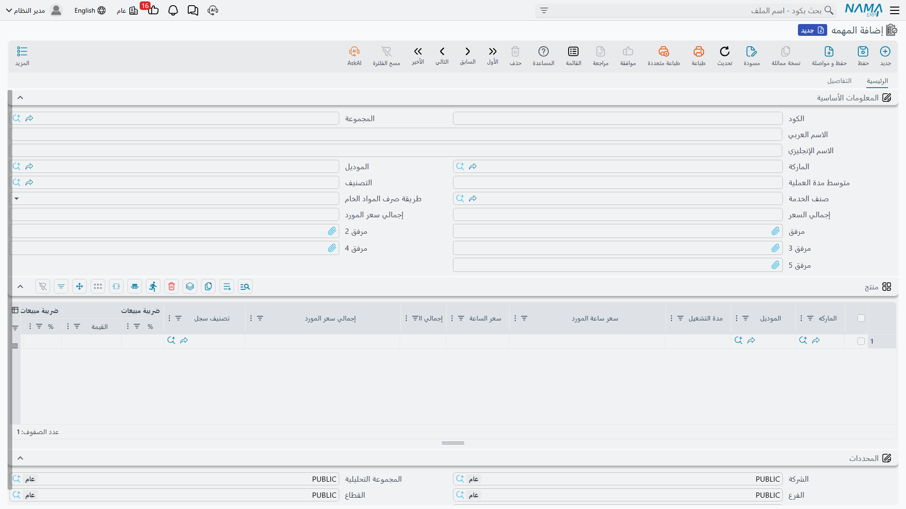

# مهام الخدمة

الورشة تبيع وقتًا. وقبل أن تسعّر إصلاحًا عليها أن تتفق على *ما هو* هذا الإصلاح — «تغيير زيت المحرك والفلتر»، «تغيير تيل الفرامل الأمامي» — وكم يستغرق على سيارة عادية، وما القطع التي يبتلعها، وكم تكلفة ساعته. و**مهمة الخدمة** هي هذا الاتفاق مكتوبًا.

وهي ذرّة الورشة كلها. فكل ما هو أكبر مبنيّ عليها: [الخدمة](/ar/modules/servicecenter/workshop-setup/servicecenter-operations.md) حزمة من المهام، و[أمر الشغل](/ar/modules/servicecenter/job-cycle/servicecenter-job-order.md) قائمة بها، و[ورقة التنفيذ في الصالة](/ar/modules/servicecenter/workshop-execution/servicecenter-production-execution.md) تسجّل زمن كل مهمة على حدة، وفاتورة العميل تحمل سطرًا لكل مهمة نُفِّذت.

| | |
|---|---|
| القائمة | **مركز خدمة ← الملفات ← المهمه** (`Service Center > Master Files > Service Center Task`) |
| النوع | ملف رئيسي — لا أثر مخزني ولا أثر محاسبي |

::: info الترخيص المطلوب
`srvcenter`
:::

## كتالوج الصحراء

خمس مهام تحمل قصة الورشة في هذه المستندات كلها:

| الكود | المهمة | الساعات المعيارية | سعر الساعة | تتكرر كل |
|---|---|---|---|---|
| `TSK-OIL` | تغيير زيت وفلتر | ١٫٠ | ١٢٠ | ١٠٬٠٠٠ كم |
| `TSK-BRK` | تغيير تيل الفرامل الأمامي | ١٫٥ | ١٢٠ | — |
| `TSK-AC` | تغيير كمبروسر التكييف | ٣٫٠ | ١٢٠ | — |
| `TSK-ALN` | ضبط زوايا الإطارات | ٠٫٥ | ١٢٠ | — |
| `TSK-WSH` | غسيل وتنظيف السيارة | ٠٫٥ | ١٢٠ | — |

اقرأ السطر الأول كجملة: *تغيير الزيت والفلتر على ناوا سيف ١٫٦ يستغرق ساعة، وتُحتسب الساعة بـ ١٢٠، والسيارة تحتاجه ثانيةً بعد ١٠٬٠٠٠ كم.*

## المهمة سطر في كتالوج لا شغل جارٍ

أكثر ما يُساء فهمه في هذه الشاشة أن تُعامَل كأنها عمل تحت التنفيذ. وليست كذلك. فلا شيء في سجل المهمة يخصّ سيارة بعينها ولا عميلًا بعينه ولا يومًا بعينه. إنها سطر في قائمة أسعار وورقة طريقة — ما *تستطيع* الورشة عمله.

أما العمل المنفَّذ فيسكن في مكان آخر: سطرًا على أمر شغل (مخطَّطًا)، وسطرًا مسجَّل الزمن على ورقة تنفيذ الصالة (فعليًا). وتعديل المهمة لا يغيّر أمر شغل صدر من قبل؛ فالأرقام نُسخت إلى أمر الشغل لحظة اختيار المهمة.

## الصفحة الرئيسية

### المعلومات الأساسية

| الحقل | المسمى الإنجليزي | ماذا يفعل |
|---|---|---|
| الكود، المجموعة، الاسم العربي، الاسم الإنجليزي | Code, Group, Name1, Name2 | بيانات التعريف. `name1` عربي و`name2` إنجليزي. |
| الماركة | Brand | تصنيف على مستوى الرأس — لأي ماركة تنتمي هذه المهمة. |
| الموديل | Item Model | تصنيف على مستوى الرأس — لأي موديل. |
| متوسط مدة العملية | Average Period | **المدة المعيارية العامة** بالساعات. `1.0` لتغيير الزيت. وهي المستخدَمة حين لا يوجد سطر مطابق للموديل. |
| التصنيف | classification | وسم حرّ من ملف تصنيف الخدمة. |
| صنف الخدمة | Service Item | **الصنف الذي يُفوتر.** فحين [يُفوتَر أمر الشغل](/ar/modules/servicecenter/job-cycle/servicecenter-job-order-invoicing.md) يكون هذا هو الصنف على سطر أجرة العمل — `SRV-OIL` لتغيير الزيت — بكمية = الساعات المعيارية × العدد. وبدونه لا يمكن فوترة أجرة المهمة. |
| طريقة صرف المواد الخام | Materials Issue Type | **تلقائي** (Automatic) أو **يدوي** (Manual) — كيف يُفترض أن تخرج قطع هذه المهمة من المخزن. |
| إجمالي السعر | Total | سعر إجمالي مقطوع للمهمة. |
| إجمالي سعر المورد | Manufacturer Suggested Retail Total Price | سعر المصنّع الاسترشادي للمهمة نفسها، ويُستخدم بدل «إجمالي السعر» حين تعمل الوحدة بسياسة تسعير المورد. |

::: tip حقل الماركة يُكتب `brad`
كلما أشرت إلى هذا الحقل بمعرّفه — في ملف استيراد، أو تعريف معايير، أو مسار كيان، أو تعبير استعلام — فالكتابة الصحيحة هي **`brad`** لا `brand`. المسمى على الشاشة «الماركة»؛ أما المعرّف فلا. والخطأ نفسه موجود في جدول «منتج» أدناه.
:::

### جدول «منتج» — مدة التشغيل لكل موديل

تحت الكتلة الأساسية جدول عنوانه **منتج** (Products)، ورغم اسمه فهو ليس قائمة بالسيارات. إنه **دليل مدد التشغيل** على طريقة المصنّع: سطر لكل موديل، يقول كم تستغرق *هذه* المهمة على *ذلك* الموديل وكم تكلفة ساعتها.

| العمود | المسمى الإنجليزي | ماذا يحمل |
|---|---|---|
| الماركه | Brand | الماركة. إلزامية في كل سطر. |
| الموديل | Item Model | الموديل — `MDL-SAIF16`. |
| مدة التشغيل | Labor Time | الساعات التي تستغرقها المهمة على هذا الموديل — `1.0`. |
| سعر الساعة | Hour Price | السعر — `120`. |
| سعر ساعة المورد | Manufacturer Suggested Retail Hour Price | سعر المصنّع للساعة نفسها. |
| إجمالي السعر | Total | مدة التشغيل × سعر الساعة، يُملأ لك. |
| إجمالي سعر المورد | Manufacturer Suggested Retail Total Price | الحاصل نفسه بسعر المصنّع. |
| تصنيف سجل | Record Category | اختياري. يتيح الاحتفاظ بأسعار مختلفة لتصنيفات مستندات مختلفة. |
| ضريبة مبيعات وضريبة ٢ / ٣ / ٤، الصافي بعد الضريبة | Item Tax, Tax 2/3/4, Total After Taxes | المعالجة الضريبية المحمولة مع السطر. |
| الوصف | Description | نص حر. |
| الشركة، الفرع، القطاع، الإدارة، المجموعة التحليلية | Legal Entity, Branch, Sector, Department, Analysis set | محددات السطر. |

وتُبقي الصحراء هذا بسيطًا: كل مهمة من الخمس تحمل **سطرًا واحدًا لـ `MDL-SAIF16`**، بمدة التشغيل وسعر ١٢٠ الواردَين في الجدول أعلاه. وذلك عن عمد، والفقرة التالية تشرح لماذا.

## من أين تأتي الساعات والسعر فعلًا

اختر `TSK-OIL` على أمر شغل للسيارة `VEH-2031` فيظهر رقمان على السطر: **١٫٠ ساعة** و**١٢٠ للساعة**، فيكون إجمالي السطر ١٢٠. من أين جاءا؟

بحثت الشاشة في جدول «منتج» داخل المهمة عن سطر يناسب السيارة التي أمامها، فوجدت سطر `MDL-SAIF16`، وأخذت مدة تشغيله وسعر ساعته. ولو لم تجد شيئًا لرجعت إلى الرأس — **متوسط مدة العملية** و**إجمالي السعر** — واشتقّت سعر الساعة بقسمة أحدهما على الآخر.

هذا هو السلوك الذي تراه أثناء الكتابة. والتعقيد فيما يحدث بعد ذلك.

::: warning ثلاث قواعد مطابقة لجدول واحد — أبقِ بياناتك بسيطة
سطر المنتج الذي يناسب سيارتك تختاره ثلاث قواعد مختلفة في ثلاثة مواضع:

- أثناء **اختيار المهمة على المستند**، تنظر المطابقة إلى الموديل والماركة وتصنيف السجل والمحددات؛
- وعند **إعادة حساب الأسعار** على الخادم للمستند المحفوظ، تنظر المطابقة إلى **الموديل وتصنيف السجل فقط** — ويُتجاهَل عمود الماركة — وحين لا يطابق شيء ترجع إلى سعر ساعة **مركز الخدمة** ومتوسط مدة العملية، لا إلى صفر؛
- وأثناء **بناء خدمة** من مهام، قد يفوز سطر بالماركة وحدها على سطر خاص بالموديل.

ولا تملك التحكم في أي قاعدة تعمل أين. لكنك تملك التحكم في بياناتك، بحيث تهبط القواعد الثلاث على السطر نفسه:

1. **سطر واحد لكل موديل.** ولا تضع أبدًا سطرين لنفس الموديل يختلفان في الماركة فقط — فالأول يفوز دائمًا، وعمود الماركة لن ينقذك.
2. **املأ «الماركه» بالماركة التي تملك الموديل فعلًا.** فالعمود إلزامي ولا خيار لك؛ لكن لا تتوقع منه أن يختار شيئًا.
3. **اترك «تصنيف سجل» فارغًا** ما لم تكن تسعّر بحسب تصنيف المستند فعلًا، وحينها استخدمه في كل السطور.
4. **اجعل سعر ساعة مركز الخدمة متفقًا مع سطورك.** فكلاهما ١٢٠ في الصحراء، ولذلك لا تستطيع إعادة الحساب أن تحرّك السعر.

وبعد أي إعادة حساب جماعية، افتح أمر شغل وراجع أرقام أجرة العمل قبل الفوترة.
:::

::: tip أي عمود سعر يُستخدم
إعداد الوحدة **سياسة تسعير الخدمات** (Service Price Strategy) هو الذي يقرّر: هل تقرأ الورشة عمود **سعر الساعة** العادي أم عمود **سعر ساعة المورد**؟ وهو مفتاح على مستوى التركيب كله لا على مستوى المهمة. والصحراء تستخدم السعر العادي في كل شيء.
:::

## صفحة التفاصيل

### المواد الخام — ما تستهلكه المهمة

الجدول المعنون **المواد الخام** (Raw Materials) هو قائمة مكوّنات المهمة.

| العمود | المسمى الإنجليزي | ماذا يحمل |
|---|---|---|
| مادة خام | Material | قطعة الغيار — `SP-OIL-5W30`، `SP-FLT-OIL`. |
| الموديل / الماركة | Item Model / Item Brand | على أي سيارات ينطبق السطر. |
| الوحدة الرئيسية: الوحدة والكمية | Primary UOM / Quantity | كم تستهلك المهمة — ٥ لترات زيت وفلتر واحد. |
| طريقة الصرف | Issue Type | صرف تلقائي أو يدوي لهذه القطعة. |
| المطابقة في السحب | Restrict In Issuing | هل يُلزَم المخزن بالكمية المخططة عند الصرف. |
| ملاحظات | Description | نص حر. |

وعلى أمر الشغل زر اسمه **تجميع الموارد والمواد الخام** (Collect Resources and Materials)، يمرّ على سطور المهام الموجودة على الأمر ويضيف المواد المعيارية لكل مهمة — مُرشَّحةً بموديل السيارة وماركتها — ويسعّر كلًّا منها عبر محرّك أسعار البيع المعتاد. وهكذا تصل لترات الزيت الخمسة والفلتر إلى [جدول قطع الغيار](/ar/modules/servicecenter/spare-parts/servicecenter-spare-parts-overview.md) دون أن يكتبها أحد.

::: tip «المطابقة في السحب» يحدّدها المستند
عمود «المطابقة في السحب» موجود أيضًا على جدول قطع الغيار في أمر الشغل، وهناك يُفرَض من `توجيه` أمر الشغل عند كل حفظ. فضبطه هنا يصف نيّتك؛ والمستند هو الذي يقرّر.
:::

### الموارد المستخدمة — المعدات التي تحتاجها المهمة

جدول ثانٍ، **الموارد المستخدمة** (Resources)، يسرد المعدات التي تحتاجها المهمة: **مورد تشغيل** (` Resource`) و**العدد** (Resources Count) و**مدة عمل المورد** (Resource Rate) ووصف. والزر نفسه على أمر الشغل الذي يجمع المواد يجمع هذه أيضًا إلى الأمر.

وهي تنتقل كأعمدة وصفية. فلا جدولة للمعدات في أي موضع من الوحدة، ومن ثمّ فإن تسجيل جهاز الترصيص هنا يوثّق الطريقة — ولا يحجز الجهاز.

### التكرار — ما الذي يُعيد المهمة

بقية الصفحة تخص الصيانة المبنية على الكيلومترات.

- **القيمة الافتراضية لمدة تكرار الخدمة** (Default Recur Every Kilometre) — الفترة العامة. `10,000` على تغيير الزيت.
- جدول **سطور معدلات التكرار** (Recurrence Rates) — لكل **المنتج** (Product) و**الموديل** (Item Model) و**الماركة** (Item Brand)، ولكل سطر **تكرر كل / كم** (Recur Every KM) خاص به. استخدمه حين تتكرر المهمة نفسها بفترات مختلفة على موديلات مختلفة، أو على سيارة بعينها.

ويفوز أول سطر مطابق؛ فإن لم يطابق شيء سرت الفترة الافتراضية.

وهذه الفترة هي التي تجعل حساب [ملف السيارة](/ar/modules/servicecenter/workshop-setup/servicecenter-product-file.md) ذا معنى. فآخر تغيير زيت لـ `VEH-2031` كان عند **٣٦٬٠٠٠ كم**، والفترة **١٠٬٠٠٠ كم**، فالتالي يستحق عند **٤٦٬٠٠٠ كم**. والعداد يقرأ **٤٥٬٣٠٠** في ٣ مارس، والسيارة تستهلك نحو **٦٠٫٧ كم يوميًا**، فتقع الزيارة التالية قرب **١٥ مارس ٢٠٢٦** — وهو التاريخ الذي يتوقعه إغلاق أمر الشغل.

::: danger لا تستخدم «تجميع المهام» لمعرفة المستحق
يحمل أمر الشغل زرًا اسمه **تجميع المهام** (Collect Tasks)، يُفترض أن يقرأ [عدّاد السيارة وسجل آخر الخدمات](/ar/modules/servicecenter/job-cycle/servicecenter-odometer-and-service-intervals.md) فيقترح الصيانة التي استحقت. **لكنه يقترح العكس تمامًا** — المهام التي لم تستحق بعد — فالسيارة المحتاجة لتغيير الزيت لا يظهر لها شيء، والسيارة التي خرجت لتوّها من الصيانة تظهر لها القائمة كاملة.

أدخِل المهام المستحقة يدويًا. فمهام الصحراء الخمس على أمر الشغل `SCJO-2026-0417` كُتبت جميعها بخط اليد، وكل مثال في هذه المستندات يفعل الشيء نفسه.
:::

## أمران لا تفعلهما المهمة

**لا تُرشِّح نفسها بحسب السيارة.** فعلى أمر الشغل يعرض منتقي المهام كل مهام الكتالوج بصرف النظر عن موديل السيارة. والمُرشِّح الذي كان سيُضيِّق القائمة موجود في النموذج لكنه معطَّل في الكود. فإن أردت أن يجد الفنيون المهمة الصحيحة بسرعة فاستخدم أكوادًا ومجموعات تُرتَّب جيدًا — فالنظام لن يضيّق القائمة عنك.

**وتصنيفها لا يغيّر شيئًا.** فحقل **التصنيف**، وملف تصنيف الخدمة كله وراءه، وسمٌ حرّ. لا سعر ولا فلتر ولا تجميع ولا تقرير يقرؤه. استخدمه لسجلاتك الخاصة، وانظر [ملفات التصنيف والوسوم](/ar/modules/servicecenter/workshop-setup/servicecenter-classification-files.md).

## بناء الكتالوج

1. أنشئ مركز الخدمة أولًا، ليتوفّر سعر ساعته كشبكة أمان.
2. أنشئ مهمة واحدة لكل خطوة إصلاح تريد أن تستطيع تسعيرها وتسميتها وتسجيل زمنها على حدة. وقاوم إغراء جعل مهمة واحدة تعني «صيانة كاملة» — فذاك دور [حزمة الخدمة](/ar/modules/servicecenter/workshop-setup/servicecenter-operations.md).
3. امنح كل مهمة **صنف خدمة**. فبدونه لا تُفوتَر أجرة العمل.
4. اضبط **متوسط مدة العملية** على المدة العامة الصادقة، ثم أضف سطر «منتج» واحدًا لكل موديل تخدمه فعلًا، بمدة التشغيل والسعر الذي يستحقه ذلك الموديل.
5. أضف المواد الخام والمعدات إن أردت لزر التجميع على أمر الشغل أن يملأها.
6. أضف فترة تكرار لكل ما يرتبط بالكيلومترات، وامنح المهام المرتبطة بالكيلومترات أدقّ تسمية — فهي التي يبحث عنها مستشار الخدمة تحت الضغط.
