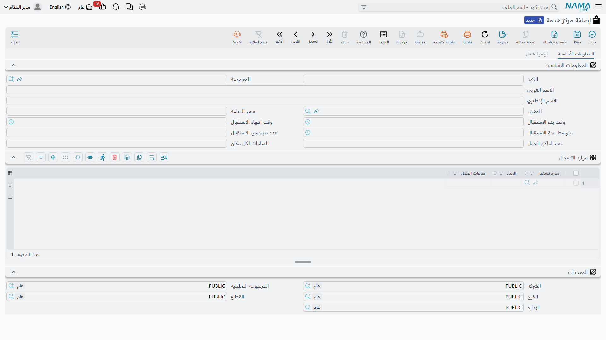

# مراكز الخدمة (صالات الإنتاج)

تدير شركة الصحراء للسيارات صالتين خلف المعرض: صالة ميكانيكا تُجرى فيها أعمال الزيوت والفرامل والتكييف، وصالة سمكرة ودهان. صالتان مختلفتان، بعمالة مختلفة ومعدات مختلفة وسعر ساعة مختلف، وسيارة العميل تذهب إلى إحداهما لا إلى كلتيهما. **مركز الخدمة** هو الملف الذي يقول ذلك.

وهو ملف قصير — عشرة حقول أو نحوها في صفحة واحدة — وقِصَره مقصود. يجيب مركز الخدمة عن ثلاثة أسئلة لا أكثر: *من أي مخزن تُصرف القطع، وكم تكلفة ساعة العمل هنا، وما حجم الورشة؟*

| | |
|---|---|
| القائمة | **مركز خدمة ← الملفات ← مركز خدمة** (`Service Center > Master Files > Service Center Work Center`) |
| النوع | ملف رئيسي — لا أثر مخزني ولا أثر محاسبي |

::: info الترخيص المطلوب
`srvcenter`
:::

::: tip الاسم يتطابق مع جذر القائمة
اسم هذا الملف الرئيسي بالعربية هو `مركز خدمة` — وهو نفس نص جذر القائمة الأعلى. فإذا قال أحدهم «افتح مركز الخدمة» فاسأله: الوحدة أم هذا الملف؟
:::

## صالتا الصحراء

| الكود | الاسم | المخزن | أماكن العمل × الساعات | سعر الساعة |
|---|---|---|---|---|
| `WC-MECH` | صالة الميكانيكا / Mechanical Hall | `WH-PARTS` | ٥ × ٨ | **١٢٠** |
| `WC-BODY` | صالة السمكرة والدهان / Body and Paint Hall | `WH-PARTS` | ٣ × ٨ | ١٥٠ |

كل [أمر شغل](/ar/modules/servicecenter/job-cycle/servicecenter-job-order.md)، وكل حجز، وكل [ورقة تنفيذ في صالة العمل](/ar/modules/servicecenter/workshop-execution/servicecenter-production-execution.md) تسمّي واحدة من هاتين. وبقية هذه الصفحة تشرح الحقول التي تفرّق بينهما.

## الشاشة

### المعلومات الأساسية

| الحقل | المسمى الإنجليزي | ماذا يفعل |
|---|---|---|
| الكود، المجموعة، الاسم العربي، الاسم الإنجليزي | Code, Group, Name1, Name2 | بيانات التعريف المعتادة لأي ملف رئيسي. `name1` هو الاسم العربي و`name2` هو الاسم الإنجليزي. |
| المخزن | Warehouse | مخزن الورشة الافتراضي. وهو `WH-PARTS` لصالتَي الصحراء — ومنه [تُصرف قطع الغيار](/ar/modules/servicecenter/spare-parts/servicecenter-spare-parts-issue.md) على أمر الشغل. |
| سعر الساعة | Hour Price | سعر ساعة العمل **الاحتياطي** لهذه الصالة: `120` في الميكانيكا و`150` في السمكرة والدهان. ولا يُستخدم إلا حين لا تجد المهمة سعرًا خاصًا بموديل السيارة — انظر أدناه. |
| وقت بدء الاستقبال / وقت انتهاء الاستقبال | Reception Start Time / Reception End Time | النافذة الزمنية التي تستقبل فيها الورشة السيارات. وهي `08:00` ← `14:00` في الصحراء. والحجز خارج هذه النافذة مرفوض — مع التحفّظ المذكور أدناه. |
| متوسط مدة الاستقبال | Reception Average Time | كم تستغرق شبّاك الاستقبال مع السيارة الواحدة — ١٥ دقيقة في الصحراء. |
| عدد مهندسي الاستقبال | Reception Engineers Count | عدد مستشاري الخدمة على الشبّاك — اثنان في الصحراء. |
| عدد اماكن العمل | Work Bays Count | مواقع العمل الفعلية. `5` في صالة الميكانيكا. |
| الساعات لكل مكان | Hours Per WorkBay | كم ساعة يعمل فيها المكان الواحد يوميًا. `8`. |

وثلاثة من هذه الحقول تملأ نفسها إن تركتها فارغة عند الحفظ: يصير بدء الاستقبال **٠٨:٠٠**، وانتهاؤه **١٤:٠٠**، ومتوسط مدة الاستقبال **١٥ دقيقة**. فإن أردت قيمًا أخرى فاكتبها، ولا تتوقع أن يبقى الحقل الفارغ فارغًا.

### أماكن العمل × الساعات — رقم الطاقة الوحيد

اضرب الحقلين الأخيرين تحصل على **إجمالي الساعات المتاحة** لليوم:

> ٥ أماكن × ٨ ساعات = **٤٠ ساعة يوميًا** في صالة الميكانيكا.

وهذه الأربعون هي المادة الخام [لجدول الطاقة اليومية](/ar/modules/servicecenter/workshop-execution/servicecenter-loading-table.md)، حيث تُقسَّم بين الحجوزات والمُرحَّل والزيارات المباشرة والطوارئ. وتنشر الصحراء ٨٠٪ منها — **٣٢ ساعة** — كوقت قابل للحجز، وهذا هو الرقم الذي يُفحص أمامه الحجز فعليًا.

والرقم يُحسب على جدول الطاقة لا هنا؛ ومركز الخدمة يوفّر العاملَين فحسب.

::: warning أول حجز في اليوم لا يُفحص أبدًا
الفحص الذي يقارن الحجز بنافذة الاستقبال وبساعات الحجوزات لا يعمل إلا إذا كان اليوم يحمل حجزًا آخر بالفعل. فأول حجز في أي يوم يمرّ بلا اختبار — يمكن أن يكون خمسين ساعة، في منتصف الليل، ولا شيء يعترض. أما الثاني فيُفحص، ويدخل الأول في الإجمالي.

وعمليًا يعني ذلك أن الورشة التي تستقبل حجزًا واحدًا في اليوم ليست مضبوطة أصلًا، وأن حجزًا أول مكتوبًا بالخطأ يلتهم طاقة اليوم في صمت قبل أن ينتبه أحد.
:::

::: danger انشر الطاقة لصالة واحدة فقط
جدول الطاقة اليومية لا يفرّق بين مراكز الخدمة. فإن نشرت جدولًا لصالة الميكانيكا وآخر لصالة السمكرة على نفس المدى الزمني، أَحَلّ أحدهما محل طاقة اليوم التي نشرها الآخر في صمت، وقد يُفحص الحجز أمام ساعات الصالة الخطأ.

وإلى أن يُصلَح ذلك، عامِل الطاقة المنشورة على أنها رقم **على مستوى التركيب كله**: انشرها مرة واحدة، للصالة التي تريد ضبطها فعلًا، وأدِر حِمل الصالة الثانية يدويًا. ولا تبنِ خطة طاقة متعددة الصالات على هذا الجدول.
:::

### جدول موارد التشغيل

أسفل الكتلة الأساسية جدول عنوانه **موارد التشغيل** (` Resources`) بثلاثة أعمدة — **مورد تشغيل** (` Resource`) و**العدد** (Resources Count) و**ساعات العمل** (Work Hours). وهو يدعوك إلى تسجيل الرافعة وجهاز الترصيص وغرفة الدهان وعدد ساعات إتاحة كل منها يوميًا.

::: warning هذا الجدول يُسجَّل ولا يُقرأ
لا شيء في الوحدة يقرأ هذه السطور. فلا جدولة للمعدات، ولا فحص للطاقة المحدودة، ولا رسالة تقول «جهاز الترصيص مشغول» — والأعداد والساعات التي تكتبها هنا لا تغيّر أي سلوك في أي مكان.

املأ الجدول إن أردت للملف أن يصف الورشة وصفًا أمينًا لقارئ بشري، واتركه فارغًا إن لم ترد. وفي الحالتين خطِّط لإتاحة المعدات خارج النظام.
:::

### المحددات

الكتلة المعتادة — الشركة (Legal Entity) والفرع (Branch) والقطاع (Sector) والإدارة (Department) والمجموعة التحليلية (Analysis Set) — تصنّف مركز الخدمة داخل الهيكل التنظيمي.

### صفحة أوامر الشغل

الصفحة الثانية، **أوامر الشغل** (Job Orders)، للقراءة فقط. وتحمل ثلاث قوائم — **التنفيذات** (Executions) و**الإستثناءات** (Exceptions) و**الأوامر المؤجلة** (Waiting Orders) — كي يفتح المشرف ملف الصالة فيرى ما تحمله، بما فيه الأوامر [الموقوفة بانتظار الاستكمال](/ar/modules/servicecenter/workshop-execution/servicecenter-pending-and-resume.md)، دون أن يذهب إلى شاشة قائمة أوامر الشغل. ولا يُكتب هنا شيء.

## سعر الساعة احتياطي لا قائمة أسعار

هذا هو الحقل الذي يُساء فهمه أكثر من غيره، ويستحق أن يُقال مرتين.

حين تختار مهمة خدمة على أمر شغل، يبحث النظام أولًا داخل **المهمة** عن سعر يناسب موديل السيارة. ومهمة تغيير الزيت في الصحراء تحمل سطرًا لموديل سيف ١٫٦ بسعر ١٢٠ للساعة، فهذا هو السعر الذي يأخذه أمر الشغل — ولا يُستشار سعر مركز الخدمة أصلًا.

وسعر مركز الخدمة هو ما ترجع إليه **إعادة الحساب على الخادم** حين لا تجد المهمة سطرًا مطابقًا. لذلك ينبغي أن يتفق الرقمان، وهما في الصحراء متفقان عن عمد: ١٢٠ في صالة الميكانيكا، و١٢٠ على سطور سيف ١٫٦ في كل مهمة ميكانيكية. وحيث يختلفان، قد تنقل إعادة الحساب سعر الشغل في صمت. والقصة كاملة في صفحة [مهام الخدمة](/ar/modules/servicecenter/workshop-setup/servicecenter-tasks.md).

## لا يوجد تدرّج للموارد

مركز الخدمة هو مورد الورشة **الوحيد** في الوحدة. فلا يوجد سجل لمكان العمل، ولا تقويم للمعدات، ولا كشف بالفنيين له طاقة، ولا بنية أب/ابن للصالات. الصالة ملف واحد مسطّح يحمل عدد أماكن العمل.

::: warning «المحطة» ليست مكان عمل في الورشة
تحت مجلد الملفات نفسه ستجد ملفًا رئيسيًا اسمه **محطة** (Service Center Station). يبدو كأنه ينبغي أن يكون مكان عمل أو محطة داخل الورشة، وليس كذلك: فهو يتبع خاصية **الرحلات وخطوط السير**، حيث يسمّي نقطة قيام أو وصول. وليس فيه حقول سوى الكود والأسماء والمحددات والمرفقات، ولا شيء في الورشة يقرؤه.

فلا تمثّل أماكن العمل لديك كمحطات. مثّلها بعدد أماكن العمل على مركز الخدمة — فهذا هو الموضع الوحيد الذي يعني فيه الرقم شيئًا.
:::

## كيف تنشئ مركز خدمة

1. قرّر كم مركز خدمة تحتاج فعلًا. والقاعدة الجيدة: مركز لكل صالة لها **سعر ساعة خاص** أو **مخزن خاص**؛ وما زاد على ذلك لا يشتري شيئًا، لأن الوحدة لا تمنحك جدولة عابرة للصالات.
2. أنشئ السجل بكوده واسميه، ووجّه **المخزن** إلى المخزن الذي تسحب منه الصالة قطعها، واضبط **سعر الساعة** على السعر نفسه الذي ستضعه في سطور المهام.
3. اضبط نافذة الاستقبال على الساعات التي يستقبل فيها الشبّاك السيارات فعلًا — فالحجز خارجها مرفوض، والنافذة الخطأ يُشعر بها فورًا.
4. اكتب عدد أماكن العمل والساعات لكل مكان. فهما العاملان اللذان يصنعان ساعات الصالة اليومية؛ اضبطهما قبل أن ينشر أحد أي طاقة.
5. اترك جدول موارد التشغيل لتقديرك، وأنت تعلم أنه وصفي.

ومتى وُجد مركز الخدمة أمكنك بناء [كتالوج المهام](/ar/modules/servicecenter/workshop-setup/servicecenter-tasks.md) وتجميع المهام في [خدمات](/ar/modules/servicecenter/workshop-setup/servicecenter-operations.md).
