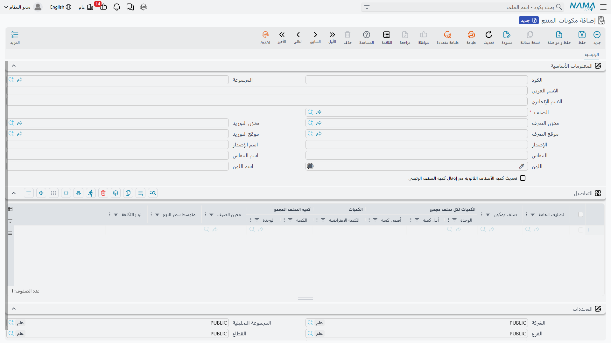
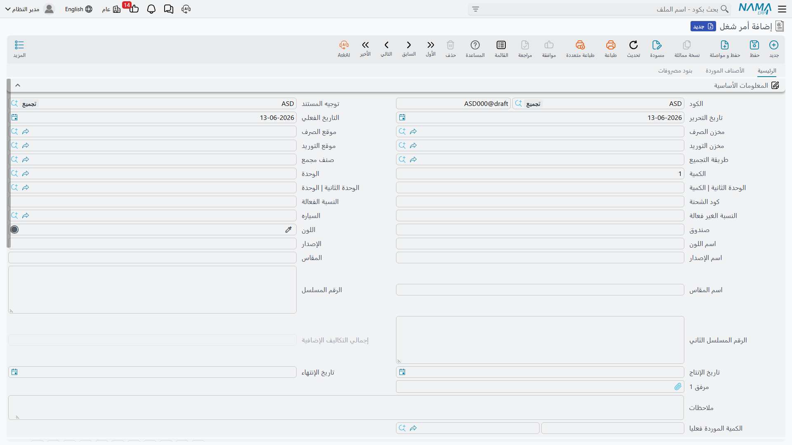

# التجميع والتعبئة (Assembly & Packaging)

ليس كل ما تبيعه تشتريه كما هو؛ فبعض الأصناف تُجمَّع من مكونات، أو تُحوَّل وتُعبَّأ قبل البيع. **التجميع (Assembly)** هو "التصنيع الخفيف" داخل سلسلة التوريد: تصرف مكونات وتستلم منتجًا مجمَّعًا، دون تعقيد أوامر الإنتاج الكاملة في وحدة التصنيع.

::: info متى التجميع ومتى التصنيع؟
استخدم التجميع للحالات البسيطة: تكوين حزم (Kitting)، أو تركيب تهيئات مخصصة، أو تعبئة. أما الإنتاج المعقّد بمراحله وعمالته ومصاريفه غير المباشرة فموطنه [وحدة التصنيع](/ar/modules/manufacturing/).
:::

## قائمة المكونات: الوصفة (AssemblyBOM)

**قائمة مكونات التجميع** هي "وصفة" المنتج المجمَّع: تحدّد الصنف الرئيسي ومكوّناته وكمياتها، إضافةً إلى المنتجات المشتركة (Co-products) ومحددات الأبعاد (المقاس، اللون، المراجعة)، ومخازن ومواقع الصرف والاستلام في عملية التجميع. كما تتيح ربط بدائل للمواد عند الحاجة لمرونة المصدر.

ولتقليل تكرار الإدخال، تتيح **قائمة المكونات الجزئية** (PartialAssemblyBOM) تعريف قاعدة تجميع على مستوى تصنيف الأصناف (لا لكل صنف على حدة)، فترث الأصناف المتشابهة بنية مكوّناتها. وتتوفر **مكوّنات التجميع** (AssemblyComponent) كسجلّ لمجموعات مكوّنات قابلة لإعادة الاستخدام.

## مستند التجميع: تنفيذ الوصفة (AssemblyDocument)

**مستند التجميع** يُنفِّذ العملية فعليًا: يصرف المكوّنات من المخزون ويستلم الصنف المجمَّع، مع توزيع التكاليف من المكوّنات إلى المنتج النهائي والمنتجات المشتركة، وإمكانية تتبع مراحل المعالجة وضبط الجودة.

**مثال - تجميع أنظمة حاسوب:** عميل يطلب 20 نظامًا كاملًا. يصرف المستند 20 وحدة أساسية و20 شاشة و20 لوحة مفاتيح و20 فأرة، ويستلم 20 نظامًا متكاملًا. فينخفض مخزون المكوّنات، ويرتفع مخزون الأنظمة، وتنتقل القيمة من المكوّنات إلى الأنظمة (تكلفة النظام = مجموع مكوّناته). ويدعم النظام أيضًا **التفكيك (De-assembly)** لعكس العملية: تفكيك حزمة لا تُباع إلى مكوّناتها لإعادة تخزينها.

### أنواع وأدوات التجميع

- **التجميع المجمَّع** (AggrAssemblyDocument): مستند تجميع دُفعي لعدة أصناف/أيام بمواد وتكاليف متراكمة، يفصل مخازن الفرز والمنتج النهائي ويولّد مستندات الصرف والاستلام المرتبطة.
- **مستند التجميع المتعدد** (MultiAssemblyDoc): يجمّع صنفًا رئيسيًا من عدة مواد ومكوّنات في مستند واحد.
- **طلب التجميع** (AssemblyRequest): يبدأ مسار التجميع طلبًا (بمكوّناته وكمياته) ويُحوَّل إلى مستند تجميع بعد الاعتماد.
- **بدائل المواد** (AssemblyAltMaterial): سجل المواد البديلة المعتمدة لكل قائمة مكونات، بنطاقات كمية وقواعد استبدال تحافظ على توافق المكوّنات مع مرونة المصدر.

### ملفات الإعداد المساندة

- **ملف عملية التجميع** (AssemblyProcessFile): يعرّف خطوات عملية التجميع (مسار العمليات) لضبط الجودة وتتبع الدفعات.
- **آلة التجميع** (AssemblyMachine): تعرّف الماكينة المستخدمة ومخازن موادها الخام وغير المباشرة ومخرجاتها وتكاليفها.

## المعالجة (ProcessingDoc)

**مستند المعالجة** يوثّق عمليات معالجة وسيطة: يدير المواد الخام وغير المباشرة والمخرجات مع تعيين المخزن والموقع، ويولّد مستندات المخزون المرتبطة مع تتبع العمالة المباشرة وتاريخ/توقيت الدفعة للتتبّع.

## التعبئة (PackagingMethodFile)

**ملف طريقة التعبئة** يعرّف وحدات التعبئة القياسية للمنتج النهائي ومكوّنات تعبئته (الكمية لكل عبوة)، فيُستخدم في احتساب التكلفة وتجميع التسليم. هذا يربط شكل المنتج كما يُباع (عبوة، كرتون، طبلية) بمكوّناته الفعلية في المخزون.

## التجميع والتكلفة

تجميع المنتج يعني تجميع تكلفته. يلتقط **تسعير المنتجات التامة** هذا التجميع من قائمة المكونات أو مستند التجميع ليصل إلى التكلفة النهائية - تجد تفاصيله في [تكلفة المخزون وإعادة التقييم](./inventory-costing.md).

## الخطوات التالية

- [تكلفة المخزون وإعادة التقييم](./inventory-costing.md) - تجميع تكاليف المنتجات المجمَّعة
- [ضبط الجودة](./quality-control.md) - فحص الجودة ضمن مراحل التجميع
- [وحدة التصنيع](/ar/modules/manufacturing/) - الإنتاج المعقّد بأوامره الكاملة
