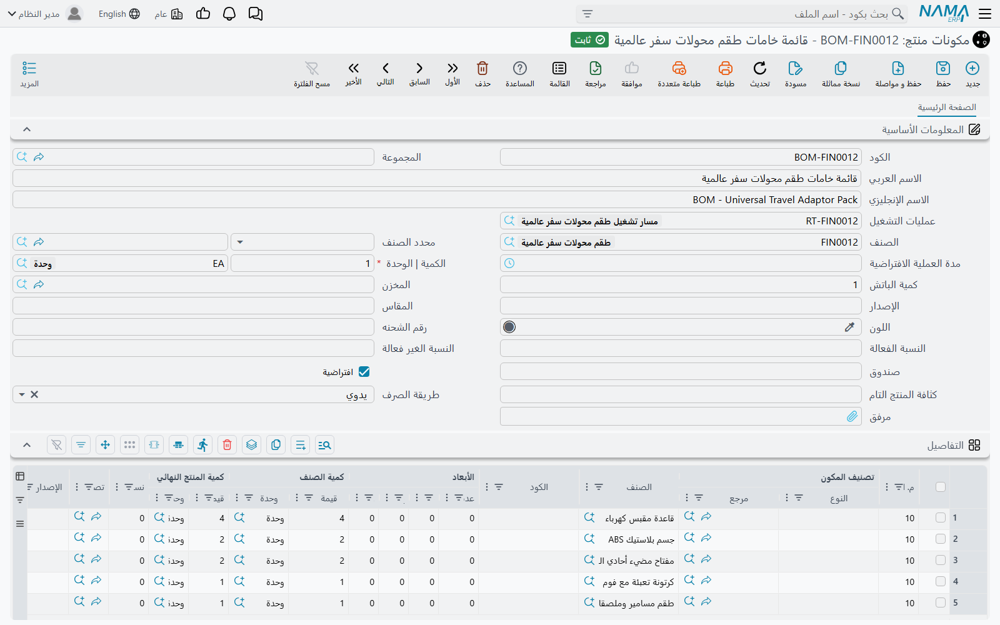
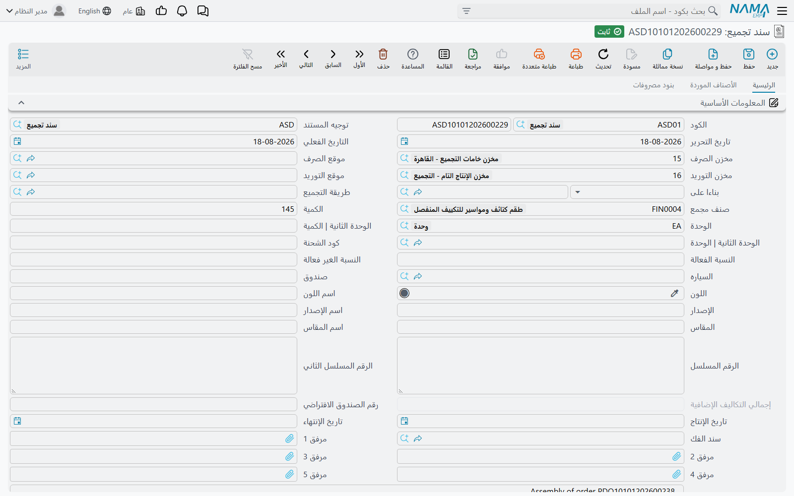

# التجميع والتعبئة (Assembly & Packaging)

ليس كل ما تبيعه تشتريه كما هو؛ فبعض الأصناف تُجمَّع من مكونات، أو تُحوَّل وتُعبَّأ قبل البيع. **التجميع (Assembly)** هو "التصنيع الخفيف" داخل سلسلة التوريد: تصرف مكونات وتستلم منتجًا مجمَّعًا، دون تعقيد أوامر الإنتاج الكاملة في وحدة التصنيع.

::: info متى التجميع ومتى التصنيع؟
استخدم التجميع للحالات البسيطة: تكوين حزم (Kitting)، أو تركيب تهيئات مخصصة، أو تعبئة. أما الإنتاج المعقّد بمراحله وعمالته ومصاريفه غير المباشرة فموطنه [وحدة التصنيع](/ar/modules/manufacturing/).
:::

## قائمة المكونات: الوصفة (AssemblyBOM)

**قائمة مكونات التجميع** هي "وصفة" المنتج المجمَّع: تحدّد الصنف الرئيسي ومكوّناته وكمياتها، إضافةً إلى المنتجات المشتركة (Co-products) ومحددات الأبعاد (المقاس، اللون، المراجعة)، ومخازن ومواقع الصرف والاستلام في عملية التجميع. كما تتيح ربط بدائل للمواد عند الحاجة لمرونة المصدر.

ولتقليل تكرار الإدخال، تتيح **قائمة المكونات الجزئية** (PartialAssemblyBOM) تعريف قاعدة تجميع على مستوى تصنيف الأصناف (لا لكل صنف على حدة)، فترث الأصناف المتشابهة بنية مكوّناتها. وتتوفر **مكوّنات التجميع** (AssemblyComponent) كسجلّ لمجموعات مكوّنات قابلة لإعادة الاستخدام.

## مستند التجميع: تنفيذ الوصفة (AssemblyDocument)

**مستند التجميع** يُنفِّذ العملية فعليًا: يصرف المكوّنات من المخزون ويستلم الصنف المجمَّع، مع توزيع التكاليف من المكوّنات إلى المنتج النهائي والمنتجات المشتركة، وإمكانية تتبع مراحل المعالجة وضبط الجودة.

**مثال - تجميع أنظمة حاسوب:** عميل يطلب 20 نظامًا كاملًا. يصرف المستند 20 وحدة أساسية و20 شاشة و20 لوحة مفاتيح و20 فأرة، ويستلم 20 نظامًا متكاملًا. فينخفض مخزون المكوّنات، ويرتفع مخزون الأنظمة، وتنتقل القيمة من المكوّنات إلى الأنظمة (تكلفة النظام = مجموع مكوّناته). ويدعم النظام أيضًا **التفكيك (De-assembly)** لعكس العملية: تفكيك حزمة لا تُباع إلى مكوّناتها لإعادة تخزينها.

### أنواع وأدوات التجميع

- **التجميع المجمَّع** (AggrAssemblyDocument): مستند تجميع دُفعي لعدة أصناف/أيام بمواد وتكاليف متراكمة، يفصل مخازن الفرز والمنتج النهائي ويولّد مستندات الصرف والاستلام المرتبطة.
- **مستند التجميع المتعدد** (MultiAssemblyDoc): يجمّع صنفًا رئيسيًا من عدة مواد ومكوّنات في مستند واحد.
- **طلب التجميع** (AssemblyRequest): يبدأ مسار التجميع طلبًا (بمكوّناته وكمياته) ويُحوَّل إلى مستند تجميع بعد الاعتماد.
- **بدائل المواد** (AssemblyAltMaterial): سجل المواد البديلة المعتمدة لكل قائمة مكونات، بنطاقات كمية وقواعد استبدال تحافظ على توافق المكوّنات مع مرونة المصدر.

### ملفات الإعداد المساندة

- **ملف عملية التجميع** (AssemblyProcessFile): يعرّف خطوات عملية التجميع (مسار العمليات) لضبط الجودة وتتبع الدفعات.
- **آلة التجميع** (AssemblyMachine): تعرّف الماكينة المستخدمة ومخازن موادها الخام وغير المباشرة ومخرجاتها وتكاليفها.

## المعالجة (ProcessingDoc)

**مستند المعالجة** يوثّق عمليات معالجة وسيطة: يدير المواد الخام وغير المباشرة والمخرجات مع تعيين المخزن والموقع، ويولّد مستندات المخزون المرتبطة مع تتبع العمالة المباشرة وتاريخ/توقيت الدفعة للتتبّع.

## التعبئة (PackagingMethodFile)

**ملف طريقة التعبئة** يعرّف وحدات التعبئة القياسية للمنتج النهائي ومكوّنات تعبئته (الكمية لكل عبوة)، فيُستخدم في احتساب التكلفة وتجميع التسليم. هذا يربط شكل المنتج كما يُباع (عبوة، كرتون، طبلية) بمكوّناته الفعلية في المخزون.

## الإجراءات في هذه الشاشات

**في سند التجميع وطلب التجميع:** **حساب القيم من بنود المصروفات** (Calculate Values From Expense Items) — يحسب قيمة كل سطر مصروف من كمية التجميع والصنف المجمَّع ويكتبها في السطور، فلا تُدخل الأعباء المحمَّلة على الصنف المجمَّع يدويًا.

**في سند التجميع الإجمالي:**

- **حساب الخامات** (Calc Materials) — يجب حفظ المستند؛ يحسب الخامات التي يحتاجها التجميع كله ويملأ جدول الخامات.
- **حساب مستلزمات الخامات الرئيسية** (Calculate Main Materials Dependent Data) — يحتاج المستند محفوظًا كذلك، ويملأ كل ما يتفرّع عن الخامات الرئيسية بعد أن تُعرف.
- **تجميع الشحنات للخامات** (Collect Material Lots) و**تجميع صناديق الخامات** (Collect Material Boxs) — يملآن الشحنة والصندوق في كل سطر خامة من المتاح في مخزن الرأس. وكلاهما يسأل أولًا عن مسح ما أُدخل من قبل.

**في سند التجميع المتعدد:**

- **فرد السطور الرئيسية** (Spread Main Items) — يفرد جدول الأصناف الرئيسية إلى سطور التفاصيل، فيصير الصف الواحد لكل منتج تام مجموعةَ سطور كاملة.
- **تغيير حالة السطور و إنشاء سندات التجميع حسب المستوى** (Change Details Status To Create Assembly Documents By Level) — يقلب حالات السطور لتُنشأ سندات التجميع مستوًى بعد مستوى، وهو ما يحتاجه التجميع متعدد المستويات.
- **حذف سندات التجميع المنشأة** (Delete Generated Assembly Documents) — يحذف سندات التجميع التي أنشأها هذا المستند. ويطلب التأكيد أولًا ولا يفعل شيئًا حتى تؤكّد.

**وفي مستند المعالجة** يحمل جدول العمالة المباشرة زرَّي **بدء** (Start) و**إنهاء** (End): وأنت واقف على سطر عمالة، يسجّلان تاريخ ووقت بدايته ونهايته، فيُرصد الوقت المستغرق أثناء العمل لا تقديرًا بعده.

## التجميع والتكلفة

تجميع المنتج يعني تجميع تكلفته. يلتقط **تسعير المنتجات التامة** هذا التجميع من قائمة المكونات أو مستند التجميع ليصل إلى التكلفة النهائية - تجد تفاصيله في [تكلفة المخزون وإعادة التقييم](./inventory-costing.md).

## رسائل قد تظهر لك

| الرسالة | لماذا | ما تفعله |
|---|---|---|
| «لا يمكن الحفظ بدون أصناف مسحوبة عند إستحدام طريقة تجميع» | مستند التجميع يذكر طريقة تجميع وجدول الأصناف المصروفة فيه فارغ، وتوجيه المستند مفعّل فيه خيار *منع الحفظ بدون أصناف مصروفة عند استخدام طريقة تجميع*. | املأ جدول المكونات المصروفة من طريقة التجميع قبل الحفظ، أو أوقف ذلك الخيار في التوجيه إن كانت المسودات الفارغة مطلوبة. |
| «لا يوجد سطر في الاصناف الموردة بمُعرف تكلفة {0}» | التكلفة تُوزَّع على سطر المنتج الثانوي المصدر فقط، وأحد سطور التفاصيل يحمل معرّف تكلفة لا يقابله أي سطر منتج ثانوي. | صحّح معرّف التكلفة في سطر التفاصيل ليطابق أحد سطور المنتجات الثانوية، أو أضف المنتج الثانوي الناقص. |
| «معرف التكلفة {0} مكرر في السطر {1}» | سطران من المنتجات الثانوية يتشاركان معرّف التكلفة نفسه، فلا يعرف النظام أيهما تتبعه التكلفة. | أعطِ كل سطر منتج ثانوي معرّف تكلفة خاصًا به. |
| «لا تحتوى عمليات التجميع على الصنف المورد {0}» | التوجيه مفعّل فيه *منع الحفظ إذا لم يكن المنتج الثانوي في عمليات التجميع*، وأحد المنتجات الثانوية في المستند لا تنتجه أي من سطور عمليات التجميع المذكورة فيه. | أضف الصنف إلى سطور ملف عمليات التجميع (المحسوبة من المنتجات الثانوية)، أو احذف المنتج الثانوي من المستند. |
| «الصنف {0} في السطر رقم {1} - في المستند {2} - {3} لا يمكن صرفه وتوريده من نفس سند التجميع» | الصنف نفسه، بالدفعة والمقاس واللون والإصدار نفسها، مذكور بين المكونات المصروفة وبين الأصناف الموردة معًا. ولا يمكن للتكلفة أن تخرج من سطر المخزون نفسه وتدخل إليه في مستند واحد. | قسّم العملية على مستندين، أو ميّز المخزون المورد بدفعة أو مقاس أو لون أو إصدار أو مخزن أو موقع مختلف. |
| «يرجي ملأ دفتر وتوجيه التكاليف الإضافيه في التوجيه {0}» | مستند التجميع به سطور مصاريف فيلزمه إنشاء مستند مصروفات استلام، لكن التوجيه الذي حُفظ عليه لا يذكر دفترًا وتوجيهًا لذلك المستند. | افتح توجيه المستند واملأ *دفتر مستند التكاليف الإضافية* و*توجيه مستند التكاليف الإضافية*. |
| «الصنف {0} لا يحتوي على الوحدة {1}» | أُدخلت وحدة على صنف طريقة التجميع، أو على سطر في مستند التجميع، ليست من وحدات الصنف الأساسية ولا الثانوية. | اختر إحدى الوحدات المدرجة في الصنف، أو أضف الوحدة إلى جدول وحدات الصنف أولًا. |
| «من تاريخ {0} لا يمكن أن يكون أكبر من إلى تاريخ {1} في السطر رقم {2}» | سطر في جدول طرق التجميع البديلة بطريقة التجميع تاريخُ «من» فيه ليس أقدم من تاريخ «إلى». والتاريخان المتساويان مرفوضان كذلك، فنافذة اليوم الواحد تُدخل بتاريخين متتاليين. | اجعل تاريخ «إلى» بعد تاريخ «من» بيوم على الأقل. |
| «وحدة الكمية الافتراضية يجب أن تكون من وحدات المكون {0}» | وحدة الكمية في سطر مكوّن بطريقة التجميع ليست من وحدات ذلك المكوّن **الأساسية** - والوحدة الثانوية غير مقبولة هنا، وإن كانت مقبولة على صنف طريقة التجميع نفسه. | غيّر وحدة السطر إلى إحدى الوحدات الأساسية للمكوّن. |
| «وحدة كمية الصنف المجمع يجب أن تكون من وحدات المكون {0}» | وحدة الصنف المجمّع في سطر مكوّن ليست وحدة أساسية للصنف المجمّع الذي أُعدَّت له طريقة التجميع. ورغم نص الرسالة، فالصنف المذكور فيها هو الصنف المجمّع لا المكوّن. | غيّر وحدة الصنف المجمّع إلى إحدى وحداته الأساسية. |
| «لايمكن ترك طريقة التجميع فارغة» | سطر تفاصيل في مستند التجميع المتعدد بلا طريقة تجميع، فلا يعرف النظام الوصفة التي يُبنى بها ذلك المنتج. | املأ طريقة التجميع في السطر. والنص العربي لا يذكر رقم السطر الذي يذكره النص الإنجليزي. |
| «الصنف {0} في السطر {1} غير موجود في تفاصيل بنود المصروفات» | سطر مصاريف في مستند التجميع المتعدد يذكر صنفًا ليس من المنتجات المجمّعة، فلا شيء تُحمَّل عليه المصاريف. | عدّل سطر المصاريف إلى أحد المنتجات المجمّعة، أو أضف ذلك المنتج إلى جدول التفاصيل. |
| «إجمالى الكمية {0} لسطور {1} يجب أن تساوى الكمية فى الهيدر ({2})» | في المواد البديلة، كميات أحد جداول البدائل لا تساوي مجموعها الكمية المذكورة في الرأس، فالاستبدال يغيّر إجمالي الوصفة. | عدّل كميات الجدول حتى تساوي كمية الرأس - وكل من الجداول الخمسة يُفحص وحده. |
| «لا يمكن ليند المصروف {0} ان يكون نسبة من نفسه» | سطر في ملف عمليات التجميع يجعل بند مصروف نسبةً من مجموعة مصاريف تشمله هو نفسه، وهذا لا يُحسب. | احذف بند المصروف من مجموعة التكاليف الإضافية الخاصة به. |
| «الأوبشن {0} يجب تقعيله مع القيمة {1} للحقل {2}» | في ملف عمليات التجميع، وُسم خيار *نقل الصنف إلى توزيع التكلفة على الصنف* في سطر يحسب من جدول التفاصيل لا من المنتجات الثانوية. | إما أن تجعل السطر يحسب من المنتجات الثانوية، أو تلغِ وسم الخيار. |
| «لا يمكنك استعمال ملفات طرق التعبئة مع القيمة {0} للحقل {1}» | أُرفقت ملفات طرق تعبئة بسطر في ملف عمليات التجميع لا يحسب من المنتجات الثانوية. | اجعل السطر يحسب من المنتجات الثانوية، أو احذف ملفات طرق التعبئة منه. |

## الخطوات التالية

- [تكلفة المخزون وإعادة التقييم](./inventory-costing.md) - تجميع تكاليف المنتجات المجمَّعة
- [ضبط الجودة](./quality-control.md) - فحص الجودة ضمن مراحل التجميع
- [وحدة التصنيع](/ar/modules/manufacturing/) - الإنتاج المعقّد بأوامره الكاملة
