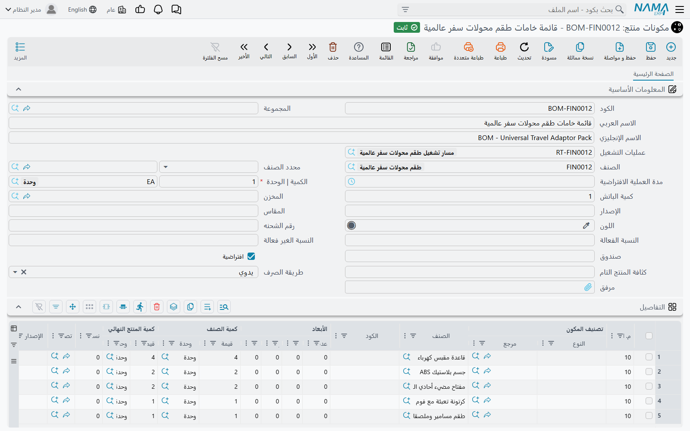

# طرق التجميع والمكونات وطرق التعبئة (Assembly BOMs, Components & Packaging Methods)

قبل أن تجمّع أي شيء يحتاج النظام أن يعرف الوصفة. محل الحاسبات الذي يجمّع **جهاز DT-500** يحفظ عن ظهر قلب أنه يحتاج صندوقًا واحدًا ولوحة أم واحدة وشريحتي ذاكرة 8 جيجا وقرصًا واحدًا 512 جيجا — و**طريقة التجميع** هي المكان الذي تكتب فيه ذلك مرة واحدة، فيملأ كل سند تجميع بعدها نفسه بنفسه.

تشرح هذه الصفحة الوصفة والملفات الرئيسية المتفرعة منها. أما المستندات التي تستخدم الوصفة فتجدها في [طلبات التجميع وسندات التجميع](./assembly-documents-and-requests.md).

## طريقة تجميع أصناف (Assembly BOM)

**المخازن ← التجميع ← طريقة تجميع أصناف**. وداخل المستندات يُسمّى السجل نفسه **طريقة التجميع**.

### الرأس

| الحقل | ما يفعله |
|---|---|
| **الصنف** | الصنف التام الذي تصنعه هذه الوصفة — جهاز DT-500. |
| **وحدة الصنف** | الوحدة التي كُتبت الوصفة لها. يجب أن تكون من وحدات الصنف الأساسية أو الثانوية. |
| **مخزن الصرف** / **موقع الصرف** | من أين تُصرف المكونات عادةً. |
| **مخزن التوريد** / **موقع التوريد** | أين يوضع الصنف التام عادةً. |
| **الإصدار**، **المقاس**، **اللون** | نوعية الصنف التام، إن كانت الوصفة لنوعية واحدة فقط. |
| **متوسط سعر البيع** | يُنسخ إلى سطر الصنف التام في سند التجميع؛ ويُستعمل حين تُوزَّع التكلفة بقيمة البيع (انظر [كيف تُوزَّع التكلفة](./assembly-documents-and-requests.md)). |
| **عدم التشارك في تكلفة الأصناف الغير المخططة** | يُستعمل مع حساب التكلفة من الأصناف المسحوبة المخططة: المنتج المصنوع بهذه الطريقة لا يتحمل نصيبًا من مكونات ليست في وصفته. |
| **تحديث كمية الأصناف الثانوية مع إدخال كمية الصنف الرئيسي** | عند تفعيله تتغير كميات الأصناف في جدول **أصناف أخرى** مع الكمية المجمَّعة بدل أن تُنسخ كميات ثابتة. |

اختيار طريقة التجميع في سند التجميع ينسخ إلى رأس السند الصنفَ ووحدته والمخزنين والموقعين والنوعية وهذا الخيار الأخير، فنادرًا ما يكتب القائمون على العمل أيًّا منها بأيديهم.

### جدول التفاصيل — المكونات

كل سطر يذكر في **صنف /مكون** إما صنفًا أو **مكونًا** (انظر أدناه)، ويقول كم منه يدخل في كم من الصنف التام:

- **الكميات لكل صنف مجمع | الوحدة** و**الكمية الافتراضية** — كم من المكون. يجب أن تكون الوحدة من الوحدات **الأساسية** للمكون.
- **كمية الصنف المجمع | الكمية** و**الوحدة** — لكل كم من الصنف التام. اتركها فارغة فيملؤها النظام بـ **1** من وحدة الصنف في الرأس. ويجب أن تكون الوحدة من الوحدات الأساسية للصنف التام.

فعبارة "شريحتا ذاكرة لكل جهاز" تعني الكمية الافتراضية 2 وكمية الصنف المجمع 1. وبرميل غراء يكفي 50 جهازًا يعني الكمية الافتراضية 1 وكمية الصنف المجمع 50 — فتجميع 20 جهازًا يصرف 0.4 برميل. ويقرّب **الكمية دائما رقم صحيح** الكمية المصروفة إلى أعلى عدد صحيح (برميل واحد لا 0.4). أما **أقل كمية** و**أقصى كمية** فحدود؛ وإن تُركت الكمية الافتراضية فارغة أخذت الحد الأدنى، فإن لم يوجد فالحد الأقصى.

وبقية السطر تتحكم في *متى* يُستعمل ومن *أين* يُصرف:

- **مخزن الصرف** / **موقع الصرف** في السطر يُنسخ إلى سطر ذلك المكون في السند. لكن انتبه: سند التجميع الذي في رأسه مخزن صرف يكتب مخزن الرأس على كل سطر مسحوب عند الحفظ، فلا يبقى مخزن السطر إلا إذا ترك رأس السند مخزن الصرف فارغًا.
- **يستعمل فقط مع وحدة / حجم / لون / كود الشحنة / إصدار / صندوق / النسبة الفعالة / النسبة الغير فعالة للصنف المجمع** — لا يُستعمل السطر إلا إذا كان للصنف الذي يُجمَّع تلك القيمة. فتغطي طريقة واحدة النوعيتين الحمراء والزرقاء، وكل منهما تسحب دهانها.
- **يستخدم فقط مع اصدارات / الوان / احجام الصنف الرئيسي** — الفكرة نفسها بقائمة قيم مفصولة بفواصل.
- **طريقة التجميع الفرعية** — المكون نفسه يُجمَّع، بهذه الطريقة. و[سند التجميع المتعدد](./multi-level-and-aggregated-assembly.md) يتبع هذه الروابط ليبني كل المستويات.
- **تصنيف الخامة** — يربط السطر بجدول من جداول شاشة خامات التجميع البديلة (أدناه).
- **خام رئيسي**، **معتمد على عدد الكرتون**، **واحد للبالتة**، **للخامات الرئيسية** — لا يقرؤها إلا [سند التعبئة المتعدد](./multi-level-and-aggregated-assembly.md). ولا يجوز أن يكون أكثر من سطر واحد خامًا رئيسيًا.
- **متوسط سعر البيع**، **نوع التكلفة**، **% التكلفة** — تُستعمل حين تكون هذه الطريقة وصفةً *لفك* صنف إلى أجزائه، لأن هذه السطور تصير حينها هي الأصناف الموردة. انظر [الفك](./assembly-documents-and-requests.md).

### أصناف أخرى، والملاحظات، والطرق البديلة المؤرخة

جدول **أصناف أخرى** (Coproducts) يذكر كل ما ينتج عن التجميع غير المنتج الرئيسي — منتج ثانوي، أو قصاصة، أو درجة ثانية. وعند اختيار طريقة التجميع في سند التجميع تُضاف هذه السطور إلى **الأصناف الموردة** في السند، بنوع تكلفتها و% تكلفتها، فتُورَّد مع المنتج الرئيسي.

**ملاحظات طريقة التجميع** نص حر للورشة.

أما **طرق التجميع البديلة** فتذكر طريقة تجميع أخرى بـ **من تاريخ** و**إلى تاريخ**. وتُقرأ حين تكون هذه الطريقة محددة على صنف في حقل **طريقة فرد مكونات الصنف المجمع** — حالة الطقم في فاتورة البيع: مستند البيع الذي في توجيهه **فرد مكونات الصنف المجمع مع الحفظ** أو **فرد مكونات الصنف المجمع مع الإدخال** يستبدل بسطر الطقم سطور مكوناته، ويستعمل الطريقة البديلة التي تغطي تواريخها التاريخ الفعلي للمستند. ويجب أن يكون «من تاريخ» أقدم فعلًا من «إلى تاريخ».

## مكون (Components)

**المخازن ← التجميع ← مكون**.

المكون مجموعة أصناف متبادلة يذكرها سطر في طريقة التجميع بدل صنف واحد — "أي قرص 512 جيجا"، مع سرد طُرز الأقراص الثلاثة التي تخزّنها. كل سطر يحمل صنفًا وكميته ووحدته وأبعاده ونوعيته؛ ضع علامة **الإفتراضي** على السطر الذي يُستعمل حين لا يُحدَّد غيره. و**السماح بتكرار السطور** يسمح بظهور الصنف نفسه مرتين.

حين يُملأ سند التجميع من سطر طريقة يذكر مكونًا، يأخذ السطر الافتراضي (أو السطر الأول إن لم يُعلَّم سطر): صنفه وكميته ووحدته ونوعيته. ويحتفظ السطر في السند بالمكون في عمود **مكون**، فترى أي اختيار يمثله الصنف. ولا يجوز لسطر في طريقة التجميع يذكر مكونًا أن يحمل إصدارًا أو مقاسًا أو لونًا خاصًا به — فهذه تأتي من المكون.

## طريقة تجميع جزئية (Partial Assembly BOM)

**المخازن ← التجميع ← طريقة تجميع جزئية**.

طريقة التجميع الجزئية جزء من وصفة لتصنيف لا لصنف: في رأسها **قسم الصنف** وحتى عشرة حقول **تصنيف**، وجدول تفاصيل بأعمدة طريقة التجميع نفسها. "كل صنف في تصنيف *أبواب حديد* يحتاج 4 مفصلات وقفلًا واحدًا" طريقة جزئية؛ و"كل صنف في تصنيف *مزجَّج* يحتاج أيضًا لوح زجاج" طريقة أخرى.

الطرق الجزئية لا تفعل شيئًا وحدها. إنما تتحول إلى طرق تجميع حقيقية بمسار الكيان [EAUniCreteGenAssemblyBOM](/entity-flows/supplychain/EAUniCreteGenAssemblyBOM)، الذي يُشغَّل على قسم صنف أو تصنيف صنف: لكل صنف فيه يجمع المسار كل الطرق الجزئية التي يحمل الصنف تصنيفاتها، ويكتب سطورها مجتمعة في طريقة تجميع ذلك الصنف (فينشئها إن لم توجد، ويستبدل تفاصيلها إن وُجدت). ولا يعمل أكثر من تشغيل واحد في الوقت نفسه.

## خامات التجميع البديلة (Assembly Alternative Material)

**المخازن ← التجميع ← خامات التجميع البديلة**.

أحيانًا تسمح الوصفة بالاستبدال: الكعكة تحتاج 100 كجم دقيق، لكنه قد يكون كله من النوع أ، أو 60 من أ و40 من ب. يعمل ملفان معًا لهذا:

1. **تصنيف الخامة** (في **المبيعات ← الملفات**) فيه إعداد واحد: **التصنيف يؤثر على جدول بدائل الخامات** — من جدول 1 إلى جدول 5، أو بدون. ضع التصنيف على سطور طريقة التجميع القابلة للاستبدال.
2. سجل **خامات التجميع البديلة** يذكر **طريقة التجميع** و**الكمية**. اختيار طريقة التجميع يملأ جداوله الخمسة، جدولًا في كل تبويب: كل سطر في الطريقة يشير تصنيف خامته إلى جدول *ن* يذهب إلى الجدول *ن*. ثم تعدّل الأصناف والكميات — ويجب أن يساوي مجموع كميات كل جدول الكميةَ في الرأس.

وفي سند التجميع، اختر سجل الخامات البديلة في عمود **خامات التجميع البديلة** على سطر من الأصناف الموردة. حينها تُحسب مكونات ذلك المنتج من الجدول بدل طريقة التجميع: سطر الطريقة المصنَّف يأخذ الكمية التي لصنفه في الجدول المقابل، ويُستبعد تمامًا إن لم يكن صنفه في ذلك الجدول. ويجب أن تساوي كمية السطر المورد كميةَ سجل الخامات البديلة.

## ملف طريقة تعبئة (Packaging Method File)

**المخازن ← التجميع ← ملف طريقة تعبئة**.

طريقة التعبئة تذكر ما تستهلكه عبوة واحدة: كرتونة، وفاصل، وملصقان، وشريط لاصق. **الكمية للعبوة الواحدة** هي عدد وحدات المنتج في العبوة؛ وجدول التفاصيل يذكر خامات التعبئة وكمية كل منها للعبوة.

في سند التجميع (أو الطلب) يمكن لسطر في الأصناف الموردة أن يذكر **طريقة التعبئة**. فيقترح النظام **كمية التعبئه** — عدد العبوات — بقسمة كمية السطر على الكمية للعبوة الواحدة مع التقريب لأعلى: 100 كيس بواقع 12 في الكرتونة تعني 9 كراتين. وعند الحفظ يضيف خامات التعبئة إلى **الأصناف المسحوبة**، مضروبة في عدد العبوات، ويعلّمها **تعبئة خام**. وهذه السطور يُعاد بناؤها مع كل حفظ، فغيّر التعبئة على السطر المورد لا على السطور المنشأة. وتذهب تكلفتها إلى سطر المنتج الذي طلبها، لا إلى الوعاء المشترك بين كل الأصناف الموردة.

ويمكن أيضًا أن تستهدف [ملفات عمليات التجميع](./assembly-documents-and-requests.md) طريقة تعبئة بعينها، لتحميل مصروف على المنتجات المعبأة بتلك الطريقة فقط.

## رسائل قد تظهر لك

| الرسالة | لماذا | ما تفعله |
|---|---|---|
| «الصنف {0} لا يحتوي على الوحدة {1}» | **وحدة الصنف** في طريقة التجميع ليست من وحدات الصنف الأساسية ولا الثانوية. | اختر إحدى وحدات الصنف، أو أضف الوحدة إلى الصنف أولًا. |
| «وحدة الكمية الافتراضية يجب أن تكون من وحدات المكون {0}» | وحدة سطر في التفاصيل ليست من الوحدات **الأساسية** للمكون. والوحدة الثانوية مرفوضة هنا، وإن كانت مقبولة وحدةً للصنف في الرأس. | استعمل إحدى الوحدات الأساسية للمكون. |
| «وحدة كمية الصنف المجمع يجب أن تكون من وحدات المكون {0}» | **كمية الصنف المجمع \| الوحدة** ليست وحدة أساسية للصنف التام. ورغم نص الرسالة، فالصنف المذكور فيها هو الصنف التام لا المكون. | اختر وحدة أساسية للصنف التام. |
| «الكمية الإفتراضية يجب أن تكون أكبر من الصفر» | سطر يذكر صنفًا ليس فيه كمية افتراضية ولا أقل ولا أقصى موجبة. | أدخل كمية أكبر من الصفر. |
| *You can select only one line to be main material* | أكثر من سطر معلَّم **خام رئيسي**. هذه الرسالة لا ترجمة عربية لها وتظهر بالإنجليزية على الشاشات العربية. | أزل العلامة عن كل السطور إلا واحدًا. |
| «لا يمكن إدخال إصدار لمكون» (ومثلها «لا يمكن إدخال مقاس لمكون» و«لا يمكن إدخال لون لمكون») | سطر يذكر مكونًا وفيه أيضًا إصدار أو مقاس أو لون. | امسحه — سطور المكون نفسه تحمل النوعية. |
| «من تاريخ {0} لا يمكن أن يكون أكبر من إلى تاريخ {1} في السطر رقم {2}» | في سطر من طرق التجميع البديلة ليس «من تاريخ» أقدم من «إلى تاريخ». والتاريخان المتساويان مرفوضان أيضًا. | اجعل «إلى تاريخ» بعد «من تاريخ» بيوم على الأقل. |
| «إجمالى الكمية {0} لسطور {1} يجب أن تساوى الكمية فى الهيدر ({2})» | في خامات التجميع البديلة، كميات أحد الجداول لا يساوي مجموعها الكمية في الرأس. كل جدول من الخمسة يُفحص وحده، والجدول الفارغ لا يُفحص. | عدّل ذلك الجدول حتى يساوي مجموعه كمية الرأس. |
