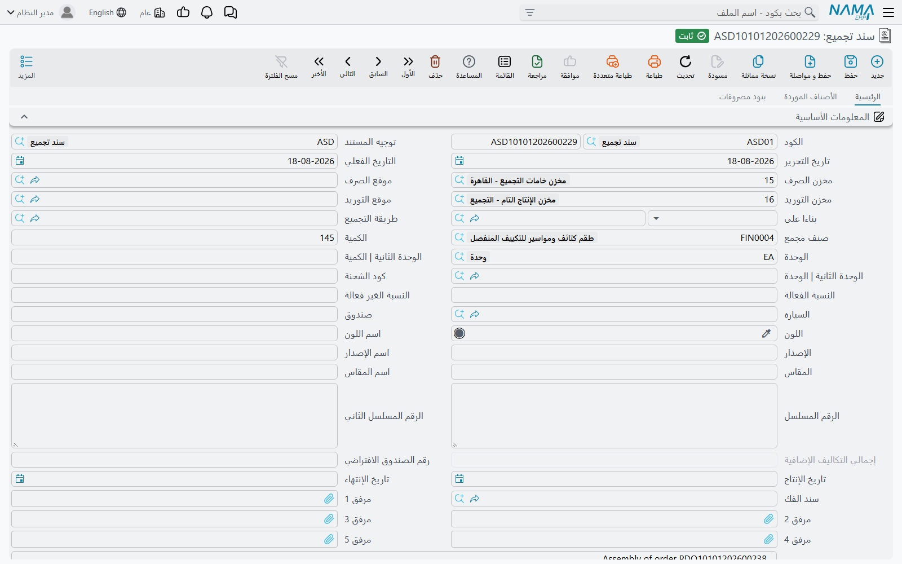
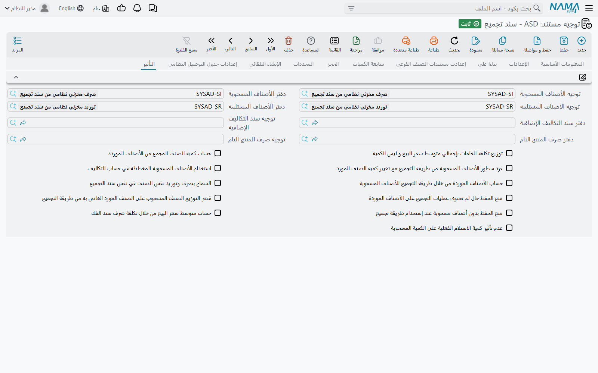
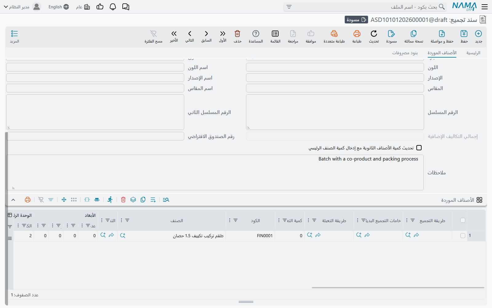
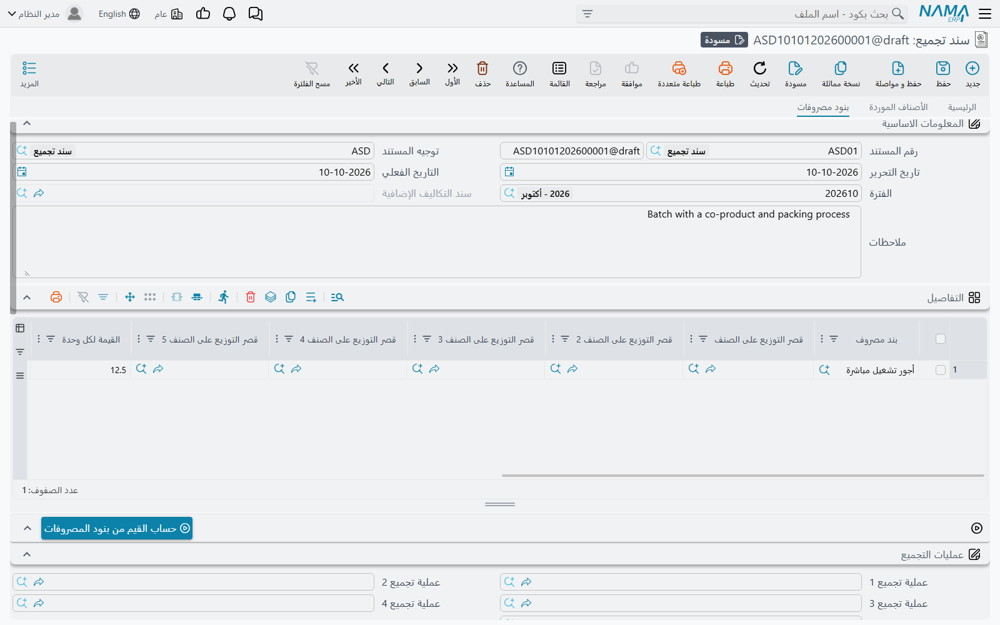
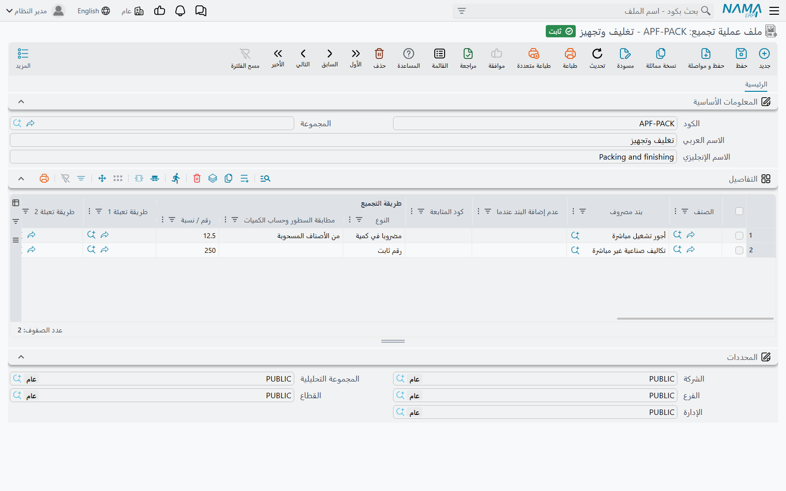

# طلبات التجميع وسندات التجميع (Assembly Requests & Assembly Documents)

عميل يطلب 20 جهاز DT-500. تأخذ الورشة من الرفوف 20 صندوقًا و20 لوحة أم و40 شريحة ذاكرة و20 قرصًا، وبعد ساعات تعيد إليها 20 جهازًا معبأً. **سند التجميع** يسجّل هذا بالضبط: مستند واحد يُخرج المكونات من المخزون، ويُدخل المنتج التام، وينقل التكلفة من الأولى إلى الثاني — فتكلفة الجهاز هي ما دخل فيه، مضافًا إليه ما كلّفه تجميعه.

تتناول هذه الصفحة سند التجميع من أعلاه إلى أسفله، ثم طلب التجميع الذي قد يسبقه، وكيف تُوزَّع التكلفة حين يُنتج التجميع أكثر من صنف، وكيف تُحمَّل المصروفات، وكيف يفك المستند نفسه المنتج إلى أجزائه.

## أين تجدها

| الشاشة | مسار القائمة | الاسم الإنجليزي |
|---|---|---|
| سند تجميع | المخازن ← التجميع ← سند تجميع | Assembly Document |
| طلب تجميع | المخازن ← التجميع ← طلب تجميع | Assembly Request |
| ملف عملية تجميع | المخازن ← التجميع ← ملف عملية تجميع | Assembly Process File |

## سند التجميع خطوة بخطوة

1. **اختر الدفتر و توجيه المستند.** التوجيه يحدد المستندات التي ينشئها التجميع (انظر «ما ينشئه الحفظ» أدناه) وطريقة تصرّف كمياته وتكاليفه.
2. **اختر طريقة التجميع.** يمتلئ الرأس من الوصفة: **صنف مجمع** ووحدته، و**مخزن الصرف** و**موقع الصرف**، و**مخزن التوريد** و**موقع التوريد**، والنوعية. ويمتلئ جدول **الأصناف المسحوبة** بالمكونات، وتُضاف الأصناف الأخرى في الطريقة إلى **الأصناف الموردة**. ويمكنك أيضًا ترك طريقة التجميع فارغة وكتابة المكونات بنفسك.
3. **أدخل الكمية** المراد تجميعها — 20. يُعاد حساب كل سطر مسحوب: السطر الذي يحتاج 2 لكل جهاز يصير 40. زوج الأعمدة **الكميات لكل صنف مجمع** يعرض الوصفة للوحدة الواحدة؛ و**إجمالي الكمية** هو ما سيُصرف فعلًا.
4. **راجع الأصناف المسحوبة.** غيّر صنفًا أو كمية أو شحنة أو صندوقًا بحسب ما جرى فعلًا. ومخزن الصرف في الرأس يُكتب على كل السطور عند الحفظ.
5. **راجع تبويب الأصناف الموردة** إن كان التجميع يُنتج أكثر من المنتج الرئيسي (أدناه).
6. **أضف المصروفات** في تبويب **بنود مصروفات** إن أردت تحميل العمالة أو المصاريف غير المباشرة على التكلفة (أدناه).
7. **احفظ.**

بعض حقول الرأس تغيّر الحساب:

- **الكمية الموردة فعليا** — إن خططت لـ 20 ولم يخرج سليمًا إلا 19، أدخل 19 هنا. فيُعاد حساب الكميات المسحوبة من 19، ما لم يكن في التوجيه **عدم تأثير كمية الاستلام الفعلية على الكمية المسحوبة**.
- **رقم الصندوق الافتراضي** — الصندوق الذي يُكتب على كل سطر مسحوب ليس له صندوق.
- **تاريخ الإنتاج** / **تاريخ الإنتهاء** — للأصناف التامة التي تُتابَع بالشحنات. وإن كان الصنف التام يستعمل الشحنات فـ **كود الشحنة** مطلوب.

::: info كميات لا يجب أن تُضرب
إن كان فريقك يكتب الكمية الإجمالية لكل مكون لا وصفة الوحدة، ففعّل **عدم إعادة حساب كميات الأصناف مع حفظ سند التجميع** في [إعدادات سلسلة التوريد](../configuration/documents-and-details-configuration.md). عندها تُحفظ الكميات المسحوبة كما كُتبت بالضبط.
:::

## ما ينشئه الحفظ

سند التجميع لا يمس المخزون بنفسه. عند الحفظ ينشئ مستندات عادية ويذكرها في جدول **السندات المخزنية**:

| المستند المنشأ | سطوره | دفتره وتوجيهه من تبويب **التأثير** في توجيه التجميع |
|---|---|---|
| **صرف مخزني** | الأصناف المسحوبة، من مخزن الصرف | **دفتر الأصناف المسحوبة** / **توجيه الأصناف المسحوبة** |
| **توريد مخزني** | الصنف المجمع وكل سطر في الأصناف الموردة، إلى مخزن التوريد | **دفتر الأصناف المستلمة** / **توجيه الأصناف المستلمة** |
| **تكاليف إستلام إضافية** | سطور المصروفات، إن وُجدت | **دفتر سند التكاليف الإضافية** / **توجيه سند التكاليف الإضافية** |
| **صرف مخزني** ثانٍ | السطور الموردة مرة أخرى، خارجةً مباشرة من مخزن التوريد | **دفتر صرف المنتج التام** / **توجيه صرف المنتج التام** — فقط إن مُلئ الحقلان |

حقول الصرف والتوريد الأربعة مطلوبة في توجيه التجميع. ويجب أيضًا أن تكون دفاتر وتوجيهات نظامية، ما لم يكن **السماح بدفتر و توجيه غير نظامي للأصناف المسحوبة و المستلمة في توجيه سند التجميع** مفعّلًا في [إعدادات سلسلة التوريد](../configuration/documents-and-details-configuration.md).

تعديل سند التجميع يحدّث هذه المستندات، وحذفه يحذفها. ومثل كل مستند مخزني، تُعالَج آثار كمياتها وتكلفتها في الخلفية بوصفها طلبات أعمال — ويُحسب تكلفة التوريد بعد معرفة تكلفة الصرف.

### تبويب التأثير في التوجيه

إلى جانب الدفاتر والتوجيهات، يحمل تبويب **التأثير** في توجيه التجميع الخيارات التي تشكّل التجميع:

| الخيار | ما يغيّره |
|---|---|
| **توزيع تكلفة الخامات بإجمالي متوسط سعر البيع و ليس الكمية** | يوزّع تكلفة المكونات على الأصناف الموردة بقيمة البيع بدل الكمية. |
| **حساب كمية الصنف المجمع من الأصناف الموردة** | السطر المسحوب المرتبط بصنف مورد (عمود **التأثير فقط على تكلفة الصنف المجمع** فيه يذكر ذلك الصنف) يأخذ كميته من كمية ذلك الصنف في الأصناف الموردة بدل الكمية في الرأس. |
| **فرد سطور الأصناف المسحوبة من طريقة التجميع مع تغيير كمية الصنف المورد** | يعيد ملء السطور المسحوبة من طريقة التجميع عند تغيير كمية سطر في الأصناف الموردة. |
| **استخدام الأصناف المسحوبة المخططه في حساب التكاليف** | يحفظ المكونات المخططة لكل صنف مورد (قائمة **الأصناف المسحوبة المخططة**) ويوزّع التكلفة حسب تلك الخطة. |
| **حساب الأصناف الموردة من خلال طريقة التجميع للأصناف المسحوبة** | يشغّل الفك (انظر «الفك» أدناه). |
| **السماح بصرف وتوريد نفس الصنف في نفس سند التجميع** | يرفع قاعدة أن سطر المخزون الواحد لا يُصرف ويُورَّد معًا. |
| **منع الحفظ حال لم تحتوى عمليات التجميع على الأصناف الموردة** | يرفض صنفًا موردًا لا يغطيه أي من ملفات عمليات التجميع في المستند. |
| **قصر التوزيع الصنف المسحوب على الصنف المورد الخاص به من طريقة التجميع** | يرسل تكلفة كل سطر مسحوب إلى السطر المورد الذي أُنشئ له فقط (بمطابقة **مُعرف سطر التكلفة**). |
| **منع الحفظ بدون أصناف مسحوبة عند إستحدام طريقة تجميع** | يرفض مستندًا يذكر طريقة تجميع وليس فيه أصناف مسحوبة. |
| **حساب متوسط سعر البيع من خلال تكلفة صرف سند الفك** | يملأ متوسط سعر البيع للأصناف الموردة من تكلفة صرف المستند المذكور في **سند الفك**. ويحتاج الخيار الأول مفعّلًا. |
| **عدم تأثير كمية الاستلام الفعلية على الكمية المسحوبة** | يبقي الكميات المسحوبة مرتبطة بالكمية حتى لو اختلفت الكمية الموردة فعليا. |

وكل هذه الخيارات مذكورة أيضًا في [الخيارات الخاصة بكل مستند](../document-terms/doc-term-document-specific.md).

## الأصناف الموردة — حين يخرج أكثر من شيء

كثير من التجميعات تُنتج أكثر من منتج. تحميص 100 كجم من البن الأخضر يعطي 360 كيس بن محمص، و10 كجم قشر تشتريه مزرعة، وكيس عينة للمعمل. تبويب **الأصناف الموردة** يذكر كل ما يُورَّد غير الصنف المجمع في الرأس، ولكل سطر نوعيته وتواريخه وإعدادات تكلفته. وتُورَّد كلها إلى مخزن التوريد وموقع التوريد في الرأس — فالحفظ يكتبهما على كل سطر مورد.

تأتي السطور من جدول أصناف أخرى في طريقة التجميع عند اختيارها. ومع **تحديث كمية الأصناف الثانوية مع إدخال كمية الصنف الرئيسي** تتبع كمياتها الكمية التي تجمّعها؛ وبدونه تُنسخ كميات ثابتة. ويمكن لسطر في الأصناف الموردة أن يحمل **طريقة التجميع** الخاصة به — فتُضاف مكونات ذلك المنتج إلى الأصناف المسحوبة — و**طريقة التعبئة** و**خامات التجميع البديلة** (انظر [طرق التجميع والمكونات وطرق التعبئة](./assembly-boms-and-components.md)).

### كيف تُوزَّع التكلفة

حين تُحسب تكلفة التوريد المخزني، تُقسَّم التكلفة الإجمالية لكل ما صُرف على السطور الموردة بهذا الترتيب:

1. السطور المسحوبة التي تخص منتجًا واحدًا تُجنَّب له: خامات التعبئة المنشأة لسطر مورد تذهب إلى ذلك السطر، والسطر الذي فيه **التأثير فقط على تكلفة الصنف المجمع** يذهب فقط إلى الصنف المذكور فيه. (يظهر هذا العمود حين يكون **اظهار التأثير فقط على تكلفة الصنف المجمع** مفعّلًا في إعدادات سلسلة التوريد.)
2. السطور التي **نوع التكلفة** فيها *تكلفة ثابتة* تأخذ مبلغًا ثابتًا — والمبلغ هو الرقم المكتوب في عمود **% التكلفة**. ففي هذه السطور يحمل ذلك العمود مالًا لا نسبة.
3. السطور التي نوع التكلفة فيها *بدون تكلفة* لا تأخذ شيئًا.
4. السطور *العادية* التي فيها **% التكلفة** تتقاسم تلك النسبة مما بقي بعد الخطوة 2.
5. وما يتبقى يُقسَّم بين السطور *العادية* التي ليس فيها نسبة — بالكمية، أو بـ **إجمالي متوسط سعر البيع** حين يوزّع التوجيه بمتوسط سعر البيع.

وتُضاف سطور المصروفات فوق ذلك، عن طريق مستند تكاليف الاستلام الإضافية.

**مثال.** البن الأخضر المصروف كلّف 10,000. القشر *تكلفة ثابتة* وفي % التكلفة 50؛ وعينة المعمل *بدون تكلفة*؛ والأكياس الـ 360 *عادية* بلا نسبة. فيُورَّد القشر بـ 50، والعينة بـ 0، والأكياس بـ 9,950 — أي 27.64 للكيس. ولو قُسّمت الأكياس إلى خلطة ممتازة بنسبة 30% وخلطة عادية بلا نسبة، لأخذت الممتازة 2,985 (30% من 9,950) وأخذت العادية الباقي 6,965.

## بنود المصروفات وملفات عمليات التجميع

يحمل تبويب **بنود مصروفات** العمالة أو الطاقة أو أي تكلفة أخرى تريدها داخل تكلفة المنتج. كل سطر يذكر **بند مصروف** و**القيمة لكل وحدة** و**إجمالي الوحدات** والمبلغ و**الحساب** الدائن، واختياريًا حتى خمسة حقول **قصر التوزيع على الصنف** تقصر المصروف على أصناف موردة بعينها. وعند الحفظ تصير هذه السطور مستند **تكاليف إستلام إضافية** يضيف قيمتها إلى تكلفة الأصناف الموردة.

**حساب القيم من بنود المصروفات** يملأ قيمة كل سطر من الأسعار المعرّفة على بند المصروف للتاريخ الفعلي للمستند — لكل كمية مسحوبة أو لكل كمية موردة، بحسب ما يقوله بند المصروف.

وللمصروفات التي تتبع قاعدة، استعمل **ملفات عمليات التجميع** بدل كتابتها. اذكر حتى خمسة منها في **عملية تجميع 1** إلى **5** في تبويب بنود مصروفات. وكل سطر في ملف العملية يقول:

- **بند مصروف** — ما يُحمَّل.
- على أي السطور ينطبق: **طريقة التجميع | مطابقة السطور وحساب الكميات** — *من الأصناف المسحوبة* (دون خامات التعبئة) أو *من الأصناف الموردة* (ذات نوع التكلفة *العادية* فقط) — مع التضييق بـ **الصنف** وحقول قسم الصنف والعلامة والفئات والتصنيفات، ومع *من الأصناف الموردة* بـ **طريقة تعبئة 1** إلى **5**؛
- كم: **طريقة التجميع | النوع** — *رقم ثابت* (يُحمَّل مرة واحدة)، أو *مضروبا في كمية* (القيمة مضروبة في إجمالي كمية السطور المطابقة)، أو *نسبة من بنود مصروفات أخرى* (نسبة من إجمالي **بند مصروف 1** إلى **20** في المستند نفسه)؛ والرقم يوضع في **طريقة التجميع | رقم / نسبة**؛
- **عدم إضافة البند عندما** — *إضافة دائما*، أو *إذا ظهر سابقا في سطر في نفس العملية*، أو *إذا ظهر سابقا في اي سطر لاي عملية*، لمنع تحميل المصروف نفسه مرتين؛
- **يستخدم فقط إذا وجدت العملية التجميعية** — لا ينطبق السطر إلا إذا كانت تلك العملية الأخرى في المستند أيضًا؛
- **نسخ الصنف إلي حقل قصر التوزيع على الصنف المورد** — مع *من الأصناف الموردة*، سطر مصروف لكل صنف مورد، كلٌّ مقصور على صنفه.

::: warning السطور يُعاد بناؤها مع الحفظ
بمجرد أن يذكر المستند عملية تجميع، تُعاد حساب سطور مصروفاته من ملفات العمليات مع كل حفظ، وتُستبدل السطور المكتوبة يدويًا. وسطر ملف العملية الذي يُترك فيه **مطابقة السطور وحساب الكميات** فارغًا لا يطابق شيئًا أبدًا.
:::

## الفك

المستند نفسه يفك المنتج إلى أجزائه. جهاز يعود فيُفكك لقطع غيار؛ أو بالتة بضائع مختلطة تُفرَّغ إلى محتوياتها.

1. في تبويب التأثير في التوجيه، فعّل **حساب الأصناف الموردة من خلال طريقة التجميع للأصناف المسحوبة**.
2. في **الأصناف المسحوبة** أدخل الصنف المراد فكه، وفي عمود **طريقة التجميع للأصناف المسحوبة** طريقة التجميع التي تصفه. ويجب أن تكون الطريقة وصفةَ ذلك الصنف نفسه.
3. احفظ. يُعاد بناء جدول **الأصناف الموردة** من تفاصيل الطريقة: سطر لكل مكون، كميته متناسبة مع الكمية المصروفة، يُورَّد إلى مخزن التوريد، ويحمل **نوع التكلفة** و**% التكلفة** و**متوسط سعر البيع** من سطر الطريقة — فتُقسَّم تكلفة الجهاز على أجزائه بالقواعد السابقة نفسها.

ومع تفعيل هذا الخيار يُعاد بناء الأصناف الموردة مع كل حفظ، فتُستبدل السطور المكتوبة فيها يدويًا. ويمكن أن يبقى الصنف المجمع في الرأس فارغًا — فسند التجميع يحتاج صنفًا مجمعًا أو أصنافًا موردة، لا الاثنين.

و**سند الفك** في الرأس يشير إلى سند تجميع سابق؛ ومع تفعيل **حساب متوسط سعر البيع من خلال تكلفة صرف سند الفك** يُؤخذ متوسط سعر البيع للأصناف الموردة من تكلفة صرف ذلك السند لكل صنف.

## طلب التجميع

**طلب التجميع** له شاشة سند التجميع نفسها — الرأس، والأصناف المسحوبة، والأصناف الموردة، وبنود المصروفات — وطريقة الملء من الوصفة نفسها، لكنه لا ينشئ مستندات مخزنية: لا يُصرف شيء ولا يُورَّد. (وإن كان في تبويب **الحجز** في توجيهه **حجز** مفعّلًا، فإنه يحجز أصنافه بدلًا من ذلك.) استعمله خطةً: أنشئه من أمر بيع عبر **بناءا على**، واتفق على الكميات، ثم أنشئ سند التجميع **بناءا على** الطلب. ويمكن أيضًا إنشاء طلب التجميع من طلب آخر، أو من سند تجميع، أو من سند تقطيع أصناف.

وتوجيه الطلب توجيه تجميع أيضًا، لكن دفاتر وتوجيهات الصرف والتوريد غير مطلوبة فيه.

## الأزرار في هذه الشاشات

| الزر | مكانه | ما يفعله |
|---|---|---|
| **تجميع الكميات المتاحة للسطور المدخلة** (Collect Available Quantities For Inserted Lines) | قائمة المزيد، في سند التجميع وطلب التجميع | يسأل عن **تجميع علي** — صندوق أو لون أو مقاس أو إصدار أو شحنة — وعن **مسح البيانات الموجوده**، ثم يملأ ذلك المحدد على كل سطر مسحوب من المخزون المتاح فعلًا في مخزن الرأس، مقسّمًا السطر على عدة شحنات أو صناديق إن لم يكفِ واحد. و**مسح البيانات الموجوده** يفرّغ القيم المدخلة أولًا. |
| **حساب تواريخ الصلاحية من كود الشحنة** (Update Expiry Dates from Lot Code) | قائمة المزيد، في سند التجميع وطلب التجميع | يملأ تواريخ الإنتاج والانتهاء وإعادة الاختبار على السطور المسحوبة من شحنتها. |
| **حساب القيم من بنود المصروفات** (Calculate Values From Expense Items) | تبويب بنود مصروفات | يعيد حساب سطور المصروفات من أسعار بنود مصروفاتها. |

## رسائل قد تظهر لك

| الرسالة | لماذا | ما تفعله |
|---|---|---|
| «يجب إدخال الاصناف المورده او الصنف الرئيسي» | لم يُدخل صنف مجمع ولا سطر في الأصناف الموردة — فلن يُورَّد شيء. | اختر طريقة التجميع أو الصنف المجمع، أو أضف سطورًا موردة. |
| «الصنف {0} لا يحتوي على الوحدة {1}» | وحدة في كمية الصنف المجمع على سطر مسحوب، أو على سطر مورد، ليست من وحدات ذلك الصنف. | اختر إحدى وحدات الصنف الأساسية أو الثانوية. |
| «لا يمكن الحفظ بدون أصناف مسحوبة عند إستحدام طريقة تجميع» | المستند يذكر طريقة تجميع، والأصناف المسحوبة فارغة، والتوجيه فيه **منع الحفظ بدون أصناف مسحوبة عند إستحدام طريقة تجميع**. | املأ الأصناف المسحوبة (أعد اختيار الطريقة)، أو ألغِ الخيار في التوجيه. |
| «لا يوجد سطر في الاصناف الموردة بمُعرف تكلفة {0}» | مع تفعيل **قصر التوزيع الصنف المسحوب على الصنف المورد الخاص به من طريقة التجميع**، **مُعرف سطر التكلفة** في سطر مسحوب لا يطابق أي سطر مورد. | صحّح مُعرف سطر التكلفة، أو أضف السطر المورد الناقص. |
| «معرف التكلفة {0} مكرر في السطر {1}» | سطران موردان يتشاركان مُعرف سطر التكلفة، فلا تعرف التكلفة لأيهما تذهب. | أعطِ كل سطر مورد مُعرفًا خاصًا به. |
| «لا تحتوى عمليات التجميع على الصنف المورد {0}» | التوجيه فيه **منع الحفظ حال لم تحتوى عمليات التجميع على الأصناف الموردة**، ولا يذكر أي سطر *من الأصناف الموردة* في ملفات عمليات التجميع في المستند هذا الصنف المورد. | أضف الصنف إلى سطر في ملف عملية، أو احذفه من الأصناف الموردة. |
| «الصنف {0} في السطر رقم {1} - في المستند {2} - {3} لا يمكن صرفه وتوريده من نفس سند التجميع» | الصنف نفسه، بالمخزن والموقع والشحنة والصندوق والمقاس واللون والإصدار نفسها، مصروف ومورد معًا. ولا يمكن للتكلفة أن تخرج من سطر مخزون واحد وتدخل إليه في مستند واحد. | ورّده إلى مخزن أو موقع أو شحنة مختلفة، أو قسّم العمل على مستندين، أو فعّل **السماح بصرف وتوريد نفس الصنف في نفس سند التجميع**. |
| «يرجي ملأ دفتر وتوجيه التكاليف الإضافيه في التوجيه {0}» | في المستند سطور مصروفات، فيلزمه إنشاء تكاليف إستلام إضافية، لكن توجيهه لا يذكر دفترًا وتوجيهًا لها. | املأ **دفتر سند التكاليف الإضافية** و**توجيه سند التكاليف الإضافية** في تبويب التأثير في التوجيه. |
| «الكمية {0} فى السطر {1} يجب أن تساوى الكمية {2} فى سند خامات التجميع البديلة {3}» | سطر مورد يستعمل سجل خامات تجميع بديلة، وكميته تختلف عن كمية ذلك السجل. | اجعل كمية السطر مساوية لكمية السجل، أو استعمل سجلًا آخر. |
| «التأثير فقط على تكلفة الصنف المجمع {0} غير موجود بالصنف المجمع او الاصناف الموردة» | **التأثير فقط على تكلفة الصنف المجمع** في سطر مسحوب يذكر صنفًا لا يُورَّد. | اختر الصنف المجمع أو أحد الأصناف الموردة، أو امسح العمود. |
| «لا يمكن ليند المصروف {0} ان يكون نسبة من نفسه» | سطر في ملف عملية تجميع يجعل مصروفًا نسبةً من قائمة (بند مصروف 1–20) تشمله هو نفسه. | احذف بند المصروف من قائمته. |
| «الأوبشن {0} يجب تقعيله مع القيمة {1} للحقل {2}» | في ملف عملية تجميع، **نسخ الصنف إلي حقل قصر التوزيع على الصنف المورد** مفعّل على سطر ليس *من الأصناف الموردة*. | اجعل السطر من الأصناف الموردة، أو ألغِ الخيار. |
| «لا يمكنك استعمال ملفات طرق التعبئة مع القيمة {0} للحقل {1}» | سطر في ملف عملية تجميع يذكر طرق تعبئة وليس *من الأصناف الموردة*. | اجعل السطر من الأصناف الموردة، أو امسح طرق التعبئة. |
| «لاستخدام الحقل {0} يجب تفعيل الحقل {1}» | في توجيه التجميع، **حساب متوسط سعر البيع من خلال تكلفة صرف سند الفك** مفعّل دون **توزيع تكلفة الخامات بإجمالي متوسط سعر البيع و ليس الكمية**. | فعّل الخيار الثاني أيضًا، أو ألغِ الأول. |
| «الدفتر يجب أن يكون نظامي» / «توجيه المستند يجب أن يكون نظامي» | دفتر أو توجيه صرف أو توريد في توجيه التجميع ليس نظاميًا. | اختر دفاتر وتوجيهات نظامية، أو فعّل **السماح بدفتر و توجيه غير نظامي للأصناف المسحوبة و المستلمة في توجيه سند التجميع**. |
| «يجب عليك إدخال تجميع علي» | شُغّل **تجميع الكميات المتاحة للسطور المدخلة** و**تجميع علي** فارغ. | اختر محددًا وشغّله مرة أخرى. |
