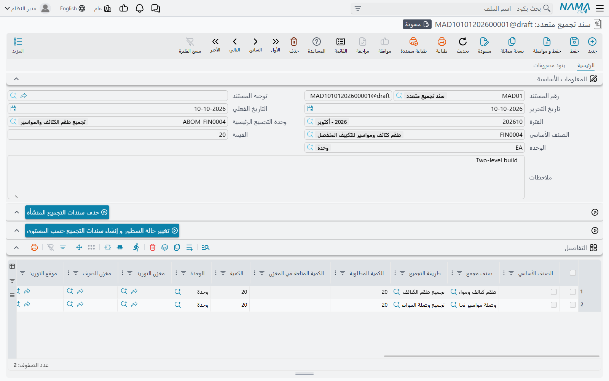
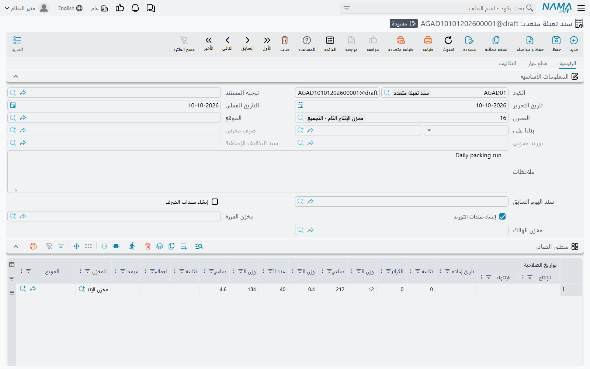

# التجميع متعدد المستويات والتعبئة المجمّعة (Multi-Level and Aggregated Assembly)

سند التجميع الواحد يبني منتجًا واحدًا من مكوناته. ويوجد مستندان لما يتجاوز ذلك:

- **سند تجميع متعدد** (Multi Assembly Document)، لمنتج مكوناته نفسها تُجمَّع — يحسب كل المستويات وينشئ سند تجميع لكل تجميع فرعي؛
- **سند تعبئة متعدد** (Aggregated Packaging Document)، لخط تعبئة يحوّل الخامة السائبة إلى كراتين على بالتات طوال اليوم، مع فرزات وهالك، ويُسجَّل مرة واحدة في اليوم.

كلاهما يقود آلية التجميع العادية الموصوفة في [طلبات التجميع وسندات التجميع](./assembly-documents-and-requests.md)؛ فاقرأها أولًا.

## سند تجميع متعدد

**المخازن ← التجميع ← سند تجميع متعدد**.

محطة العمل **WS-900** تُبنى من جهاز DT-500 وشاشة ولوحة مفاتيح؛ وجهاز DT-500 نفسه يُبنى من صندوق ولوحة أم وذاكرة. في طريقة تجميع WS-900، سطر DT-500 فيه **طريقة التجميع الفرعية** = طريقة تجميع DT-500. وهذا الرابط هو كل ما يحتاجه سند التجميع المتعدد.

### ملء التفاصيل

هناك طريقتان.

**منتج واحد.** أدخل في الرأس **وحدة التجميع الرئيسية** و**الصنف الأساسي** و**الكمية الرئيسية** — واختيار الطريقة يملأ الصنف ووحدته. فيمتلئ جدول **التفاصيل** بسطر لـ WS-900 نفسه وسطر لكل تجميع فرعي يُعثر عليه باتباع روابط طريقة التجميع الفرعية نزولًا في الشجرة: 10 من WS-900 تعني سطرًا لـ 10 من WS-900 وسطرًا لـ 10 من DT-500. ويحمل كل سطر طريقة تجميعه وكميته ومخزني الصرف والتوريد (من تلك الطريقة) ومستواه.

**عدة منتجات.** املأ جدول **الأصناف الرئيسية** — سطر لكل منتج تام، لكل منها طريقة تجميعه و**الكمية المطلوبة** و**الكمية المتاحة في المخزن** — واضغط **فرد السطور الرئيسية**. فيُفرد كل صنف رئيسي بالطريقة نفسها، وتُدمج السطور المتطابقة في الصنف والوحدة والمخازن والمستوى، فيظهر DT-500 الذي يحتاجه منتجان مختلفان مرة واحدة بالكمية المجمّعة. والضغط عليه مرة أخرى يحتفظ بتواريخ السطور الموجودة من قبل ومحدداتها وحالتها والسند المنشأ لها.

وفي كلا الجدولين تُحسب **الكمية** على أنها **الكمية المطلوبة** ناقص **الكمية المتاحة في المخزن**، ولا تنزل عن الصفر — فإن كان على الرف 3 من DT-500 لم يُبنَ إلا 7.

### ما يفعله الحفظ

عند الحفظ يصير كل سطر في التفاصيل له كمية **سند تجميع** — يُنشأ أول مرة ويُحدَّث بعدها — باستخدام **دفتر سند تجميع** و**توجيه سند تجميع** في توجيه السند المتعدد. ويُربط السند المنشأ في عمود **سند تجميع** على السطر، وتُملأ أصنافه المسحوبة من طريقة تجميع السطر.

::: warning بلا دفتر وتوجيه، بلا مستندات
إن لم يكن في توجيه السند المتعدد دفتر سند تجميع أو توجيه سند تجميع، يُحفظ المستند عاديًا لكنه لا ينشئ شيئًا. املأ الحقلين في التوجيه أولًا.
:::

ثلاثة إعدادات تتحكم في السطور التي تنشئ مستندات وكيف:

- **إنشاء سند التجميع للسطور التي حالتها** في التوجيه — لا ينشئ سندًا إلا السطر الذي **الحالة** فيه تساوي هذه القيمة. والحالات هي *مبدئي* و*مخطّطة* و*منتهي* و*أخرى 1–3*. اتركه فارغًا فينشئ كل سطر.
- **الحفظ كمسودة** على السطر — يُحفظ سند تجميعه مسودةً، طالما لم يُعتمد قط. و**حفظ كل سندات التجميع كمسودات** في التوجيه يعلّمه على كل السطور.
- تبويب **بنود مصروفات** — كل سطر يذكر **الصنف**؛ ويُنسخ إلى السند المنشأ لكل سطر تفاصيل لذلك الصنف، مع إجمالي الوحدات = كمية ذلك السطر.

وحين يكون **عرض الخامات النهائية في سند تجميع متعدد** مفعّلًا في إعدادات سلسلة التوريد، يعرض جدول **الخامات النهائية** المواد الخام التي تستهلكها الشجرة كلها — كل سطر في طرق التجميع ليس هو نفسه تجميعًا فرعيًا، مدموجًا عبر المستويات. و**إستخدام الكمية المطلوبة لعرض الخامات النهائية بدل كمية التجميع** في التوجيه يجعله مبنيًا على الكمية المطلوبة.

حذف سطر من التفاصيل يحذف سند تجميعه المنشأ عند الحفظ التالي؛ وحذف السند المتعدد يحذفها كلها.

### البناء مستوًى بعد مستوى

لا يمكن تجميع WS-900 قبل أن تكون أجهزة DT-500 التي يحتاجها في المخزون. وزر **تغيير حالة السطور و إنشاء سندات التجميع حسب المستوى** يفعل ذلك بالترتيب: يأخذ أعمق مستوى لم تأخذ سطوره حالة التوجيه بعد، ويضبط حالتها، ويحفظ المستند — فتُنشأ سندات تجميع ذلك المستوى — وينتظر حتى تُعالج آثارها المخزنية قبل أن يصعد إلى المستوى التالي. وهو مصمم للتوجيهات التي فيها **إنشاء سند التجميع للسطور التي حالتها**.

و**حذف سندات التجميع المنشأة** يعكس ذلك بالترتيب المعاكس، بدءًا من المستوى الأعلى: يطلب منك التأكيد (**تأكيد حذف السجلات**)، ثم يحذف المستندات المنشأة مستوًى بعد مستوى ويمسح حالة سطورها.

## سند تعبئة متعدد

**المخازن ← التجميع ← سند تعبئة متعدد**.

صُمم هذا المستند لخطوط التعبئة التي تزن ناتجها: الخامة السائبة تدخل الكراتين، والكراتين توضع على البالتات، وبعض المنتج يُفرز درجةً أقل، وبعضه يُفقد. يسجّل يوم العمل في مستند واحد وينشئ له صرفًا مخزنيًا واحدًا وتوريدًا مخزنيًا واحدًا.

### وصفة التعبئة

طريقة تجميع المنتج المعبأ تستعمل أربعة أعمدة لا يقرؤها غير هذا المستند:

- **خام رئيسي** — الخامة السائبة، وتُقاس بالوزن. سطر واحد لكل طريقة.
- **معتمد على عدد الكرتون** — خامة تعبئة تُستعمل لكل كرتونة.
- **واحد للبالتة** — خامة تُستعمل مرة لكل بالتة، أي مرة لكل سطر في المستند.
- **للخامات الرئيسية** — خامة تعتمد على كمية الخام الرئيسي المصروفة فعلًا.

### التبويب الرئيسي

في الرأس **المخزن** و**الموقع** للصرف، و**مخزن الفرزة** للدرجات المفروزة، و**مخزن الهالك** للفاقد، و**إنشاء سندات الصرف** / **إنشاء سندات التوريد** (والثاني مفعّل افتراضيًا). وتظهر في الرأس بعد الحفظ المستندات المنشأة: **صرف مخزني** و**توريد مخزني** و**سند التكاليف الإضافية**.

كل سطر في **سطور الصادر** بالتة واحدة من منتج تام: **طريقة التجميع** والصنف والكمية بالكراتين، والأوزان — **وزن البالتة فارغة** و**صافي وزن البالتة** و**وزن الكرتونة فارغة** — إضافة إلى **الكراتين الجاهزة**، وهي كراتين معبأة من قبل ولا يجري إلا وضعها على البالتة. وعند الحفظ يحسب النظام:

- **عدد الكرتون** = الكمية − الكراتين الجاهزة؛
- **وزن الخامة** = صافي وزن البالتة − وزن البالتة فارغة − وزن الكرتونة فارغة × عدد الكرتون؛
- **صافي وزن الكرتونة** = وزن الخامة ÷ عدد الكرتون.

بالتة من 50 كرتونة، منها 5 جاهزة، وزنها 520 كجم على بالتة فارغة 20 كجم بكراتين 0.5 كجم، تعطي 45 كرتونة و477.5 كجم خامة و10.61 كجم للكرتونة.

ضع علامة **نقل الي اليوم التالي** على البالتة التي لم تكتمل. واجعل سند اليوم **سند اليوم السابق** في سند الغد، فتظهر البالتة هناك في **السطور من السند السابق** وتُحسب في ذلك اليوم بدلًا من هذا.

جدول **الفرزات** يذكر الدرجات المفروزة الموردة إلى مخزن الفرزة، وجدول **الهالك** يُملأ عند الحفظ: لكل خام رئيسي، ما صُرف زيادةً على ما تفسّره البالتات يُورَّد إلى مخزن الهالك فاقدًا. والمحددات الافتراضية لكليهما تأتي من **بيانات الفرزة** و**بيانات الهالك** في التوجيه.

### تبويب قطع غيار — ما يُصرف

الخامات المراد صرفها في التبويب المعنون **قطع غيار**. زر **حساب الخامات** يملؤه من طرق تجميع البالتات: الخام الرئيسي بإجمالي وزن الخامة، والسطور المعتمدة على الكرتون بعدد الكرتون، وسطور البالتة بعدد السطور، وكل ما عداها بالكمية. والكراتين الجاهزة تُصرف على أنها الصنف التام نفسه. ثم يضيف **حساب مستلزمات الخامات الرئيسية** سطور «للخامات الرئيسية» من كمية الخام الرئيسي في التبويب. وكلاهما يحتاج حفظ المستند أولًا.

و**تجميع الشحنات للخامات** و**تجميع صناديق الخامات** يملآن الشحنة أو الصندوق على كل سطر خامة من المتاح في مخزن الرأس، ويسألان أولًا عن **مسح البيانات الموجوده**. والأزرار الأربعة في تبويب قطع غيار وفي قائمة المزيد؛ وزرّا الحساب أيضًا في التبويب الرئيسي.

### تبويب التكاليف

**التكاليف المثبتة** تعطي تكلفة ثابتة لكل وحدة من الخام الرئيسي، اختياريًا لكل إصدار ولون ومقاس؛ و**الإصدارات ذات التكلفة المثبتة** في التوجيه يملأ صفًا لكل إصدار مسبقًا. والبالتة التي لخامها الرئيسي تكلفة ثابتة تُحسب تكلفة خامها الرئيسي بذلك السعر، وسطور الفرزة تُحسب بالتكلفة الثابتة لصنفها. وسطور المصروفات تصير سند تكاليف إضافية؛ ومع **حساب التكاليف الإضافية اليا مع الحفظ** في التوجيه تُملأ عند الحفظ من بنود المصروفات التي خامها الرئيسي مستعمل في المستند، مع إجمالي الوحدات = كمية بالتات تلك الخامة.

يُنشأ الصرف المخزني من جدول قطع غيار بـ **دفتر سند الصرف** / **توجيه سند الصرف** في التوجيه؛ والتوريد المخزني من سطور الصادر والسطور من السند السابق والفرزات والهالك بـ **دفتر سند التوريد** / **توجيه سند التوريد**؛ وسند التكاليف الإضافية بـ **دفتر سند التكاليف الإضافية** / **توجيه سند التكاليف الإضافية**. وبعد حساب تكلفة الصرف، تُوزَّع تكلفة الخامات على البالتات بحسب نصيبها المخطط من كل خامة، ويُحدَّث التوريد بالنتيجة.

## رسائل قد تظهر لك

| الرسالة | لماذا | ما تفعله |
|---|---|---|
| «لايمكن ترك طريقة التجميع فارغة» | سطر في تفاصيل سند التجميع المتعدد بلا طريقة تجميع. | املأ طريقة التجميع في ذلك السطر. والنص العربي لا يذكر رقم السطر الذي يذكره الإنجليزي. |
| «الصنف {0} في السطر {1} غير موجود في تفاصيل بنود المصروفات» | سطر مصروف في سند التجميع المتعدد يذكر صنفًا لا يجمّعه أي سطر في التفاصيل، فلا يوجد ما يُحمَّل عليه. | غيّر صنف سطر المصروف، أو أضف ذلك الصنف إلى التفاصيل. |
| *Can not handle more than 10 levels of assembly bom recursion, most probably there is a cyclic dependency.* | اتباع روابط طريقة التجميع الفرعية تجاوز عشرة مستويات — وغالبًا طريقة تعود إلى نفسها. هذه الرسالة لا ترجمة عربية لها وتظهر بالإنجليزية. | ابحث عن الطريقة التي تشير طريقتها الفرعية إلى أعلى الشجرة وصحّحها. |
| «يجب أن تختار الأوبشن {0} في إعدادات الSupply Chain  لتفعيل الأوبشن {1}» | فُعّل خيار متابعة كميات في توجيه السند المتعدد بينما إعدادات سلسلة التوريد لا تحتفظ بمدخلات متابعة الكميات. | فعّل الخيار المذكور في إعدادات سلسلة التوريد أولًا، أو ألغِ خيار التوجيه. |
