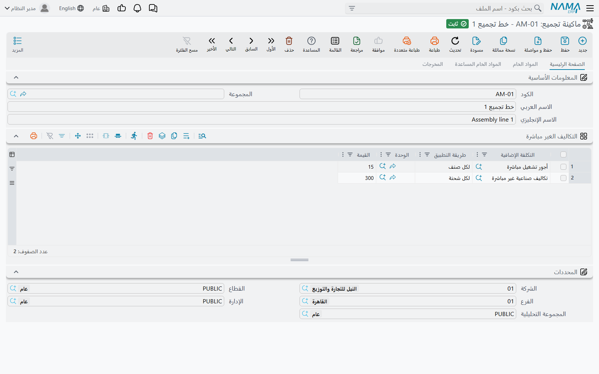
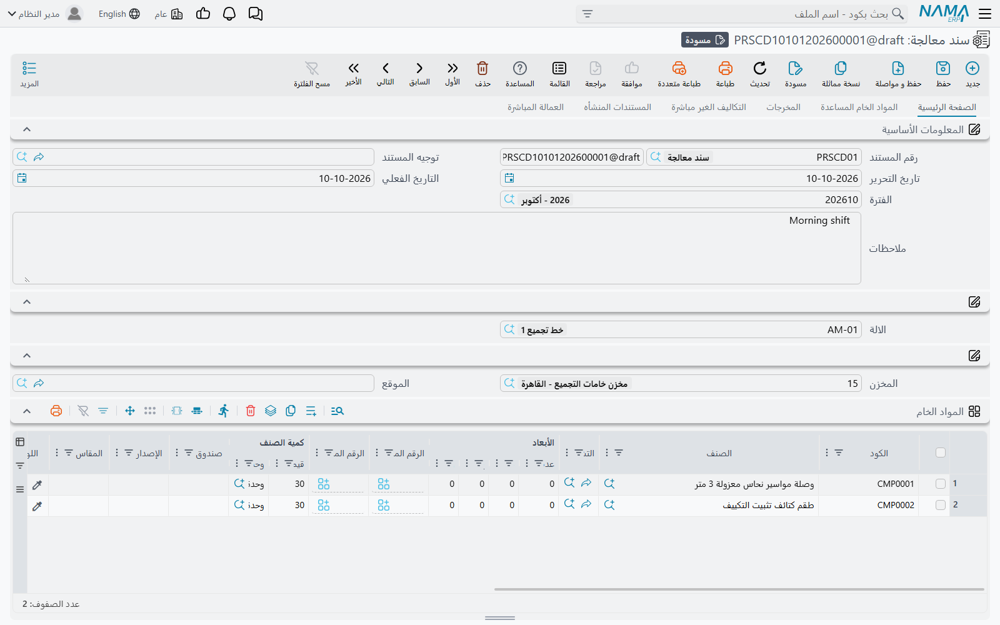

# سندات المعالجة وماكينات التجميع (Processing Documents & Assembly Machines)

بعض العمل يُوصف بالماكينة أفضل مما يُوصف بالوصفة. مطحنة تأخذ البن الخام، وتستهلك فلاتر وزيت تشحيم، وتُخرج بنًا مطحونًا بدرجتين، وتكلّف كذا في الساعة لتشغيلها. كل تشغيلة تشبه الأخرى؛ لا يتغير إلا الكميات. **ماكينة تجميع** تصف الماكينة مرة واحدة، وكل تشغيلة **سند معالجة** يبدأ منها.

| الشاشة | مسار القائمة | الاسم الإنجليزي |
|---|---|---|
| ماكينة تجميع | المخازن ← التجميع ← ماكينة تجميع | Assembly Machine |
| سند معالجة | المخازن ← التجميع ← سند معالجة | Processing Document |

## ماكينة التجميع

يحمل ملف الماكينة النسخة القياسية من التشغيلة، تبويبًا بعد تبويب:

- **الصفحة الرئيسية** — جدول **التكاليف الغير مباشرة**: كل سطر بند مصروف و**طريقة التطبيق** و**الوحدة** و**القيمة** — "كهرباء، لكل صنف، كجم، 0.15".
- **المواد الخام** — المخزن والموقع اللذان تُصرف منهما المواد الخام، وسطور المواد الخام القياسية.
- **المواد الخام المساعدة** — المخزن والموقع للمستلزمات (فلاتر، زيت، غلاف تعبئة)، وسطورها.
- **المخرجات** — المخزن والموقع اللذان تُورَّد إليهما المخرجات، وسطور المخرجات القياسية.

## سند المعالجة

### البدء من الماكينة

اختر **الالة** في الصفحة الرئيسية، فيمتلئ السند من ملف الماكينة: أزواج المخزن والموقع الثلاثة، وسطور المواد الخام والمساعدة والمخرجات، والتكاليف غير المباشرة — وتُنسخ كل قيمة من الماكينة إلى **القيمة القياسية** وإلى **القيمة** معًا، فتغيّر القيمة الفعلية وتبقى القياسية بجوارها. ثم عدّل الكميات بحسب ما استهلكته هذه التشغيلة وأنتجته فعلًا.

التبويبات:

| التبويب | ما يوضع فيه |
|---|---|
| **الصفحة الرئيسية** | الالة، و**المخزن** و**الموقع** للمواد الخام، وجدول **المواد الخام** |
| **المواد الخام المساعدة** | **مخزن صرف المواد المساعدة** و**موقع المواد المساعدة**، والمستلزمات مع **الكمية لكل وحده منتجه** و**طريقة التطبيق** |
| **المخرجات** | **مخزن التوريد** و**موقع التوريد**، والمخرجات، وفي كل منها **إجمالي التكاليف الغير مباشرة** |
| **التكاليف الغير مباشرة** | تكاليف الماكينة في هذه التشغيلة |
| **المستندات المنشأه** | المستندات المخزنية التي أنشأتها التشغيلة |
| **العمالة المباشرة** | من عمل في التشغيلة، ومتى |

ومخازن الرأس تُكتب على كل سطور جدولها عند الحفظ.

### ما يُحسب

- **إجمالي الوحدات المنتجه** (في تبويب المواد الخام المساعدة) هو إجمالي كمية المخرجات كلها.
- المادة المساعدة التي فيها **الكمية لكل وحده منتجه** تأخذ كميتها منها: *لكل صنف* يضربها في إجمالي الوحدات المنتجه؛ و*لكل شحنة* يستعملها كما هي. فلتر يُستعمل مرة لكل تشغيلة هو «لكل شحنة» 1؛ وغلاف بمعدل 0.02 متر لكل كيس هو «لكل صنف» 0.02.
- **الكمية الإجمالية** في سطر التكلفة غير المباشرة هي إجمالي المخرجات بـ **الوحدة** المذكورة فيه — أو إجمالي كل المخرجات إن كانت الوحدة فارغة. و**اجمالى التكلفة** = القيمة × الكمية الإجمالية مع *لكل صنف*، أو القيمة وحدها مع *لكل شحنة*. 1,200 كجم من المخرجات بـ 0.15 للكيلو = 180 كهرباء.
- **إجمالي التكاليف الغير مباشرة** لكل مُخرَج هو نصيبه من تلك التكاليف، بالكمية، بين المخرجات التي بوحدة التكلفة.

### ما ينشئه الحفظ

عند الحفظ ينشئ سند المعالجة المستندات التالية ويذكرها في **المستندات المنشأه** مع **النوع**:

| المستند المنشأ | من | الدفتر والتوجيه في توجيه المعالجة |
|---|---|---|
| صرف مخزني | المواد الخام | **دفتر المواد الخام** / **توجيه المواد الخام** (مجموعة *المواد الخام*) |
| صرف مخزني | المواد الخام المساعدة | **دفتر المواد الخام المساعدة** / **توجيه المواد الخام المساعدة** (مجموعة *المواد الخام المساعدة*) |
| توريد مخزني | المخرجات | **دفتر الأصناف المستلمة** / **توجيه الأصناف المستلمة** (مجموعة *المخرجات*) |

وحين تُحسب تكلفة الصرف تُنقل إلى المخرجات. وتُطابَق المواد بالمخرجات بـ **صندوق**: المُخرَج يأخذ تكلفة المواد المصروفة بقيمة الصندوق نفسها، مقسومة بالكمية على المخرجات التي تتشارك ذلك الصندوق، وتكلفة المواد التي لا يطابق صندوقها أي مُخرَج تُوزَّع على كل المخرجات بالكمية. فإن لم تستعمل الصناديق، تقاسمت المخرجات تكلفة المواد كلها بالكمية.

وتُنتج التكاليف غير المباشرة أيضًا قيدًا محاسبيًا، يُعالَج بوصفه طلب أعمال، حين يكون في تبويب **التأثير** في توجيه المعالجة جانبا **مدين** و**دائن** محددين كلاهما — عادةً حساب تكلفة إنتاج مقابل الحسابات التي تحمل الكهرباء والإهلاك ونحوها. وبدون الجانبين لا يُنشأ قيد.

## العمالة المباشرة

جدول **سطور العمالة المباشرة** يسجّل كل **الموظف** بـ **من** و**إلى** تاريخًا ووقتًا؛ و**عدد ساعات العمل** يُحسب منهما. وزرّان على الجدول يجعلانه ساعة حضور: قف على سطر واضغط **بدء** ليُختم التاريخ والوقت الحاليان بدايةً له، أو **إنهاء** ليُختم نهايته. ومع تفعيل **ملئ من تاريخ اليا مع إدخال سطر** و**ملئ من وقت اليا مع إدخال سطر** يبدأ السطر الجديد والتاريخ والوقت الحاليان مملوءان فيه.

## صفحات ذات صلة

- [طلبات التجميع وسندات التجميع](./assembly-documents-and-requests.md) — البديل المعتمد على الوصفة
- [تكلفة المخزون وإعادة التقييم](../inventory-costing.md)
