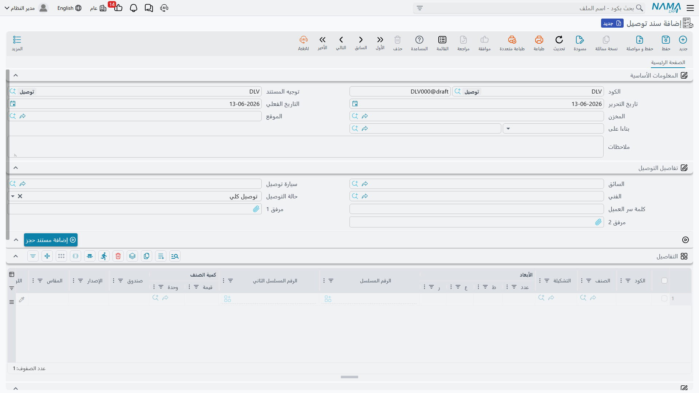
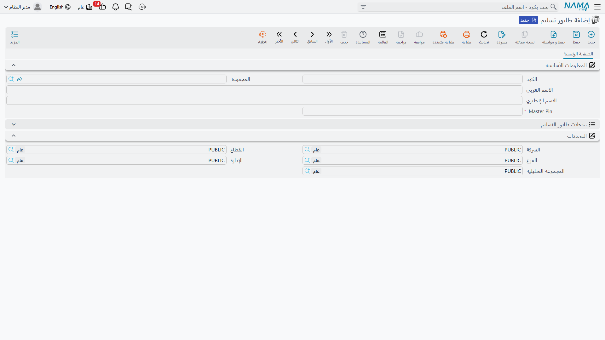

# التسليم والتحميل (Delivery & Loading)

بين تأكيد أمر البيع وإصدار الفاتورة تقع المرحلة المادية: تحضير البضاعة، وتحميلها، وإيصالها للعميل، والحصول على إثبات الاستلام. يجمع هذا الدليل المستندات والإعدادات التي تدير هذه الرحلة الأخيرة - من رف المخزن إلى باب العميل.

## التحضير: سحب الأصناف (Pick)

قبل أن تغادر البضاعة، يجب جمعها من مواقعها في المخزن. **قواعد التحضير (PickRules)** تحدّد كيف يختار النظام ما يُسحب ومن أين: بالأقدم أولًا (FIFO)، أو بالأقرب انتهاءً (FEFO)، أو حسب الموقع الأقرب، أو الدفعة المناسبة. وتُولَّد قائمة التحضير التي توجّه عامل المخزن إلى الأصناف ومواقعها بالتسلسل الأمثل عبر الممرات، فتقلّ الأخطاء ويسرع التجهيز.

## التحميل: تجميع الشحنة (LoadingDocument)

**مستند التحميل** يسجّل تجميع عدة تسليمات في حمولة واحدة (شاحنة أو شحنة): يجمعها حسب المسار أو السائق أو المركبة، ويتتبع حالة التحميل وسعة المركبة، ويربط الأوامر/الفواتير المصدر بالشحنة. هذا يخلق "منطقة انتظار" منطقية: البضاعة لم تعد في التخزين العادي (لا تُباع لغيره)، ولم تُسلَّم بعد (لا تزال في مخزونك)، لكنها جاهزة على رصيف التحميل منظَّمةً حسب الشحنة.

عند الحاجة لإلغاء شحنة وإعادة بضاعتها للتخزين، يتولّى ذلك **إلغاء التحميل** (LoadingCancellationDoc).

## التسليم وإثبات الاستلام (DeliveryDocument)

**مستند التسليم** يسجّل أن الأصناف حُمِّلت على المركبة وسُلِّمت للعميل ووُقِّع على استلامها، فخرجت من حيازتك. يتتبع المستند حالة التسليم (قيد الانتظار، مُسلَّم، جزئي، ملغى)، والسائق والمركبة لكل سطر، وقد يدعم تأكيد التسليم بكلمة مرور للعميل. وهو وثيقة **إثبات التسليم** - حيوية إن ادّعى العميل لاحقًا عدم الاستلام. كما يُرقَّم كل تسليم عبر **رقم التسليم** (DeliveryNumber) لتسهيل تتبعه ضمن إدارة الطوابير.

عند فشل التسليم أو الحاجة لإلغائه وإعادة البضاعة، يتولّى ذلك **إلغاء التسليم** (DeliveryCancellationDoc)، فيعكس أثر التسليم ويعيد البضاعة إلى المخزون المتاح.

::: tip التسليم والحجز
يتكامل التسليم مع [نظام الحجوزات](./reservation-system-guide.md): فعند تسليم بضاعة محجوزة لأمر، يُحرَّر حجزها وتنتقل من "محجوز" إلى "خارج" فعليًا.
:::

## طوابير التسليم: تنظيم التوصيل (DeliveryQueue)

في الأعمال كثيفة التوصيل (مطاعم، توزيع، تجارة إلكترونية)، يحتاج التسليم إلى تنظيم أعمق. **طابور التسليم** يدير توجيه التسليمات وتعيينها للسائقين بقواعد أولوية (عاجل، حسّاس للوقت، حسب المنطقة)، ويضبط منطق التعيين الآلي وحدود التحقق.

يكتمل النظام بثلاثة ملفات إعداد:
- **إعداد طابور التسليم** (DeliveryQueueConfiguration): معايير تشغيل الطابور، ومستويات الخدمة، والنوافذ الزمنية، وقواعد الأولوية والتعيين الآلي.
- **إعداد سائق التسليم** (DeliveryDriverConfig): قدرات السائق، وأنواع المركبات المصرّح بها، والمناطق الجغرافية، والشهادات (مثل النقل المبرّد).
- **منظمة التسليم** (DeliveryOrganization): الهيكل التنظيمي لعمليات التوصيل، وربط المناطق بالفروع/المخازن.

## الصورة الكاملة

تخيّل أمر بيع جاهزًا للتنفيذ:
1. **التحضير**: تولّد قائمة التحضير وفق قواعدها، فيجمع العامل الأصناف من مواقعها.
2. **التحميل**: يجمع مستند التحميل عدة تسليمات في شاحنة المسار، فتنتقل البضاعة إلى رصيف التحميل.
3. **التوجيه**: يعيّن طابور التسليم الشحنة لسائق ومركبة مناسبين حسب المنطقة والأولوية.
4. **التسليم**: يوصل السائق، ويُسجَّل مستند التسليم بإثبات الاستلام، فيتحرّر الحجز وتغادر البضاعة مخزونك.
5. **الفوترة**: تُصدر [فاتورة المبيعات](./sales-journey.md) لتكمل المعاملة المالية.

## الخطوات التالية

- [رحلة المبيعات](./sales-journey.md) - أين يقع التسليم في دورة البيع
- [دليل نظام الحجوزات](./reservation-system-guide.md) - حجز المخزون قبل التسليم
- [تحريك المخزون بين المخازن](./moving-stock.md) - التحويلات الداخلية قبل التحضير
