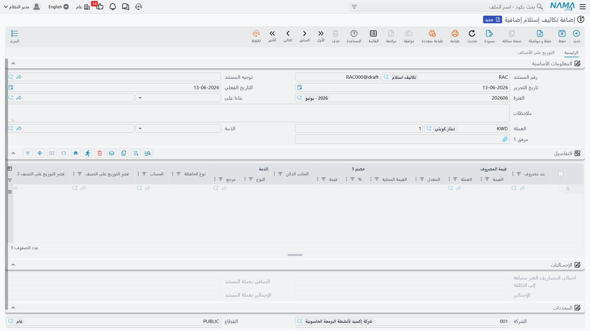
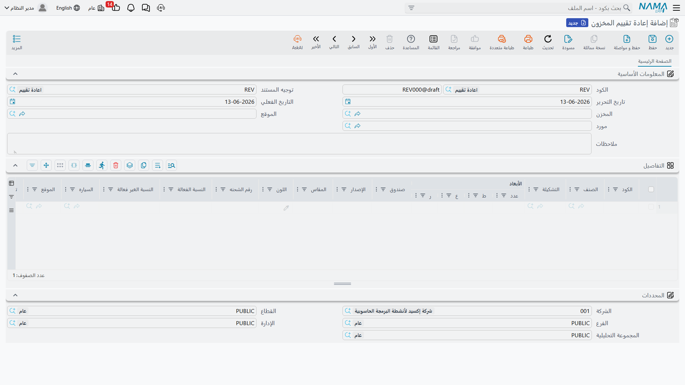

# تكلفة المخزون وإعادة التقييم (Inventory Costing & Revaluation)

كمية المخزون نصف الحقيقة فقط؛ النصف الآخر هو **قيمته**. هذا الدليل يجمع المستندات التي تضبط تكلفة مخزونك: توزيع المصاريف الإضافية على التوريدات، وإعادة تقييم التكلفة، وتجميد التكلفة عند الإقفال.

## كيف يتتبع النظام التكلفة

يحتفظ النظام بتكلفة كل صنف ويحدّثها مع كل حركة وفق طريقة التكليف المعتمدة - مثل **الوارد أولًا صادر أولًا (FIFO)**، و**متوسط التكلفة المتحرك**، و**آخر تكلفة شراء**. عند كل توريد تُحدَّث التكلفة، وعند كل صرف تُحتسب تكلفة المنصرف بالطريقة ذاتها، فتبقى تكلفة البضاعة المبيعة وقيمة المخزون متّسقتين تلقائيًا.

لكن الواقع يفرض حالات يحتاج فيها هذا التتبع التلقائي إلى تدخّل: مصاريف شحن تصل بعد التوريد، أو قيمة سوقية تنخفض، أو إقفال شهري يجب تثبيت التكلفة عنده. وتلك حالات هذه الصفحة.

## التكاليف الإضافية على التوريدات (ReceiptAdditionalCost)

سعر الصنف عند المورّد ليس كل تكلفته الحقيقية. هناك الشحن، والتأمين، والجمارك، والتخليص، والعمولات. **مستند التكلفة الإضافية** يوزّع هذه المصاريف على أصناف التوريد لتصل إلى **التكلفة الواصلة (Landed Cost)** الحقيقية.

### كيف يعمل

تربط المستند بالتوريد (أو أمر الشراء) المعني، ثم تُدخل بنود المصاريف. ويوزّعها النظام على الأصناف وفق أساس تختاره - بالقيمة، أو بالوزن، أو بالكمية، أو يدويًا. النتيجة أن تكلفة كل صنف ترتفع بنصيبه العادل من المصاريف، فتصبح قيمة المخزون - وتاليًا تكلفة البيع - معبّرة عن التكلفة الحقيقية لا سعر المورّد وحده.

يدعم المستند بنودًا تلقائية ويدوية ومحسوبة، كما يدعم جدولة سداد المصاريف الخارجية عبر قوالب الجدولة، فتُربط المصاريف بمستحقّيها زمنيًا.

::: tip التكاليف الإضافية والاعتمادات المستندية
في الاستيراد عبر الاعتمادات المستندية، تُجمَّع مصاريف الاعتماد (شحن، تأمين، جمارك، عمولات بنك) وتُحمَّل على البضاعة ضمن مسار الاعتماد. راجع [الاعتمادات المستندية](./letters-of-credit.md).
:::

## إعادة تقييم التكلفة (CostRevaluation)

أحيانًا تكون الكمية صحيحة لكن **القيمة** تحتاج تعديلًا. **مستند إعادة تقييم التكلفة** يغيّر تكلفة الأصناف دون تغيير كمياتها - لا حركة فعلية، أثر محاسبي فقط.

حالات الاستخدام:
- **انخفاض القيمة السوقية**: إلكترونيات اشتُريت بسعر مرتفع ثم صدر طراز أحدث، فتُخفَّض قيمتها لتطابق السوق (التقييم بالأقل من التكلفة أو السوق).
- **التقادم**: مخزون قديم لن يُباع بالسعر الكامل، فتُعدَّل قيمته إلى المبلغ القابل للاسترداد المتوقع.
- **تصحيح أخطاء التكلفة**: أصناف استُلمت بتكلفة خاطئة، فتُعاد إلى التكلفة الصحيحة.

يبقى الموقع والكمية كما هما، ويتغيّر الرصيد القيمي في الدفاتر فقط، مع قيد محاسبي يعكس فرق القيمة.

## تسعير المنتجات التامة (FinishedProductPricing)

عند تجميع أو تصنيع منتج نهائي، تتجمّع تكلفته من مكوناته. **مستند تسعير المنتجات التامة** يلتقط هذا التجميع: يجمع تكاليف المكونات من قائمة المواد (BOM) أو مستند التجميع، ويوزّع المنتجات المشتركة والتكاليف الإضافية غير المباشرة، ليصل إلى التكلفة النهائية للمنتج المجمَّع. يكمّل هذا المستند مسار [التجميع والتعبئة](./assembly-and-packaging.md) من الجانب التكلفوي. أما تكلفة الإنتاج الكاملة (عمالة ومصاريف غير مباشرة لأوامر الإنتاج) فموطنها [وحدة التصنيع](/ar/modules/manufacturing/).

## تجميد التكلفة عند الإقفال (FrozenCostAccounts)

عند إقفال فترة محاسبية (نهاية الشهر مثلًا)، لا تريد أن تتغيّر تكلفة المخزون بأثر رجعي بعد إصدار القوائم. **تجميد حسابات التكلفة** يمنع تعديل التكلفة خلال فترة محدّدة بتاريخ، فيحافظ على ثبات الأرقام التي بُنيت عليها القوائم المالية، ويمنع التوريدات أو التعديلات المتأخرة من تحريك تكلفة فترة مُقفلة.

::: tip منع استخدام دفعات بعينها
إلى جانب تجميد التكلفة، يتيح النظام **منع استخدام دفعة** خلال فترة (مثلًا دفعة قيد الاستدعاء أو الحجر الصحي)، فلا تُصرف تلك الدفعة حتى يُرفع المنع - أداة رقابة جودة تتقاطع مع التكلفة عبر منع تحريك مخزون لا يجب بيعه.
:::

## أفضل الممارسات

::: tip نصائح عملية
**وزّع التكاليف الإضافية قبل الإقفال**: أدخل مصاريف الشحن والجمارك على التوريد فور توفّرها، حتى تعكس تكلفة المخزون الواقع قبل احتساب تكلفة المبيعات.

**وثّق سبب إعادة التقييم**: كل إعادة تقييم تحتاج مبررًا واضحًا (هبوط سوق، تقادم، تصحيح) لأغراض المراجعة والامتثال.

**جمّد التكلفة بعد الإقفال مباشرةً**: فعّل التجميد بمجرد اعتماد قوائم الفترة لمنع أي تحريك لاحق لأرقامها.

**راجع التكلفة الواصلة دوريًا**: قارن التكلفة الواصلة الفعلية بالمتوقعة لاكتشاف انحرافات الموردين أو الشحن مبكرًا.
:::

## الخطوات التالية

- [استلام المخزون](./receiving-stock.md) - حيث تبدأ تكلفة المخزون
- [الجرد المخزني](./stock-taking.md) - تسوية الكميات قبل تثبيت القيم
- [التجميع والتعبئة](./assembly-and-packaging.md) - بناء المنتجات وتجميع تكاليفها
- [الاعتمادات المستندية](./letters-of-credit.md) - تكاليف الاستيراد عبر الاعتمادات
