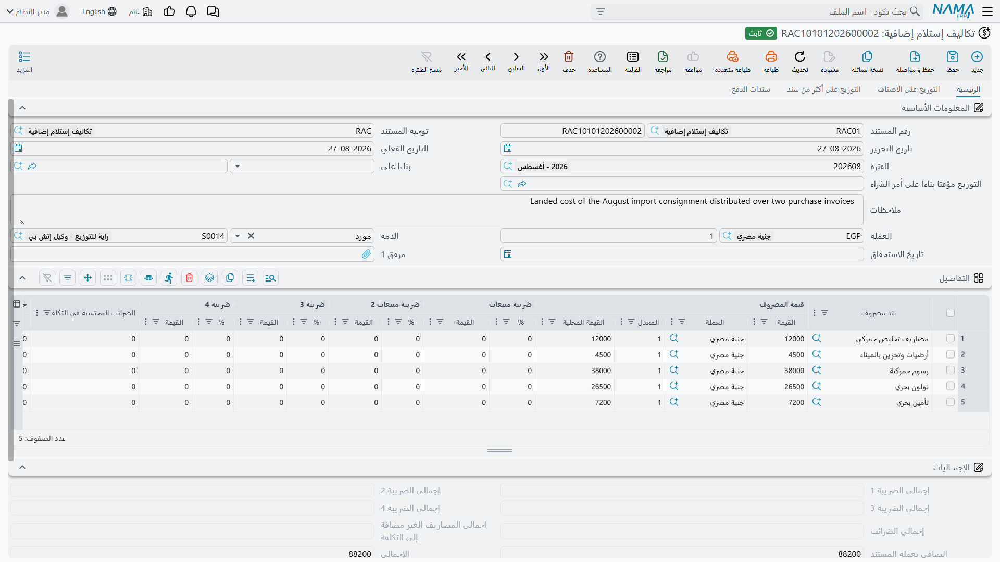
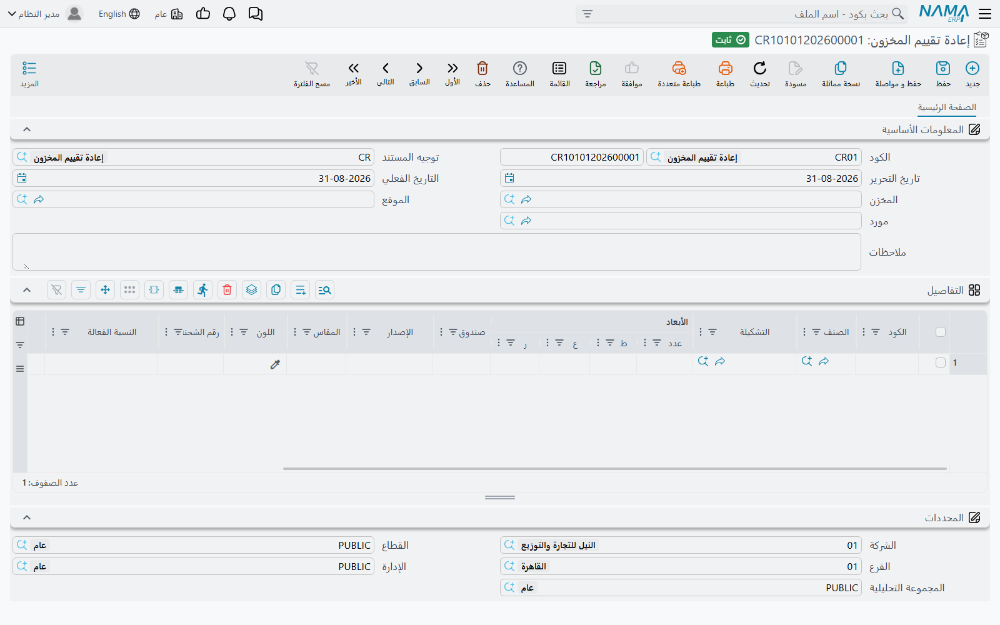

# تكلفة المخزون وإعادة التقييم (Inventory Costing & Revaluation)

كمية المخزون نصف الحقيقة فقط؛ النصف الآخر هو **قيمته**. هذا الدليل يجمع المستندات التي تضبط تكلفة مخزونك: توزيع المصاريف الإضافية على التوريدات، وإعادة تقييم التكلفة، وتجميد التكلفة عند الإقفال.

## كيف يتتبع النظام التكلفة

يحتفظ النظام بتكلفة كل صنف ويحدّثها مع كل حركة وفق طريقة التكليف المعتمدة - مثل **الوارد أولًا صادر أولًا (FIFO)**، و**متوسط التكلفة المتحرك**، و**آخر تكلفة شراء**. فكل توريد يضيف إلى طبقات التكلفة، وكل صرف يأخذ منها بالطريقة ذاتها، فتبقى تكلفة البضاعة المبيعة وقيمة المخزون متّسقتين.

وهذا العمل لا يجري داخل الحفظ. فحفظ المستند المخزني يرفع **طلب حركة مخزنية**، وتُحسب التكلفة حين يُعالَج ذلك الطلب بعد لحظات. ولهذا قد يظهر الصرف المحفوظ للتو بلا تكلفة، ولهذا يكون سؤال التكلفة في الغالب سؤالاً عن المعالجة: فالطلب إما في الانتظار وإما فشل. وصفحة [طلبات الأعمال](/ar/platform/background-processing/business-requests) هي موضع النظر فيه، وصفحة [إعدادات التكلفة](/ar/modules/supplychain/configuration/costing-configuration) تغطي ما يفعله النظام مع توريد لم تستقر تكلفته بعد — وهو السبب المعتاد لخروج الصرف بتكلفة صفر.

لكن الواقع يفرض حالات يحتاج فيها هذا التتبع التلقائي إلى تدخّل: مصاريف شحن تصل بعد التوريد، أو قيمة سوقية تنخفض، أو إقفال شهري يجب تثبيت التكلفة عنده. وتلك حالات هذه الصفحة.

## التكاليف الإضافية على التوريدات (ReceiptAdditionalCost)

سعر الصنف عند المورّد ليس كل تكلفته الحقيقية. هناك الشحن، والتأمين، والجمارك، والتخليص، والعمولات. **مستند التكلفة الإضافية** يوزّع هذه المصاريف على أصناف التوريد لتصل إلى **التكلفة الواصلة (Landed Cost)** الحقيقية.

### كيف يعمل

تربط المستند بالتوريد (أو أمر الشراء) المعني، ثم تُدخل بنود المصاريف. ويوزّعها النظام على الأصناف وفق أساس تختاره - بالقيمة، أو بالوزن، أو بالكمية، أو يدويًا. النتيجة أن تكلفة كل صنف ترتفع بنصيبه العادل من المصاريف، فتصبح قيمة المخزون - وتاليًا تكلفة البيع - معبّرة عن التكلفة الحقيقية لا سعر المورّد وحده.

يدعم المستند بنودًا تلقائية ويدوية ومحسوبة، كما يدعم جدولة سداد المصاريف الخارجية عبر قوالب الجدولة، فتُربط المصاريف بمستحقّيها زمنيًا.

::: tip التكاليف الإضافية والاعتمادات المستندية
في الاستيراد عبر الاعتمادات المستندية، تُجمَّع مصاريف الاعتماد (شحن، تأمين، جمارك، عمولات بنك) وتُحمَّل على البضاعة ضمن مسار الاعتماد. راجع [الاعتمادات المستندية](./letters-of-credit.md).
:::

## إعادة تقييم التكلفة (CostRevaluation)

أحيانًا تكون الكمية صحيحة لكن **القيمة** تحتاج تعديلًا. **مستند إعادة تقييم التكلفة** يغيّر تكلفة الأصناف دون تغيير كمياتها - لا حركة فعلية، أثر محاسبي فقط.

حالات الاستخدام:
- **انخفاض القيمة السوقية**: إلكترونيات اشتُريت بسعر مرتفع ثم صدر طراز أحدث، فتُخفَّض قيمتها لتطابق السوق (التقييم بالأقل من التكلفة أو السوق).
- **التقادم**: مخزون قديم لن يُباع بالسعر الكامل، فتُعدَّل قيمته إلى المبلغ القابل للاسترداد المتوقع.
- **تصحيح أخطاء التكلفة**: أصناف استُلمت بتكلفة خاطئة، فتُعاد إلى التكلفة الصحيحة.

يبقى الموقع والكمية كما هما، ويتغيّر الرصيد القيمي في الدفاتر فقط، مع قيد محاسبي يعكس فرق القيمة.

## تسعير المنتجات التامة (FinishedProductPricing)

عند تجميع أو تصنيع منتج نهائي، تتجمّع تكلفته من مكوناته. **مستند تسعير المنتجات التامة** يلتقط هذا التجميع: يجمع تكاليف المكونات من قائمة المواد (BOM) أو مستند التجميع، ويوزّع المنتجات المشتركة والتكاليف الإضافية غير المباشرة، ليصل إلى التكلفة النهائية للمنتج المجمَّع. يكمّل هذا المستند مسار [التجميع والتعبئة](./assembly-and-packaging.md) من الجانب التكلفوي. أما تكلفة الإنتاج الكاملة (عمالة ومصاريف غير مباشرة لأوامر الإنتاج) فموطنها [وحدة التصنيع](/ar/modules/manufacturing/).

## تجميد التكلفة عند الإقفال (FrozenCostAccounts)

عند إقفال فترة محاسبية (نهاية الشهر مثلًا)، لا تريد أن تتغيّر تكلفة المخزون بأثر رجعي بعد إصدار القوائم. **تجميد حسابات التكلفة** يمنع تعديل التكلفة خلال فترة محدّدة بتاريخ، فيحافظ على ثبات الأرقام التي بُنيت عليها القوائم المالية، ويمنع التوريدات أو التعديلات المتأخرة من تحريك تكلفة فترة مُقفلة.

::: tip منع استخدام دفعات بعينها
إلى جانب تجميد التكلفة، يتيح النظام **منع استخدام دفعة** خلال فترة (مثلًا دفعة قيد الاستدعاء أو الحجر الصحي)، فلا تُصرف تلك الدفعة حتى يُرفع المنع - أداة رقابة جودة تتقاطع مع التكلفة عبر منع تحريك مخزون لا يجب بيعه.
:::

## الإجراءات في هذه الشاشات

**في مصروفات الاستلام:** **تجميع الأصناف** (Collect Items) يملأ سطور التكلفة من أمر الاستلام أو الاعتماد المستندي أو الشحنة المذكورة في الرأس، فتُفرد التكلفة على ما وصل فعلًا؛ و**إنشاء الدفعات** (GeneratePayments) يقسّم قيمة المستند إلى جدول أقساط، سائلًا عن عدد الدفعات والمدة ووحدتها وتاريخ البدء وفترة السماح وقيم الدفعة المقدمة والأولى والثانية والأخيرة وطريقة التقريب.

**في تسعير المنتجات التامة:** **تجميع المواد الخام** (Collect Materials) يملأ جدول الخامات من المنتجات محل التسعير وتوجيه المستند؛ و**إعادة حساب كميات الخامات** (Recalculate Materials Qty) يعيد اشتقاق كميات تلك الخامات بعد تغيّر كميات المنتجات؛ و**تجميع المنتجات الثانوية** (Collect CoProducts)، في صفحة التفاصيل، يملأ جدول المنتجات الثانوية من المنتجات.

## أفضل الممارسات

::: tip نصائح عملية
**وزّع التكاليف الإضافية قبل الإقفال**: أدخل مصاريف الشحن والجمارك على التوريد فور توفّرها، حتى تعكس تكلفة المخزون الواقع قبل احتساب تكلفة المبيعات.

**وثّق سبب إعادة التقييم**: كل إعادة تقييم تحتاج مبررًا واضحًا (هبوط سوق، تقادم، تصحيح) لأغراض المراجعة والامتثال.

**جمّد التكلفة بعد الإقفال مباشرةً**: فعّل التجميد بمجرد اعتماد قوائم الفترة لمنع أي تحريك لاحق لأرقامها.

**راجع التكلفة الواصلة دوريًا**: قارن التكلفة الواصلة الفعلية بالمتوقعة لاكتشاف انحرافات الموردين أو الشحن مبكرًا.
:::

## رسائل قد تظهر لك

| الرسالة | لماذا | ما تفعله |
|---|---|---|
| «لا توجد أصناف لتوزيع التكاليف الإضافية عليها» | المستند المذكور في رأس مصروفات الاستلام (أمر استلام أو أمر شراء أو شحنة) لا يحتوي سطور أصناف تُوزَّع عليها المصاريف، وتوجيه المستند لا يسمح بترك جدول التوزيع الآلي فارغًا. | اربط الرأس بمستند يحتوي سطور أصناف فعلًا ثم اضغط **تجميع الأصناف** من جديد، أو - إن كان الجدول الفارغ مقصودًا - فعّل خيار *السماح بسطور توزيع آلي فارغة* في التوجيه. |
| «يمكنك استعمال سند تجميع واحد فقط فى سند تكاليف إستلام إضافية» | المستند يذكر أكثر من مستند تكلفة وأحدها سند تجميع. | أفرد لسند التجميع مستند مصروفات استلام خاصًا به، وأدخل باقي المصاريف في مستند آخر. |
| «لا يمكنك استعمال أكثر من نوع مستند فى سند تكاليف إستلام إضافية» | مستندات التكلفة المذكورة من أنواع مختلفة - أمر استلام وشحنة مثلًا. أمر الشراء وفاتورة الشراء يُعدّان نوعًا واحدًا. | قسّم المصاريف بحيث يوزّع كل مستند مصروفات استلام على نوع مستند واحد فقط. |
| «السطر رقم {0} مرتبط بمستند تكلفة مختلف {1} عن المستند المتوقع {2}» | سطر تكلفة يدوي أو آلي يذكر مستند تكلفة غير المذكور في الرأس. | افرغ مستند التكلفة في ذلك السطر ليتبع الرأس، أو عدّله إلى مستند الرأس. |
| «لا يمكن إستخدام المستند {0} كبناءا علي للفاتورة {1} لانه استخدم من قبل الفاتورة {2} ووجد في مستند تكاليف الإستلام الإضافية {3}» | ترتفع عند حفظ فاتورة شراء مبنية على أمر شراء سبق توزيع مصاريفه بمستند مصروفات استلام على فاتورة أخرى. مصاريف أمر واحد لا تتبع فاتورتين. | إما أن تبني الفاتورة على أمر لم يُستخدم بعد، أو تفتح مستند مصروفات الاستلام وتعيد ربطه بالفاتورة التي تحفظها. |
| «التكلفة فيفو لا تدعم إعادة تقييم المخزون» | طريقة التكلفة في إعدادات سلاسل التوريد هي الوارد أولًا صادر أولًا (فيفو)، وإعادة تقييم التكلفة لا تعمل إلا مع الطرق الأخرى. | عدّل القيمة بمستند تدعمه طريقة التكلفة (تسوية مخزنية، أو مصروفات استلام على أمر الاستلام) بدلًا من إعادة تقييم التكلفة. |
| «لا يمكن إختيار طريقة التجميع {0} مرتين فى سطور المنتجات» | سطر منتج في تسعير المنتجات التامة يذكر طريقة التجميع نفسها في خانتين من خانات التجميع نصف المصنّع. | اذكر كل طريقة تجميع مرة واحدة في السطر. |
| «لا يمكن إختيار مكونات المنتج {0} مرتين فى سطور المنتجات» | سطر منتج في تسعير المنتجات التامة يذكر مكونات المنتج نفسها في خانتين من خانات نصف المصنّع. | اذكر كل مكونات منتج مرة واحدة في السطر. |
| «لا يمكن أن تكون الشركة عام» | حُفظ سجل تجميد التكلفة والشركة متروكة «عام» (مشتركة بين الشركات) أو مركّبة، وتجميد التكلفة يلزمه شركة واحدة حقيقية. | اختر شركة واحدة، وأنشئ سجلًا لكل شركة إن كنت تجمّد أكثر من واحدة. |
| «المستخدم {0} غير مسموح له باتخاذ هذا الإجراء» | تجميد التكلفة لا يحفظه إلا المستخدم `admin` أو مستخدم تسمح إعداداته بتعديل تجميد التكلفة. | اطلب من مسؤول النظام حفظ السجل، أو أن تُضاف هذه الصلاحية إلى إعدادات مستخدمك. |
| «لقد قمت بإيقاف تأثير التكاليف على شركة {0} من {1} إلى {2}. برجاء التأكد من ذلك» | تحذير لا رفض - يظهر في كل حفظ لتجميد التكلفة، معيدًا ذكر الشركة والمدة التي لن تتحرك فيها التكلفة. | راجع التواريخ والشركة؛ إن كانت صحيحة فأكّد ويُحفظ السجل. |

## الخطوات التالية

- [استلام المخزون](./receiving-stock.md) - حيث تبدأ تكلفة المخزون
- [الجرد المخزني](./stock-taking.md) - تسوية الكميات قبل تثبيت القيم
- [التجميع والتعبئة](./assembly-and-packaging.md) - بناء المنتجات وتجميع تكاليفها
- [الاعتمادات المستندية](./letters-of-credit.md) - تكاليف الاستيراد عبر الاعتمادات
