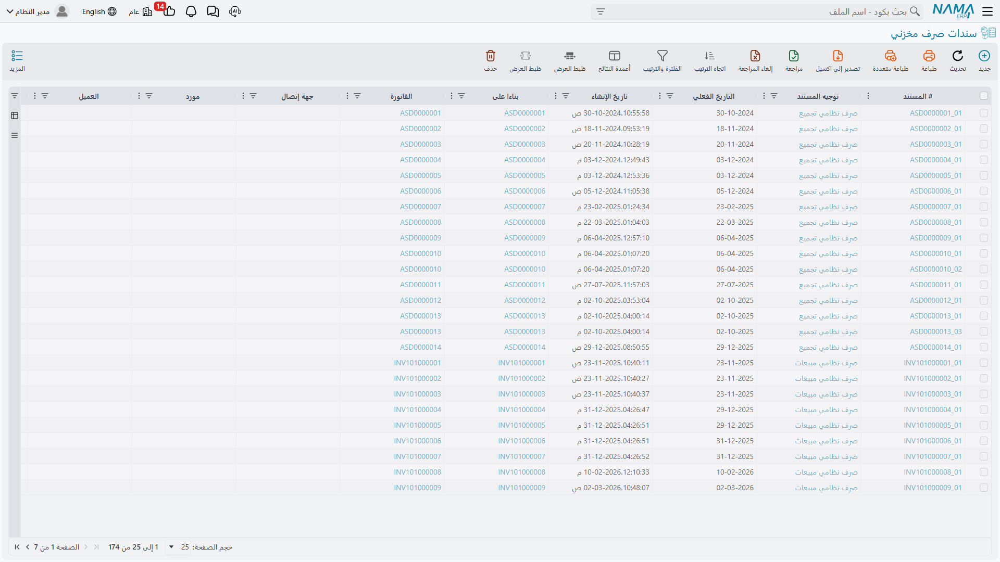
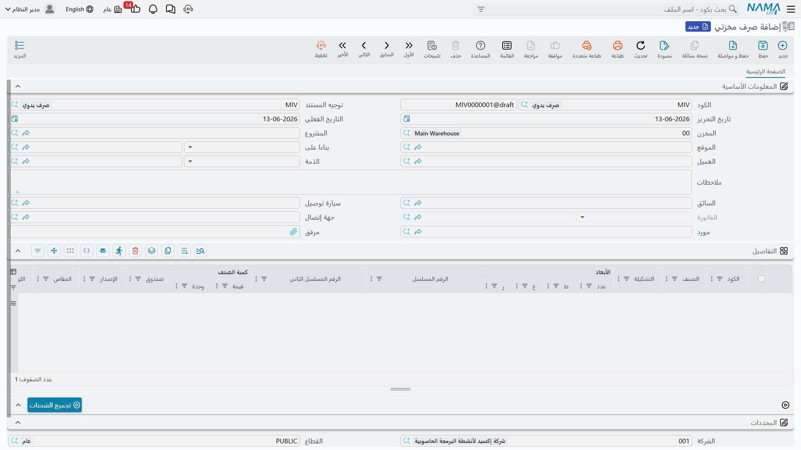

# إصدار المخزون من المستودع (Issuing Stock)

ما يدخل لا بد أن يخرج! بينما يتعلق [استلام المخزون](./receiving-stock.md) بإدخال الأصناف إلى المستودع، فإن الصرف يتعلق بإطلاقها للاستخدام. لنستعرض متى ولماذا وكيف تغادر الأصناف مخزونك.

## الصرف المخزني: نقطة الخروج من المخزون

**الصرف المخزني** (StockIssue) هو السجل الرسمي الذي يُثبت خروج الأصناف من المستودع في وقت محدد ولغرض محدد. تمامًا كوثائق الاستلام، تستدعي السيناريوهات المختلفة معالجة مختلفة.

## الصرف المخزني العام: أداتك الأساسية

مستند الصرف المخزني هو أداتك متعددة الأغراض لإخراج الأصناف من المخزون لأي سبب غير البيع المباشر (الذي يمتلك مساره الخاص في [رحلة المبيعات](./sales-journey.md)).

### السيناريوهات الشائعة

**الاستخدام الداخلي للأقسام**
يحتاج قسم تقنية المعلومات إلى 10 أجهزة لابتوب لمشروع جديد. أنشئ صرفًا مخزنيًا لنقل الأجهزة من "متاح" إلى عهدة القسم، وتقليل المخزون المتاح (حتى لا تبيعها بالخطأ)، ومعرفة مكانها لاحقًا.

**العينات والعروض التوضيحية**
يحتاج فريق المبيعات إلى عينات للمعرض التجاري. اصرفها مع ملاحظات عن الغرض، لتتبع ما وُزِّع مقابل المتاح للبيع، واحتساب تكلفتها كمصروف تسويقي.

**العجز والخسائر والتلف**
خلال الجرد اكتشفت نقصًا في 5 قطع، أو تلف بعض البضاعة في التخزين. لا يوجد في النظام "سند تلفيات" مستقل؛ فالطريقة الصحيحة لتسجيل أي خسارة أو تلف عارض هي **صرف مخزني** موجَّه إلى حساب خسائر مناسب. يُزيل ذلك الأصناف رسميًا من المخزون المتتبَّع ويسجّل الخسارة محاسبيًا مع توثيق السبب.

::: warning النقص الطبيعي والفروق الدورية
إذا كان النقص ناتجًا عن نقص طبيعي أو فروق دورية تُكتشف عند العد (لا عن واقعة تلف محددة)، فالأنسب تسويته عبر [الجرد المخزني](./stock-taking.md)، لا عبر صرف يدوي.
:::

**التبرعات**
تتبرع بمعدات قديمة لجمعية خيرية. اصرف الأصناف مع توثيق مناسب للأغراض الضريبية وتسجيل القيمة العادلة ومعلومات جهة الاستلام.

### كيف يعمل النظام

يتطلب كل مستند صرف:
1. **موقع المصدر**: من أين تُؤخذ الأصناف؟ أي مخزن وموقع تخزيني محدد؟
2. **الأصناف والكميات**: ما الذي يخرج وبأي كمية؟ مع تحديد وحدة القياس.
3. **الغرض / جهة الاستلام**: إلى أين تذهب؟ قسم؟ مشروع؟ حساب خسائر؟
4. **طريقة التكلفة**: عادةً تلقائية بناءً على طريقة التكليف المعتمدة.

يقوم النظام بعدها بتخفيض كمية المخزون في موقع المصدر، وتقليل قيمة أصل المخزون، وإنشاء القيود المحاسبية (دائن المخزون، مدين المصروف أو الحساب المستهدف)، وتسجيل الأرقام التسلسلية أو الدُّفعات المحددة التي صُرفت، وتحديث الكميات المتاحة.

## نهج الطلب أولًا: طلب الصرف (StockIssueReq)

في كثير من المنظمات، لا تُصرف الأصناف عشوائيًا — بل يطلبها شخص ما أولًا. **طلب الصرف المخزني** هو طلب للحصول على أصناف يجب مراجعته واعتماده قبل الصرف الفعلي.

**سير العمل:**
1. **الطلب**: يُنشئ القسم طلب صرف: "نحتاج 100 كغ مادة، 50 قطعة لأمر العمل #12345".
2. **المراجعة**: يراجع مشرف المستودع التوفر وصحة الطلب ومعقولية الكميات.
3. **الاعتماد**: بعد الاعتماد يصبح الطلب مُرخَّصًا.
4. **التنفيذ**: يُنشئ المستودع مستند الصرف الفعلي مرتبطًا بالطلب.

**لماذا الخطوة الإضافية؟** لأنها تمنحك التحكم (لا أحد يأخذ الأصناف دون طلب واعتماد)، والتخطيط (تحضير الأصناف مسبقًا)، والرؤية (اطلاع الإدارة قبل الاستهلاك)، ومسار تدقيق واضح. هذا بالغ الأهمية للأصناف عالية القيمة والمواد الخاضعة للرقابة والأصناف المقيدة بميزانية.

::: info الصرف للإنتاج والأقسام المتخصصة
صرف المواد الخام لأوامر الإنتاج له مستنداته في وحدتي **التصنيع** و**مكونات التصنيع (MC)**، وصرف المستلزمات لأجنحة المرضى في **إدارة المستشفيات**، وصرف مواد مواقع العمل في **المقاولات**. كل وحدة من هذه تتبع تكلفتها بطريقتها الخاصة، فراجع توثيق كل وحدة لتلك المسارات. يبقى الصرف المخزني العام هنا أداتك للأغراض غير المتخصصة.
:::

## تقطيع المواد ثنائية الأبعاد (ItemCuttingDoc)

يُعالج **مستند التقطيع** حالة خاصة بالأصناف **ثنائية الأبعاد** (مثل ألواح الفولاذ والزجاج والخشب): عندما لا تصرف المادة فحسب، بل تُحوِّلها إلى قطع أصغر بأبعاد محددة.

**مثال**: لديك لوح فولاذ بمقاس 2×3 متر. تقطعه إلى عدة قطع بأبعاد مختلفة وفق احتياج التصنيع. هذا المستند **يصرف** اللوح الكامل، **ويستلم** القطع الناتجة بأبعادها، **ويتتبع** الهدر (الفرق بين مساحة اللوح ومجموع مساحات القطع). إنه صرف واستلام في آنٍ واحد — مستند تحويل مخصص للأصناف ذات البُعدين.

::: tip ليس للنقص الوزني
مستند التقطيع مخصص للتحويل الهندسي للأصناف ثنائية الأبعاد، وليس لمعالجة النقص الوزني أو الفاقد الطبيعي (كنقص وزن اللحوم مثلًا)؛ فذلك يُعالَج عبر [الجرد المخزني](./stock-taking.md).
:::

## اختيار الدُّفعات: أي الأصناف تُصرف؟

عندما يكون لديك عدة دفعات من الصنف ذاته، أيها يُصرف؟ يمكن للنظام الاختيار تلقائيًا بناءً على:

- **FIFO (أول داخل أول خارج)**: صرف أقدم المخزون أولًا - مناسب للأصناف القابلة للتلف والوقاية من التقادم.
- **LIFO (آخر داخل أول خارج)**: صرف أحدث المخزون أولًا - يُستخدم أحيانًا للأصناف التي يكون فيها الأحدث أفضل.
- **FEFO (أول انتهاء صلاحية أول خارج)**: صرف الأقرب انتهاءً أولًا - ضروري للأدوية والمواد الغذائية وأي صنف له تاريخ انتهاء.
- **الاختيار اليدوي**: عند الحاجة لاختيار دُفعة بعينها لاعتبارات جودة أو تفضيل عميل.

## إدارة الأرقام التسلسلية

للأصناف المرقَّمة تسلسليًا، يستلزم الصرف تحديد الأرقام التسلسلية المغادِرة بدقة. يعرض النظام الأرقام المتاحة في موقع المصدر، فيختار المستخدم (أو يمسح ضوئيًا) ما يُصرف، ويتحقق النظام من التوفر، وعند الحفظ تنتقل تلك الأرقام من "متاح" إلى "مصروف". يبقى التتبع المستقبلي ممكنًا: "أين الرقم التسلسلي #12345؟" يُظهر أنه صُرف في تاريخ كذا لجهة كذا. هذا ضروري لتتبع الضمان وإدارة الاستدعاء وإدارة الأصول.

## الأثر المحاسبي للصرف

لكل عملية صرف تبعات محاسبية تعتمد على الغرض:

- **الصرف لقسم (استخدام داخلي)**: دائن المخزون / مدين مصروفات القسم
- **الصرف للعينات (تسويق)**: دائن المخزون / مدين مصروف التسويق
- **الصرف للخسائر/التلف**: دائن المخزون / مدين حساب الخسائر
- **الصرف للإصلاح (يُعاد لاحقًا)**: دائن المخزون / مدين مخزون تحت الإصلاح (لا يزال أصلًا!)

يُنشئ النظام هذه القيود تلقائيًا بناءً على إعدادات المحاسبة التي هيأتها للصنف وغرض الصرف.

## تصحيح أخطاء الصرف

ماذا لو صرفت أكثر مما يجب؟ أو أقل؟ أو الصنف الخطأ؟
- **الإعادة عبر استلام**: إذا أُعيدت الأصناف، أنشئ استلامًا لإعادتها إلى المخزون المتاح.
- **صرف تعديلي**: إذا صرفت أقل، أنشئ صرفًا إضافيًا للكمية الباقية.
- **الإلغاء وإعادة الإصدار**: أوضح مسار تدقيق لكنه الأكثر جهدًا.

اختر بناءً على ضوابط مؤسستك، والوقت المنقضي، وما إذا كانت العمليات اللاحقة (كاحتساب تكلفة الإنتاج) قد استخدمت بيانات الصرف بالفعل.

## نصائح للصرف الدقيق

::: tip أفضل الممارسات
**تحقق قبل الحفظ**: راجع الكميات والأصناف قبل الحفظ (لا كمسودة). بمجرد الحفظ يؤثر المستند على النظام فورًا.

**استخدم المواقع بدقة**: اصرف من الموقع الفعلي الذي تتواجد فيه الأصناف، لا من المخزن بشكل عام.

**اربط بمستندات المصدر**: اربط الصرف دائمًا بغرضه. هذا التتبع ضروري عند التحقيق في الفروقات.

**لا تؤخر تسجيل الصرف**: سجِّله فور حدوثه. دقة المخزون اللحظية تتطلب تسجيلًا لحظيًا.

**عالج الصرف الجزئي**: إذا توفر جزء فقط من الطلب، اصرف ما لديك وسجِّل النقص بدلًا من الانتظار.
:::

## أسئلة شائعة

**س: هل يمكننا صرف أصناف غير موجودة في المخزون (الدخول في الرصيد السالب)؟**

ج: يعتمد على سياسة السحب على المكشوف للصنف؛ فبعض الأصناف الحرجة تمنع المخزون السالب، وأخرى تُنبِّه لكن تسمح. راجع [فهم أصناف المخزون](./understanding-items.md#ضبط-المخزون-كيف-يتصرف-المخزون).

**س: ما الفرق بين الصرف والتحويل؟**

ج: **الصرف** يُقلِّص إجمالي المخزون (خرجت الأصناف من سيطرة المنشأة). **التحويل** ينقل الأصناف بين المواقع مع بقاء الإجمالي كما هو. النقل من مخزن إلى آخر تحويل، تجده في [تحريك المخزون](./moving-stock.md).

**س: كيف نسجّل تلف بضاعة دون وجود "سند تلفيات"؟**

ج: استخدم صرفًا مخزنيًا موجَّهًا إلى حساب خسائر. هذه هي الطريقة المعتمدة في النظام لتسجيل التلف العارض، مع توثيق السبب في الملاحظات.

## الخطوات التالية

الآن وقد فهمت الاستلام والصرف معًا، تعلَّم ما يلي:
- [تحريك المخزون بين المخازن](./moving-stock.md) - التحويلات والتجميعات
- [الجرد المخزني](./stock-taking.md) - تسوية الفروق والنقص الطبيعي
- [رحلة المبيعات](./sales-journey.md) - كيف تغادر الأصناف المباعة (مما يؤدي إلى الصرف)
