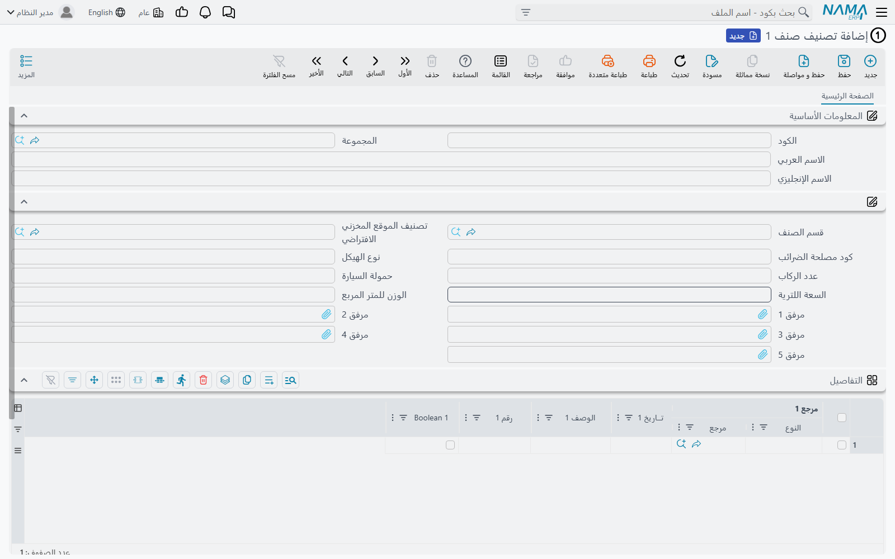
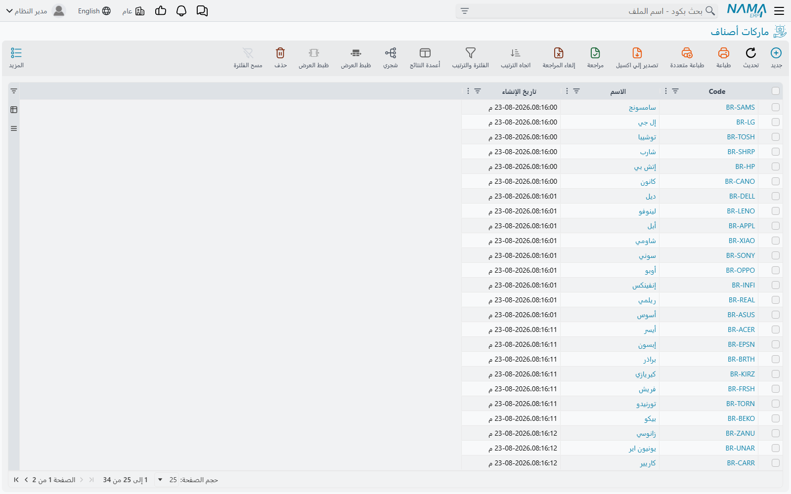
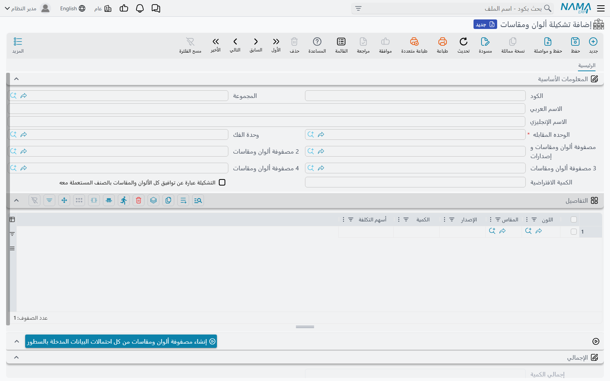

# ملفات تصنيف الأصناف (Item Classification Files)

اطلب من شخصين تنظيم الكتالوج نفسه المكوّن من خمسة آلاف صنف وستحصل على إجابتين مختلفتين. أحدهما سيجمعها حسب **ماهية** الشيء — مادة خام، منتج تام، قطع غيار. والآخر سيجمعها حسب من يبيعها، أو المورد الذي تأتي منه، أو الرف الذي تسكنه. وكلاهما محق، والعمل الحقيقي يحتاجها جميعًا في آن واحد، لأن تقرير المشتريات ونظام عمولات المبيعات والجرد يقطع كلٌّ منها الكتالوج بطريقة مختلفة.

ولهذا السبب لا يكون تصنيف الأصناف حقلًا واحدًا. بل هو مجموعة من الملفات الرئيسية الصغيرة، يحمل كل منها قيم طريقة واحدة لتقطيع الكتالوج، ثم تربطها بالأصناف.

## تصنيف صنف من 1 إلى 10: الخانات العشر

**تصنيف صنف 1** حتى **تصنيف صنف 10** (المخازن ← الملفات ← تصنيف صنف 1 … تصنيف صنف 10) هي آلية التصنيف الأساسية. عشر خانات مستقلة فارغة، وأنت من يقرر معنى كل واحدة منها.

فقد يستخدم موزّع أدوية التصنيف 1 للفئة العلاجية، والتصنيف 2 للشركة المصنّعة، والتصنيف 3 لمتطلبات التخزين (سلسلة تبريد أو حرارة عادية)، ويترك الباقي فارغًا. وقد يستخدم بائع ملابس التصنيف 1 للقسم، والتصنيف 2 للقماش، والتصنيف 3 للفئة العمرية. ولا شيء في النظام يفترض معنى أي منها.

وكل خانة ملف رئيسي مستقل، فالقيم في التصنيف 1 منفصلة عن قيم التصنيف 2، ويمكن ملء العشرة بشكل مستقل على أي صنف.

::: tip لماذا تصنيفات الأصناف أهم مما تبدو
خانات التصنيف العشر هي ما يطابق عليه كل شيء تقريبًا في سلسلة التوريد. فحين تعدّ قاعدة تنطبق على مجموعة من الأصناف بدلًا من صنف واحد — قواعد التسعير، وتحديد التخزين، وعلاقات الأصناف، وإنشاء الأصناف بالجملة — يكون المُحدِّد المعروض هو **تصنيف 1–10**.

وشاشة [أصناف متعددة](./item-maintenance.md) أوضح مثال على ذلك: جدول التوليد فيها يتضاعف بالتصنيف 1 حتى 10 ولا شيء غيرها. فإذا كنت تجهّز تطبيقًا جديدًا وتتساءل أي تصنيف يستحق بذل الجهد فيه، فهذه هي الإجابة.
:::

::: warning فئة الصنف تجاوزها التصنيف
تحمل الأصناف أيضًا **فئة الصنف 1** حتى **فئة الصنف 5**، ويغذّيها ملف **فئة صنف** (المخازن ← الملفات ← فئة صنف). والشاشة ما زالت تُشحن وما زالت على القائمة، فستجدها، وقواعد البيانات القائمة ما زالت تحمل قيمًا فيها.

لكن تصنيفات الأصناف تجاوزتها. فالتطبيقات الجديدة ينبغي أن تصنّف بـ**تصنيف 1–10** وتترك خانات الفئات؛ فالتصنيفات هي ما بُنيت حوله القواعد والمولّدات والمُحدِّدات في الوحدة كلها. أما الفئات فتظهر في مواضع قليلة كحقول مرجع، لكنها ليست حيث يعيش منطق التصنيف في النظام.
:::

## القسم والماركة

ملفا تصنيف آخران يقفان خارج الخانات المرقّمة لأن لهما معنى ثابتًا.

**قسم صنف** (المخازن ← الملفات ← قسم صنف) هو أعرض تجميع — القسم أو الشعبة التي ينتمي إليها المنتج.

**ماركة صنف** (المخازن ← الملفات ← ماركة صنف) تسجّل العلامة التجارية. وهي أهم مما تبدو: فالماركة أحد المُحدِّدات المعروضة حين تكتب قاعدة ينبغي أن تنطبق على نطاق من المنتجات، فتصبح «كل ما تنتجه هذه الشركة» سطرًا واحدًا بدلًا من قائمة أصناف.

## الألوان والمقاسات

بعض الأصناف ليست شيئًا واحدًا. فالقميص قميص بثمانية ألوان وخمسة مقاسات، ولا تريد أربعين بطاقة صنف له. وفي Nama ERP يمكن للصنف الواحد أن يحمل اللون والمقاس كـ**محددات**: صنف واحد، تُتابَع الأرصدة والتكاليف والأسعار فيه لكل تركيبة لون ومقاس.

وتدعم ذلك أربعة ملفات رئيسية:

| الملف | ما يحمله |
|---|---|
| **لون صنف** (المخازن ← الملفات ← لون صنف) | الألوان نفسها |
| **مقاس صنف** (المخازن ← الملفات ← مقاس صنف) | المقاسات |
| **تصنيف لون صنف** (المخازن ← الملفات ← تصنيف لون صنف) | مجموعات من الألوان، لتنظيم قائمة ألوان طويلة |
| **تصنيف مقاس صنف** (المخازن ← الملفات ← تصنيف مقاس صنف) | المثل نفسه للمقاسات |

أما استخدام الصنف لها من عدمه فيحدده مفتاحا **له ألوان** و**له مقاسات** على الصنف، ومدى صرامة تطبيقها يأتي من ملف إعدادات الصنف — راجع [إنشاء الأصناف وصيانتها](./item-maintenance.md).

## ملف إصدار الصنف (Item Revision File)

يعرّف ملف **اصدار صنف** (المخازن ← الملفات ← اصدار صنف) إصدارًا — سنة موديل، أو نسخة، أو تركيبة. ومثل اللون والمقاس، الإصدار محدد يمكن متابعة الصنف به، فيحتفظ الصنف الواحد برصيد نسختي 2025 و2026 منفصلين.

والإصدار أكثر من مجرد كود. فكل إصدار مصنَّف بذاته — يحمل **الماركة** و**قسم الصنف** و**تصنيف 1–10** و**فئة الصنف 1–5** — ما يعني أن الإصدار يمكن البحث عنه وإصدار التقارير عنه بالطريقة نفسها التي يُعامَل بها الصنف. كما يحمل جدولي **الألوان** و**المقاسات** الخاصين به، ويمكن لكل منهما ترشيح قيمة **افتراضية**. وهكذا يعلن الإصدار الألوان والمقاسات المتاحة فيه فعلًا، بدلًا من أن يرث كل لون صُنع به الصنف يومًا.

## بناء المصفوفة (Size Color Revision Collection)

سرد الألوان والمقاسات سهل. أما الجزء الممل فهو التركيبات، ولذلك وُجدت شاشة **مصفوفة ألوان ومقاسات و إصدارات** (المخازن ← الملفات ← مصفوفة ألوان ومقاسات و إصدارات).

للشاشة تبويبان، والثاني هو موضع العمل. ففي تبويب **المصفوفة** تملأ ثلاثة جداول بسيطة — **الألوان** و**المقاسات** و**إصدارات** (كل سطر فيه يسمّي ملف اصدار صنف). ثم تضغط **إنشاء مصفوفة**، فتُبنى المصفوفة لك: كل لون مقرونًا بكل مقاس، مكتوبةً في جدول **التفاصيل** في التبويب الأول.

فتصير أربعة ألوان وخمسة مقاسات عشرين سطرًا دون أن يكتب أحد عشرين سطرًا. ويمكنك بعدها حذف التركيبات غير الموجودة — فإذا كان القميص لا يُصنع بمقاس كبير جدًا باللون الأخضر، احذف ذلك السطر.

وتُربط المصفوفة الجاهزة بالأصناف عبر حقل **مصفوفة ألوان ومقاسات و إصدارات**، الذي يظهر على بطاقة الصنف وعلى طلب فتح صنف وأصناف متعددة معًا. فتُعرَّف المصفوفة مرة واحدة وتُعاد الاستفادة منها في كل صنف يشاركها.

## بيع تشكيلة كوحدة واحدة (Item Assortment)

التشكيلة خليط مُعبأ مسبقًا يُباع كوحدة واحدة. فكرتونة قمصان تضم مقاسين صغيرين وثلاثة متوسطة وواحدًا كبيرًا هي شيء واحد بالنسبة للعميل ولقائمة الأسعار، لكنها ستة أثواب بالنسبة للمخزن.

وتصف شاشة **تشكيلة ألوان ومقاسات** (المخازن ← الملفات ← تشكيلة ألوان ومقاسات) ذلك بالضبط. فجدول **التفاصيل** يسرد ما بداخلها — **اللون** و**المقاس** و**الإصدار** و**الكمية** و**أسهم التكلفة** لتوزيع تكلفة التشكيلة على محتوياتها — ويجمعها **إجمالي الكمية**.

وحقلان في الرأس يجعلان التعبئة والتفكيك يعملان:

- **الوحده المقابله** هي الوحدة التي تُتداول بها التشكيلة — الكرتونة.
- **وحدة الفك** هي ما تتفكك إليه — الثوب المفرد.

وملء الجدول يدويًا اختياري. فبتفعيل **التشكيلة عبارة عن توافيق كل الألوان والمقاسات بالصنف المستعملة معه** تُؤخذ التشكيلة على أنها كل توافيق الألوان والمقاسات المستخدمة على الصنف. أو يبني إجراء **إنشاء مصفوفة ألوان ومقاسات من كل احتمالات البيانات المدخلة بالسطور** المحتويات من توافيق ما أدخلته في السطور. ويمكن للرأس أن يشير إلى أربع مصفوفات، فتستند التشكيلة إلى أكثر من مصفوفة واحدة.

كما تظهر التشكيلات في جداول الوحدات في طلب فتح صنف وأصناف متعددة، في عمود اسمه **التشكيلة**، فيمكن إعداد الصنف للتداول بوحدات التشكيلة منذ لحظة إنشائه.

## أين تعيش ملفات التصنيف الأخرى

ملفان يبدو أنهما ينتميان إلى هنا لكنهما موثقان في مكان آخر، لأن القائمة تضعهما في مكان آخر وكذلك غرضهما:

- **تصنيف الخامة** يقع تحت المبيعات ← الملفات، وهو مشروح في [السيناريوهات المتخصصة](./specialized-scenarios.md).
- **موسم** و**مستند تحديث المواسم** يقعان تحت المبيعات ← قوائم الأسعار والعروض. وهما يصنّفان حسب الفترة التجارية لا حسب طبيعة المنتج، ما يضعهما بجانب [التسعير والعروض والكوبونات](./pricing-offers-and-coupons.md) لا هنا.
