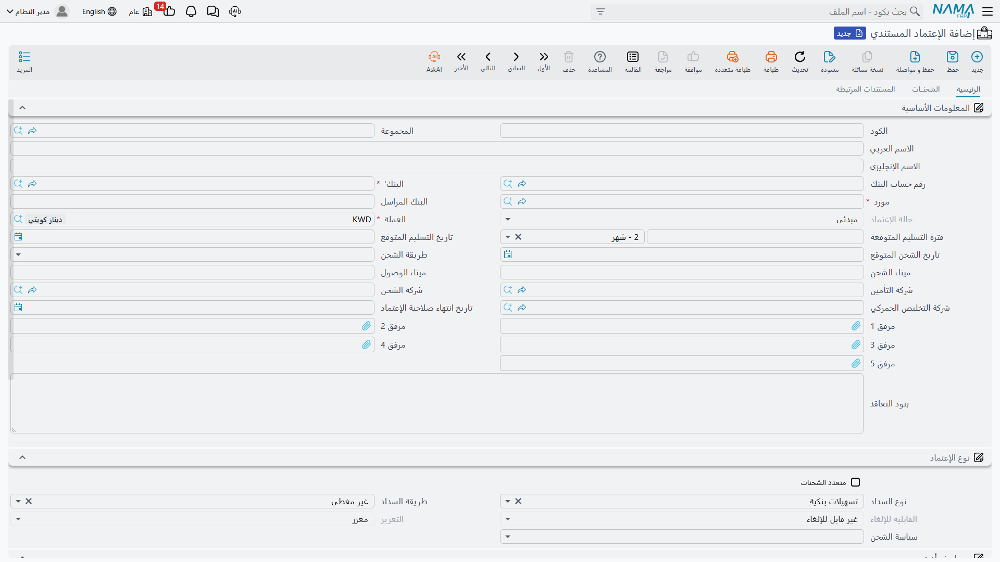
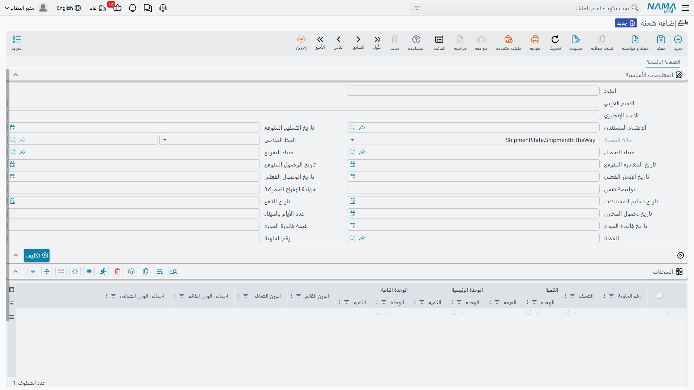

# الاعتمادات المستندية (Letters of Credit)

عندما تستورد بضاعة من مورّد في الخارج، يحتاج الطرفان إلى ضمان: المورّد يريد ضمان الدفع، وأنت تريد ضمان الشحن المطابق. **الاعتماد المستندي (Letter of Credit)** هو الأداة المصرفية التي توفّق بينهما، ويدير النظام دورته كاملةً - من الفتح إلى الشحنات إلى التكاليف.

::: info الجانب البنكي للاعتماد
هذه الصفحة تغطّي إدارة الاستيراد (الشحنات والتكاليف والتكلفة الواصلة). أمّا الجانب المصرفي البحت — حجز حدّ التسهيلات ورسوم الفتح والقيود المحاسبية — فيُدار عبر [الاعتماد البنكي في الحسابات](../accounting/bank-letters-of-credit.md).
:::

## ما الاعتماد المستندي؟

هو تعهّد من بنكك بدفع قيمة البضاعة للمورّد عند استيفائه شروطًا متفقًا عليها (مستندات شحن مطابقة ضمن مهلة محددة). فبدل تحويل المال مباشرةً لمورّد بعيد لم تتعامل معه من قبل، يقف البنك وسيطًا موثوقًا يحمي الطرفين.



## ملف الاعتماد (LetterOfCredit)

**الاعتماد المستندي** هو الملف الرئيسي الذي يربط المورّد والبنك وتفاصيل الشحن والشروط: نوع الدفع (مقدّم أو آجل)، وسياسة الشحن وشكل الاعتماد (اطلاعي أو آجل)، وقيمة الاعتماد وتاريخ انتهائه، وموانئ الشحن، وأطراف التأمين والجمارك والشحن. ويدعم شحنات متعددة بفترات تسليم متوقعة، ويخزّن المرفقات والفواتير المبدئية المرتبطة.

## دورة الفتح

```
طلب الاعتماد → طلب الفتح → مستند الفتح → الشحنات → التكاليف والمصروفات
```

- **طلب الاعتماد** (LetterOfCreditRequest): يبدأ مسار العمل بنسبة دفعة مقدّمة وبيانات المورّد، مع تتبّع حالة للاعتماد.
- **طلب الفتح** (LCOpeningRequest): مرحلة ما قبل الفتح، تمهّد لإنشاء الاعتماد لدى البنك.
- **مستند الفتح** (LCOpeningDoc): يُنهي الفتح بحساب بنكي وعمولة فتح وتأكيد القيمة، ويوزّع الدفعة المقدّمة والعمولة كتكاليف إضافية، ويُنشئ القيود المحاسبية اللازمة، ويرتبط بمستند المصروفات لتتبع تكاليف الاعتماد عبر دورته.

## الشحنات (LCShipment)



**شحنة الاعتماد** تتتبع إرسال البضاعة تحت الاعتماد: مستندات الحاوية وبوليصة الشحن والتخليص، والتواريخ المتوقعة مقابل الفعلية وأيام العبور، والفاتورة التجارية بعملتها وبنود الشحنة، وتعيين خط الشحن وتوجيه الموانئ. ويرتبط بها على المستوى المستندي:
- **الفاتورة المبدئية للاعتماد** (LCProformaInvoice): فاتورة مبدئية قبل الشحن تحدّد الأصناف والأسعار، مع دعم جدولة الدفع الآجل.
- **الفاتورة المبدئية للشحنة** (LCShipmentProformaInvoice): تُصدر عند تنفيذ الشحنة، وبنودها مرتبطة بكميات الشحنة الفعلية.

## التكاليف والمصروفات

تكلفة البضاعة المستوردة ليست سعرها فقط، بل تشمل التأمين والشحن والجمارك والعمولات والتمويل. يجمعها **مستند مصروفات الاعتماد** (LcExpenseDocument) ويحمّلها على البضاعة، بدعم بنود يدوية ومحسوبة ومجدولة الدفع، وتكامل مع الإعداد المحاسبي للضرائب المتعددة. ويتوفر **مستند تكاليف الاعتماد** (LCCostDoc) لتتبع تكلفي إضافي. وبهذا تصل إلى **التكلفة الواصلة** الحقيقية للبضاعة المستوردة - وهي امتداد لمفهوم [التكاليف الإضافية](./inventory-costing.md).

## سجل الأحداث (LCAction)

طوال حياة الاعتماد تطرأ أحداث إدارية: تعديلات، وإشعارات، ومطالبات، وإفراجات. يسجّلها **مستند حركة الاعتماد** (LCAction) بأنواعها ومرفقاتها وربطها بالشحنات، فيكوّن مسار تدقيق كامل لدورة حياة الاعتماد.

## الصورة الكاملة

1. تتفق مع مورّد خارجي، فتُنشئ **طلب الاعتماد** ثم **طلب الفتح**.
2. يفتح البنك الاعتماد عبر **مستند الفتح**، فتُحمَّل الدفعة المقدّمة والعمولة كتكاليف.
3. يشحن المورّد البضاعة، فتُسجَّل **الشحنة** بمستنداتها وفاتورتها.
4. تتجمّع مصاريف التأمين والشحن والجمارك في **مستند المصروفات** فتُحمَّل على البضاعة.
5. تصل البضاعة فتُستلم في المخزون بتكلفتها الواصلة الكاملة، وتُسجَّل أي أحداث عبر **سجل الحركة**.

## الخطوات التالية

- [رحلة الشراء](./purchasing-journey.md) - المشتريات المحلية مقابل الاستيرادية
- [تكلفة المخزون وإعادة التقييم](./inventory-costing.md) - تحميل التكاليف الإضافية على البضاعة
- [استلام المخزون](./receiving-stock.md) - استلام البضاعة المستوردة في المخزون
