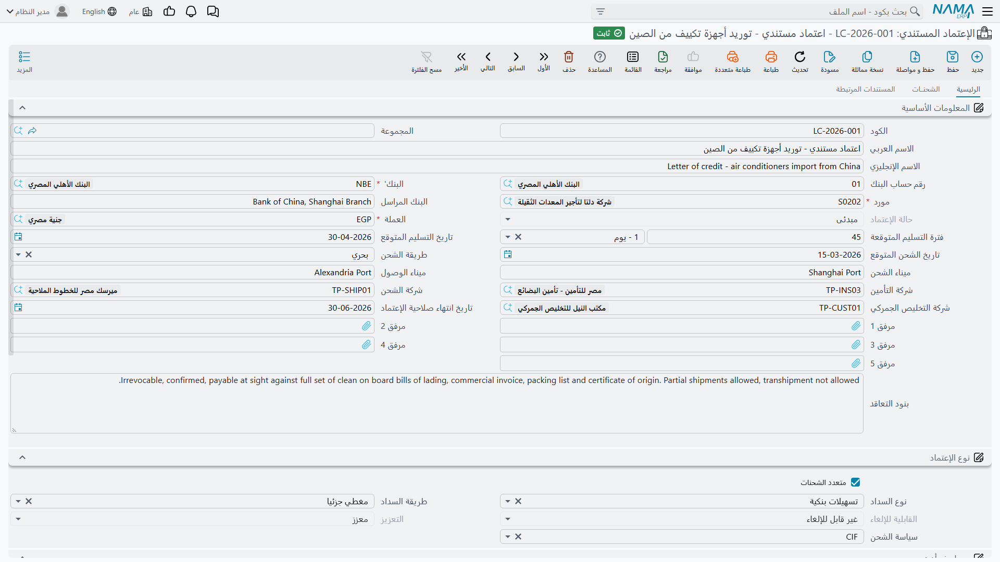
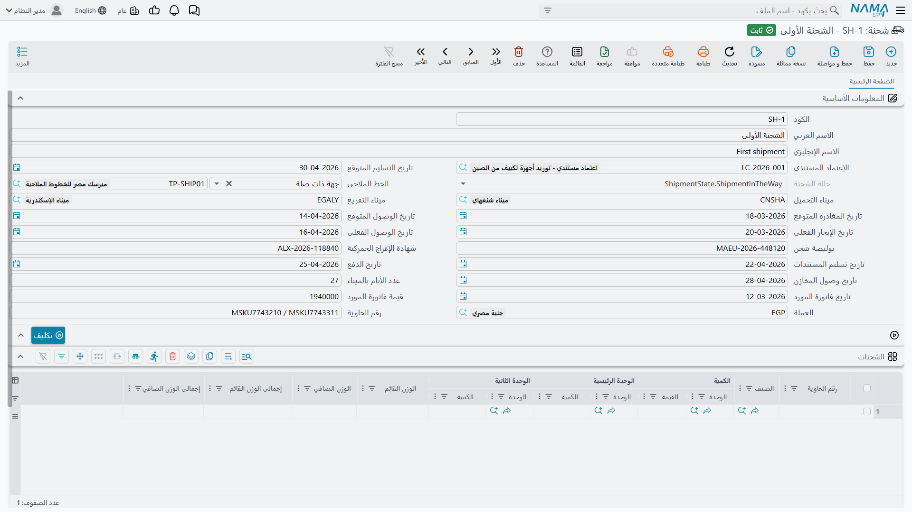

# الاعتمادات المستندية للاستيراد (Letters of Credit)

عندما تستورد بضاعة من مورّد في الخارج، يحتاج الطرفان إلى ضمان: المورّد يريد ضمان الدفع، وأنت تريد ضمان الشحن المطابق. **الاعتماد المستندي (Letter of Credit)** هو الأداة المصرفية التي توفّق بينهما، ويدير النظام دورته كاملةً - من الفتح إلى الشحنات إلى التكاليف.

::: info الجانب البنكي للاعتماد
هذه الصفحة تغطّي إدارة الاستيراد (الشحنات والتكاليف والتكلفة الواصلة). أمّا الجانب المصرفي البحت — حجز حدّ التسهيلات ورسوم الفتح والقيود المحاسبية — فيُدار عبر [الاعتماد البنكي في الحسابات](../accounting/bank-letters-of-credit.md).
:::

## ما الاعتماد المستندي؟

هو تعهّد من بنكك بدفع قيمة البضاعة للمورّد عند استيفائه شروطًا متفقًا عليها (مستندات شحن مطابقة ضمن مهلة محددة). فبدل تحويل المال مباشرةً لمورّد بعيد لم تتعامل معه من قبل، يقف البنك وسيطًا موثوقًا يحمي الطرفين.



## ملف الاعتماد (LetterOfCredit)

**الاعتماد المستندي** هو الملف الرئيسي الذي يربط المورّد والبنك وتفاصيل الشحن والشروط: نوع الدفع (مقدّم أو آجل)، وسياسة الشحن وشكل الاعتماد (اطلاعي أو آجل)، وقيمة الاعتماد وتاريخ انتهائه، وموانئ الشحن، وأطراف التأمين والجمارك والشحن. ويدعم شحنات متعددة بفترات تسليم متوقعة، ويخزّن المرفقات والفواتير المبدئية المرتبطة.

## دورة الفتح

```
طلب الاعتماد → طلب الفتح → مستند الفتح → الشحنات → التكاليف والمصروفات
```

- **طلب الاعتماد** (LetterOfCreditRequest): يبدأ مسار العمل بنسبة دفعة مقدّمة وبيانات المورّد، مع تتبّع حالة للاعتماد.
- **طلب الفتح** (LCOpeningRequest): مرحلة ما قبل الفتح، تمهّد لإنشاء الاعتماد لدى البنك.
- **مستند الفتح** (LCOpeningDoc): يُنهي الفتح بحساب بنكي وعمولة فتح وتأكيد القيمة، ويوزّع الدفعة المقدّمة والعمولة كتكاليف إضافية، ويُنشئ القيود المحاسبية اللازمة، ويرتبط بمستند المصروفات لتتبع تكاليف الاعتماد عبر دورته.

## الشحنات (LCShipment)



**شحنة الاعتماد** تتتبع إرسال البضاعة تحت الاعتماد: مستندات الحاوية وبوليصة الشحن والتخليص، والتواريخ المتوقعة مقابل الفعلية وأيام العبور، والفاتورة التجارية بعملتها وبنود الشحنة، وتعيين خط الشحن وتوجيه الموانئ. ويرتبط بها على المستوى المستندي:
- **الفاتورة المبدئية للاعتماد** (LCProformaInvoice): فاتورة مبدئية قبل الشحن تحدّد الأصناف والأسعار، مع دعم جدولة الدفع الآجل.
- **الفاتورة المبدئية للشحنة** (LCShipmentProformaInvoice): تُصدر عند تنفيذ الشحنة، وبنودها مرتبطة بكميات الشحنة الفعلية.

## التكاليف والمصروفات

تكلفة البضاعة المستوردة ليست سعرها فقط، بل تشمل التأمين والشحن والجمارك والعمولات والتمويل. يجمعها **مستند مصروفات الاعتماد** (LcExpenseDocument) ويحمّلها على البضاعة، بدعم بنود يدوية ومحسوبة ومجدولة الدفع، وتكامل مع الإعداد المحاسبي للضرائب المتعددة. ويتوفر **مستند تكاليف الاعتماد** (LCCostDoc) لتتبع تكلفي إضافي. وبهذا تصل إلى **التكلفة الواصلة** الحقيقية للبضاعة المستوردة - وهي امتداد لمفهوم [التكاليف الإضافية](./inventory-costing.md).

## سجل الأحداث (LCAction)

طوال حياة الاعتماد تطرأ أحداث إدارية: تعديلات، وإشعارات، ومطالبات، وإفراجات. يسجّلها **مستند حركة الاعتماد** (LCAction) بأنواعها ومرفقاتها وربطها بالشحنات، فيكوّن مسار تدقيق كامل لدورة حياة الاعتماد.

## الإجراءات في هذه الشاشات

مستندات الاعتماد المستندي يُنشأ معظمها من بعضها البعض، والأزرار هي الطريق الذي تُقطع به هذه السلسلة.

**في طلب الاعتماد المستندي:** **إنشاء اعتماد مستندي** (Create Letter Of Credit) — يبني الاعتماد نفسه من الطلب، وينقل إليه ميناء الوصول والحساب البنكي وبقية شروط الطلب، ويفتحه كسجل جديد.

**في طلب فتح الاعتماد:** **قبول** (Accept) و**رفض** (Reject) يضبطان حالة الطلب. ولا يعمل أيٌّ منهما على طلب سبقت معالجته — تخبرك الشاشة بذلك ولا يتغير شيء.

**في الاعتماد المستندي:**

- **إنشاء فتح اعتماد مستندي** (Create LC Opeining Doc) — ينشئ مستند الفتح مملوءًا مسبقًا بمورد الاعتماد وحسابه البنكي.
- **إنشاء سند تكليف** (Create LC Cost Doc) — ينشئ مستند التكليف الخاص بالاعتماد، وينقل إليه كوده وأسماءه.
- **تكليف** (Apply Costing) — يفرد التكاليف المجمَّعة حتى الآن على البضاعة، وهو ما يحوّل مصروفات الاعتماد إلى تكلفة صنف. ويحمل **شحنة الاعتماد** الزر نفسه لشحنة واحدة.

**في سند تكليف الاعتماد:** **تجميع المصروفات على الأصناف** (Collect Item Expenses) — يقرأ الاعتماد المستندي، أو الشحنة المفردة، المذكور في الرأس، ويملأ الجدول بالمصروفات المسجَّلة عليه، فتكلّف مما أُنفق فعلًا بدل إعادة كتابته.

**في مستند مصروفات الاعتماد:** **تجميع الأصناف** (Collect Items) يملأ سطور المصروفات من الاعتماد والشحنة في الرأس، و**إنشاء الدفعات** (GeneratePayments) يقسّم القيمة إلى جدول أقساط. و**إنشاء الدفعات** موجود كذلك في الفاتورة المبدئية للاعتماد والفاتورة المبدئية لشحنة الاعتماد.

## الصورة الكاملة

1. تتفق مع مورّد خارجي، فتُنشئ **طلب الاعتماد** ثم **طلب الفتح**.
2. يفتح البنك الاعتماد عبر **مستند الفتح**، فتُحمَّل الدفعة المقدّمة والعمولة كتكاليف.
3. يشحن المورّد البضاعة، فتُسجَّل **الشحنة** بمستنداتها وفاتورتها.
4. تتجمّع مصاريف التأمين والشحن والجمارك في **مستند المصروفات** فتُحمَّل على البضاعة.
5. تصل البضاعة فتُستلم في المخزون بتكلفتها الواصلة الكاملة، وتُسجَّل أي أحداث عبر **سجل الحركة**.

## رسائل قد تظهر لك

| الرسالة | لماذا | ما تفعله |
|---|---|---|
| «الإعتماد المستندي {0} ليس متعدد الشحنات» | حُفظت شحنة اعتماد على اعتماد خيار *متعدد الشحنات* فيه غير مفعّل، فالاعتماد يتوقع وصول البضاعة دفعة واحدة تُسجَّل على الاعتماد نفسه. | فعّل *متعدد الشحنات* في الاعتماد إن كانت البضاعة تصل على مراحل فعلًا، أو سجّل الوصول على الاعتماد بدلًا من فتح شحنة. |
| «لا يمكن التعامل مع اعتماد حالته مغلقة» | الاعتماد المذكور في حركة اعتماد أو طلب فتح أو مستند فتح أو فاتورة مبدئية ما زال في حالته الأولية أو أنه مغلق بالفعل، وكلتا الحالتين لا تقبل مستندات جديدة. | انقل الاعتماد من حالته الأولية قبل تسجيل مستندات عليه؛ وإن كان مغلقًا فسجّل الحركة على اعتماد قائم أو أعد فتح هذا. وفي الفاتورة المبدئية يرفع المنعَ خيار *السماح بالتعديل في الفاتورة المبدئية ومستند مصروفات الاعتماد* في إعدادات سلاسل التوريد. |
| «لا يمكنك ترك الإعتماد المستندي في الرأس او في تفاصيل الشحنات والإعتمادات فارغا» | مستند مصروفات الاعتماد لا يذكر اعتمادًا في رأسه ولا يحتوي سطور شحنات واعتمادات، فلا شيء تُحمَّل عليه المصاريف. | اذكر الاعتماد في الرأس، أو املأ جدول الشحنات والاعتمادات. |
| «الاعتماد {0} غير موجود بهذا السند» | سطر مصاريف يدوي يذكر اعتمادًا ليس في الرأس ولا في سطور الشحنات والاعتمادات. | عدّل السطر إلى أحد الاعتمادات التي يغطيها المستند، أو أضف ذلك الاعتماد إلى جدول الشحنات والاعتمادات. |
| «الشحنة {0} غير موجودة بهذا السند» | سطر مصاريف يدوي يذكر شحنة ليست في الرأس ولا في سطور الشحنات والاعتمادات. | عدّل السطر إلى إحدى شحنات المستند، أو أضف تلك الشحنة إلى الجدول. |
| «لا توجد فاتورة لهذا الإعتماد {0}» | تُحمَّل المصاريف على اعتماد لا فاتورة مبدئية له، فلا توجد قيم أصناف تُوزَّع عليها. | أنشئ الفاتورة المبدئية للاعتماد أولًا ثم احفظ مستند المصاريف. |
| «الإعتماد المستندي {0} يجب ان يدخل له شحنة» | الاعتماد موسوم *متعدد الشحنات*، فيلزم كل سطر مصاريف أن يذكر الشحنة التي يتبعها، وهذا السطر يترك الشحنة فارغة. | املأ الشحنة في السطر - سطر لكل شحنة تتوزّع عليها المصاريف. |
| «لا يمكنك استخدام نفس الإعتماد المستندي لنفس الشحنه أكثر من مرة» | زوج «الاعتماد + الشحنة» نفسه مذكور مرتين في جدول الشحنات والاعتمادات (وزوج الرأس يُحتسب واحدًا منهما). | احذف السطر المكرر واجمع المصاريف في سطر واحد. |
| «الشحنة {0} لا تنتمي للإعتماد المستندي {1}» | الرأس أو أحد سطور الجدول يقرن شحنة باعتماد غير الاعتماد الذي فُتحت الشحنة تحته. | اختر شحنة تابعة لذلك الاعتماد، أو صحّح الاعتماد في السطر. |
| «الشحنة {0} غير مدرجه بفاتورة مبدئية» | الشحنة المذكورة في رأس مستند المصاريف غير مشار إليها في أي سطر من الفاتورة المبدئية للاعتماد، فأصنافها وقيمها مجهولة. | أضف أصناف الشحنة إلى الفاتورة المبدئية للاعتماد قبل تحميل المصاريف عليها. |
| «الشحنة {0} غير مدرجه بفاتورة مبدئية للشحنة» | الفحص نفسه مع تفعيل خيار *استخدام فاتورة مبدئية لكل شحنة* في إعدادات سلاسل التوريد: يبحث النظام الآن عن فاتورة مبدئية لشحنة الاعتماد فلا يجدها. | أصدر الفاتورة المبدئية لتلك الشحنة ثم احفظ مستند المصاريف. |
| «حالة الإعتماد المستندي {0} مغلقة» | حُفظ مستند مصروفات اعتماد على اعتماد مغلق وخيار *السماح بالتعديل في الفاتورة المبدئية ومستند مصروفات الاعتماد* في إعدادات سلاسل التوريد غير مفعّل. | حمّل المصاريف على اعتماد ما زال مفتوحًا، أو فعّل الخيار إن كانت المصاريف المتأخرة على اعتمادات مغلقة أمرًا معتادًا عندك. |
| «لا يمكن الحفظ لأن كل الأصناف في الفاتورة المبدئية: {0} من نوع خدمي» | المصاريف لا تُحمَّل إلا على أصناف مخزنية، وكل سطور الفاتورة المبدئية للاعتماد أصناف خدمية - فلا قيمة بضاعة تحمل التكلفة. | اصرف تلك الخدمات بمستند محاسبي مباشر، واحفظ مستند مصروفات الاعتماد للاعتمادات التي تورّد أصنافًا مخزنية. |
| «لا يوجد اي توريد مخزني للاعتماد المستندي {0}» | مستند تكاليف الاعتماد يكلّف ما وصل فعلًا، ولا يوجد أمر توريد مخزني محفوظ يشير إلى هذا الاعتماد (أو إلى الشحنة المذكورة في الرأس). | استلم البضاعة أولًا ثم كلّف الاعتماد. وإن كان أمر التوريد موجودًا فتأكد أنه يذكر الاعتماد أو الشحنة كفاتورة له. |
| «لا يمكن تعديل الفاتورة المبدئية{0}للاعتماد المستندى {1} بسبب سند الصرف {2}» | سبق توزيع المصاريف على قيم هذه الفاتورة المبدئية، وتعديلها يجعل التكلفة الموزّعة خاطئة. | ألغِ أو احذف مستند المصاريف المذكور في الرسالة، ثم عدّل الفاتورة المبدئية وأعد إدخال المصاريف - أو فعّل خيار *السماح بتعديل الفاتورة المبدئية بعد مستندات المصاريف* في إعدادات سلاسل التوريد. |
| «الشحنة {0} لها فاتورة مبدئية أخرى {1}» | للشحنة فاتورة مبدئية واحدة فقط، والرسالة تذكر الفاتورة المحفوظة لها بالفعل. | عدّل الفاتورة المبدئية القائمة بدلًا من إصدار ثانية. |

## الخطوات التالية

- [رحلة الشراء](./purchasing-journey.md) - المشتريات المحلية مقابل الاستيرادية
- [تكلفة المخزون وإعادة التقييم](./inventory-costing.md) - تحميل التكاليف الإضافية على البضاعة
- [استلام المخزون](./receiving-stock.md) - استلام البضاعة المستوردة في المخزون
