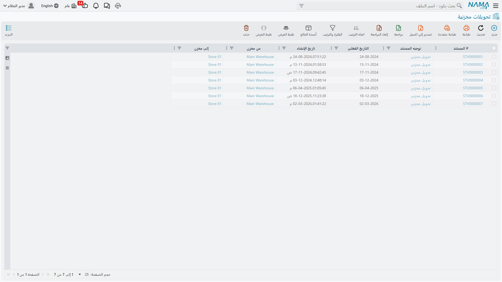
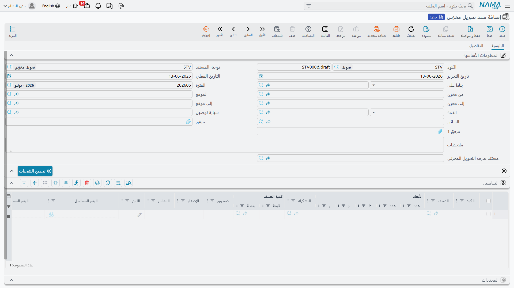

# تحريك المخزون بين المخازن (Moving Stock)

في بعض الأحيان لا تدخل الأصناف ولا تخرج - بل تنتقل فقط من مكان إلى آخر. يركّز هذا الدليل على **التحويلات المخزنية**: نقل المخزون بين المخازن والمواقع مع بقاء ملكيته داخل المنشأة.

::: info حركات أخرى لها أدلتها الخاصة
تحويل المخزون من خلال **تجميعه** يجده القارئ في [التجميع والتعبئة](./assembly-and-packaging.md)؛ و**حجز** الأصناف دون تحريكها في [دليل نظام الحجوزات](./reservation-system-guide.md)؛ و**تحميلها وتسليمها** للعملاء في [التسليم والتحميل](./delivery-and-loading.md)؛ وتسوية الفروق عبر **الجرد** في [الجرد المخزني](./stock-taking.md). يبقى هذا الدليل مخصصًا للتحويلات بين المخازن.
:::

## تحويلات المخزون: الأساسيات

**تحويل المخزون** هو أي حركة للأصناف من موقع إلى آخر دون تغيير الجهة المالكة لها. إجمالي المخزون يبقى كما هو - فقط الموقع يتغير.

فكّر في الأمر كنقل الأموال بين حساب الجاري وحساب التوفير. ثروتك الإجمالية لا تتغير، لكن مكان تواجد المال يتغير، وتحتاج إلى تتبع ذلك.

## التحويل البسيط: مستند واحد وحركة كاملة

يعالج مستند **التحويل المخزني** (StockTransfer) التحويلات المباشرة في خطوة واحدة.

### سيناريوهات التحويل الشائعة

**بين المخازن**
لديك ثلاثة مخازن: الرئيسي، والفرع الشمالي، والفرع الجنوبي. عميل في الفرع الشمالي يريد صنفًا موجودًا فقط في المخزن الرئيسي. أنشئ تحويلًا من المخزن الرئيسي إلى الفرع الشمالي بالكمية المطلوبة. سيخفّض النظام المخزون في المصدر ويزيده في الوجهة، مع بقاء الإجمالي ثابتًا، وتتبّع سجل حركة الصنف.

**داخل مخزن واحد**
حتى داخل مبنى واحد قد تحتاج إلى نقل الأصناف: من رصيف الاستلام إلى موقع التخزين، أو من التخزين إلى منطقة التجهيز، أو من رف إلى آخر أثناء إعادة التنظيم. أنشئ تحويلات لتحديث سجلات مواقع النظام بما يطابق الواقع الفعلي.

### آلية عمل التحويلات

يقوم التحويل في آنٍ واحد بـ:
1. **الصرف** من الموقع المصدر (يخفض الكمية هناك)
2. **الاستلام** في الموقع الوجهة (يزيد الكمية هناك)

هو في جوهره عملية صرف واستلام معًا، مجمّعتان في مستند واحد. إذا فشل التحويل أو أُلغي، يُعكس الجانبان معًا - لن تجد أصنافًا ضائعة في المنتصف.

**ملاحظة التكلفة**: تُنقل الأصناف عادةً بتكلفتها الحالية - دون إعادة تقييم. فالصنف يحمل التكلفة ذاتها أينما كان.

## التحويل ذو الخطوتين: مزيد من التحكم والتتبع

بعض المؤسسات تريد تحكمًا أشد في التحويلات، خاصة عندما تنتقل الأصناف بين مواقع بعيدة، أو يكون وقت العبور ملحوظًا، أو تتغير الحيازة من يد إلى أخرى، أو يتطلب الأمن والامتثال تتبع المخزون أثناء العبور. هنا يأتي دور عملية التحويل ذات الخطوتين.

### صرف التحويل المخزني (IssueStockTransfer)

يوثّق **صرف التحويل** جانب الإرسال: الأصناف تغادر المخزن المصدر، فينخفض المخزون هناك وتصبح الأصناف "في الطريق"، ويسجّل المستند ما أُرسل ومتى وبواسطة من.

### استلام التحويل المخزني (ReceiptStockTransfer)

يوثّق **استلام التحويل** جانب الوصول: الأصناف تصل إلى المخزن الوجهة، فيزداد المخزون هناك وتصبح "متاحة" في الموقع الجديد، ويسجّل المستند ما استُلم ومتى وبواسطة من.

### لماذا خطوتان؟

- **تتبع المخزون أثناء العبور**: إذا كانت الأصناف في شاحنة لمدة يومين بين المخازن، تعرف أنها غير متاحة في المصدر (شُحنت)، وغير متاحة في الوجهة (لم تصل)، وأنها في الطريق. كثيرًا ما يُستخدم لذلك **مخزن "بضاعة في الطريق"** ([راجع أنواع المخازن](./warehouses-and-locators.md)).
- **إدارة الفروقات**: أرسل المصدر 100 صنف لكن الوجهة استلمت 98؛ يُبرز النظام فارق الوحدتين للتحقيق (تلف؟ نقص في العد؟).
- **نقل الحيازة**: موظف المصدر يوقّع على الصرف، وموظف الوجهة يوقّع على الاستلام، فتكون المساءلة واضحة في كل مرحلة.
- **نقاط الاعتماد**: قد تشترط اعتمادًا للصرف واعتمادًا منفصلًا للاستلام.

### طلب التحويل (StockTransferReq)

يضيف **طلب التحويل المخزني** طبقة أعلى: طلب التحويل قبل تنفيذه.

**سير العمل:** يطلب الفرع الشمالي 50 وحدة من الصنف X من المخزن الرئيسي → يراجع المخزن الرئيسي ويوافق → يشحن 50 وحدة → تعبر الأصناف → يستلم الفرع الشمالي 50 وحدة (أو أقل مع التفسير). هذا يضمن تحويلات مخطَّطة، وتنسيقًا بين المواقع، ورؤية للحركات القادمة.

وعندما تتكرر طلبات التحويل من عدة فروع أو لعدة أصناف، يجمعها **طلب التحويل المجمَّع** (AggrStockTransferReq) في مستند واحد يسهّل التخطيط والتنفيذ دفعةً واحدة.

## نصائح لتتبع دقيق للتحويلات

::: tip أفضل الممارسات
**التحويل للحركات الفعلية فقط**: أنشئ التحويلات فقط عند تحرك الأصناف فعليًا، لا تحويلات "افتراضية" لأغراض التقارير.

**ادمج التحويلات بذكاء**: إذا نقلت 100 صنف دفعةً واحدة، فمستند واحد بكمية 100 أنظف من 100 مستند. أما إذا تحركت في أوقات مختلفة فأنشئ تحويلات منفصلة.

**تتبّع وقت العبور**: في التحويلات ذات الخطوتين، قلّل الوقت بين الصرف والاستلام. فترات العبور الطويلة تشير إلى ضياع الأصناف أو حاجة العملية إلى تحسين.

**عالج الفروقات فورًا**: عند استلام كمية أقل من المشحونة، وثّق الفارق وحقّق فيه بدلًا من تجاهله.
:::

## أسئلة شائعة

**س: هل يمكننا تحويل الأصناف بين شركات مختلفة؟**

ج: التحويلات داخل الشركة الواحدة بسيطة. أما بين الشركات فتحتاج عادةً إلى مستندات البيع/الشراء بين الشركات لحساب تغيّر الملكية بشكل صحيح.

**س: ماذا يحدث للحجوزات عند تحويل أصناف محجوزة؟**

ج: الحجوزات عادةً تنتقل مع الأصناف - إذا حوّلت مخزونًا محجوزًا إلى مخزن آخر، يبقى محجوزًا لنفس الغرض في الموقع الجديد.

**س: نستخدم التحويل ذا الخطوتين أم الخطوة الواحدة؟**

ج: استخدم الخطوة الواحدة للتحويلات داخل موقع واحد أو بين مواقع قريبة بوقت عبور ضئيل. واستخدم الخطوتين عندما يكون وقت العبور ملحوظًا، أو يتعامل أشخاص مختلفون مع الشحن مقابل الاستلام، أو تحتاج إلى تتبع المخزون أثناء العبور.

## الخطوات التالية

- [الجرد المخزني](./stock-taking.md) - التحقق من مطابقة الرصيد الدفتري للفعلي
- [تكلفة المخزون وإعادة التقييم](./inventory-costing.md) - تعديل القيم دون تحريك الكميات
- [رحلة المبيعات](./sales-journey.md) - كيف تغادر الأصناف المباعة المنشأة
