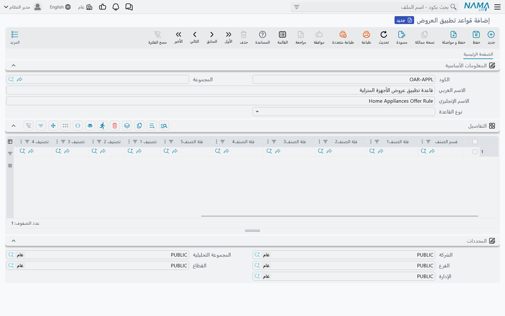

# قواعد تطبيق العروض (Offer Apply Rules)

**قاعدة تطبيق العروض** فلتر مُسمّى وقابل لإعادة الاستخدام، يخبر أي عرض على مستوى الفاتورة بالسطور التي يعنيها فعلًا من المستند. فالعروض والقسائم والأصناف المجانية تُعرَّف كلها في مواجهة المستند بكامله — خصم على إجمالي الفاتورة، أو هدية عند تجاوز السلة قيمة معينة — لكن العرض الذي يقصده العميل عادةً أضيق من ذلك بكثير: *خصم عشرة بالمائة، لكن تُحتسب ماكينات القهوة وحدها*، أو *كوب مجاني بعد شراء ما قيمته ألف جنيه من أي شيء عدا التبغ*. وبدلًا من تكرار فلتر الأصناف هذا في كل سطر عرض يحتاجه، تصفه مرة واحدة في هذه الشاشة ثم توجّه سطور العروض إليه.

::: info ما لا تتناوله هذه الصفحة
أما كتالوج العروض التي يستطيع النظام تشغيلها — قوائم الأسعار، وخصومات الأصناف، والأصناف المجانية، والقسائم، والعروض بعد البيع — فتتناوله صفحة [التسعير والعروض والكوبونات](./pricing-offers-and-coupons.md). وهذه الصفحة عن الشاشة الصغيرة التي تستعيرها تلك العروض حين تحتاج أن تُصوَّب نحو جزء من السلة لا نحوها كلها.
:::

## ما تحمله القاعدة وما لا تحمله عن قصد

القاعدة نحيفة عن قصد. فيها **الكود** و**المجموعة** و**الاسم العربي** و**الاسم الإنجليزي** و**نوع القاعدة** وجدول **التفاصيل**. وهذه هي الشاشة بأكملها.

وما ينقصها لا يقل أهمية. فلا توجد تواريخ، ولا عميل، ولا نسبة خصم، ولا — وهذه هي المفاجأة — **أولوية**. كل ذلك يبقى على العرض أو القسيمة التي تستخدم القاعدة. فالقاعدة وصف لمجموعة من السطور، لا عرضًا في ذاتها. ويمكن ربط القاعدة نفسها بعرض صيفي وآخر شتوي، وستتصرف في الاثنين تصرفًا واحدًا.

أما مجموعة **المحددات** في أسفل الشاشة (**الشركة**، **المجموعة التحليلية**، **الفرع**، **القطاع**، **الإدارة**) فهي محددات الملف الرئيسي المعتادة التي يحملها كل ملف في النظام. وهي تحكم من يرى السجل ومن يستعمله، ولا تشارك في تحديد سطور المستند المنطبقة.

## وصف السطور: جدول التفاصيل

كل سطر في جدول **التفاصيل** هو وصف واحد لـ«سطور من هذا القبيل». ويقدّم السطر ثلاثة أنواع من الأعمدة:

| الأعمدة | ما تطابقه |
|---|---|
| **قسم الصنف**، **فئة الصنف1** حتى **فئة الصنف5**، **تصنيف 1** حتى **تصنيف 10**، **الماركة** | قيم التصنيف المسجلة على بطاقة الصنف |
| **الصنف** | صنف بعينه |
| **الإدارة**، **المجموعة التحليلية**، **الفرع**، **القطاع**، **الشركة** | المحددات المسجلة على بطاقة الصنف |

وعند قراءة سطر واحد من الجدول، فكل عمود تملؤه شرطٌ، ويجب أن تتحقق الشروط كلها معًا. فوضع **الماركة** = Bosch مع **قسم الصنف** = الأجهزة المنزلية يطابق أجهزة Bosch المنزلية وحدها، لا غير.

وعند قراءة الجدول ككل، فكل سطر قائم بذاته، ولذلك فإضافة السطور توسّع الشبكة ولا تضيّقها. والقاعدة التي يفترض أن تغطي ماركتين تحتاج سطرين، سطرًا لكل ماركة.

::: warning أعمدة المحددات تقرأ بطاقة الصنف لا الفاتورة
أعمدة المحددات الخمسة في سطر الجدول تُقارَن بالمحددات المسجلة **على الصنف نفسه**، لا بفرع المستند الجاري تسعيره ولا بقطاعه. فوضع **الفرع** في سطر الجدول يعني «الأصناف التابعة لهذا الفرع»، لا «عند البيع من هذا الفرع». وإذا كان المقصود تقييد العرض بمكان حدوث البيع فمحل ذلك محددات العرض نفسه، لا هنا.

كما أن عمود المحدد الذي تضع فيه قيمة المحدد العامة الشاملة يُعامَل معاملة الفارغ ولا يفلتر شيئًا.
:::

::: tip السطر الفارغ يختفي عند الحفظ
سطر الجدول الذي تكون كل أعمدته فارغة يُحذف في صمت عند حفظ السجل. وإذا أدى ذلك إلى خلو الجدول تمامًا رُفض الحفظ، لأن قاعدة بلا سطور لا تقول شيئًا — فحقل **التفاصيل** إجباري.
:::

## نوع القاعدة: ثلاث طرق لقراءة الجدول نفسه

حقل **نوع القاعدة** هو الذي يقرر كيف يُقرأ الجدول، وهو يغيّر معنى القاعدة تغييرًا كاملًا.

| نوع القاعدة | كيف يُقرأ الجدول | متى تلجأ إليه |
|---|---|---|
| **إدراج (تطابق أي سطر)** | ينطبق سطر المستند إذا طابق **سطرًا واحدًا على الأقل** من سطور الجدول. | حين تعدّد ما يتناوله العرض — وهو الاختيار اليومي |
| **استبعاد (عدم تطابق أي سطر)** | ينطبق سطر المستند إذا **لم يطابق أي سطر** من سطور الجدول. | حين يغطي العرض كل شيء تقريبًا ولا تحتاج إلا تسمية الاستثناءات |
| **تطابق كل السطور** | يجب أن يطابق **كلَّ** سطر من سطور الجدول سطرٌ ما في المستند. فإن تحقق ذلك انطبق المستند بكامله، وإن بقي سطر واحد من الجدول بلا مطابق لم ينطبق شيء على الإطلاق. | حين يكون العرض مكافأة على شراء توليفة معينة |

والنوع الثالث هو الذي يوقع الناس في الخطأ، لأنه ليس اختبارًا لكل سطر على حدة، بل بوابة على المستند كله. ضع فيه سطرين، أحدهما للطابعات والآخر للأحبار، ويظل العرض نائمًا حتى تحتوي الفاتورة على الاثنين معًا. وفي اللحظة التي تحتويهما فيها تصبح كل سطور تلك الفاتورة منطبقة: الطابعة والحبر، والورق والكابلات التي لم تُذكر في القاعدة أصلًا. أما «إدراج» و«استبعاد» فيفرزان المستند سطرًا سطرًا ويتركان بقية السلة وشأنها.

::: info السطور المجانية لا تُحتسب مطابقة أبدًا
السطور التي أضافها النظام إلى المستند بوصفها سطورًا مجانية أو هدايا تُتجاهَل عند تقييم القاعدة. فالهدية لا تعين العميل أبدًا على بلوغ الحد الذي يستحق به الهدية التالية.
:::

## أين تُربط القاعدة

القاعدة لا تفعل شيئًا وحدها؛ لا بد أن يلتقطها شيء آخر. وهناك أربعة حقول تطلبها.

| الشاشة | الحقل | ما تقرره القاعدة هناك |
|---|---|---|
| **عرض** ← تبويب **عروض الفاتورة** ← جدول **خصومات على قيمة الفاتورة** (المبيعات ← قوائم الأسعار والعروض ← عرض) | **يطبق على** | أي السطور يُقاس إجماليها في مواجهة مدى قيمة الفاتورة الخاص بالخصم — وهل يبقى الخصم قائمًا أصلًا |
| **عرض** ← تبويب **عروض الفاتورة** ← جدول **قسائم خصومات على قيمة الفاتوره** | **يطبق على** | أي السطور يُقاس إجماليها في مواجهة المدى الذي يقرر إصدار القسيمة من عدمه |
| **عرض** ← تبويب **عروض الفاتورة** ← جدول **أصناف مجانية على قيمة الفاتوره** | **يطبق على** | أي السطور تُكسب قيمتُها الصنفَ المجاني، وعلى أي السطور تُوزَّع تكلفة الهدية بعد ذلك |
| **قسيمة خصومات** و**دفتر قسيمة خصومات** (المبيعات ← قوائم الأسعار والعروض ← قسيمة خصومات) | **قواعد تطبيق الخصم علي السطور** | على أي السطور تُكتب نسبة القسيمة |

وفي جدول **خصومات على قيمة الفاتورة** يقبل حقل **يطبق على** إما قاعدة تطبيق عروض وإما **مدى تطبيق الأسعار** (PricingRange). والاثنان بديلان في الحقل نفسه: فمدى تطبيق الأسعار يفلتر بحسب مدى الكمية لا بحسب تصنيف الصنف.

وهناك مفتاحان مجاوران لا معنى لهما إلا بصحبة قاعدة:

- **اساس الخصم من إجمالى السطور المنطبقة فقط**، في سطر خصم الفاتورة، يغيّر ما يُحتسب عليه الخصم من نوع «مضاعفات القيمة». فبدل احتساب المضاعفات على الفاتورة كلها تُحتسب على إجمالي السطور المنطبقة. والنظام يرفض حفظ عرض فُعِّل فيه هذا المفتاح مع ترك **يطبق على** فارغًا، ويقول ذلك صراحةً.
- **طريقة اعتبار مبيعات الصنف من الفواتير الأخرى**، في سطر القسيمة، لا يجتمع مع **يطبق على**. فتلك الطريقة توسّع القياس ليشمل فواتير العميل الأخرى في الشهر أو السنة، وهو سؤال مختلف عن *أي سطور هذه الفاتورة*، والسطر الذي يحاول الجمع بينهما يُرفض عند الحفظ.

### على قسيمة الخصومات

حقل **قواعد تطبيق الخصم علي السطور** في القسيمة يغيّر موضع نزول القسيمة. فالقسيمة تتحول عادةً إلى خصم واحد على رأس الفاتورة كلها. لكنك إن ملأت القاعدة مع **وقت حساب التخفيض في الفاتورة** — أي خانة الخصم التي تُكتب فيها القيمة — طُبعت نسبة القسيمة على كل سطر منطبق على حدة بدلًا من ذلك، وتُركت بقية الفاتورة على حالها. وإذا لم تطابق القاعدة شيئًا في تلك الفاتورة فالقسيمة ببساطة لا تنطبق.

وتصاحب ذلك ثلاثة شروط، تفرضها الشاشة جميعًا:

- يجب أن تكون القسيمة قسيمة نسبة مئوية. أما قسيمة القيمة التي تحمل قاعدة فتُرفض عند الحفظ.
- ملء أي من **قواعد تطبيق الخصم علي السطور** أو **وقت حساب التخفيض في الفاتورة** يجعل الآخر إجباريًا — فلا معنى لهما إلا معًا.
- و**دفتر قسيمة خصومات** يحمل الحقلين نفسيهما بالتحققات نفسها، ويمرر الإعدادين إلى القسائم التي يولّدها.

## أين تقع القاعدة حين تتزاحم عدة عروض

هذا هو الجزء الجدير بالفهم، لأنه المكان الذي تبدأ منه مكالمة الدعم عادةً: عند العميل ثلاثة عروض تبدو كلها كأنها يجب أن تنطبق، ولا يصل إلى الفاتورة إلا واحد منها.

والمفاضلة بين العروض المتزاحمة **ليست** من عمل القاعدة. فالقاعدة فلتر، وهي تعمل في وقت متأخر. وحين يسعّر النظام مستندًا تُحسم خصومات مستوى الفاتورة بهذا الترتيب:

1. **تجميع المرشحين.** يُجمَع كل سطر خصم فاتورة من كل عرض يناسب رأسُه المستندَ: نافذة تواريخ العرض، وعميله أو تصنيف عميله، وتصنيف الفاتورة، ومحدداته، ومصنّفات الأسعار، وصلاحية الأمان، والذمة. ولا تشارك قواعد التطبيق في هذه الخطوة إطلاقًا — فالسطر يصير مرشحًا بقوة رأس العرض، مهما قالت قاعدته.
2. **استبعاد المرشحين الذين يتنازلون أمام الموقِف.** المرشح المؤشَّر عليه بـ**عدم التطبيق في حال وجود عروض بها ايقاف التخفيضات الأخرى** يُستبعَد إذا كان المستند يحمل بالفعل عرضًا يوقف التخفيضات الأخرى.
3. **إعمال أولوية أقوى موقِف.** حين يكون خيار **إيقاف العروض الأخرى حسب الأولوية لكل أنواع العروض** مفعّلًا في إعدادات المخازن والمبيعات، يبحث النظام عن أقوى أولوية بين كل سطور العروض المؤشَّر عليها بـ**إيقاف التخفبضات الأخرى** — من أي نوع، بما في ذلك خصومات الأصناف — ثم يستبعد كل مرشح أضعف من تلك الأولوية.
4. **ترك المُوقِفات تحذف ما وراءها.** بالمرور على المرشحين الباقين بترتيب الأولوية، يحذف السطرُ المؤشَّر عليه بـ**إيقاف التخفبضات الأخرى** كلَّ مرشح تابع لعرض *آخر* يقع خلفه.
5. **الفلترة بالموظف.**
6. **الآن تعمل قاعدة التطبيق.** لكل مرشح باقٍ له قاعدة: إذا لم تطابق القاعدة أي سطر في المستند حُذف المرشح كليًا. وإذا طابقت بعض السطور بقي المرشح — لكن مدى قيمة الفاتورة الأدنى والأعلى الخاص به يُعاد قياسه على **إجمالي السطور المنطبقة وحدها** بدلًا من إجمالي الفاتورة. أما المرشح بلا قاعدة فيظل يُقاس على المستند بكامله.
7. **الترتيب والتجميع.** ما يتبقى يُرتَّب حسب **الأولوية** ثم حسب ترتيب السطور داخل عرضها، ثم يساهم كل سطر باقٍ بخصمه هو.

ومن ذلك تخرج نتيجتان، وهما جواب السؤالين اللذين يسألهما الناس فعلًا.

::: tip الرقم الأصغر هو الفائز، والعروض تتراكم افتراضيًا
**الأولوية** رتبة لا وزن: فكلما صغر الرقم قوي العرض. ولا شيء في التسلسل السابق يختار فائزًا واحدًا — بل إن الخصومات الباقية **تتجمع**. والعروض لا يستبعد بعضها بعضًا إلا حين يؤشّر أحدهم على مفتاح إيقاف (**إيقاف التخفبضات الأخرى**، أو **لا يُعتد بعروض الأصناف مع هذا العرض**، أو **عدم التطبيق في حال وجود عروض بها ايقاف التخفيضات الأخرى**)، وحتى حينئذٍ يُحسم الاستبعاد بالأولوية لا بأي العروض عُثر عليه أولًا.
:::

::: warning قاعدة التطبيق لا تفصل في تعادل أبدًا
لأن القاعدة تعمل في الخطوة السادسة، فكل ما تقدر عليه هو حذف مرشح أو تغيير القيمة التي يُقاس عليها. وهي لا تستطيع أن تجعل عرضًا أضعف يتغلب على عرض أقوى، والعرضان اللذان يشيران إلى القاعدة نفسها يظل الفاصل بينهما أولويتيهما وحدهما. وحين يتوقع العميل أن «العرض الأكثر تحديدًا يجب أن يفوز» فذلك التوقع يجب أن يُكتب أولويةً على العرض. أما القاعدة فلن تحققه.
:::

وجدولا الأصناف المجانية والقسائم يستعملان القاعدة بالروح نفسها: فهي تقرر أي السطور تُحتسب في بلوغ الحد، لا أي العرضين المتنافسين أفضل.

## حين لا تُربط قاعدة

ترك **يطبق على** فارغًا هو الحالة الطبيعية، ومعناه *المستند بكامله*. فمدى قيمة الفاتورة يُقاس على إجمالي الفاتورة، والصنف المجاني يُستحق على إجمالي الفاتورة، والقسيمة تصير خصمًا واحدًا على رأس الفاتورة. ولا يتعطل شيء بغياب القاعدة، ولا تُوضَع قاعدة افتراضية بديلة — فالعرض بلا قاعدة هو ببساطة عرض عن كل شيء.

وهذا أيضًا شكل الحل حين يتوقف عرض عن العمل في اليوم الذي يربط فيه أحدهم قاعدة به. فتفريغ الحقل يعيد سلوك المستند الكامل؛ وقبل إلقاء اللوم على العرض، يستحق الأمر فتح القاعدة والتأكد من أن جدولها يطابق فعلًا شيئًا في المستندات التي يختبر بها العميل. فالقاعدة التي لا تطابق شيئًا تحذف عرضها بالكامل بدلًا من أن ترجع في صمت إلى الفاتورة كلها.

## الخطوات التالية

- [التسعير والعروض والكوبونات](./pricing-offers-and-coupons.md) — العروض التي تستعير هذه القواعد
- [ملفات تصنيف الأصناف](./item-classification-files.md) — الأقسام والفئات والتصنيفات والماركات التي يفلتر بها الجدول
- [إعدادات المبيعات والعروض](./configuration/sales-and-offers-configuration.md) — إعدادات الوحدة التي تحكم الأولويات والمُوقِفات
- [رحلة المبيعات](./sales-journey.md) — حيث يُنشأ المستند المسعَّر
