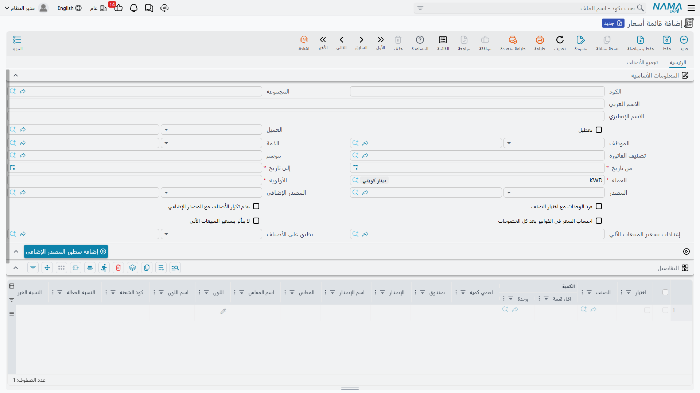
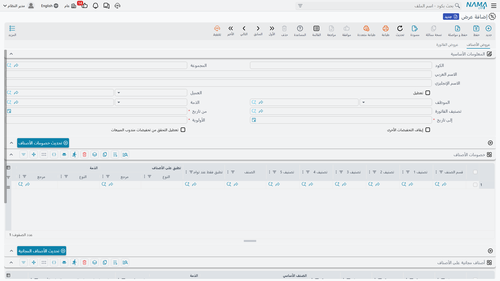

# التسعير والعروض والكوبونات (Pricing, Offers & Coupons)

السعر الذي يدفعه العميل ليس رقمًا واحدًا، بل نتيجة طبقات متعددة: قائمة أسعار، وخصم كمية، وعرض ترويجي، وربما كوبون. يجمع هذا الدليل أدوات التسعير الخاصة بسلسلة التوريد ويشرح كيف تتراكم.

::: info تكامل مع وحدة الفوترة
آليات الخصم والعروض ونقاط الولاء المشتركة على مستوى المستند موثّقة في [وحدة الفوترة](/ar/modules/invoicing/) (أدلة الخصومات والعروض ونقاط المكافأة). تركّز هذه الصفحة على كيانات التسعير الخاصة بسلسلة التوريد وتُحيل إلى تلك الأدلة عند التقاطع، تفاديًا للتكرار.
:::

## قوائم أسعار البيع (SalesPriceList)

**قائمة أسعار البيع** هي العمود الفقري للتسعير: تحدّد سعر كل صنف لشريحة عملاء وفترة وعملة محددة. يمكنك امتلاك قوائم متعددة (تجزئة، جملة، عملاء مميزون، عروض ترويجية)، ولكل قائمة نطاق تاريخ سريان وأولوية تمنع التعارض عند تداخل أكثر من قائمة. عند إنشاء الفاتورة تختار القائمة المناسبة فيملأ النظام الأسعار تلقائيًا.

### التسعير حسب الكمية (PricingRange)

**نطاق التسعير** يتيح أسعارًا متدرّجة حسب الكمية: 1-10 قطع بسعر، و11-50 بسعر أقل، وما فوق بسعر أقل - فيكافئ الشراء بكميات أكبر تلقائيًا.

### التسعير التلقائي (AutoSalesPricing)

بدل تحديد سعر البيع يدويًا، يحسبه **التسعير التلقائي** من التكلفة زائد هامش ربح (افتراضي، وحد أدنى، وحد أقصى). فعند تغيّر التكلفة يُعاد حساب السعر مع احترام سياسة الهامش. ويُضبط سلوكه العام عبر **إعداد التسعير التلقائي** (AutoSalesPricingSetting).

### التسعير بالنقاط (SalesPriceInPoints)

لبرامج الولاء، يتيح **سعر البيع بالنقاط** تسعير الأصناف بنقاط قابلة للاستبدال بدل النقود (أو إلى جانبها).

## العروض والأصناف المجانية (SalesOffers)

**عروض المبيعات** هي محرّك الترويج: خصم نسبي أو مبلغي، أو أصناف مجانية، أو حوافز حسب قيمة الفاتورة أو حدّ أدنى للسلة. تستطيع استهدافها بفلاتر (تصنيف الفاتورة، العميل، القطاع) وربطها بموسم بحيث تُفعَّل تلقائيًا في فترته.

و**مجموعة الأصناف المجانية** (FreeItemGroup) تتيح تقديم عدة أصناف مجانية كحزمة واحدة ضمن العرض، مع ضبط قواعد التكرار والسياسات.

## عروض ما بعد البيع (PostSalesOffer)

بعض الحوافز لا تُمنح وقت البيع بل بعده (حوافز، خصومات رجعية، استرداد). **عرض ما بعد البيع** يحدّد البرنامج وشروطه عبر **إعداد عرض ما بعد البيع** (PostSalesOfferConfig)، ويطالب العميل باستحقاقه عبر **مطالبة عرض ما بعد البيع** (PostSalesOfferClaim) التي تُراجَع وتُعتمد وتؤثر في رصيد العميل. وهناك **العرض الشهري الدوري** (PeriodicMonthlySalesOffer) الذي يُولِّد حوافزه شهريًا بحساب دوري.

## الكوبونات (DiscountCoupon)

**كوبون الخصم** أداة ترويج موجّهة: قيمة خصم ونطاق أصناف وحدود استخدام وصلاحية وأهلية عملاء. وتنتظم الكوبونات في:
- **نوع الكوبون** (DiscountCouponType): فئة تحكم قواعده (متجر، إلكتروني، موسمي).
- **دفتر الكوبونات** (DiscountCouponBook): مجموعة كوبونات لحملة ترويجية وتوزيعها.
- **طريقة ترميز الكوبونات** (SalesCouponsCodingMethod): شكل الرمز وخوارزمية توليده والتحقق من تفرّده.

وعند البيع، يُطبَّق الكوبون عبر **أمر بيع الكوبونات** (CouponsSalesOrder)، ويُعالَج إلغاؤه عند الإرجاع عبر **مرتجع أمر بيع الكوبونات** (CouponsSalesOrderReturn).

## التصويت على الأسعار (PriceVotingDoc)

في المنشآت التي تتطلب اعتماد تغييرات الأسعار، يوفّر **مستند التصويت على الأسعار** سير عمل: تُقترح الأسعار الجديدة وتُعرض على المعتمِدين للتصويت قبل سريانها، ويُحفظ سجلها في **ملف التصويت على الأسعار** (PriceVotingFile) كمسار تدقيق لقرارات التسعير.

## كيف تتراكم الطبقات

عند تسعير سطر في الفاتورة، يطبّق النظام الطبقات بالترتيب: السعر الأساس من **قائمة الأسعار** (أو **التسعير التلقائي**)، ثم تعديل **نطاق الكمية**، ثم **العروض** المؤهَّلة، ثم **الكوبون** إن وُجد، مع احترام **الحد الأدنى للسعر** المعرّف على الصنف. فهم هذا الترتيب يفسّر السعر النهائي الذي يراه العميل.

## الخطوات التالية

- [رحلة المبيعات](./sales-journey.md) - حيث تُطبَّق هذه الأسعار على الأوامر والفواتير
- [فهم أصناف المخزون](./understanding-items.md) - الحد الأدنى للسعر والتسعير التلقائي على الصنف
- [وحدة الفوترة](/ar/modules/invoicing/) - آليات الخصم والعروض ونقاط الولاء على مستوى المستند
