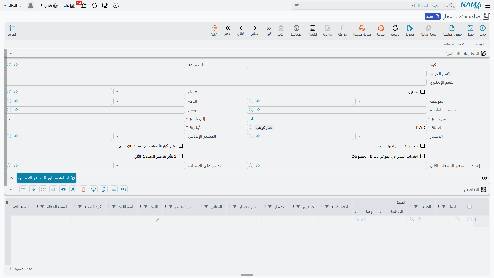
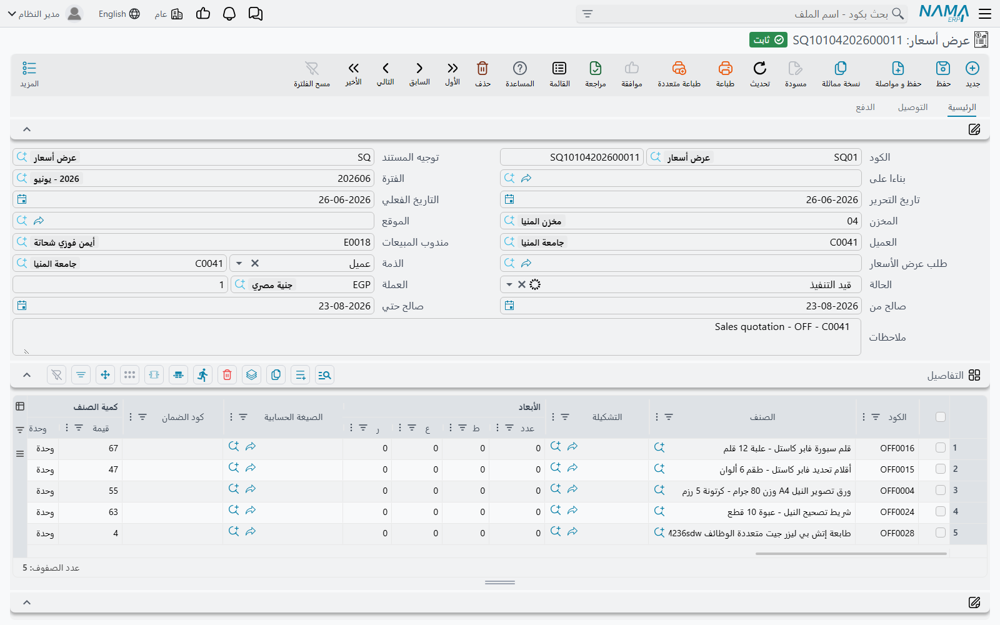

# التسعير والعروض والكوبونات (Pricing, Offers & Coupons)

السعر الذي يدفعه العميل ليس رقمًا واحدًا، بل نتيجة طبقات متعددة: قائمة أسعار، وخصم كمية، وعرض ترويجي، وربما كوبون. يجمع هذا الدليل أدوات التسعير الخاصة بسلسلة التوريد ويشرح كيف تتراكم.

::: info تكامل مع وحدة الفوترة
آليات الخصم والعروض ونقاط الولاء المشتركة على مستوى المستند موثّقة في [وحدة الفوترة](/ar/modules/invoicing/) (أدلة الخصومات والعروض ونقاط المكافأة). تركّز هذه الصفحة على كيانات التسعير الخاصة بسلسلة التوريد وتُحيل إلى تلك الأدلة عند التقاطع، تفاديًا للتكرار.
:::

## قوائم أسعار البيع (SalesPriceList)

**قائمة أسعار البيع** هي العمود الفقري للتسعير: تحدّد سعر كل صنف لشريحة عملاء وفترة وعملة محددة. يمكنك امتلاك قوائم متعددة (تجزئة، جملة، عملاء مميزون، عروض ترويجية)، ولكل قائمة نطاق تاريخ سريان وأولوية تمنع التعارض عند تداخل أكثر من قائمة. عند إنشاء الفاتورة تختار القائمة المناسبة فيملأ النظام الأسعار تلقائيًا.

### التسعير حسب الكمية (PricingRange)

**نطاق التسعير** يتيح أسعارًا متدرّجة حسب الكمية: 1-10 قطع بسعر، و11-50 بسعر أقل، وما فوق بسعر أقل - فيكافئ الشراء بكميات أكبر تلقائيًا.

### التسعير التلقائي (AutoSalesPricing)

بدل تحديد سعر البيع يدويًا، يحسبه **التسعير التلقائي** من التكلفة زائد هامش ربح (افتراضي، وحد أدنى، وحد أقصى). فعند تغيّر التكلفة يُعاد حساب السعر مع احترام سياسة الهامش. ويُضبط سلوكه العام عبر **إعداد التسعير التلقائي** (AutoSalesPricingSetting).

### التسعير بالنقاط (SalesPriceInPoints)

لبرامج الولاء، يتيح **سعر البيع بالنقاط** تسعير الأصناف بنقاط قابلة للاستبدال بدل النقود (أو إلى جانبها).

## العروض والأصناف المجانية (SalesOffers)

**عروض المبيعات** هي محرّك الترويج: خصم نسبي أو مبلغي، أو أصناف مجانية، أو حوافز حسب قيمة الفاتورة أو حدّ أدنى للسلة. تستطيع استهدافها بفلاتر (تصنيف الفاتورة، العميل، القطاع) وربطها بموسم بحيث تُفعَّل تلقائيًا في فترته.

و**مجموعة الأصناف المجانية** (FreeItemGroup) تتيح تقديم عدة أصناف مجانية كحزمة واحدة ضمن العرض، مع ضبط قواعد التكرار والسياسات.

## المواسم التجارية (Season)

كلتا الشاشتين أعلاه تطلبان **من تاريخ** و**إلى تاريخ**، وفي عمل يدور على المواسم ينتهي بك الأمر إلى كتابة زوج التواريخ نفسه في عشرات السجلات: كل قائمة أسعار لتشكيلة الصيف، وكل عرض يسير معها، وكل سعر بالنقاط. ويكفي أن يخطئ أحدها بيوم واحد ليتصرف ذلك السجل وحده تصرفًا مختلفًا عن البقية في صمت.

و**الموسم** (المبيعات ← قوائم الأسعار والعروض ← موسم) موجود ليمنع ذلك. وهو ملف رئيسي صغير — كود واسم و**من تاريخ** و**إلى تاريخ** — يمنح الفترة التجارية اسمًا يمكنك الإشارة إليه. فـ«صيف 2026» يُعرَّف مرة واحدة.

أما ما يفعله بعد ذلك فضيّق عن قصد، ويستحق التحديد الدقيق: **اختيار الموسم يملأ تواريخ السجل نفسه منه.** ففي **قائمة أسعار البيع** و**عرض المبيعات** و**سعر البيع بالنقاط**، يَنسخ اختيارُ الموسم تاريخَي بدايته ونهايته إلى **من تاريخ** و**إلى تاريخ** في السجل لحظة اختياره — ثم في كل مرة يُحفظ فيها السجل من جديد. فإذا أخّرت نهاية الموسم أسبوعًا، تبعه كل سجل يشير إليه عند حفظه التالي.

::: warning الموسم يغلب التواريخ التي تكتبها
لأن النسخ يجري عند كل حفظ لا عند اختيار الموسم فحسب، لا يمكنك الإبقاء على موسم في السجل ثم تجاوز تواريخه يدويًا — فتواريخك تُستبدَل ببساطة. وإن كانت قائمة أسعار بعينها تحتاج فعلًا نافذة مختلفة عن بقية الموسم، فاترك حقل **موسم** فيها فارغًا واكتب التواريخ بنفسك.
:::

كما يظهر الموسم حقلَ تجميع عاديًا في **التنبؤ بالمبيعات** و**التنبؤ بالمشتريات**، حيث يصنّف الأرقام بالفترة التجارية دون أن يقود أي سلوك.

### إدراج الأصناف في موسم: مستند تحديث المواسم (UpdateSeasonsDoc)

الموسم على قائمة الأسعار يؤرّخ القائمة. وهو لا يقول شيئًا عن *أي المنتجات ينتمي إلى الموسم* — ولدى بائع الملابس، «ما الذي في تشكيلة الصيف؟» سؤال حقيقي يبقى بعد أي قائمة أسعار بعينها.

و**مستند تحديث المواسم** (المبيعات ← قوائم الأسعار والعروض ← مستند تحديث المواسم) يسجّل الجواب. وهو مستند لا ملف رئيسي: له دفتر وكود، و**توجيه المستند**، و**تاريخ التحرير**، و**التاريخ الفعلي**، و**الفترة** — فيصير إسناد الصنف إلى موسم مُرقَّمًا ومؤرَّخًا ومنسوبًا إلى صاحبه، بما لا يتحقق في ملف رئيسي يُعدَّل.

وجسمه جدول **مواسم** بسطر لكل إسناد — **الصنف** و**موسم** و**من تاريخ** و**إلى تاريخ** للإسناد نفسه. وفوق الجدول أربعة حقول في الرأس تحمل الأسماء الأربعة نفسها، وهي تتصرف على نحو يفاجئ الناس.

::: warning الرأس يستبدل الجدول لا يعطيه قيمة افتراضية
أي **الصنف** أو **موسم** أو **من تاريخ** أو **إلى تاريخ** يُملأ في الرأس يُكتب على *كل* سطر في الجدول عند كل حفظ، محلَّ ما كان السطر يحمله. وهذا ما يجعل الرأس الطريقَ السريع إلى العمل الشائع — إدراج أربعمائة صنف في موسم واحد بتسمية الموسم مرة وسرد الأصناف — لكنه يعني أيضًا أن مستندًا يخلط بين مواسم عدة عليه أن يترك حقل **موسم** في الرأس فارغًا، وإلا خرج كل سطر حاملًا موسم الرأس.
:::

ولا ينتج عن معالجة المستند أي حركة مخزون ولا أي قيد محاسبي؛ الذي ينتج عنه هو سجل الإسنادات. والمكان الذي تقرؤها فيه هو الصنف نفسه: فصفحة الأسعار في بطاقة الصنف تحمل قائمة **قوائم المواسم** التي تعرض كل موسم أُدرج فيه ذلك الصنف، بتواريخه وبالمستند الذي جاء منه كل إسناد. ولذلك يكون تصحيح الإسناد بتحرير مستند آخر، وتبقى قائمة الصنف حافظة للأثر.

## عروض ما بعد البيع (PostSalesOffer)

بعض الحوافز لا تُمنح وقت البيع بل بعده (حوافز، خصومات رجعية، استرداد). **عرض ما بعد البيع** يحدّد البرنامج وشروطه عبر **إعداد عرض ما بعد البيع** (PostSalesOfferConfig)، ويطالب العميل باستحقاقه عبر **مطالبة عرض ما بعد البيع** (PostSalesOfferClaim) التي تُراجَع وتُعتمد وتؤثر في رصيد العميل. وهناك **العرض الشهري الدوري** (PeriodicMonthlySalesOffer) الذي يُولِّد حوافزه شهريًا بحساب دوري.

## الكوبونات (DiscountCoupon)

**كوبون الخصم** أداة ترويج موجّهة: قيمة خصم ونطاق أصناف وحدود استخدام وصلاحية وأهلية عملاء. وتنتظم الكوبونات في:
- **نوع الكوبون** (DiscountCouponType): فئة تحكم قواعده (متجر، إلكتروني، موسمي).
- **دفتر الكوبونات** (DiscountCouponBook): مجموعة كوبونات لحملة ترويجية وتوزيعها.
- **طريقة ترميز الكوبونات** (SalesCouponsCodingMethod): شكل الرمز وخوارزمية توليده والتحقق من تفرّده.

وعند البيع، يُطبَّق الكوبون عبر **أمر بيع الكوبونات** (CouponsSalesOrder)، ويُعالَج إلغاؤه عند الإرجاع عبر **مرتجع أمر بيع الكوبونات** (CouponsSalesOrderReturn).

## التصويت على الأسعار (PriceVotingDoc)

في المنشآت التي تتطلب اعتماد تغييرات الأسعار، يوفّر **مستند التصويت على الأسعار** سير عمل: تُقترح الأسعار الجديدة وتُعرض على المعتمِدين للتصويت قبل سريانها، ويُحفظ سجلها في **ملف التصويت على الأسعار** (PriceVotingFile) كمسار تدقيق لقرارات التسعير.

## الإجراءات في هذه الشاشات

شاشات التسعير مبنية على حركتين: ملء السطور من مكان ما، ثم إنزال قيمة من الرأس أو نتيجة حساب عليها.

**في قائمة سعر البيع:**

- **تجميع الأصناف** (Collect Items) — يملأ السطور من معايير تجميع الأصناف في الرأس بدل إدخالها صنفًا صنفًا.
- **تحديث التفاصيل** (Update Details) — ينزل بقيم الرأس إلى كل سطر، ويسأل عن كل منها بنعم/لا: تاريخ من، وتاريخ إلى، والمجموعة التحليلية، والشركة، والفرع، والإدارة، والقطاع، والعميل، وتصنيف الفاتورة، ومصنِّفات الأسعار من ١ إلى ٥.
- **تحديث الأسعار** (Update Prices) — يعيد الحساب عبر قواعد محدِّثات السعر في الرأس: حقل مصدر، وحتى أربعة حقول وجهة، وحتى خمسة محدِّثات، تُطبَّق على كل السطور أو على المختار منها. ويرفض العمل إن كانت القائمة بلا سطور أو لم يُملأ أي محدِّث.
- **حساب السعر من متوسط التكلفة** (calculate Price from Average Cost) — يملأ حقل السعر الوجهة من متوسط تكلفة كل صنف بدل ملئه من حقل سعر آخر.
- **إضافة سطور المصدر الإضافي** (Add additional source lines) — يلحق سطور القائمة المعرَّفة في **المصدر الإضافي**، مع إمكانية نقل خصومات الفواتير وتخطي الأصناف الموجودة أصلًا.
- **فرد بيانات السطر المحدد** (Spread Selected Line Data) — يفرد السطر الواقف عليه على وحدات الصنف وإصداراته ومقاساته وألوانه، بحسب مفاتيح الفرد في الرأس.

وتحمل **قائمة سعر الشراء** و**خصم المورد** نفس **تحديث التفاصيل**، لكنه يسأل عن المورد بدل العميل.

**وفي شاشة عروض المبيعات** لكل جدول زر تحديث خاص به، لأن لكل جدول نافذة صلاحية خاصة:

- **تحديث التفاصيل** (Update Details) — ينزل بتواريخ الرأس ومحدداته والعميل وتصنيف الفاتورة ومصنِّفات الأسعار إلى سطور خصومات الأصناف، وبنفس أسلوب أسئلة نعم/لا.
- **تحديث من وقت والي وقت في التفاصيل** (Update Details From Time To Time) — أضيق منه: ينسخ **من وقت** و**إلى وقت** من الرأس إلى كل سطر خصم فقط، وهو ما يحتاجه عرض مرتبط بساعات محددة من اليوم.
- **تحديث الأصناف المجانية** (update Free Items) و**تحديث خصومات الفاتورة** (Update Invoice Discounts) و**تحديث الأصناف المجانية على قيمة الفاتورة** (Update Invoice Offers) — نفس الإنزال، موجَّهًا إلى جدول الأصناف المجانية وجدول خصومات الفاتورة وجدول عروض الفاتورة على الترتيب.
- **تحديث قسائم خصومات على قيمة الفاتوره** (Update Coupons) و**تحديث الأصناف المجانية على عدد أصناف الفاتوره** (Update Lines) — لجدول القسائم وجدول العروض على عدد الأصناف؛ وهذان يسألان عن ثلاثة أشياء فقط: تاريخ من، وتاريخ إلى، والأولوية.
- **تحديث نسب - قيم الخصومات** (Update Discounts Values - Percentages) — محرك محدِّثات السعر مرة أخرى، لكنه هنا يكتب قيم الخصومات ونسبها على سطور خصومات الأصناف.

**في احتساب عرض المبيعات الشهري الدوري:** **حساب البيانات** (Calculate Data) يحسب أرقام كل عميل مرشَّح، ثم **إنشاء العروض** (Generate Offers) ينشئ العروض نفسها. وكلاهما يحتاج المستند محفوظًا.

**في ملف التصويت على الأسعار:** **تجميع الأسعار المقترحه** (calculate Suggested Prices) يجمع ما اقترحه المصوِّتون، ويحتاج الملف محفوظًا؛ و**تحديث السعر المتفق عليه** (Update Agreed Price) يملأ السعر المتفق عليه في كل سطر من **مصدر السعر المتفق عليه** المختار في الرأس — أعلى سعر مقترح، أو أقله، أو متوسطه، وهكذا.

**في ملف التصويت على الأصناف:** **تجميع سطور المستندات** (Collect Doc Lines) يجلب مستندات التصويت وسطورها. و**تحديث الأصناف** (update Items) — في الملف وفي مستند التصويت على الأصناف كليهما — يكتب نتيجة التصويت على الأصناف نفسها، ويحتاج السجل محفوظًا.

**في مستند إعادة احتساب الخصومات ومستند تحديث الخصم:** **Collect** يجمع الفواتير محل العمل — بالمورد ومدى التاريخ في الأول، وبنوع الفاتورة المجمَّعة ونطاقات القطاع والفرع في الثاني — ثم **تطبيق** (Apply) يكتب الخصومات المعاد احتسابها في تلك الفواتير. و**تطبيق** يحتاج المستند محفوظًا.

## كيف تتراكم الطبقات

عند تسعير سطر في الفاتورة، يطبّق النظام الطبقات بالترتيب: السعر الأساس من **قائمة الأسعار** (أو **التسعير التلقائي**)، ثم تعديل **نطاق الكمية**، ثم **العروض** المؤهَّلة، ثم **الكوبون** إن وُجد، مع احترام **الحد الأدنى للسعر** المعرّف على الصنف. فهم هذا الترتيب يفسّر السعر النهائي الذي يراه العميل.

## الخطوات التالية

- [رحلة المبيعات](./sales-journey.md) - حيث تُطبَّق هذه الأسعار على الأوامر والفواتير
- [فهم أصناف المخزون](./understanding-items.md) - الحد الأدنى للسعر والتسعير التلقائي على الصنف
- [وحدة الفوترة](/ar/modules/invoicing/) - آليات الخصم والعروض ونقاط الولاء على مستوى المستند
