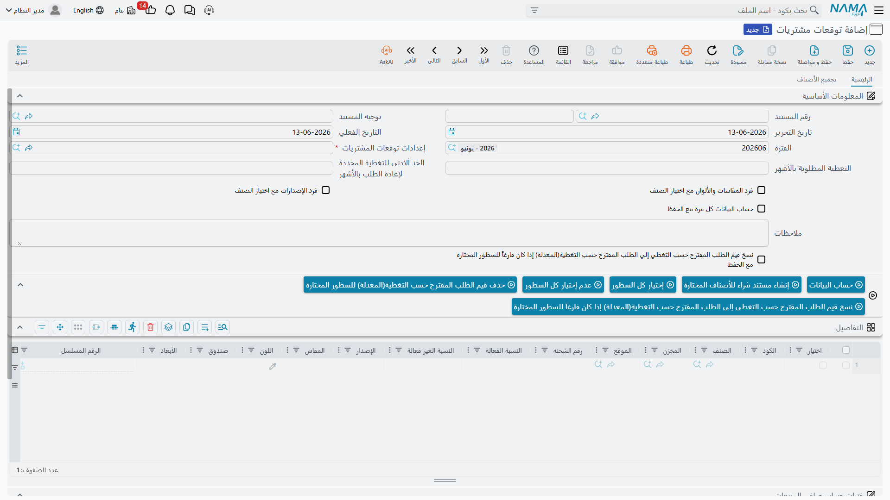

# التنبؤ بالمشتريات (Purchase Forecast)

أفضل عملية شراء هي التي تتم قبل أن تنفد البضاعة، لا بعدها. **التنبؤ بالمشتريات** يحوّل قسم المشتريات من رد الفعل ("نفد المخزون! اطلب الآن!") إلى الاستباق ("سينفد خلال ثلاثة أسابيع، فلنطلب الآن بتسليم عادي وأسعار أفضل").

## لماذا التنبؤ؟

الشراء التفاعلي مكلف: استعجال الشحن، وأسعار أعلى، ونفاد يوقف الإنتاج أو يخسر مبيعات. أما التنبؤ فيمنحك رؤية مسبقة للاحتياج، فتشتري بكميات اقتصادية، وتفاوض على أسعار أفضل، وتراعي أوقات الانتظار (Lead Times)، وتتفادى النفاد والتكدّس معًا.

## مستند التنبؤ بالمشتريات (NewPurchaseForecast)

**مستند التنبؤ بالمشتريات** هو الأداة التي تقدّر بها الاحتياج المستقبلي لكل صنف خلال فترة قادمة. يعتمد التقدير على مصدر كمية تختاره، ثم يقترح كميات الشراء بعد خصم المتوفر في المخزون والمطلوب فعليًا.

تستطيع تضييق نطاق التنبؤ بحسب الصنف أو العلامة التجارية أو نطاق التاريخ، وضبط فترة الاستناد (المدة التاريخية التي يُقاس عليها الاستهلاك).

## مصادر الكمية: على أي أساس نتنبأ؟

قوة التنبؤ في مصدر بياناته. يدعم النظام أكثر من مصدر يمكن مزجها:

- **تاريخ المبيعات**: استهلِك معدّل البيع السابق لتوقّع الطلب القادم - الأنسب لأصناف التوزيع والتجزئة. تُضبط قواعد استخلاص المبيعات عبر **إعداد مصدر المبيعات** (PFSalesSourceConfig): نطاق التاريخ، وفلاتر الأصناف، وأنواع الفواتير المشمولة أو المستبعَدة.
- **مصادر كمية أخرى**: عبر **مصدر الكمية** (PFQuantitySource) يمكن تغذية التنبؤ بأرقام من مصادر أخرى (مثل خطط الإنتاج أو إدخال يدوي)، لا من المبيعات وحدها.

## إعداد التنبؤ (PurchaseForecastConfig)

يجمع **إعداد التنبؤ بالمشتريات** معايير الحساب في مكان واحد: المصادر المعتمَدة، ومعاملات الموسمية، ومضاعفات الطلب، وكيفية التعامل مع المتوفر والمحجوز. ضبط هذا الإعداد مرة واحدة يجعل توليد التنبؤات لاحقًا متسقًا وسريعًا.

::: tip ادمج التنبؤ مع أوقات الانتظار
التنبؤ وحده يخبرك بـ"كم" ستحتاج، لكن **وقت الانتظار** للصنف (المعرّف في [بطاقة الصنف](./understanding-items.md#تهيئة-الشراء)) يخبرك بـ"متى" تطلب. اجمع الاثنين لتطلب في التوقيت الذي يضمن وصول البضاعة قبل النفاد تمامًا.
:::

## من التنبؤ إلى أمر الشراء

التنبؤ ليس غايةً بذاته، بل مقدّمة للشراء. بعد توليد التنبؤ ومراجعته، تتحول مقترحاته إلى [طلبات أو أوامر شراء](./purchasing-journey.md)، فتكتمل الحلقة من توقّع الحاجة إلى تلبيتها. وبهذا يصبح الشراء مدفوعًا بالبيانات لا بالحدس.

## الخطوات التالية

- [رحلة الشراء](./purchasing-journey.md) - تحويل التنبؤ إلى أوامر شراء فعلية
- [فهم أصناف المخزون](./understanding-items.md) - حيث تُضبط أوقات الانتظار والمخزون الاحتياطي
- [الجرد المخزني](./stock-taking.md) - دقة المخزون أساس دقة التنبؤ
