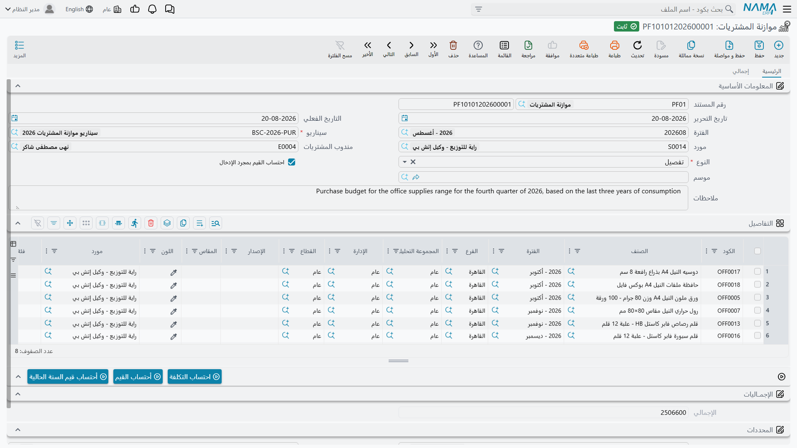

# التنبؤ بالمشتريات (Purchase Forecast)

أفضل عملية شراء هي التي تتم قبل أن تنفد البضاعة، لا بعدها. **التنبؤ بالمشتريات** يحوّل قسم المشتريات من رد الفعل ("نفد المخزون! اطلب الآن!") إلى الاستباق ("سينفد خلال ثلاثة أسابيع، فلنطلب الآن بتسليم عادي وأسعار أفضل").

## لماذا التنبؤ؟

الشراء التفاعلي مكلف: استعجال الشحن، وأسعار أعلى، ونفاد يوقف الإنتاج أو يخسر مبيعات. أما التنبؤ فيمنحك رؤية مسبقة للاحتياج، فتشتري بكميات اقتصادية، وتفاوض على أسعار أفضل، وتراعي أوقات الانتظار (Lead Times)، وتتفادى النفاد والتكدّس معًا.

## مستند التنبؤ بالمشتريات (NewPurchaseForecast)

**مستند التنبؤ بالمشتريات** هو الأداة التي تقدّر بها الاحتياج المستقبلي لكل صنف خلال فترة قادمة. يعتمد التقدير على مصدر كمية تختاره، ثم يقترح كميات الشراء بعد خصم المتوفر في المخزون والمطلوب فعليًا.

تستطيع تضييق نطاق التنبؤ بحسب الصنف أو العلامة التجارية أو نطاق التاريخ، وضبط فترة الاستناد (المدة التاريخية التي يُقاس عليها الاستهلاك).

## مصادر الكمية: على أي أساس نتنبأ؟

قوة التنبؤ في مصدر بياناته. يدعم النظام أكثر من مصدر يمكن مزجها:

- **تاريخ المبيعات**: استهلِك معدّل البيع السابق لتوقّع الطلب القادم - الأنسب لأصناف التوزيع والتجزئة. تُضبط قواعد استخلاص المبيعات عبر **إعداد مصدر المبيعات** (PFSalesSourceConfig): نطاق التاريخ، وفلاتر الأصناف، وأنواع الفواتير المشمولة أو المستبعَدة.
- **مصادر كمية أخرى**: عبر **مصدر الكمية** (PFQuantitySource) يمكن تغذية التنبؤ بأرقام من مصادر أخرى (مثل خطط الإنتاج أو إدخال يدوي)، لا من المبيعات وحدها.

## إعداد التنبؤ (PurchaseForecastConfig)

يجمع **إعداد التنبؤ بالمشتريات** معايير الحساب في مكان واحد: المصادر المعتمَدة، ومعاملات الموسمية، ومضاعفات الطلب، وكيفية التعامل مع المتوفر والمحجوز. ضبط هذا الإعداد مرة واحدة يجعل توليد التنبؤات لاحقًا متسقًا وسريعًا.

::: tip ادمج التنبؤ مع أوقات الانتظار
التنبؤ وحده يخبرك بـ"كم" ستحتاج، لكن **وقت الانتظار** للصنف (المعرّف في [بطاقة الصنف](./understanding-items.md#thyy-lshr)) يخبرك بـ"متى" تطلب. اجمع الاثنين لتطلب في التوقيت الذي يضمن وصول البضاعة قبل النفاد تمامًا.
:::

## الإجراءات في هذه الشاشات

**في مستند التنبؤ بالشراء:**

- **حساب البيانات** (Calculate Data) — يجب حفظ المستند؛ يشغّل التنبؤ ويملأ سطور التفاصيل من مصادر الكمية التي اخترتها.
- **تجميع الأصناف** (Collect Items) — يملأ السطور من معايير تجميع الأصناف بدل إدخالها صنفًا صنفًا، مراعيًا مفاتيح الرأس الخاصة بفرد الإصدارات وفرد المقاسات والألوان. ويرفض العمل إن كانت سطور التجميع فارغة.
- **فرد بيانات السطر المحدد** (Spread Selected Line Data) — يأخذ السطر الواقف عليه ويفرده على إصدارات الصنف ومقاساته وألوانه، وفق المفاتيح نفسها.
- **إختيار كل السطور** (Select All Lines) و**عدم إختيار كل السطور** (Unselect All Lines) — يؤشّران أو يزيلان التأشير عن كل سطور التفاصيل دفعة واحدة، وعليهما يعتمد الإجراءان التاليان وإنشاء المستند.
- **حذف قيم الطلب المقترح حسب التغطية(المعدلة) للسطور المختارة** (Delete Suggested Order Based On Adjusted Coverage Values From Details For Selected Lines) — يمسح اقتراح التغطية المعدلة في السطور المؤشَّرة لتعيده من جديد.
- **نسخ قيم الطلب المقترح حسب التغطي إلي الطلب المقترح حسب التغطية(المعدلة) إذا كان فارغاً للسطور المختارة** (Copy Values Of Suggested Order Based On Coverage To Suggested Order Based On Adjusted Coverage If Empty For Selected Lines) — يملأ اقتراح التغطية المعدلة من اقتراح التغطية العادي في السطور المؤشَّرة، لكن حيث لا يزال فارغًا فقط، فيبقى ما عدّلته بيدك كما هو.
- **إنشاء مستند شراء للأصناف المختارة** (Generate Purchase Document For Selected Items) — يجب حفظ المستند؛ يسأل هل ينشئ **أمر شراء** أم **طلب صنف** (وأمر الشراء هو الافتراضي) وينشئه من السطور المؤشَّرة.

**وفي التنبؤ بالشراء الأقدم والتنبؤ بالمبيعات**، تحمل صفحة التفاصيل **احتساب التكلفة** (Calculate Cost) و**أحتساب القيم** (Calculate Values) و**أحتساب قيم السنة الحالية** (Calculate Current Year Values)، ولصفحة الإجماليات **احتساب التكلفة** و**احتساب القيم للإجمالي** (Calculate Aggregate Values) و**أحتساب القيم الإجمالية للسنة الحالية** (Calculate Aggregate Current Year Values) الخاصة بها.

## من التنبؤ إلى أمر الشراء

التنبؤ ليس غايةً بذاته، بل مقدّمة للشراء. بعد توليد التنبؤ ومراجعته، تتحول مقترحاته إلى [طلبات أو أوامر شراء](./purchasing-journey.md)، فتكتمل الحلقة من توقّع الحاجة إلى تلبيتها. وبهذا يصبح الشراء مدفوعًا بالبيانات لا بالحدس.

## رسائل قد تظهر لك

| الرسالة | لماذا | ما تفعله |
|---|---|---|
| «يجب تحديد سطر واحد علي الأقل» | يُولَّد مستند شراء من التنبؤ ولم يُعلَّم أي سطر في عمود **السطر المختار**. | علّم السطور التي تريد شراءها، ثم نفّذ إجراء التوليد من جديد. |
| «نهاية الفترة لا يمكن أن تكون اكبر من بداية الفترة» | في **إعداد مصدر مبيعات التنبؤ بالشراء** تُحسب الفترتان *إلى الخلف* من تاريخ إنشاء السجل، فلا بد أن تكون بداية المدى هي الأبعد. ويُرفع الرفض حين ترجع **بداية الفترة** للخلف أقل مما ترجع **نهاية الفترة**. | ضع الفترة الأطول في **بداية الفترة** والأقصر في **نهاية الفترة** — ستة أشهر مضت بداية، وشهر مضى نهاية. |
| «المخزن {0} في السطر {1} لا يساوي المخزن الموجود في الموقع {2}» | سطر مصدر كميات يذكر مخزنًا وموقعًا تابعًا لمخزن آخر، فالرصيد الذي سيقرأه غير محدد. | استخدم موقعًا من مخزن السطر، أو أفرِغ المخزن واترك الموقع يحدده. |

## الخطوات التالية

- [رحلة الشراء](./purchasing-journey.md) - تحويل التنبؤ إلى أوامر شراء فعلية
- [فهم أصناف المخزون](./understanding-items.md) - حيث تُضبط أوقات الانتظار والمخزون الاحتياطي
- [الجرد المخزني](./stock-taking.md) - دقة المخزون أساس دقة التنبؤ
