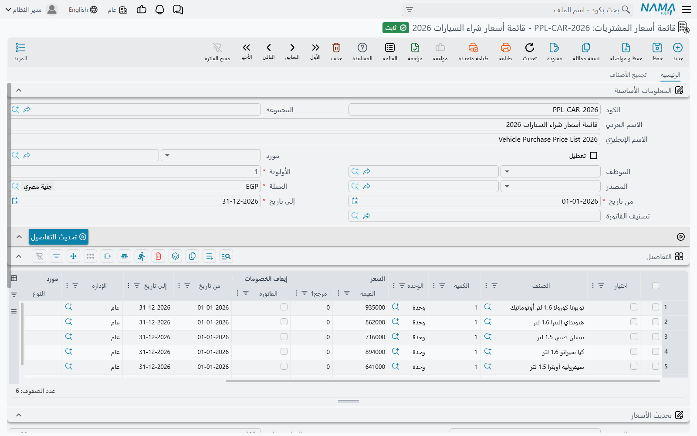
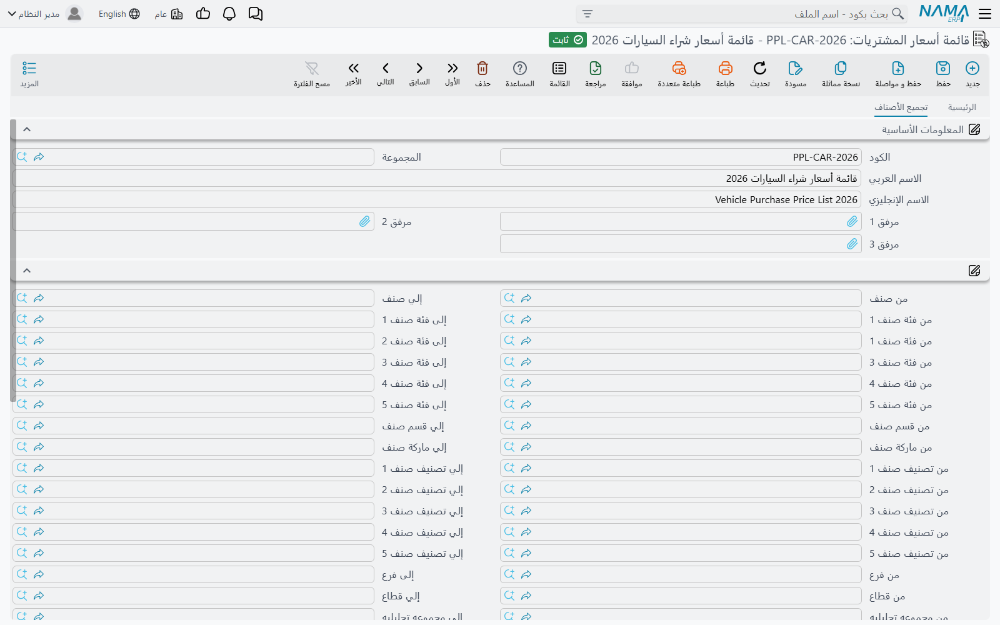
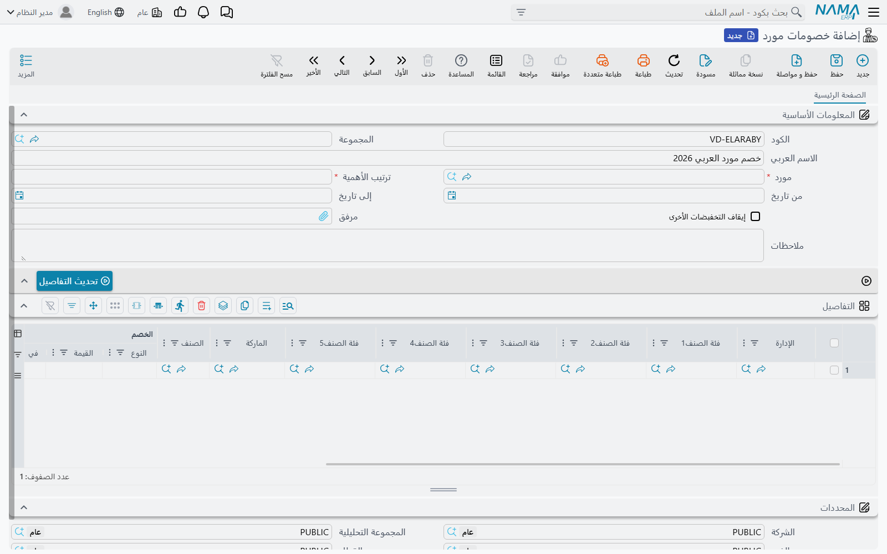

# كيف يُحدَّد سعر الشراء (How a Purchase Price Is Decided)

كل سطر في أمر شراء أو فاتورة مشتريات يحتاج سعر وحدة، وفي معظم المنشآت لا يكتبه أحد بيده: فالرقم يأتي من **قائمة أسعار المشتريات**، ثم تقتطع منه **خصومات المورد**، ويمكن حصر أيٍّ منهما على نوع واحد من المستندات عبر **تصنيف الفواتير**. تتتبّع هذه الصفحة ذلك الرقم من الاتفاق الذي وقّعته مع المورد حتى الرقم الذي يظهر في السطر، وتوضّح بالضبط ما الذي يجب أن يتطابق حتى تعمل كل شاشة من هذه الشاشات.

أما الجانب البيعي من القصة نفسها — قوائم أسعار البيع والعروض والكوبونات — فتشرحه صفحة [التسعير والعروض والكوبونات](./pricing-offers-and-coupons.md). والجانب الشرائي أصغر عن قصد، ويختلف في مواضع عدة، وهذه الاختلافات هي مصدر معظم المفاجآت، لذا نشير إليها أولًا بأول.

## ترتيب احتساب السعر

حفظ مستند الشراء يعيد تسعير كل سطر يحمل صنفًا وليس مُعلَّمًا كسطر مجاني. ويمر كل سطر بالخطوات الأربع نفسها، بهذا الترتيب.

**1. هل يُسمح للنظام بتسعير هذا السطر أصلًا؟** يحمل **توجيه المستند** خيار **إعادة تطبيق قوائم الأسعار عند الحفظ**، وهو مفعّل افتراضيًا. اتركه مفعّلًا فيُعاد جلب السعر مع كل حفظ، وأغلقه فيبقى ما كتبه المشتري كما هو بعد الحفظ. وهذا المفتاح وحده هو الفارق بين «قائمة الأسعار هي الحقيقة» و«قائمة الأسعار مجرد اقتراح».

**2. البحث عن سطر في قائمة أسعار المشتريات.** يبحث النظام في سطور قوائم أسعار المشتريات السارية عن سطر يناسب هذا المورد وهذا الصنف وهذا التاريخ وهذه الكمية. فإذا وجده، صار **السعر | القيمة** فيه سعرَ الوحدة، و**السعر | مرجع1** السعرَ المرجعي — ويُحوَّل كلاهما إذا كانت القائمة مسعّرة بوحدة غير الوحدة التي تشتري بها. فالسعر المعطى للكرتونة يُقسَّم بشكل صحيح حين تشتري بالقطعة.

**3. إن لم يتطابق شيء، الرجوع إلى آخر سعر دفعته.** مع تفعيل **استخدام أخر سعر شراء** في إعدادات سلسلة التوريد، يأخذ السطر سعر الوحدة من أحدث فاتورة مشتريات مُعالجة لنفس الصنف ونفس المورد — الأحدث بالتاريخ الفعلي، مع تجاهل السطور ذات السعر صفر. وبإغلاق هذا الخيار، ومع عدم وجود سطر في قائمة أسعار، ينتهي السطر بسعر صفر. أما مفاتيح «اعتبار…» التي تجعل هذا البحث أدق فتشرحها صفحة [إعدادات التسعير وقوائم الأسعار](./configuration/pricing-and-price-lists.md).

**4. تطبيق خصومات المورد.** مع تفعيل **تطبيق خصومات الموردين** في التوجيه (وهو مفعّل افتراضيًا أيضًا)، يُطبَّق كل سطر خصم مورد يناسب المورد والصنف والتاريخ في خانات الخصم الثماني على سطر الشراء.

::: warning سطر قائمة الأسعار يمكنه إيقاف الخصومات عن صنفه
يحمل كل سطر في قائمة أسعار المشتريات علامة **إيقاف الخصومات | الفاتورة**. فإذا كانت مفعّلة وكان هذا السطر هو من سعّر المستند، تُتخطى الخطوة الرابعة كليًا لذلك الصنف — فلا يصله أي خصم مورد. أما الخصومات التي كتبها المشتري بيده على السطر فتبقى كما هي؛ فالمُوقَف هو الخصومات الآلية فقط. وهذه أنظف طريقة لقول «هذا الصنف بسعره الصافي المتفق عليه، فلا تخصم عليه مرة أخرى».
:::

## قائمة أسعار المشتريات (Purchase Price List)

شاشة **قائمة أسعار المشتريات** (المشتريات ← الملفات ← قائمة أسعار المشتريات) هي توأم قائمة أسعار البيع من جهة الموردين: مجموعة مؤرَّخة ومرتَّبة بالأولوية من أسعار الشراء المتفق عليها. وعمليًا كل قائمة هي اتفاق واحد — الكتالوج الذي أرسله المورد لهذا الموسم، أو المناقصة التي رسَت عليك، أو أسعار ناقل بضائع لسنة كاملة.

ويحدد الرأس لمن ومتى تسري القائمة:

| الحقل | ما الذي يحدده |
|---|---|
| **مورد** (Supplier) | المورد الذي تخصّه القائمة. ويقبل الحقل موردًا واحدًا **أو تصنيف موردين كاملًا**. اتركه فارغًا فتسري القائمة على كل الموردين. |
| **من تاريخ** / **إلى تاريخ** | الفترة التي تسري فيها الأسعار. وكلاهما إجباري. |
| **العملة** (Currency) | إجبارية؛ وتسجّل العملة التي عُبِّر بها عن الأسعار. |
| **الأولوية** (Priority) | تحسم أي قائمة تفوز حين تغطي أكثر من واحدة الصنف نفسه — انظر أدناه. |
| **الموظف** (Employee) | اختياري؛ يقصر القائمة على مشترٍ واحد. ويقبل موظفًا أو إدارة موظفين أو مجموعة موظفين أو وظيفة أو منصبًا تنظيميًا أو مجموعة. |
| **تصنيف الفاتورة** (Invoice Classification) | اختياري؛ يقصر القائمة على المستندات الحاملة لذلك التصنيف. |
| **المصدر** (Source) | من أين جاءت القائمة — قائمة أسعار أخرى، أو مستند شراء أو بيع، أو ملف تصويت على الأسعار. واختياره يملأ الجدول فورًا؛ انظر أدناه. |
| **تعطيل** (Deactivate) | يُحيل القائمة إلى التقاعد دون حذفها. |

ثم يحمل جدول **التفاصيل** سطرًا لكل صنف مسعَّر: **الصنف**، و**الكمية** و**الوحدة**، و**السعر | القيمة** و**السعر | مرجع1**، و**من تاريخ** و**إلى تاريخ** خاصين بالسطر، وحين تريد أن يكون السطر أضيق من الرأس: **مورد** و**تصنيف الفاتورة** و**الإدارة** ومحددات السعر و**المقاس** و**اللون** و**الإصدار** الخاصة به.

::: info الرأس يكتب فوق السطور عند الحفظ
حفظ القائمة ينسخ تواريخ الرأس ومحدداته والمورد وتصنيف الفاتورة ومحددات السعر إلى كل سطر، ويستبدل ما كان موجودًا. وهذا ما يجعل قائمة من مئتي سطر قابلة للإدارة: تضبط الفترة مرة واحدة. فإذا أردت بقاء القيم على مستوى السطر، فعّل **عدم تحديث السطور من رأس ملف قوائم الأسعار** في إعدادات سلسلة التوريد — لكن لاحظ أن مورد الرأس وتصنيف الفاتورة يُدفعان إلى السطور حتى حينئذ؛ فالمتروك للسطور هو التواريخ والمحددات فقط.
:::

### ما الذي يجب أن يتطابق قبل استخدام السطر

لا يُؤخذ سطر قائمة الأسعار في الاعتبار إلا إذا تحقق **كل** ما يلي في سطر المستند الجاري تسعيره:

| الشرط | التفصيل الذي يوقع الناس |
|---|---|
| **المورد** | مورد السطر هو مورد المستند، أو **تصنيف ذلك المورد**، أو فارغ. والفارغ يعني «أي مورد». |
| **الصنف** | تطابق تام للصنف. فلا مطابقة بتصنيف الصنف أو فئته أو ماركته أو قسمه — وخلافًا لقائمة أسعار البيع، تسعّر قائمة أسعار المشتريات صنفًا واحدًا في كل سطر. |
| **التواريخ** | **التاريخ الفعلي** للمستند — لا تاريخ تحريره — يقع بين **من تاريخ** و**إلى تاريخ** في السطر. |
| **الكمية** | **الكمية** في السطر عتبة *من هذه الكمية فصاعدًا*: يجب أن تكون أقل من أو تساوي الكمية المشتراة. اتركها فارغة فيصلح السطر دائمًا. |
| **الوحدة** | تُتجاهل إلا إذا فُعّل **يجب تطابق وحدة السطر مع وحدة قائمة الأسعار في المشتريات عند البحث عن السعر** في [إعدادات المشتريات](./configuration/purchasing-configuration.md)؛ وإلا فالسعر يُحوَّل بين الوحدات. |
| **تصنيف الفاتورة** | فارغ في السطر، أو مساوٍ لتصنيف المستند. والمستند بلا تصنيف لا يطابق إلا السطور بلا تصنيف. |
| **محدد سعر 1–5** | القاعدة نفسها، لكل محدد مفعَّل في الإعدادات. |
| **المحددات** | الشركة والمجموعة التحليلية والفرع والقطاع والإدارة: كلٌّ منها فارغ في السطر، أو مساوٍ لما في المستند. |
| **المقاس واللون والإصدار** | إن كانت مملوءة في السطر، وجب أن تساوي ما يحمله سطر المستند. والفارغ يعني «أيًّا كان». |
| **الموظف** | إذا سمّت القائمة موظفًا، وجب أن يطابقه مشتري المستند. والقائمة المقصورة على موظف لا تطابق أبدًا مستندًا لا يحمل مشتريًا. |

واثنان من هذه الشروط يستحقان وقفة. فـ**المشتري** الذي يقارن به النظام هو مندوب مشتريات المستند فقط حين يكون **استعمال البائع بدلا من المستخدم للأسعار** مفعّلًا في الإعدادات العامة؛ وإلا فهو موظف المستخدم الذي سجّل الدخول — فقد يُسعَّر المستند نفسه بشكل مختلف لدى مستخدمَين.

وقاعدة **الفارغ يعني أيًّا كان** هي ما يجعل القوائم عملية. فالسطر الذي لا يسمّي موردًا ولا تصنيفًا ولا محددات هو سعر كتالوج متاح للجميع؛ ثم تضيّقه حقلًا حقلًا.

::: tip حين لا تنطبق القائمة التي توقعتها
راجع الجدول أعلاه بالترتيب. وفي الحالات الواقعية يكون السبب غالبًا واحدًا من ثلاثة: التاريخ الفعلي خارج الفترة، أو عتبة الكمية في السطر أعلى من الكمية المطلوبة، أو المستند يحمل تصنيف فاتورة (أو محددًا) لا يحمله سطر قائمة الأسعار.
:::

### الأولوية، ولماذا ترفض قائمتان أن تُحفظا معًا

حين ينجو أكثر من سطر من الاختبار، يفوز السطر الآتي من القائمة ذات **رقم الأولوية الأصغر**. والأولوية في الرأس، فهي صفة للاتفاق كله لا للسطر.

ولهذا أثر مباشر على شرائح الكميات. فشريحة عند 100 وحدة وشريحة عند وحدة واحدة كلتاهما تصلح حين تشتري 150، وتحملان الأولوية نفسها إذا كانتا في القائمة نفسها. والطريقة المعوَّل عليها لبناء الشرائح هي إذن **قائمة لكل شريحة**، مع إعطاء الكمية الأكبر رقم الأولوية الأصغر: فتُستشار قائمة الـ100 أولًا، وحين تشتري 10 فقط لا تصلح أصلًا، فتتولى قائمة الوحدة الواحدة الأمر وحدها.

وتحكم الأولوية أيضًا تحقُّقًا يفاجئ الناس في أول لقاء. فما لم يُفعَّل **السماح بتكرار اولويات العروض  و قوائم الأسعار** في إعدادات سلسلة التوريد، لا يجوز لقائمتي أسعار مشتريات محفوظتين بنفس **الأولوية** أن تحملا التركيبة نفسها من الصنف والوحدة والكمية والمقاس واللون والإصدار والأبعاد. فإذا حفظت الثانية ظهرت لك رسالة *«هذا السطر موجود في قائمة الأسعار … السطر رقم …»*. ولاحظ ما **ليس** جزءًا من هذه المقارنة: المورد والتواريخ والمحددات والتصنيف. فقائمتان لموردين مختلفين تتصادمان مع ذلك إن تشاركتا الأولوية وسعّرتا الصنف نفسه — فأعطِ كل اتفاق رقم أولوية خاصًا به تختفِ المشكلة.

وداخل القائمة الواحدة لا يجوز تكرار التركيبة نفسها كذلك، ويُرفض السطر الذي لا يكون صنفه معلَّمًا بـ**يمكن شراؤه** في بطاقته.

### ملء السطور دون كتابتها

على الشاشة أربع أدوات، تغطي بينها معظم الطرق التي تُبنى بها القائمة فعلًا.

**المصدر** أسرعها. وجّه حقل **المصدر** في الرأس إلى قائمة أسعار مشتريات أو مبيعات أخرى، أو إلى أمر شراء أو فاتورة، أو إلى ملف تصويت على الأسعار، فيمتلئ الجدول منه في الحال: سطر لكل صنف، يحمل السعر الذي كان في ذلك المستند أو تلك القائمة. استخدمه حين يرسل المورد كتالوج هذا العام كتعديل على كتالوج العام الماضي.

**تجميع الأصناف** موجود في صفحة **تجميع الأصناف**. املأ أيًّا من نطاقات «من/إلى» — كود الصنف، وفئة الصنف 1 إلى 5، وتصنيف الصنف 1 إلى 5، والقسم، والماركة، وفرع الصنف وقطاعه ومجموعته التحليلية وإدارته — ثم اضغطه؛ فيصبح كل صنف داخل النطاق سطرًا، بلا سعر، حاملًا **وحدة الشراء الافتراضية** للصنف. وهو يرفض العمل حتى يُملأ نطاق واحد على الأقل، وهذه رحمة: فالبديل هو تجميع ملف الأصناف كله.

**تحديث التفاصيل** يدفع قيم الرأس إلى كل سطر دون انتظار الحفظ. ويسأل سؤالًا بنعم/لا في كل مرة — من تاريخ، وإلى تاريخ، والمحددات الخمسة، والمورد (والسؤال معنون **تحديث العميل-المورد**، لكنه في قائمة المشتريات يكتب المورد)، وتصنيف الفاتورة، ومحددات السعر من 1 إلى 5.

**تحديث الأسعار** هو الآلة الحاسبة. تحمل مجموعة **تحديث الأسعار** في الرأس حقل **المصدر**، واختيار **يتم التطبيق على** (كل السطور، أو المؤشَّرة في عمود **اختيار** فقط، أو غير المؤشَّرة فقط)، وحتى خمس عمليات. وكل عملية تجمع أو تطرح أو تضرب أو تقسم على قيمة أو نسبة، بنوع تقريب وقيمة تقريب خاصين بها، وتُنفَّذ بالتسلسل — فناتج العملية 1 يغذي العملية 2 وهكذا. وفي قائمة المشتريات ينتهي الناتج دائمًا في عمود **السعر | القيمة** الوحيد، أيًّا كان اسم الحقل الذي يعرضه الاختيار، لأن سطر الشراء لا يحمل إلا سعرًا واحدًا. ويؤدي **حساب السعر من متوسط التكلفة** العمل نفسه من نقطة بداية أخرى: فهو يملأ سعر كل سطر معنيّ من متوسط تكلفة الصنف بدلًا من سعر آخر.

::: info زرّا الأسعار يحملان الاسم نفسه في الإنجليزية
الزر أسفل مجموعة العمليات والبند الموجود في قائمة **المزيد** يحملان الاسم الإنجليزي نفسه. أما الشاشة العربية فتفرّق بينهما (**تحديث الأسعار** مقابل **تغيير الأسعار**). والمشروح أعلاه هو الزر الموجود في الصفحة نفسها، مباشرة تحت العمليات.
:::

### إحالة القائمة إلى التقاعد

لا تحذف قائمة أسعار استُخدمت من قبل — بل علّم **تعطيل** بدلًا من ذلك. فحفظ القائمة المعطَّلة يسحب كل سطور التسعير السارية فيها دفعة واحدة، فتتوقف عن المطابقة فورًا، بينما يبقى السجل نفسه لمن يسأل لاحقًا عمّا كنت تدفعه في مارس.

## خصومات المورد (Vendor Discount)

تسجّل شاشة **خصومات مورد** (المشتريات ← الملفات ← خصومات مورد) النصف الآخر من الاتفاق مع المورد: لا السعر، بل ما يُقتطع منه. وكل سجل هو ترتيب خصومات مورد واحد، وحقلا **مورد** و**ترتيب الأهمية** فيه إجباريان معًا.

وسبب وجود هذه الشاشة مستقلة، بدلًا من عمود في قائمة الأسعار، أن خصومات الموردين تتراكم. فموزّع يمنحك 8% خصمًا تجاريًا، و2% أخرى للسداد خلال عشرة أيام، و5% على ماركة واحدة هذا الربع — ثلاثة اتفاقات منفصلة، تفاوض عليها أشخاص مختلفون في أوقات مختلفة، وعليها كلها أن تحطّ على سطر الفاتورة نفسه دون أن يعيد أحد حسابها يدويًا. ولذلك يحمل سطر الشراء **ثماني** خانات خصم، ويقول كل سطر خصم في أي خانة يقع.

والرأس قصير: **مورد**، و**ترتيب الأهمية**، و**من تاريخ** و**إلى تاريخ**، وعلامة **إيقاف التخفبضات الأخرى**، و**مرفق** للاتفاق الموقَّع، والمحددات. وكما في قائمة الأسعار، تُدفع تواريخ الرأس إلى كل سطر عند الحفظ، وترث السطور محددات الرأس حيث تكون فارغة.

ويصف كل سطر في جدول **التفاصيل** خصمًا واحدًا:

| العمود | ما الذي يحمله |
|---|---|
| **الصنف** أو **فئة الصنف1–5** و**الماركة** | ما الذي يخصّه الخصم. وهذه متعارضة: فاختيار صنف يمسح الفئات، واختيار فئة يمسح الصنف. |
| **الخصم \| النوع** | **نسبة مركبة** أو **نسبة ثابتة** أو **قيمة** لمبلغ مقطوع يُخصم من سعر الوحدة. |
| **الخصم \| القيمة** | النسبة أو المبلغ. والنسبة التي تتجاوز 100 مرفوضة. |
| **الخصم \| في** | أي الخانات الثماني يُكتب فيها الناتج — من **خصم 1** إلى **خصم 8**. |
| **الخصم \| يحتسب من** | مِمَّ تُؤخذ النسبة: **تلقائي** (السعر الجاري بعد كل ما طُبِّق حتى الآن)، أو **السعر الإساسي**، أو **سعر مرجع 1**، أو **صافي بعد خصم 1** حتى **صافي بعد خصم 7**. ويُعطَّل حين يكون النوع **قيمة**، فهي لا تحتاج أساسًا تُحسب منه. |
| **فعال** | مفتاح تشغيل السطر وإيقافه. والسطر غير المؤشَّر يُتجاهل. والشاشة تؤشّره عنك بمجرد اختيارك صنفًا أو فئة. |
| **الإدارة** و**من تاريخ** و**إلى تاريخ** | تضيّق السطر أكثر. |

### ما الذي يجب أن يتطابق

الاختبار هنا أوسع من اختبار قائمة الأسعار في جهة، وأضيق منه كثيرًا في جهة أخرى:

| الشرط | التفصيل الذي يوقع الناس |
|---|---|
| **المورد** | تطابق **تام** للمورد، مأخوذًا من الرأس. فخلافًا لقائمة الأسعار، لا مطابقة بتصنيف المورد ولا «الفارغ يعني الجميع» — فخصم المورد يخصّ موردًا واحدًا بالضبط دائمًا. |
| **الصنف** | فارغ في السطر، أو مساوٍ للصنف. |
| **فئة الصنف 1–5** و**الماركة** | كلٌّ منها فارغ في السطر، أو مساوٍ لقيمة الصنف نفسه. وهكذا يغطي سطر واحد تشكيلة كاملة. |
| **التواريخ** | التاريخ الفعلي للمستند يقع داخل فترة السطر. |
| **المحددات** | كل محدد في السطر فارغ، أو مساوٍ لما في المستند. |

أما تصنيفات الصنف من 1 إلى 10 فليست جزءًا من هذا الاختبار. فإذا كان تصنيف أصنافك مبنيًا على تصنيفات الصنف لا على الفئات، فلن يستطيع خصم المورد استهدافه مباشرة، وستحتاج سطرًا لكل فئة أو لكل صنف. وتشرح صفحة [ملفات تصنيف الأصناف](./item-classification-files.md) الفرق بين المنظومتين.

### الترتيب الذي تُطبَّق به السطور، وكيف تتجمع

تُجمَع كل السطور المطابِقة من كل سجلات خصومات ذلك المورد وتُرتَّب حسب **ترتيب الأهمية**، ثم تحدث ثلاثة أشياء.

أولًا، يُحترَم **إيقاف التخفبضات الأخرى**. فبالسير في القائمة المرتَّبة، يحتفظ أول سجل تحمل علامتُه هذا الخيار بكل سطوره — ويُسقط كل سطر يتبع *سجلًا أدنى أولوية* بعده. وهي طريقة قول «هذا الاتفاق يلغي كل ما دونه» دون حذف السجلات الأقدم.

ثانيًا، تُسقَط السطور غير **فعال**.

ثالثًا، يُرتَّب الباقي حسب الخانة (خصم 1 أولًا وخصم 8 آخرًا)، ثم حسب **ترتيب الأهمية**، ثم حسب رقم السطر، ويُطبَّق بهذا التسلسل. ولأن **الخصم | يحتسب من** في كل سطر يمكنه تسمية الصافي بعد خانة سابقة، فإن هذا التسلسل هو ما يجعل الاتفاقات المتتالية تخرج صحيحة.

::: tip سطران في الخانة نفسها لا يُجمعان ببساطة
**الخصم | النوع** هو ما يحدد طريقة تجمّعهما. فسطران بـ**نسبة مركبة** 10% و5% في الخانة 1 يعطيان **14.5%**، لأن الثاني يُؤخذ مما تبقى بعد الأول. أما سطران بـ**نسبة ثابتة** 10% و5% فيعطيان **15%** مباشرة. وهذا هو كل الفرق بين النوعين، وهو التفسير المعتاد حين يصرّ المشتري على أن الفاتورة تختلف بجنيهات قليلة.
:::

أما الخصومات التي كتبها المشتري في خانات لم يمسّها أي سطر خصم مورد فتبقى كما كُتبت تمامًا — فالسطور الآلية تملأ خاناتها هي ولا شيء غيرها.

::: warning أولوية واحدة لكل مورد
لا يجوز لسجلَّي خصومات مورد لنفس المورد أن يتشاركا **ترتيب الأهمية** نفسه. وحفظ الثاني مرفوض. فأعطِ كل اتفاق رقمه الخاص، بالتسلسل الذي تريد تطبيقه به.
:::

أما مفاتيح التوجيه التي توقف هذا كله — **تطبيق خصومات الموردين**، و**عدم تطبيق خصم 1 للموردين** حتى **7** لإيقاف خانة واحدة في كل مرة — فمشروحة في [توجيه المستند: التسعير والضرائب والخصومات](./document-terms/doc-term-pricing-taxes-discounts.md).

## تصنيف الفواتير (Invoice Classification)

شاشة **تصنيف الفواتير** (المشتريات ← الإعدادات ← تصنيف الفواتير — واسم الشاشة في الإنجليزية مكتوب فعلًا ككلمة واحدة «InvoiceClassification») ملف رئيسي صغير واسع الأثر. فهو وسم حر تضعه على المستند ليقول ما *نوع* هذه المعاملة: محلية أم مستوردة، رأسمالية أم استهلاكية، لمشروع أم للمخزون، خاضعة للضريبة أم معفاة.

وهو وحده لا يفعل شيئًا. وقيمته أن شاشات كثيرة يمكن فلترتها به — قوائم أسعار المشتريات وسطورها المفردة، وقوائم أسعار البيع، والعروض، ونطاقات التسعير، وعلاقات الأصناف، والتنبؤات، وأجهزة نقاط البيع، ومعايير تعريفات التقارير. فوسِّم مشترياتك المستوردة بتصنيف، وابنِ قائمة أسعار مشتريات واحدة مقصورة على ذلك التصنيف، فتسري أسعار الاستيراد على المشتريات المستوردة ولا شيء غيرها. ولولا التصنيف لاحتجت موردًا منفصلًا، أو محددًا منفصلًا، أو صنفًا منفصلًا.

ولا تحمل الشاشة سوى إعدادين إلى جانب الاسم:

**تصنيف ل** (Classify to) يقصر التصنيف على نوع مستند واحد. اتركه فارغًا فيصلح التصنيف في أي مكان، واضبطه على فاتورة المشتريات فلا يظهر إلا في قائمة اختيار التصنيف في فواتير المشتريات. وقائمة الاختيار في كل مستند تحترم هذا، فما يراه المشتري مفلتَر سلفًا على التصنيفات المسموح بها هناك.

::: warning التصنيف المقيَّد يسقط عند توليد مستند من آخر
ولّد فاتورة مشتريات من أمر شراء فيُنقل تصنيف الأمر — لكن فقط إذا كان التصنيف غير مقيَّد أو كان مضبوطًا على تصنيف فواتير المشتريات. أما إن كان مرتبطًا بأوامر الشراء فتخرج الفاتورة الجديدة بلا تصنيف أصلًا، ولا يظهر على الشاشة ما ينبّهك. فإذا أردت لتصنيف أن يبقى عبر سلسلة المستندات، اترك **تصنيف ل** فارغًا.
:::

**السعر الافتراضي في قائمة الأسعار** (Price List Default Price) يختار أيَّ أعمدة الأسعار في سطر قائمة الأسعار يصير سعر الوحدة — الأقل أو الأقصى أو الافتراضي أو المخصص أو أحد الأرقام. وهذا إعداد يخصّ **البيع**: فسطر قائمة أسعار المشتريات يحمل **سعرًا** واحدًا، فلا شيء ليختار بينه. وإنما يهمّ حين يُستعمل التصنيف نفسه على مستندات البيع، حيث يأخذ موقعه في سلسلة الأولويات المشروحة في [الأسئلة الشائعة لسلسلة التوريد](./supply-chain-faq.md)، وهو أحد أسباب الوصول إلى ملف التصنيف نفسه من قائمتي المبيعات والمشتريات معًا.

## إلزام المشتري بالسعر المتفق عليه

كل ما سبق يسعّر السطر؛ ولا شيء منه يمنع المشتري من الكتابة فوق الناتج. لكن إعدادين في توجيه المستند يمنعانه، وهما يعملان معًا.

أغلق **إعادة تطبيق قوائم الأسعار عند الحفظ** وافتح **الالتزام بقوائم الأسعار**، فتتوقف فاتورة المشتريات عن إعادة تسعير نفسها وتبدأ في مراجعة نفسها. فيُبحث عن كل سطر في قوائم الأسعار عند الحفظ، ويُرفض الحفظ إن كان السعر المكتوب غير السعر الذي تحمله القائمة، أو إن لم يكن للصنف سطر في أي قائمة أسعار مشتريات. ويخفّف **السماح بالحفظ مع وجود أصناف ليس لها سعر (مع الالتزام بقوائم الأسعار)** النصف الثاني فقط: فتمرّ الأصناف التي لا قائمة لها بالسعر المكتوب، بينما تظل الأصناف التي لها قائمة ملزمة بمطابقتها.

واترك **إعادة تطبيق قوائم الأسعار عند الحفظ** مفعّلًا فلا يُطرح السؤال أصلًا — إذ يُستبدل السعر المكتوب مع كل حفظ.

## أين تجد الإعدادات ذات الصلة

- [إعدادات المشتريات](./configuration/purchasing-configuration.md) — قاعدة تطابق الوحدة وبقية مفاتيح المشتريات.
- [إعدادات التسعير وقوائم الأسعار](./configuration/pricing-and-price-lists.md) — الرجوع إلى آخر سعر شراء ومفاتيح سلوك قوائم الأسعار.
- [توجيه المستند: التسعير والضرائب والخصومات](./document-terms/doc-term-pricing-taxes-discounts.md) — استراتيجية الأسعار على مستوى التوجيه.
- [رحلة المشتريات](./purchasing-journey.md) — إلى أين يذهب السطر بعد تسعيره.
- [وحدات القياس](./units-of-measure.md) — كيف يصل سعر مسعَّر للكرتونة إلى سطر مشترى بالقطعة.
- [تكلفة المخزون](./inventory-costing.md) — ماذا يحدث لذلك السعر بعد استلام البضاعة.
